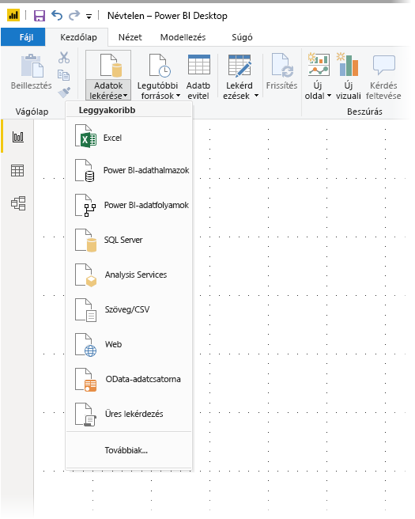
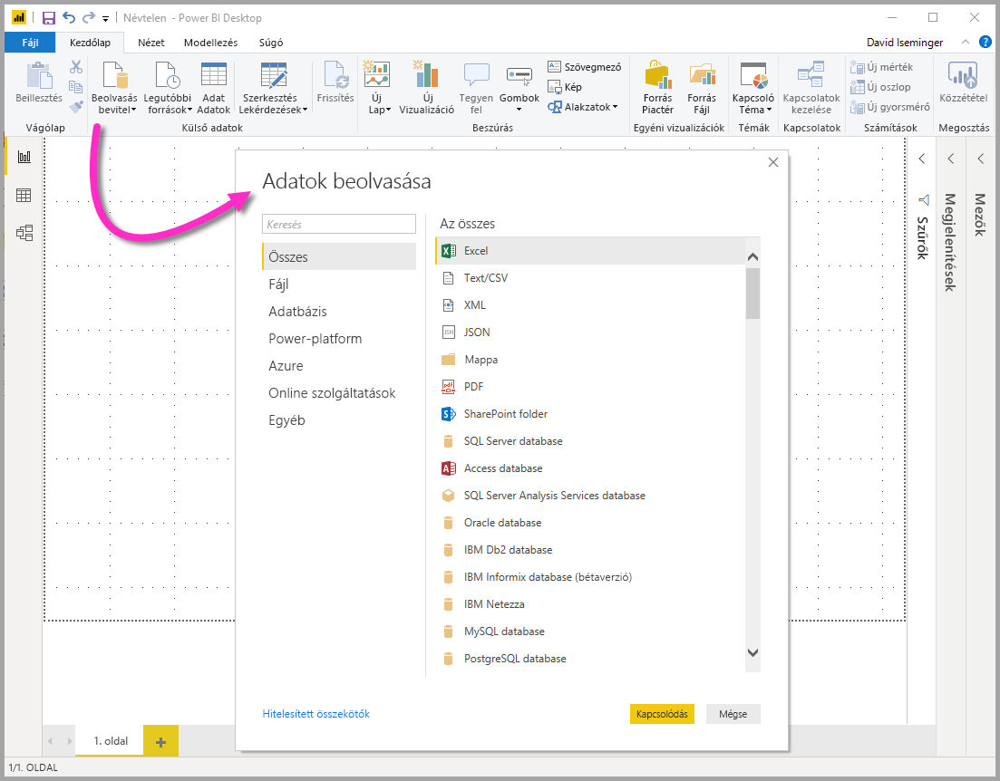
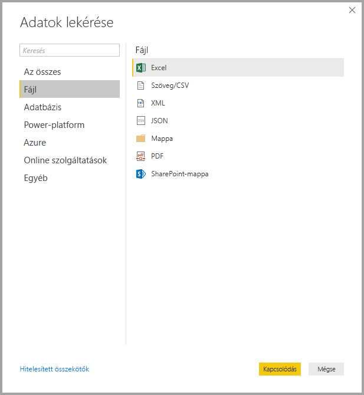
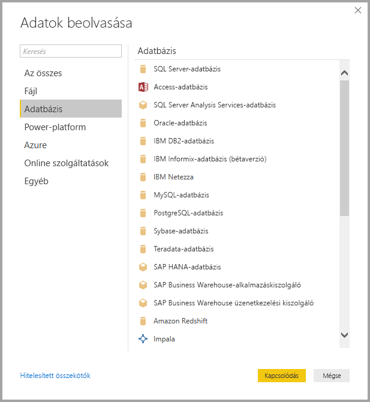
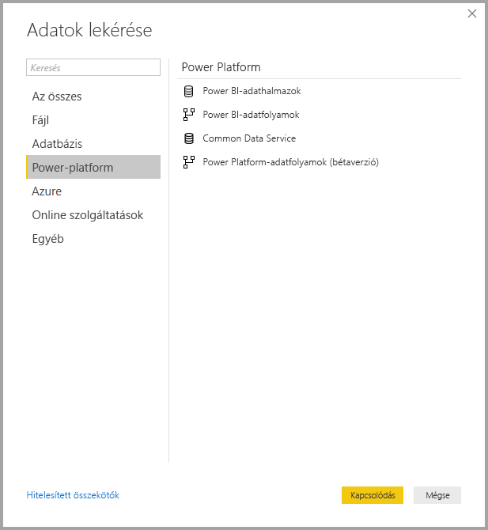
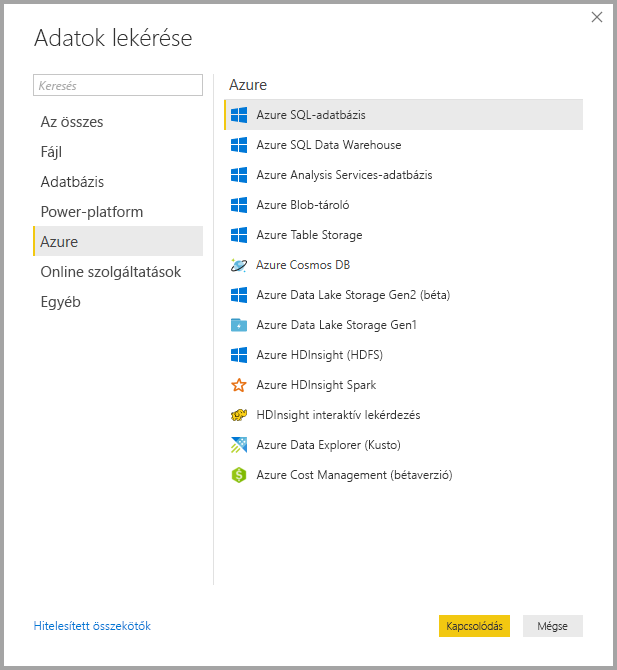
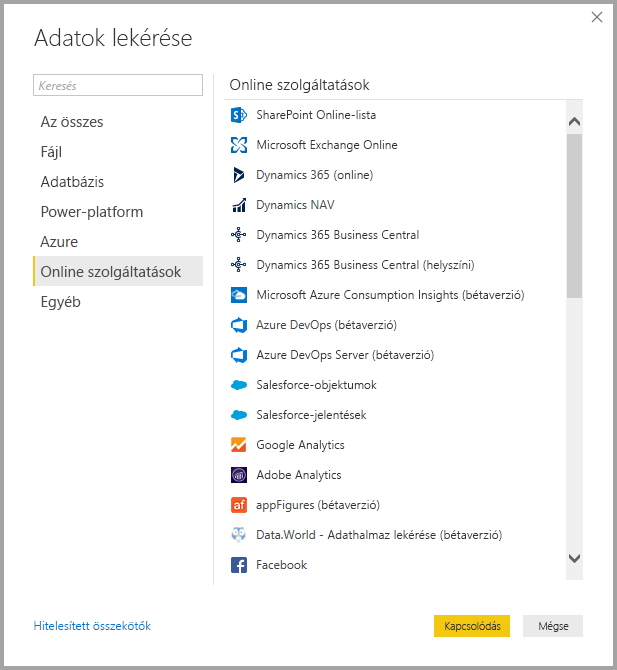
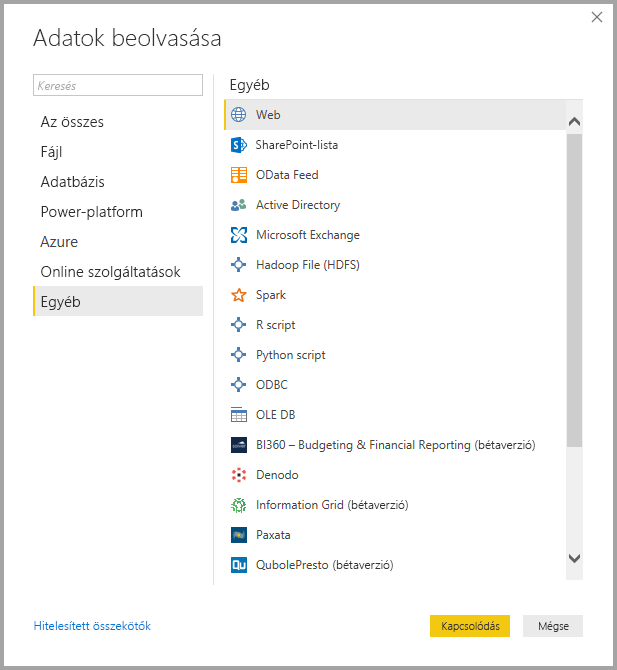
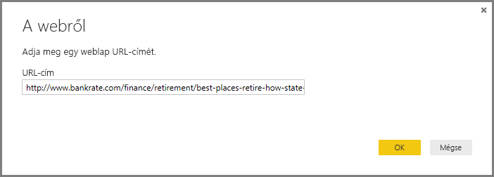
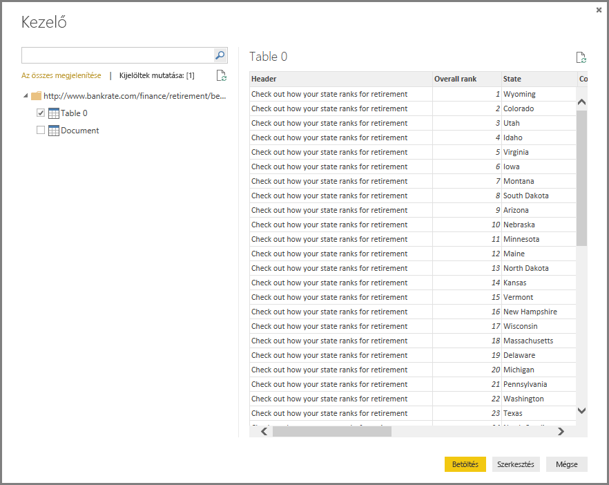

# <a name="data-sources-in-power-bi-desktop"></a>Adatforrások a Power BI Desktopban
A Power BI Desktoppal különböző forrásokból származó adatokhoz csatlakozhat. Az elérhető adatforrások teljes listája az oldal alján látható.

Az adatokhoz való csatlakozáshoz válassza a **Kezdőlap** menüszalag **Lekérdezés** lehetőségét. A lefelé mutató nyíl vagy a gomb **Lekérdezés** feliratának kiválasztásával megjelenik a **Leggyakoribb** adattípusok menüje, ahogyan az a következő képen látható:



A **Továbbiak...** lehetőség a **Leggyakoribb** menüből való kiválasztásakor megjelenik a **Lekérdezés** ablak. A **Lekérdezés** ablakot (a **Leggyakoribb** menü kihagyásával) a **Lekérdezés** **ikongomb** közvetlen kiválasztásával is megjelenítheti.



> [!NOTE]
> A Power BI csapata folyamatosan bővíti a **Power BI Desktop** és a **Power BI szolgáltatás** számára elérhető adatforrásokat. Ezért gyakran láthatja majd a fejlesztés alatt álló adatforrások előzetes verzióit *bétaverzió* vagy *előzetes verzió* felirattal. A *bétaverzió* vagy *előzetes verzió* felirattal ellátott adatforrások támogatása és működése korlátozott, használatuk éles környezetben nem ajánlott. 

> Emellett a **Power BI Desktophoz** *Béta* vagy *Előzetes verzióként* megjelölt adatforrások nem feltétlenül használhatók a **Power BI szolgáltatásban** vagy más Microsoft-szolgáltatásban, amíg az adatforrás általánosan elérhető nem lesz.

## <a name="data-sources"></a>Adatforrások
Az adattípusok a következő kategóriákba vannak csoportosítva:

* Összes
* Fájl
* Adatbázis
* Power BI
* Azure
* Online szolgáltatások
* Egyéb

A **Mind** kategória az összes kategóriába tartozó adatkapcsolat-típusokat tartalmazza.

A **Fájl** kategória a következő adatkapcsolatokat biztosítja:

* Excel
* Szöveg/CSV
* XML
* JSON
* Mappa
* PDF
* SharePoint-mappa

A következő képen a **Lekérdezés** ablak látható, amelyen a **Fájl** kategória ki van választva.



Az **Adatbázis** kategória a következő adatkapcsolatokat biztosítja:

* SQL Server-adatbázis
* Access-adatbázis
* SQL Server Analysis Services-adatbázis
* Oracle Database
* IBM DB2-adatbázis
* IBM Informix-adatbázis (bétaverzió)
* IBM Netezza
* MySQL-adatbázis
* PostgreSQL-adatbázis
* Sybase-adatbázis
* Teradata
* SAP HANA-adatbázis
* SAP Business Warehouse-alkalmazáskiszolgáló
* SAP Business Warehouse üzenetkezelési kiszolgáló
* Amazon Redshift
* Impala
* Google BigQuery
* Vertica
* Snowflake
* Essbase
* AtScale-kockák (bétaverzió)
* BI-összekötő
* Dremio
* Exasol
* Indexima (bétaverzió)
* InterSystems IRIS (bétaverzió)
* Jethro (bétaverzió)
* Kyligence Enterprise (bétaverzió)
* MarkLogic (bétaverzió)

> [!NOTE]
> Egyes adatbázis-összekötőket engedélyezni kell a **Fájl > Lehetőségek és beállítások > Beállítások** elem, majd az **Előzetes verziójú funkciók** lehetőség kiválasztásával és az adott összekötő engedélyezésével. Ha a fentiekben említett összekötők nem jelennek meg itt, és használni kívánja őket, ellenőrizze az **Előzetes verziójú funkciók** beállításait. Vegye figyelembe azt is, hogy a *bétaverzió* vagy *előzetes verzió* felirattal ellátott adatforrások támogatása és működése korlátozott, használatuk éles környezetben nem ajánlott.

A következő képen a **Lekérdezés** ablak látható, amelyen az **Adatbázis** kategória ki van választva.



A **Power Platform** kategória a következő adatkapcsolatokat biztosítja:

* Power BI-adathalmazok
* Power BI-adatfolyamok
* Common Data Service
* Power Platform-adatfolyamok (bétaverzió)

A következő képen a **Lekérdezés** ablak látható, amelyen a **Power Platform** kategória van kiválasztva.



Az **Azure** kategória a következő adatkapcsolatokat biztosítja:

* Azure SQL Database
* Azure SQL Data Warehouse
* Azure Analysis Services-adatbázis
* Azure Blob-tároló
* Azure Table Storage
* Azure Cosmos DB
* Azure Data Lake Storage Gen2 (béta)
* Azure Data Lake Storage Gen1
* Azure HDInsight (HDFS)
* Azure HDInsight Spark
* HDInsight interaktív lekérdezés
* Azure Data Explorer (Kusto)
* Azure Cost Management (bétaverzió)

A következő képen a **Lekérdezés** ablak látható, amelyen az **Azure** kategória ki van választva.



Az **Online szolgáltatások** kategória a következő adatkapcsolatokat biztosítja:

* SharePoint Online-lista
* Microsoft Exchange Online
* Dynamics 365 (online)
* Dynamics NAV
* Dynamics 365 Business Central
* Dynamics 365 Business Central (helyszíni)
* Microsoft Azure Consumption Insights (bétaverzió)
* Azure DevOps (bétaverzió)
* Azure DevOps Server (bétaverzió)
* Salesforce-objektumok
* Salesforce-jelentések
* Google Analytics
* Adobe Analytics
* appFigures (bétaverzió)
* Data.World – Adathalmaz lekérése (bétaverzió)
* Facebook
* GitHub (bétaverzió)
* MailChimp (bétaverzió)
* Marketo (bétaverzió)
* Mixpanel (bétaverzió)
* Planview Enterprise One - PRM (bétaverzió)
* Planview Projectplace (bétaverzió)
* QuickBooks Online (bétaverzió)
* Smartsheet
* SparkPost (bétaverzió)
* Stripe (bétaverzió)
* SweetIQ (bétaverzió)
* Planview Enterprise One - CMT (bétaverzió)
* Twilio (bétaverzió)
* tyGraph (bétaverzió)
* Webtrends (bétaverzió)
* Zendesk (bétaverzió)
* Dynamics 365 Customer Insights (béta)
* Emigo adatforrás (bétaverzió)
* Entersoft Business Suite (bétaverzió)
* Industrial App Store
* Intune Data Warehouse (bétaverzió)
* Microsoft Graph Security (bétaverzió)
* Quick Base
* TeamDesk (bétaverzió)


A következő képen a **Lekérdezés** ablak látható, amelyen az **Online szolgáltatások** kategória ki van választva.



Az **Egyéb** kategória a következő adatkapcsolatokat biztosítja:

* Web
* SharePoint-lista
* OData-adatcsatorna
* Active Directory
* Microsoft Exchange
* Hadoop-fájl (HDFS)
* Spark
* R-szkript
* Python-szkript
* ODBC
* OLE DB
* BI360 - Budgeting & Financial Reporting (bétaverzió)
* Denodo
* Information Grid (bétaverzió)
* Paxata 
* QubolePresto (bétaverzió)
* Roamler (bétaverzió)
* SurveyMonkey (bétaverzió)
* Tenforce (Smart)List (bétaverzió)
* Workforce Dimensions (bétaverzió)
* Üres lekérdezés

A következő képen a **Lekérdezés** ablak látható, amelyen az **Egyéb** kategória ki van választva.



> [!NOTE]
> Jelenleg nem lehetséges olyan egyéni adatforrásokhoz csatlakozni, amelyek védelmét az Azure Active Directory biztosítja.

## <a name="connecting-to-a-data-source"></a>Csatlakozás adatforráshoz
Egy adott adatforráshoz való csatlakozáshoz válassza ki azt a **Lekérdezés** ablakban, majd válassza a **Kapcsolódás** lehetőséget. A következő képen a **Web** lehetőség van kiválasztva az **Egyéb** adatkapcsolat-kategórián belül.


Ekkor megjelenik egy, az adott adatkapcsolatra jellemző csatlakozási ablak. Ha hitelesítő adatok szükségesek, a rendszer ezek megadására kéri. A következő képen a Web típusú adatforráshoz való csatlakozáshoz szükséges URL-cím megadása látható.



Az URL-cím vagy az erőforrás csatlakozási adatainak megadása után kattintson az **OK** gombra. A Power BI Desktop csatlakozik az adatforráshoz, és megjeleníti az elérhető adatforrásokat a **Kezelőben**.



Az adatokat betöltheti a **Kezelő** panel alján található **Betöltés** gombbal, vagy szerkesztheti a lekérdezést az adatok betöltése előtt a **Szerkesztés** gombbal.

Ilyen egyszerűen csatlakozhat adatforrásokhoz a Power BI Desktopban. Egyre több adatforrás közül választhat, és a lista folyamatosan bővül, ezért érdemes gyakran visszatérnie.

## <a name="using-pbids-files-to-get-data"></a>PBIDS-fájlok használata az adatok beolvasásához

A PBIDS-fájlok olyan Power BI Desktop-fájlok, amelyek adott struktúrával rendelkeznek, és .PBIDS kiterjesztésűek, ami Power BI adatforrás-fájlként azonosítja őket.

.PBIDS-fájl létrehozásával egyszerűsítheti a szervezet jelentéskészítőinek munkáját az **Adatbeolvasási** folyamatnál. Javasoljuk, hogy a rendszergazdák a gyakran használt kapcsolatokhoz hozzanak létre ilyen fájlokat, hogy megkönnyítsék a PBIDS-fájlok használatát az új jelentéskészítők számára. 

Amikor egy szerző megnyit egy .PBIDS-fájlt, megnyílik a Power BI Desktop, és bekéri a felhasználótól a hitelesítő adatokat a hitelesítéshez és a fájlban megadott adatforráshoz való kapcsolódáshoz. Megjelenik a navigációs párbeszédpanel, és a felhasználónak ki kell választania az adatforrásból azokat a táblákat, melyeket be szeretne tölteni a modellbe. A felhasználónak ki kell választania az adatbázis(oka)t is, ha az nem lett megadva a PBIDS-fájlban. 

Ettől kezdve a felhasználó megkezdheti a vizualizációk létrehozását, vagy a *legutóbbi források* használatával betölthet a modellbe egy új táblacsoportot. 

A .PBIDS-fájlok jelenleg csak egyetlen adatforrást támogatnak egyetlen fájlban. Egynél több adatforrás megadása hibát eredményez. 

A .PBIDS-fájl létrehozásához a rendszergazdának meg kell adnia az adott kapcsolathoz szükséges bemeneteket, és megadhatja a kapcsolat módját is, ami lehet **DirectQuery** vagy **Importálás**. Ha a **mód** hiányzik vagy null értékű a fájlban, akkor a fájlt a Power BI Desktopban megnyitó felhasználónak ki kell választania vagy a DirectQuery, vagy az Importálás lehetőséget. 

### <a name="pbids-file-examples"></a>Példák .PBIDS-fájlokra

Ebben a szakaszban bemutatunk néhány példát a gyakran használt adatforrásokra. A .PBIDS fájltípus csak azokat az adatkapcsolatokat támogatja, amelyeket a Power BI Desktop is támogat, két kivétellel: az élő kapcsolat és az üres lekérdezés. 

A .PBIDS-fájl *nem* tartalmazza a hitelesítési adatokat és a táblák és a séma adatait.  

Az alábbiakban néhány gyakori példát talál .PBIDS-fájlokra. A lista nem teljes és nem átfogó. Más adatforrásokhoz tekintse meg az [Adatforrás-referencia (DSR) formátuma a protokoll- és címadatokhoz](https://docs.microsoft.com/azure/data-catalog/data-catalog-dsr#data-source-reference-specification) című cikket.

Ezeket a példákat csak segítségként mutatjuk be, azok nem teljesek, és nem tartalmazzák az összes támogatott összekötőt DSR formátumban. A rendszergazdák vagy a szervezetek saját adatforrásokat hozhatnak létre a példákat útmutatóként használva, amelyekből létrehozhatják és támogathatják a saját adatforrás-fájljaikat. 


**Azure AS**
```
{ 
    "version": "0.1", 
    "connections": [ 
    { 
        "details": { 
        "protocol": "analysis-services", 
        "address": { 
            "server": "server-here" 
        }, 
        } 
    } 
    ] 
}
```


 

**Mappa**
```
{ 
  "version": "0.1", 
  "connections": [ 
    { 
      "details": { 
        "protocol": "folder", 
        "address": { 
            "path": "folder-path-here" 
        } 
      } 
    } 
  ] 
} 
```

**OData**
```
{ 
  "version": "0.1", 
  "connections": [ 
    { 
      "details": { 
        "protocol": "odata", 
        "address": { 
            "url": "URL-here" 
        } 
      } 
    } 
  ] 
} 
```
 
**SAP BW**
```
{ 
  "version": "0.1", 
  "connections": [ 
    { 
      "details": { 
        "protocol": "sap-bw-olap", 
        "address": { 
          "server": "server-name-here", 
          "systemNumber": "system-number-here", 
          "clientId": "client-id-here" 
        }, 
      } 
    } 
  ] 
} 
```
 
**SAP Hana**
```
{ 
  "version": "0.1", 
  "connections": [ 
    { 
      "details": { 
        "protocol": "sap-hana-sql", 
        "address": { 
          "server": "server-name-here:port-here" 
        }, 
      } 
    } 
  ] 
} 
```

**SharePoint-lista**

Az URL-címnek magára a SharePoint-webhelyre kell mutatnia, és nem a webhelyen belüli listára. A felhasználók egy kezelő használatával választhatnak ki egy vagy több listát a helyről, amelyek mindegyike a modell egy táblája lesz. 
```
{ 
  "version": "0.1", 
  "connections": [ 
    { 
      "details": { 
        "protocol": "sharepoint-list", 
        "address": { 
          "url": "URL-here" 
        }, 
       } 
    } 
  ] 
} 
```
 
 
**SQL Server**
```
{ 
  “version”: “0.1”, 
  “connections”: [ 
    { 
      “details”: { 
        “protocol”: “tds”, 
        “address”: { 
          “server”: “server-name-here”, 
          “database”: “db-name-here (optional)” 
        } 
      }, 
      “options”: {}, 
      “mode”: “DirectQuery” 
    } 
  ] 
} 
} 
```
 

**Szövegfájl**
```
{ 
  "version": "0.1", 
  "connections": [ 
    { 
      "details": { 
        "protocol": "file", 
        "address": { 
            "path": "path-here" 
        } 
      } 
    } 
  ] 
} 
```
 

**Web**
```
{ 
  "version": "0.1", 
  "connections": [ 
    { 
      "details": { 
        "protocol": "http", 
        "address": { 
            "url": "URL-here" 
        } 
      } 
    } 
  ] 
} 
```
 


## <a name="next-steps"></a>Következő lépések
A Power BI Desktop műveletek és lehetőségek széles tárházát tartalmazza. A program képességeivel kapcsolatos további információkért lásd az alábbi forrásanyagokat:

* [Mi az a Power BI Desktop?](desktop-what-is-desktop.md)
* [Lekérdezések áttekintése a Power BI Desktopban](desktop-query-overview.md)
* [Adattípusok a Power BI Desktopban](desktop-data-types.md)
* [Adatok formázása és kombinálása a Power BI Desktoppal](desktop-shape-and-combine-data.md)
* [Gyakori lekérdezési feladatok a Power BI Desktopban](desktop-common-query-tasks.md)    
