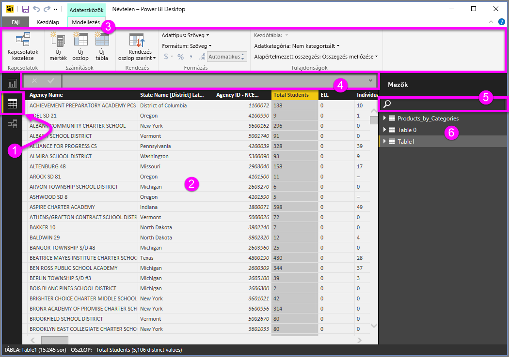
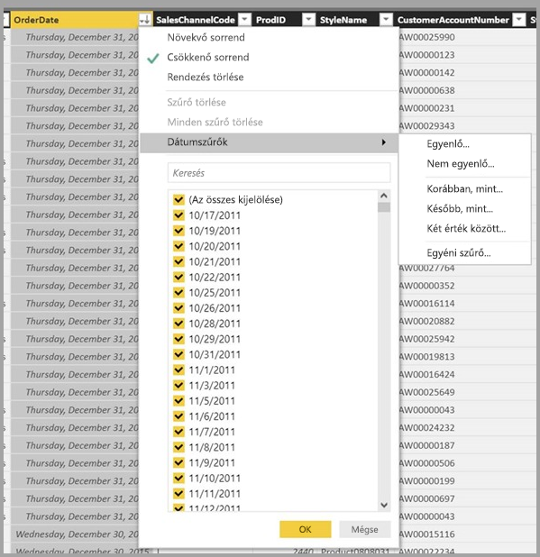

# Az Adatok nézet használata a Power BI Desktopban

Az *Adat nézet* segítségével megvizsgálhatja, felderítheti és megismerheti *Power BI Desktop*-modellben lévő adatokat. Így másképp tekintheti meg a táblákat, oszlopokat és adatokat, mint a *Power Query-szerkesztőben*. Az Adat nézettel a modellbe való betöltésük *után* tekintheti meg az adatokat.

Az adatok modellezésekor előfordulhat, hogy csak meg szeretné tekinteni egy tábla vagy oszlop aktuális tartalmát anélkül, hogy ehhez egy vizualizációt vagy jelentésvásznat kellene létrehoznia. Akár sorszintű betekintésre is szüksége lehet. Ez a képesség akkor igazán hasznos, amikor mértékeket vagy számított oszlopokat hoz létre, vagy amikor azonosítani szeretné az adatok típusát vagy kategóriáját.

Tekintsük meg részletesebben az Adat nézet néhány elemét.

1. **Adatnézet ikonja**. Az ikon kiválasztásával Adatnézetbe léphet.

2. **Adatrács**. Ez a terület a kijelölt táblát és a benne lévő összes oszlopot és sort jeleníti meg. A *Jelentés* nézet elől elrejtett oszlopok itt szürkén jelennek meg. Jobb gombbal az egyes oszlopokra kattintva elérheti a beállításokat.

3. **Modellezési menüszalag**. Lehetővé teszi a kapcsolatok kezelését, a számítások létrehozását és az oszlopok adattípusának, formátumának és adatkategóriájának szerkesztését.

4. **Képletsáv**. Itt adhatja meg a mértékek és a számított oszlopok Data Analysis Expression- (DAX-) képleteit.

5. **Keresés**. Táblákat vagy oszlopokat kereshet meg a modellben.

6. **Mezőlista**. Az adatrácsban megjelenítendő táblák vagy oszlopok kiválasztására szolgál.

## Szűrés Adatnézetben

Az Adatnézet lehetővé teszi az adatok szűrését és rendezését is. Mindegyik oszlopnál feltüntetésre kerül a rendezés irányát szemléltető ikon, ha az oszlopra van rendezés alkalmazva.

Szűrést alkalmazhat egyes értékekre, vagy az oszlopban található adatokat alapul véve használhatja a speciális szűrés funkciót is.

> [!NOTE]
> Amikor egy, a felhasználói felülettől eltérő kulturális környezetben hoz létre egy Power BI-modellt, a keresőmező kizárólag szövegmezők esetén jelenik meg az Adatnézet felhasználói felületén. Ez történne például egy amerikai angol nyelven létrehozott, spanyol területi beállítással megtekintett modell esetében.
