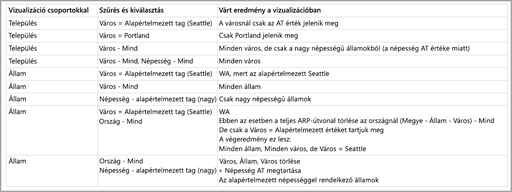

# Alapértelmezett tag többdimenziós modellekben a Power BI-ban

A Power BI-ban többdimenziós modellekhez csatlakozhat, és számos adattípust megjelenítő jelentéseket létrehozhat. Többdimenziós modellek használatakor a Power BI az adatok feldolgozásához bizonyos szabályokat alkalmaz az *alapértelmezett tagként* definiált oszlop alapján. 

Többdimenziós modellek használatakor a Power BI a modell adatait a **DefaultMember** attribútumot tartalmazó oszlop használati helyétől függően kezeli. A *DefaultMember* attribútum egy multidimenziós modell adott oszlopához CSDL-ben (Conceptual Schema Definition Language) van megadva. Az alapértelmezett tagról további információt az [attribútum tulajdonságival foglalkozó cikkben](https://docs.microsoft.com/sql/analysis-services/multidimensional-models/attribute-properties-define-a-default-member?view=sql-server-2017) találhat. DAX-lekérdezések végrehajtásakor a program automatikusan alkalmazza a modellben megadott alapértelmezett tagot.

Ez a cikk ismertette, hogy hogyan viselkedik a Power BI különböző, többdimenziós modelleket tartalmazó helyzetekben, az *alapértelmezett tag* helye alapján. 

## Szűrőkártyák használata

Amikor egy alapértelmezett tagot tartalmazó mezőn szeretne szűrőkártyát létrehozni, az alapértelmezett tag mezőjének értéke automatikusan ki lesz jelölve a szűrőkártyán. Ennek eredményeképp a szűrőkártya által befolyásolt vizualizációk megtartják az adatbázisban az alapértelmezett modelljeiket. Az ilyen szűrőkártyák értékei az alapértelmezett tag értékét tükrözik.

Ha az alapértelmezett tagot eltávolítják, az érték kijelölésének megszüntetésével az már nem fog a szűrőkártya hatókörébe tartozó vizualizációkra vonatkozni, a megjelenített értékek pedig nem az alapértelmezett tagot tükrözik.

Tegyük fel például, hogy egy *Pénznem* oszlop alapértelmezett tagja *USD-re* van állítva:

* Ebben az esetben, ha meg van adva egy kártya, amely az *Összes értékesítést* mutatja, az érték az alapértelmezett tag alapján „USD-t” eredményez az értékesítésekben.
* Ha a *Pénznem* oszlopot a szűrőkártya paneljére húzzuk, az *USD* lesz alapértelmezett értékként kijelölve. Az *Összes értékesítés* értéke változatlan marad, mivel az alapértelmezett tagot alkalmaztuk.
* Azonban ha megszüntetjük az *USD* érték kijelölését a szűrőkártyán, a *Pénznem* alapértelmezett értéke üres lesz, az *Összes értékesítés* így minden pénznemet megjelenít.
* Ennek következtében, ha kiválasztunk egy másik értéket a szűrőkártyán (mondjuk az *EURO* értéket) az alapértelmezett tag mellett, az *Összes értékesítés* a következő szűrőt eredményezi: *Pénznem IN {USD, EURO}* .

## A csoportosítás működése

A Power BI-ban minden alkalommal, amikor egy *alapértelmezett tagot* tartalmazó oszlopban csoportosít egy vizualizációt, a Power BI törli az *alapértelmezett tagot* az oszlopban és annak attribútumkapcsolati útvonalán. A vizualizáció így mindenképp megjelenít minden értéket, és nem csak az alapértelmezett értékeket.

## Attribútumkapcsolati útvonalak (ARP-k)

Az attribútumkapcsolati útvonalak (ARP-k) hasznos funkciókkal ruházzák fel az *alapértelmezett tagokat*, azonban összetettebbé teszik a modellt. A Power BI ARP-k észlelésekor azok útvonalát követve törli az egyéb oszlopok további alapértelmezett tagjait, így konzisztens és pontos adatkezelést biztosít a vizualizációk számára.

Lássunk erre egy példát. Vegyük alapul a következő ARP-konfigurációt:

Most tegyük fel, hogy a következő *alapértelmezett tagok* vannak beállítva az alábbi oszlopokhoz:

* Város > Seattle
* Állam > WA
* Ország > US
* Népesség > Nagy

Most nézzük meg, mi történik, ha a Power BI alkalmazza az egyes oszlopokat. Amikor a vizualizációkat a következő oszlopokban csoportosítja, az alábbi eredményt kapja:

* **Város** – a Power BI az összes várost megjeleníti a *Város*, *Állam* és *Ország* **alapértelmezett tagjainak** törlésével, azonban megőrzi a *Népesség* **alapértelmezett tagját**, a *Város* teljes ARP-jét pedig törli.
    > [!NOTE]
    > A *Népesség* nem szerepel a *Város* ARP-útvonalában, csak az *Államhoz* kapcsolódik, a Power BI így nem törli.
* **Állam** – a Power BI az összes *államot* megjeleníti a *Város* ,az *Állam*, az *Ország* és a *Népesség* **alapértelmezett tagjainak** törlésével.
* **Ország** – a Power BI az összes országot megjeleníti a *Város*, az *Állam* és az *Ország* **alapértelmezett tagjainak** törlésével, a *Népesség* **alapértelmezett tagját** azonban megőrzi.
* **Város és állam** – a Power BI törli az összes oszlop **alapértelmezett tagjait**.

A vizualizációban megjelenített csoportok teljes ARP-útvonala törlődik. 

Ha egy csoport nem jelenik meg a vizualizációban, de egy másik csoportosított oszlop ARP-útvonalában szerepel, a következő történik:

* Az ARP-útvonal nem minden ága törlődik automatikusan.
* A csoport továbbra is a nem törölt **alapértelmezett tag** által van szűrve.

### Szeletelők és szűrőkártyák

Szeletelőkkel vagy szűrőkártyákkal való munka során a következő működés figyelhető meg:

* Amikor egy szeletelőt vagy szűrőkártyát adatokkal tölt meg, a Power BI a vizualizáció oszlopában csoportosítja az elemeket, a megjelenítési működés így megegyezik az előző szakasszal.

Mivel a szeletelők és a szűrőkártyák gyakran lépnek interakcióba más vizualizációkkal, az érintett vizualizációk **alapértelmezett tagjainak** törlése a következő táblázatban leírtak szerint történik. 

A táblázathoz a cikkben korábban is használt mintaadatokat használjuk:

A Power BI ezen körülmények közötti működésére a következő szabályok vonatkoznak.

A Power BI a következő esetekben törli egy adott oszlop **alapértelmezett tagját**:

* A Power BI az oszlopban csoportosít
* A Power BI egy, az oszlophoz kapcsolódó oszlopban csoportosít (az ARP bármelyik pontján)
* A Power BI az ARP egyik oszlopán szűr (bármelyik irányba)
* Az oszlop egy *ÖSSZES* állapotú szűrőkártyával rendelkezik
* Az oszlop egy olyan szűrőkártyával rendelkezik, amelyben ki van jelölve egy érték (a Power BI egy szűrőt kap az oszlophoz)

A Power BI a következő esetekben nem törli egy adott oszlop **alapértelmezett tagját**:

* Az oszlopnak egy alapértelmezett állapottal rendelkező szűrőkártyát tartalmaz, a Power BI pedig ennek ARP-jéhez tartozó egyik oszlopban csoportosít.
* Az oszlop egy másik oszlop felett található az ARP-ben, a Power BI pedig egy szűrőkártyát alkalmaz alapértelmezett állapotban a másik oszlopra.

## Következő lépések

A cikkből ismertette a Power BI többdimenziós modellekben található alapértelmezett tagokkal való működését. Az alábbi cikkeket is érdekesnek találhatja: 

* [Adatot nem tartalmazó elemek megjelenítése a Power BI-ban](desktop-show-items-no-data.md)
* [Adatforrások a Power BI Desktopban](desktop-data-sources.md)
