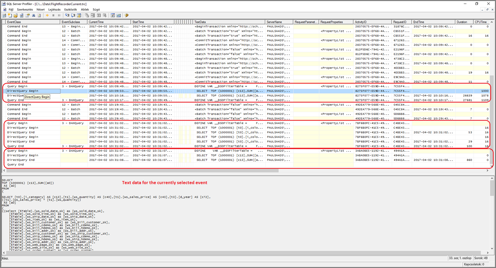
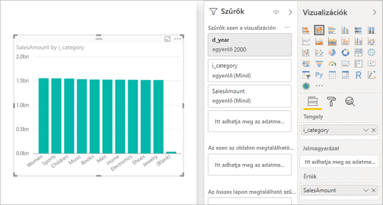

# <a name="troubleshoot-developing-directquery-models-in-power-bi-desktop"></a>DirectQuery-modellek fejlesztésének hibaelhárítása a Power BI Desktopban

Ez a cikk a Power BI Desktopban vagy a Power BI szolgáltatásban Power BI DirectQuery-modelleket fejlesztő adatmodellezőknek készült. Azt írja le, hogyan diagnosztizálhatja a teljesítményproblémákat, és hogyan kérhet le részletesebb információkat, amelyek lehetővé teszik a jelentések optimalizálását.

## <a name="performance-analyzer"></a>Teljesítményelemző

Erősen ajánlott a teljesítményproblémák diagnosztizálását a Power BI Desktopban elkezdeni, nem pedig a Power BI-ban (a szolgáltatásban vagy a Power BI jelentéskészítő kiszolgálón). A teljesítményproblémákat gyakran egyszerűen a mögöttes adatforrás teljesítményszintje okozza, ezeket pedig könnyebb azonosítani és diagnosztizálni a Power BI Desktop sokkal elkülönítettebb környezetében, illetve ezzel bizonyos összetevők is kiiktathatók (ilyen például a Power BI-átjáró). Csak akkor érdemes a Power BI-ban a jelentés jellemzői közt vizsgálódni, ha a Power BI Desktopban nem észleli a teljesítményproblémákat. A [Teljesítményelemző](desktop-performance-analyzer.md) hasznos eszköz a folyamat során felmerülő problémák azonosításához.

Hasonlóképp ajánlott a problémákat először egy különálló vizualizációban azonosítani, nem egy sok vizualizációt tartalmazó oldalon.

Tegyük fel, hogy elvégeztük ezeket a lépéseket (a témakör előző bekezdéseiben felsoroltakat) – most egyetlen vizualizációnk van egy oldalon a Power BI Desktopban, amely még mindig lassú. A Power BI Desktop által a mögöttes forrásnak küldött lekérdezések meghatározásához használja a Teljesítményelemzőt. Áttekintheti a mögöttes forrás által esetlegesen kiadott nyomkövetési és diagnosztikai adatokat. Ezek a nyomkövetési adatok hasznos információkat tartalmazhatnak a lekérdezés végrehajtásának részleteiről és a lekérdezés javításának lehetőségeiről is.

Emellett még ha az ilyen nyomkövetési adatok hiányoznak is a forrásból, akkor is megtekinthetők a Power BI által küldött lekérdezések és a végrehajtási idejük a következő módon.

## <a name="review-trace-files"></a>Nyomkövetési fájlok áttekintése

A Power BI Desktop alapértelmezés szerint az egy adott munkamenet során történt eseményeket egy nyomkövetési fájlban rögzíti, amelynek a neve **FlightRecorderCurrent.trc**.

Egyes DirectQuery-források esetében ez a naplófájl tartalmazza a mögöttes adatforrásnak küldött összes lekérdezést (a további DirectQuery-források esetleg a jövőbeli verziókban lesznek támogatottak). A következő források írnak lekérdezéseket a naplóba:

- SQL Server
- Azure SQL Database
- Azure SQL Data Warehouse
- Oracle
- Teradata
- SAP HANA

A nyomkövetési fájl az aktuális felhasználó **AppData** mappájában található: _\\\<Felhasználó>\AppData\Local\Microsoft\Power BI Desktop\AnalysisServicesWorkspaces_

Ez a mappa a legkönnyebben a következő módon érhető el: A Power BI Desktopban válassza a _Fájl > Lehetőségek és beállítások > Beállítások_ lehetőséget, majd a **Diagnosztika** lapot. Megjelenik a következő párbeszédablak:


Amikor kiválasztja az **Összeomlási memóriakép/nyomkövetési mappa megnyitása** hivatkozást, a következő mappa nyílik meg az Összeomlási memóriakép-gyűjtés szakaszban: _\\\<Felhasználó>\AppData\Local\Microsoft\Power BI Desktop\Traces_

E mappa szülőmappáját megnyitva az _AnalysisServicesWorkspaces_ mappa jelenik meg, amelyben a Power BI Desktop minden egyes megnyitott példányához egy munkaterületi almappa található. Ezek az almappák egész szám utótagokkal vannak elnevezve, például _AnalysisServicesWorkspace2058279583_.

Az almappákban van egy _\Data_ almappa, ebben található az aktuális Power BI-munkamenethez tartozó FlightRecorderCurrent.trc fájl. A Power BI Desktop-munkamenet befejezésekor az ahhoz tartozó munkaterületi mappa törlődik.

A nyomkövetési fájlok az SQL Server Profiler eszközzel nyithatók meg, amely az SQL Server Management Studio részeként ingyenesen letölthető. Ez az eszköz [innen](/sql/ssms/download-sql-server-management-studio-ssms?view=sql-server-2017) tölthető le.

Ha letöltötte és telepítette az SQL Server Management Studio eszközt, futtassa az SQL Server Profilert.



A nyomkövetési fájl megnyitásához hajtsa végre a következő lépéseket:

1. Az SQL Server Profilerben válassza a _File (Fájl) > Open (Megnyitás) > Trace file (Nyomkövetési fájl)_ lehetőséget
2. Írja be a jelenleg megnyitott Power BI-munkamenethez tartozó nyomkövetési fájl elérési útját, például: _\\\<Felhasználó>\AppData\Local\Microsoft\Power BI Desktop\AnalysisServicesWorkspaces\AnalysisServicesWorkspace2058279583\Data_
3. Nyissa meg a _FlightRecorderCurrent.trc_ fájlt

Megjelenik az aktuális munkamenet összes eseménye. Alább láthat egy jelmagyarázattal kiegészített példát, amely eseménycsoportokat emel ki. A csoportok a következőkkel rendelkeznek:

- Egy _Query Begin_ (Lekérdezés kezdete) és egy _Query End_ (Lekérdezés vége) esemény, amelyek egy felhasználói felületen (például egy vizualizációból vagy a szűrőfelület egy értéklistájából) létrehozott DAX-lekérdezés elejét és végét jelölik.
- Egy vagy több pár _DirectQuery Begin_ (DirectQuery kezdete) és _DirectQuery End_ (DirectQuery vége) esemény, amelyek egy-egy lekérdezés elküldését jelölik az alapul szolgáló adatforrás felé a DAX-lekérdezés kiértékelésének részeként

Vegye figyelembe, hogy több DAX-lekérdezés is végrehajtható párhuzamosan, így a különböző csoportok eseményei összefonódhatnak. Az ActivityID (Tevékenységazonosító) segítségével azonosítható, hogy mely események tartoznak ugyanazon csoporthoz.


A további lényeges oszlopok a következők:

- **TextData:** Az esemény szöveges részletezése. A _Lekérdezés kezdete/vége_ eseményeknél ez jelöli a DAX-lekérdezést. A _DirectQuery kezdete/vége_ eseményeknél ez jelöli a mögöttes forrásnak elküldött SQL-lekérdezést. A jelenleg kiválasztott esemény _TextData_ értéke az alsó régióban is megjelenik.
- **EndTime:** Az esemény befejezésének időpontja.
- **Duration:** A DAX- vagy SQL-lekérdezés végrehajtásához szükséges időtartam, ezredmásodpercben.
- **Error:** Jelzi, ha hiba történt – ez esetben az esemény vörös színnel jelenik meg.

A fenti képen néhány kevésbé lényeges oszlop keskenyítve lett, hogy a lényeges oszlopok jobban láthatók legyenek.

A potenciális teljesítményproblémák diagnosztizálásához szükséges nyomkövetés rögzítése az alábbi eljárással hajtható végre:

- Egyetlen Power BI Desktop-munkamenetet nyisson meg (a munkaterületi mappák összekeverésének elkerülése érdekében)
- Végezze el a vonatkozó műveleteket a Power BI Desktopban. Ezután végezzen el még néhány további műveletet, hogy a lényeges események biztosan bekerüljenek a nyomkövetési fájlba.
- Nyissa meg az SQL Server Profilert, és vizsgálja meg a nyomkövetési adatokat a fentebb leírt módon. Ne feledje, hogy a nyomkövetési fájl a Power BI Desktop bezárásakor törlődik. Emellett a Power BI Desktopban elvégzett további műveletek nem jelennek meg azonnal – az új események megtekintéséhez be kell zárni és újra meg kell nyitni a nyomkövetési fájlt.
- Fogja rövidre az egyes munkameneteket (néhány tíz másodpercre, ne több százra), hogy könnyebb legyen értelmezni a nyomkövetési fájlt (már csak azért is, mert a nyomkövetési fájl mérete korlátozott, így a nagyon hosszú munkamenetek esetén megvan az esélye a korai események eltűnésének).

## <a name="understand-queries-sent-to-the-source"></a>A forrásnak küldött lekérdezések ismertetése

A Power BI Desktop által generált és elküldött lekérdezések általános formátuma segédlekérdezéseket használ a modell minden egyes hivatkozott táblájához, ahol a segédlekérdezések a Power Query-lekérdezésben vannak meghatározva. Vegyük például egy SQL Server rendszerű relációs adatbázis alábbi TPC-DS-tábláit:


Tekintse meg a következő vizualizációt és annak konfigurációját, figyelembe véve, hogy a **SalesAmount** (Értékesítési összeg) mérték a következő kifejezéssel van definiálva:

```dax

SalesAmount = SUMX(Web_Sales, [ws_sales_price] * [ws_quantity])

```



A vizualizáció frissítésének eredménye a következő bekezdés alatt látható T-SQL-lekérdezés lesz. Mint látható, a **Web_Sales** (Webes értékesítés), az **Item** (Tétel) és a **Date_dim** (Dátumdimenzió) modell táblához három segédlekérdezés tartozik. Bár a vizualizáció ténylegesen csak négy oszlopra hivatkozik, a táblák mindegyike visszaadja a modelltábla összes oszlopát. Ezek az (árnyékolt) segédlekérdezések pontosan megfelelnek a Power Query-lekérdezések definíciójának. A segédlekérdezések ily módon való használata az eddigi tapasztalatok szerint nem befolyásolja a teljesítményt a DirectQuery által jelenleg támogatott adatforrások esetében. Az SQL Server és a hasonló adatforrások optimalizálással eltávolítják a nem használt oszlopok hivatkozásait.

A Power BI többek között azért alkalmazza ezt a mintát, mert Power Query-lekérdezést definiálhat egy konkrét lekérdezési utasításhoz. Ezért az „adott állapotában” használható, anélkül, hogy kísérletet tennénk az újraírására. Fontos megjegyezni, hogy ez a minta korlátozza a közös táblakifejezéseket (CTE-ket) és a tárolt eljárásokat használó lekérdezési utasítások használatát. Ezek az utasítások nem használhatók segédlekérdezésekben.


## <a name="gateway-performance"></a>Átjárók teljesítménye

Az átjárók teljesítményével kapcsolatos hibák elhárítására vonatkozó további információért lásd: [Átjárók hibaelhárítása – Power BI](service-gateway-onprem-tshoot.md).

## <a name="next-steps"></a>Következő lépések

Ha többet szeretne megtudni a DirectQueryről, tekintse át a következő forrásanyagokat:

- [A DirectQuery használata a Power BI Desktopban](desktop-use-directquery.md)
- [DirectQuery-modellek a Power BI Desktopban](desktop-directquery-about.md)
- [Útmutató a Power BI Desktopbeli DirectQuery-modellekhez](guidance/directquery-model-guidance.md)
- Kérdése van? [Kérdezze meg a Power BI közösségét](https://community.powerbi.com/)
