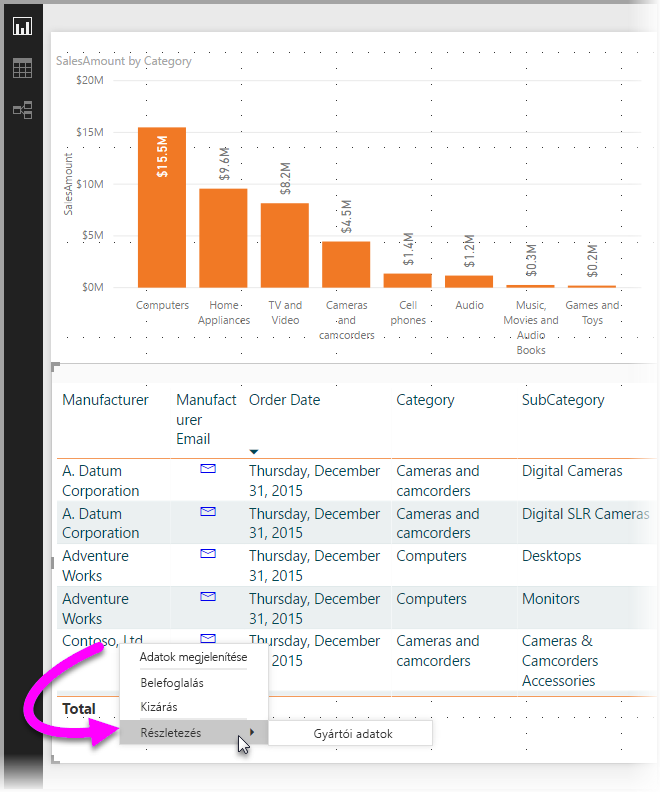
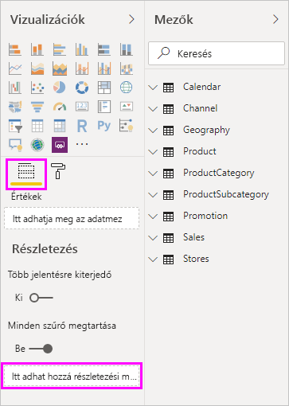
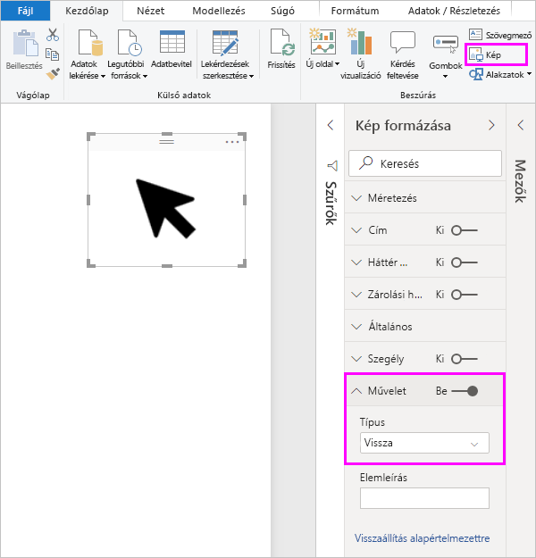
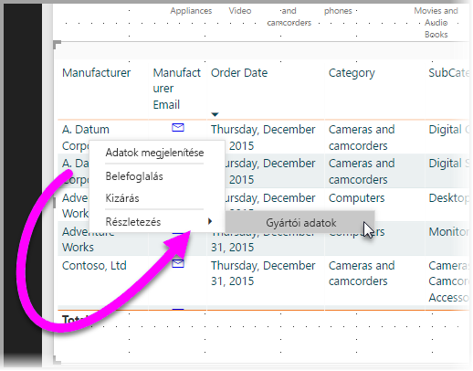
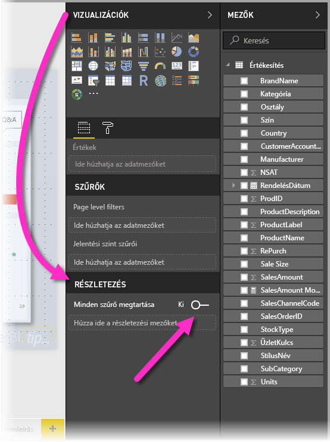
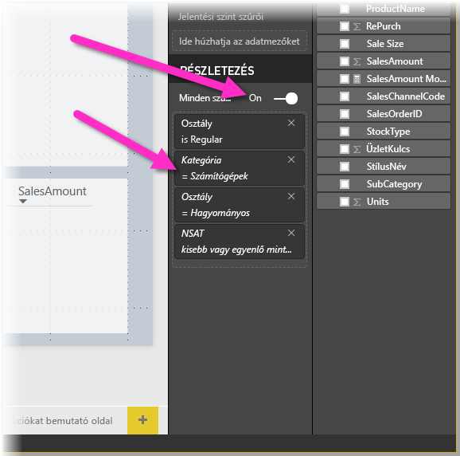
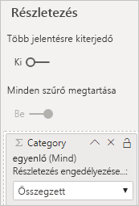

# Részletezés használata a Power BI Desktopban
A Power BI Desktop *részletezés* funkciójával olyan oldalt hozhat létre a jelentésben, amely egy adott entitásra – például szállítóra, ügyfélre vagy gyártóra összpontosít. A részletezés funkció használatához válassza ki azt úgy, hogy a jobb gombbal rákattint egy másik jelentésoldalon lévő adatpontra, így áthatolhat az összpontosított oldalra az ebben a környezetben szűrt részletek beszerzéséhez.

## A részletezés használata
1. A részletezés használatához hozzon létre egy jelentésoldalt, amely arról az entitástípusról tartalmaz vizualizációkat, amelyhez a részletezést készíti. 

    Tegyük fel például, hogy a gyártókra vonatkozó részletezést szeretne készíteni. Ekkor létrehozhat egy részletezési oldalt, amely megjeleníti többek között az összes értékesítést, az összes kiszállított egységet, a kategória szerinti értékesítéseket, a régió szerinti értékesítéseket stb. Ha részletezést jelenít meg ehhez az oldalhoz, a vizualizációk a kiválasztott gyártóra fognak vonatkozni.

2. Ezután a részletezési oldalon a **Vizualizációk** panel **Mezők** szakaszában húzza a **Részletezési szűrők** szakaszra azt a mezőt, amelyhez engedélyezni szeretné a részletezést.

    

    Amikor egy mezőt a **Részletezési szűrők** szakaszhoz ad, a Power BI Desktop automatikusan létrehoz egy *Vissza* gomb vizualizációt. Ez a vizualizáció a megjelenített jelentésekben gombként jelenik meg. Azok a felhasználók, akik a Power BI szolgáltatásban használják a jelentést, ezzel a gombbal térhetnek vissza arra a jelentésoldalra, ahonnan érkeztek.

    

## Saját kép használata vissza gombhoz    
 A vissza gomb egy kép, ezért a vizualizációt bármely tetszőleges képpel behelyettesítheti. De továbbra is vissza gombként fog működni, amellyel a felhasználók visszatérhetnek az eredeti oldalhoz. 

Ha egy saját képet szeretne használni a Vissza gombhoz, kövesse az alábbi lépéseket:

1. A **Kezdőlap** lapon válassza ki a **Kép** lehetőséget. Keresse meg a képet, majd helyezze a részletező oldalra.

2. Kattintson az új képre a részletező oldalon. A **Kép formázása** panel alatt húzza a **Művelet** csúszkát a **Be** állásba, majd állítsa a **Típust** a **Vissza** értékre. A kép most már vissza gombként működik.

    

    
     A felhasználók mostantól a jobb gombbal kattinthatnak a jelentésben lévő adatpontra az oldal részletezését támogató helyi menühöz. 

    

    Amikor a jelentés felhasználói a részletezést választják, a rendszer szűri az oldalt, és megjeleníti a jobb gombbal kiválasztott adatpontra vonatkozó információkat. Tegyük fel például, hogy a felhasználó a Contoso nevű gyártóra vonatkozó adatpontra kattintott a jobb gombbal, és a részletezést választotta. A megnyíló részletezés oldal a Contoso cégre szűr.

## Összes szűrő átvétele a részletezésben

A Power BI Desktop alkalmazás 2018. májusi verziója óta átveheti az összes alkalmazott szűrőt a részletezési ablakban. Megteheti például, hogy csak egy adott termékkategóriát jelöl ki, és a vizualizációkat erre a kategóriára szűri, majd ezután választja a részletezést. Ilyen esetben elképzelhető, hogy szeretné megtekinteni, hogyan nézne ki a részletezés a szűrők alkalmazásával.

Az összes alkalmazott szűrő megtartásához állítsa a **Vizualizációk** panel **Részletezés** szakaszában az **Az összes szűrő megőrzése** kapcsolót **Be** állásba. 

A Power BI Desktop alkalmazás 2018. május előtti verziói úgy működnek, mintha ez a kapcsoló **Ki** állásba lenne állítva.

Ha ezt követően részletez egy vizualizációt, láthatja, hogy mely szűrők lettek alkalmazva a forrásvizualizációra alkalmazott ideiglenes szűrők révén. A **Vizualizációk** panel **Részletezés** szakaszában dőlt formázású átmeneti szűrők jelennek meg. 

Ugyanezt elvégezhetné elemleíráslapokkal is, de ez szokatlan eredményhez vezetne, mert az elemleírás látszólag nem működne megfelelően. Éppen ezért nem javasolt az eszköztippek használata.

## Mérték hozzáadása részletezéshez

Nem csupán az összes szűrőt adhatja át a részletezési ablaknak, de mértéket (vagy összegzett numerikus oszlopot) is hozzáadhat a részletezési területhez. A részletező menü alkalmazásához húzza át azt a **Részletezés** kártyára. 

Mérték (vagy összegzett numerikus oszlop) hozzáadása esetén a mezőt a vizualizáció *Érték* területén használva jelenítheti meg az oldal részleteit.

Ezek a tudnivalók vonatkoztak a részletezés jelentésekben való használatára. Ezzel a módszerrel hatékonyan jelenítheti meg a részletezési szűrőhöz kiválasztott entitásinformációk kibővített nézetét.

## Következő lépések

Az alábbi cikkeket is érdekesnek találhatja:

* [Jelentésközi részletezés a Power BI Desktopban](desktop-cross-report-drill-through.md)
* [Szeletelők használata a Power BI Desktopban](visuals/power-bi-visualization-slicers.md)

