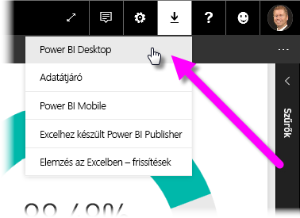
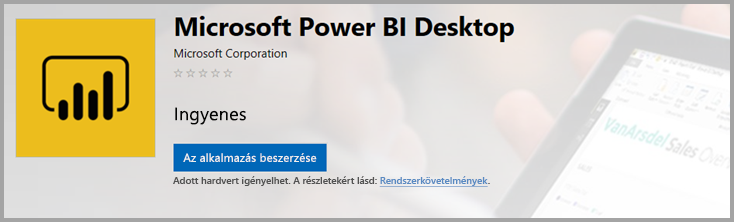
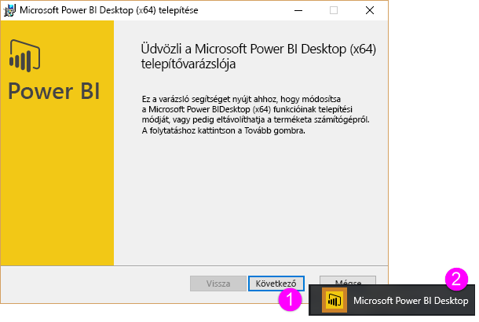
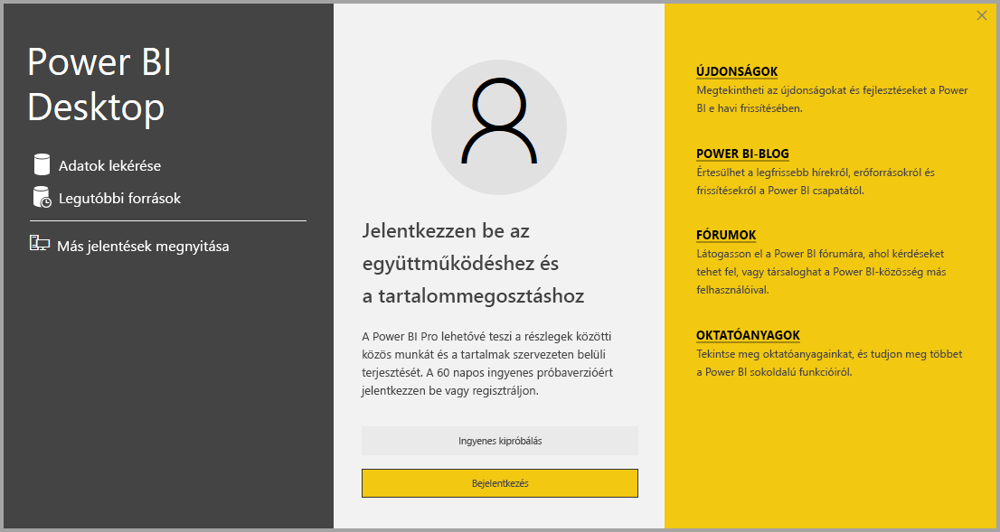

# <a name="get-power-bi-desktop"></a>A Power BI Desktop beszerzése
A Power BI Desktop használatával összetett lekérdezéseket, modelleket és az adatokat megjelenítő jelentéseket hozhat létre. A Power BI Desktop használatával adatmodelleket állíthat össze, jelentéseket hozhat létre és megoszthatja a munkáját a Power BI szolgáltatásba való közzététellel. A Power BI Desktop ingyenesen letölthető.

A Power BI Desktopot kétféleképpen szerezheti be. Ezen módszerek leírását megtalálja a következő szakaszokban:

* [Telepítés alkalmazásként a Microsoft Store-ból](#install-as-an-app-from-the-microsoft-store).
* [Közvetlen letöltés egy futtatható fájl letöltésével és telepítésével a számítógépen](#download-power-bi-desktop-directly).

Mindkét módszerrel a Power BI Desktop legfrissebb verzióját szerzi be a számítógépére, de néhány különbséget érdemes kiemelni. Ezeket a különbségeket a következő szakaszok ismertetik.

## <a name="install-as-an-app-from-the-microsoft-store"></a>Telepítés alkalmazásként a Microsoft Store-ból
A Power BI Desktop legújabb verziója több módon is elérhető a Microsoft Store-ban. 

1. A Microsoft Store **Power BI Desktop** oldalát az alábbi lehetőségek egyikével nyithatja meg:

   - Nyisson meg egy böngészőt és keresse fel közvetlenül a Microsoft Store [Power BI Desktop oldalát](https://aka.ms/pbidesktopstore).

    - A [Power BI szolgáltatásban](https://docs.microsoft.com/power-bi/service-get-started) válassza a jobb felső sarokban található **Letöltés** ikont, majd válassza a **Power BI Desktop** elemet.

      

   - Lépjen a [Power BI Desktop termékoldalra](https://powerbi.microsoft.com/desktop/), majd válassza az **Ingyenes letöltés** lehetőséget.
  
2. Amikor megérkezik a Microsoft Store **Power BI Desktop** oldalára, válassza a **Telepítés** lehetőséget.

     

A következő előnyökkel jár, ha a Power BI Desktopot a Microsoft Store-ból szerzi be:

* **Automatikus frissítések**: A Windows automatikusan letölti a legfrissebb verziót a háttérben, amint az elérhetővé válik, így a verziója mindig naprakész marad.
* **Kisebb letöltések**: A Microsoft Store csak azokat az összetevőket tölti le a gépre, amelyek az egyes frissítések során megváltoztak, így frissítéskor kisebb méretű fájlokat kell letölteni.
* **Nincs szükség rendszergazdai jogosultságokra**: Ha közvetlenül tölti le és telepíti a csomagot, a telepítés sikeres elvégzéséhez rendszergazdának kell lennie. Ha a Microsoft Store-ból szerzi be a Power BI Desktopot, *nincs* szükség rendszergazdai jogosultságra.
* **Informatikai bevezetés lehetősége**: A Microsoft Store Vállalatoknak szolgáltatáson keresztül a Power BI Desktopot egyszerűen helyezheti üzembe és *vezetheti be* az összes vállalati felhasználó számára

* **Nyelvfelismerés**: A Microsoft Store-ból elérhető verzió tartalmazza az összes támogatott nyelvet, és minden indításkor ellenőrzi, hogy mely nyelvet használják a számítógépen. Ez a nyelvi támogatás a Power BI Desktopban létrehozott modellek területi beállításaira is kiterjed. A beépített dátumhierarchiák például megfelelnek annak a nyelvnek, amelyet a Power BI Desktop a .pbix-fájl létrehozásakor használ.

A Power BI Desktop Microsoft Store-ból történő telepítésekor az alábbi szempontokat és korlátozásokat kell figyelembe venni:

* Ha az SAP-összekötőt használja, lehet, hogy a *Windows\System32* mappába kell helyeznie az SAP-illesztő fájljait.
* A Power BI Desktop Microsoft Store-ból való telepítésével nem történik meg a .exe-verzióból származó felhasználói beállítások másolása. Elképzelhető, hogy újra kell csatlakoztatni a legutóbbi adatforrásokat, és ismét meg kell adni az adatforrások hitelesítő adatait. 

> [!NOTE]
> A Power BI Desktop Power BI jelentéskészítő kiszolgáló verziója az ebben a cikkben tárgyalt verzióktól eltérő, önálló telepítés. A Power BI Desktop jelentéskészítő kiszolgáló verziójáról információt a [Power BI-jelentés létrehozása a Power BI jelentéskészítő kiszolgálóhoz](report-server/quickstart-create-powerbi-report.md) című cikkben talál.
> 
> 

## <a name="download-power-bi-desktop-directly"></a>A Power BI Desktop közvetlen letöltése
  
  Ha a Power BI Desktop futtatható telepítőjét szeretné letölteni a Letöltőközpontból, válassza a **Letöltés** lehetőséget a [Letöltőközpont oldalán](https://www.microsoft.com/download/details.aspx?id=58494). Ez után adja meg, hogy a 32 vagy a 64 bites telepítőfájlt szeretné letölteni.

  

### <a name="install-power-bi-desktop-after-downloading-it"></a>A Power BI Desktop letöltés utáni telepítése
A letöltés befejezésekor a rendszer felkéri a telepítőfájl futtatására.

A 2019. júliusi kiadástól kezdve a Power BI Desktop egyetlen .exe telepítőcsomagként szerezhető be, amely az összes támogatott nyelvet tartalmazza. A 32 és a 64 bites verzióhoz külön .exe-fájl tartozik. Az .msi-csomagokat a 2019. szeptemberi kiadástól kezdve kivontuk, így a telepítéshez a végrehajtható .exe szükséges. Ez sokkal egyszerűbbé és kényelmesebbé teszi a terjesztést, a frissítéseket és a telepítést (elsősorban a rendszergazdák számára). A telepítési folyamatot testre is szabhatja parancssori paraméterek használatával a [parancssori beállítások használata a telepítés során](#using-command-line-options-during-installation) című szakaszban leírtak szerint.

A telepítőcsomag indítása után a Power BI Desktop alkalmazásként lesz telepítve, és az asztalon fut.



> [!NOTE]
> Nem támogatott a Power BI Desktop letöltött (MSI-) verziójának (elavult) és Microsoft Store-ból elérhető verziójának telepítése ugyanarra a számítógépre (ez más néven a *párhuzamos telepítés*). A Microsoft Store-ból való letöltés előtt manuálisan távolítsa el a Power BI Desktopot.
> 

## <a name="using-power-bi-desktop"></a>A Power BI Desktop használata
A Power BI Desktop elindításakor megjelenik egy üdvözlőképernyő.



Ha első alkalommal használja a Power BI Desktopot (tehát ha a telepítés nem frissítés volt), a rendszer felkéri egy űrlap kitöltésére vagy a Power BI szolgáltatásba való bejelentkezésre, mielőtt továbbléphetne.

Innen megkezdheti adatmodellek vagy jelentések létrehozását, majd megoszthatja azokat másokkal a Power BI szolgáltatásban. A [Következő lépések](#next-steps) szakaszban olyan útmutatókra mutató hivatkozásokat talál, amelyek segítenek a Power BI Desktop használatba vételében.

## <a name="minimum-requirements"></a>Minimális követelmények
A következő lista a Power BI Desktop futtatásához szükséges minimális követelményeket tartalmazza:

* Windows 7 / Windows Server 2008 R2 vagy újabb
* .NET 4.5
* Internet Explorer 10-es vagy újabb verzió
* Memória (RAM): Legalább 1 GB, 1,5 GB vagy több javasolt.
* Kijelző: Legalább 1440×900 vagy 1600×900 (16:9) felbontás javasolt. Az alacsonyabb felbontás, például 1024x768 vagy 1280x800 nem javasolt, mert bizonyos vezérlők (például a kezdőképernyő bezárása) csak nagyobb felbontáson jelennek meg.
* A Windows megjelenítési beállításai: Ha a megjelenítési beállításokkal több mint 100%-ra módosítja a szövegek, alkalmazások és más elemek méretét, lehet, hogy nem jelennek meg bizonyos párbeszédpanelek, amelyeken valamilyen műveletet kell végezni a Power BI Desktop használatának folytatásához. Ha ezzel a problémával találkozik, ellenőrizze a Windows megjelenítési beállításait. Ehhez lépjen a **Gépház** > **Rendszer** > **Kijelző** területre, és a csúszkával állítsa vissza a megjelenítési beállításokat 100%-ra.
* CPU: 1 GHz-es vagy gyorsabb 32 vagy 64 bites x86-os processzor ajánlott.

## <a name="considerations-and-limitations"></a>Megfontolandó szempontok és korlátozások

Igyekszünk a lehető legjobb élményt biztosítani a Power BI Desktop felhasználóinak. Mivel előfordulhat, hogy a Power BI Desktop használata során problémák merülnek fel, ez a szakasz megoldásokat és javaslatokat kínál a különböző esetekre. 

### <a name="using-command-line-options-during-installation"></a>Parancssori beállítások használata a telepítés során 

A Power BI Desktop telepítésekor tulajdonságokat és beállításokat adhat meg parancssori kapcsolókkal. Ezek a beállítások elsősorban a rendszergazdák számára hasznosak, akik több vállalatnál kezelik vagy bonyolítják le a Power BI Desktop telepítését. Ezek a lehetőségek .msi és .exe telepítésekor is használhatók. 


|Parancssori beállítás  |Működés  |
|---------|---------|
|-q, -quiet, -s, -silent     |Csendes telepítés         |
|-passive     |Telepítés közben csak a folyamatjelző sáv látható         |
|-norestart     |A számítógép újraindítási követelményének mellőzése         |
|-forcerestart     |A számítógép kérdés nélküli újraindítása a telepítés után         |
|-promptrestart     |A felhasználó értesítése, ha a számítógép újraindítása szükséges (alapértelmezés)         |
|-l<>, -log<>     |A telepítés naplózása a <> jelek között megadott fájlba         |
|-uninstall     |A Power BI Desktop eltávolítása         |
|-repair     |A telepítés javítása (vagy telepítés, ha jelenleg nincs telepítve)         |
|-package, -update     |A Power BI Desktop telepítése (alapértelmezés, ha nincs megadva az -uninstall vagy a -repair kapcsoló)         |

Használhatja az alábbi szintaktikai paramétereket is, amelyeket a *tulajdonság = érték* szintaxissal adhat meg:

|Paraméter  |Értelmezés  |
|---------|---------|
|ACCEPT_EULA     |Az 1 értéket kell megadni a végfelhasználói licencszerződés automatikus elfogadásához         |
|ENABLECXP     |Az 1 érték regisztrál a felhasználói élmény programba, amely a termék használatáról rögzít telemetriai adatokat         |
|INSTALLDESKTOPSHORTCUT     |Az 1 érték parancsikont vesz fel az asztalra         |
|INSTALLLOCATION     |A kívánt telepítési útvonal         |
|LANGUAGE     |Területi beállításkód, például en-US, de-DE, pr-BR, hu-HU, az alkalmazás alapértelmezett nyelvének kikényszerítéséhez. Ha nem ad meg nyelvet, a Power BI Desktop a Windows operációs rendszer nyelvét jeleníti meg. Ezt a beállítást a **Beállítások** párbeszédpanelen módosíthatja.         |
|REG_SHOWLEADGENDIALOG     |A 0 érték letiltja annak a párbeszédpanelnek a megjelenítését, amely a Power BI Desktopba való bejelentkezés előtt jelenne meg.         |

A Power BI Desktop a következő beállításokkal és paraméterekkel futtatva például felhasználói felület nélkül, német nyelv használatával lesz telepítve: 

```-quiet LANG=de-DE ACCEPT_EULA=1```

### <a name="installing-power-bi-desktop-on-remote-machines"></a>A Power BI Desktop telepítése távoli gépekre

Ha olyan eszközzel telepíti a Power BI Desktopot a felhasználók számára, amely Windows telepítőfájlt (.msi-fájlt) igényel, kicsomagolhatja az .msi-fájlt a Power BI Desktop telepítő .exe-fájljából. Erre használhat olyan külső eszközt, mint a WiX Toolset.

> [!NOTE]
> Mivel külső termék, a WiX Toolset beállítási lehetőségei előzetes értesítés nélkül változhatnak. Ellenőrizze a dokumentációban a legfrissebb információkat, segítségért pedig forduljon a vállalat felhasználói levelezési listájához.

1. Azon a számítógépen, amelyre letöltötte a Power BI Desktop telepítőjét, telepítse a [WiX Toolset](https://wixtoolset.org/) legújabb verzióját.
2. Nyisson meg rendszergazdaként egy parancssori ablakot, és lépjen ahhoz a mappához, amelybe a WiX Toolsetet telepítette.
3. Futtassa a következő parancsot: 
    
    ```Dark.exe <path to Power BI Desktop installer> -x <output folder>```

    Például:

    ``` Dark.exe C:\PBIDesktop_x64.exe -x C:\output```

    A kimeneti mappa tartalmaz egy *AttachedContainer* nevű mappát, amelyben az .msi-fájlok találhatók.


### <a name="issues-when-using-previous-releases-of-power-bi-desktop"></a>Problémák a Power BI Desktop előző kiadásainak használata során

Egyes felhasználók a következő példához hasonló hibaüzenettel szembesülhetnek, ha a Power BI Desktop elavult verzióját használják: 

*Nem sikerült visszaállítani a modellbe a mentett adatbázist* 

A Power BI Desktop aktuális verziójára történő frissítés általában megoldja ezt a problémát.

### <a name="disabling-notifications"></a>Értesítések letiltása
Azt javasoljuk, hogy frissítsen a Power BI Desktop legújabb verziójára, mert így a legújabb fejlesztéseket élvezheti többek között a funkciók, a teljesítmény és a stabilitás terén. Egyes cégek nem kívánják, hogy a munkatársaik minden új verzióra frissítsenek. Az értesítéseket a beállításjegyzék módosításával kapcsolhatja ki a következő lépésekben:

1. A beállításjegyzék-szerkesztőben nyissa meg a **HKEY_LOCAL_MACHINE\SOFTWARE\Microsoft\Microsoft Power BI Desktop** kulcsot.
2. Hozzon létre új **REG_DWORD** értéket a kulcsban az alábbi névvel: **DisableUpdateNotification**.
3. Állítsa az új bejegyzés értékét **1**-re.
4. A módosítás érvényre juttatásához indítsa újra a számítógépet.

### <a name="power-bi-desktop-loads-with-a-partial-screen"></a>A Power BI Desktop részképernyővel töltődik be

Bizonyos körülmények között, például bizonyos képernyőfelbontási konfigurációk esetén, egyes felhasználók a Power BI Desktop tartalmai mellett nagy, fekete területeket láthatnak. Ez a probléma általában inkább az elemek megjelenítését befolyásoló, közelmúltban történt operációsrendszer-frissítések következménye, és nem közvetlenül abból adódnak, ahogy maga a Power BI Desktop mutatja be őket. A probléma megoldásához hajtsa végre az alábbi lépéseket:

1. Nyomja le a **Start** billentyűt, és a megjelenő keresőmezőbe írja be a *blurry* (homályos) szót.
2. A megjelenő párbeszédablakban válassza az alábbi lehetőséget: **A Windows javítsa ki a homályos alkalmazásokat.**
3. Indítsa újra a Power BI Desktopot.

A probléma későbbi Windows-frissítések megjelenésekor megoldódhat. 
 

## <a name="next-steps"></a>Következő lépések
A Power BI Desktop telepítése után a következő tartalmak segíthetnek a használata gyors megkezdésében:

* [Mi az a Power BI Desktop?](desktop-what-is-desktop.md)
* [Lekérdezések áttekintése a Power BI Desktopban](desktop-query-overview.md)
* [Adatforrások a Power BI Desktopban](desktop-data-sources.md)
* [Csatlakozás adatokhoz a Power BI Desktopban](desktop-connect-to-data.md)
* [Adatok formázása és összevonása a Power BI Desktopban](desktop-shape-and-combine-data.md)
* [Gyakori lekérdezési feladatok a Power BI Desktopban](desktop-common-query-tasks.md)   

