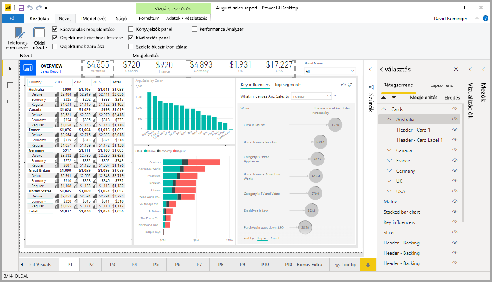
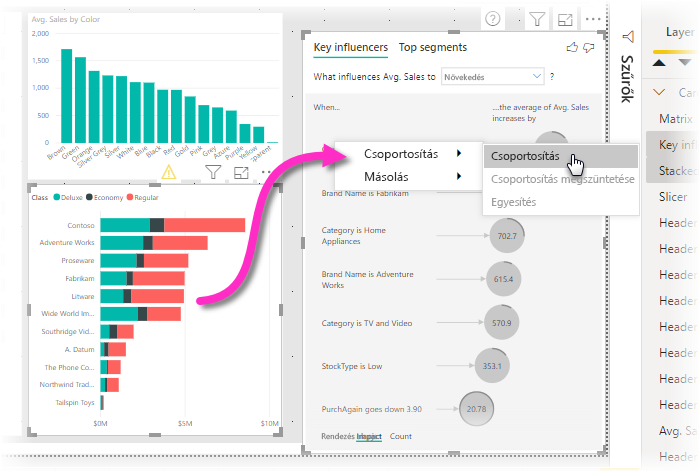
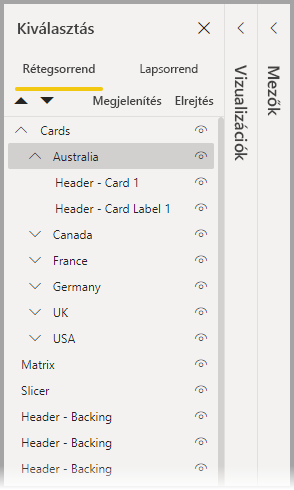
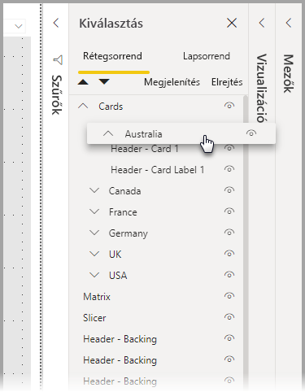
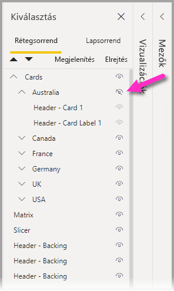
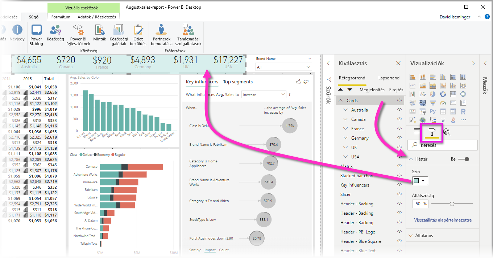

# Vizualizációk csoportosítása a Power BI Desktop-jelentésekben
A **Power BI Desktopban** ugyanúgy **csoportosíthatja** a jelentésbeli vizualizációkat, például gombokat, szövegdobozokat, alakzatokat, képeket és bármilyen létrehozott vizualizációt, ahogyan a PowerPointban csoportosít elemeket. Egy jelentés vizualizációinak csoportosítása lehetővé teszi, hogy a csoportot egyetlen objektumként kezelje, ezáltal egyszerűbbé, gyorsabbá és magától értetődőbbé válik azok áthelyezése, méretezése és a rétegek kezelése a jelentésben.

## Csoportok létrehozása

Vizualizációcsoportot úgy hozhat létre a Power BI Desktopban, hogy kijelöli a vásznon az első vizualizációt, majd a CTRL billentyűt lenyomva tartva kattint a csoportba foglalni kívánt egy vagy több további vizualizációra, végül a jobb gombbal kattint a vizualizációk gyűjteményére, és a megjelenő menü **Csoportba foglalás** elemét választja.

A csoportok a **Kijelölés** panelen jelennek meg. Annyi vizualizációcsoportot hozhat létre, amennyire a jelentéshez szüksége van, és a vizualizációcsoportokat egymásba is ágyazhatja. Az alábbi ábrán az *Ausztrália* csoport a *Kártyák* csoportba van beágyazva. Egy csoportot a neve melletti karet jel kiválasztásával bonthat ki, és ugyanezzel a jellel csukhatja össze újra. 

A **Kijelölés** panelen kattintással és húzással is végrehajthatja egyes vizualizációk csoportba helyezését, csoportból való eltávolítását, csoport beágyazását, vagy csoport vagy vizualizáció beágyazásból való kivételét. Egyszerűen húzza át a módosítani kívánt vizualizációt a kívánt helyre. A vizualizációk rétegződését átfedés esetén a *Rétegsorrend* lista sorrendje határozza meg.

A csoport felbontásához jelölje ki a csoportot, kattintson rá a jobb gombbal, és válassza a megjelenő menü **Csoportbontás** elemét.

## Vizualizációk vagy csoportok elrejtése és felfedése

Csoportokat egyszerűen elrejthet és felfedhet a **Kiválasztás** panelen. Csoport elrejtéséhez a csoport (vagy bármely vizualizáció) neve melletti szem ikonra kattintva válthat a vizualizáció vagy csoport rejtett és megjelenített állapota között. Az alábbi ábrán az *Ausztrália* csoport rejtett, a *Kártyák* csoportba ágyazott többi csoport viszont látható.

Ha elrejt egy csoportot, akkor a csoportban lévő összes vizualizáció rejtett lesz. Ezt a szem ikon szürke megjelenése jelzi (nem lehet ki- vagy bekapcsolni, mert a teljes csoport rejtett). Ha csak a csoport egyes vizualizációit szeretné elrejteni, egyszerűen váltson a vizualizáció melletti szem ikonnal, és a csoportban csak az a vizualizáció lesz rejtett.

## Vizualizációk csoporton belüli kijelölése

Vizualizációcsoporton belül az elemek több módon is kezelhetők és kijelölhetők. A következő lista ezt a viselkedést ismerteti:

* A csoporton belüli üres területre (például két vizualizáció közötti sávra) kattintva semmit sem jelöl ki
* A csoporton belüli vizualizációra kattintva a teljes csoportot kijelöli, újabb kattintással csak az adott vizualizációt jelöli ki
* Ha kijelöl egy csoportot, majd egy másik elemet a jelentésvásznon, és a helyi menü **Csoportba foglalás** elemét választja, beágyazott csoportot hoz létre
* Ha két csoportot jelöl ki, a jobb gombbal kattintva megjelenített lehetőségek közül a beágyazás helyett a kijelölt csoportok egyesítését is választhatja

## Háttérszín alkalmazása

Egy csoporthoz háttérszínt is megadhat a **Vizualizációk** panel **Formázás** területének használatával, az alábbi ábrán látható módon. 

Háttérszín alkalmazása után a csoportbeli vizualizációk közötti területre kattintva kijelöli a csoportot (ellentétben a vizualizációk közötti színezetlen üres helyre kattintással, amely nem jelöli ki a csoportot). 

## Következő lépések
Többet is megtudhat a csoportosításról az alábbi videó megtekintésével:

* [Csoportosítás használata a Power BI Desktopban – videó](https://youtu.be/sf4n7VXoQHY?t=10)

Az alábbi cikkeket is érdekesnek találhatja:

* [Jelentésközi részletezés a Power BI Desktopban](desktop-cross-report-drill-through.md)
* [Szeletelők használata a Power BI Desktopban](visuals/power-bi-visualization-slicers.md)

