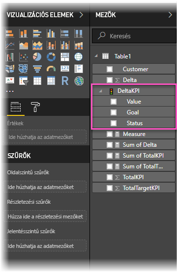
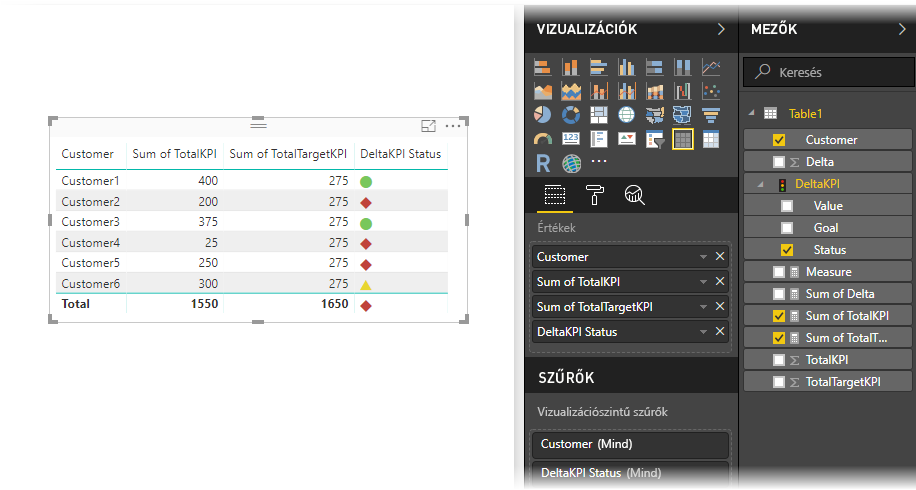

# KPI-k importálása és megjelenítése a Power BI-ban
A **Power BI Desktop** használatával KPI-ket importálhat és jeleníthet meg a táblákban, mátrixokban és kártyákon.

A KPI-k importálásához és megjelenítéséhez kövesse az alábbi lépéseket

1. Kezdje egy olyan Excel-fájllal, amely Power Pivot-modellel és KPI-kkel rendelkezik. Ebben a gyakorlatban egy *KPI-k* elnevezésű munkafüzetet használunk.

1. Importálja az Excel-munkafüzetet a Power BI-ba a **File -> Importálás -> Excel-munkafüzet tartalma** lehetőséggel. Így [a munkafüzetek importálásának módját is elsajátíthatja](desktop-import-excel-workbooks.md). 

1. A Power BI-ba történt importálás után a KPI megjelenik a  ikonnal jelölt **Mezők** panelen. Ahhoz, hogy a KPI-t felhasználhassa a jelentésben, ki kell bontania annak tartalmát, hogy megjelenjen az **Érték**, **Cél** és **Állapot** mező.

    

1. Az importált KPI-ket érdemes szabványos vizualizáció-típusokban, például **Tábla** típusban felhasználni. A Power BI **KPI** vizualizáció-típust is tartalmaz, amely csak új KPI-k létrehozásához használandó.
   
    

Ennyi az egész. Ezekkel a KPI-kkel trendeket, előrehaladást vagy egyéb jelentős mutatókat emelhet ki.
