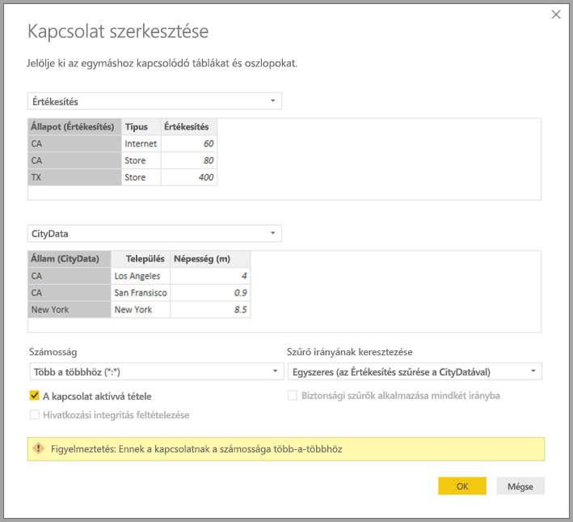

# Több-a-többhöz kapcsolatok alkalmazása a Power BI Desktopban

A Power BI Desktop *több-a-többhöz számosságú kapcsolatok* funkciójával *több-a-többhöz* számosságot használó táblák kapcsolhatók össze. A kettő vagy több adatforrást tartalmazó adatmodellek így egyszerűbb és intuitívabb módon hozhatók létre. A *több-a-többhöz számosságú kapcsolatok* a Power BI Desktop tágabb *összetett modellek* funkciójának része.

A Power BI Desktopban beállítható *több-a-többhöz számosságú kapcsolatok* három összefüggő funkció együttesének egy részét képezik:

* **Összetett modellek**: Az *összetett modellek* lehetővé teszik, hogy egy jelentés kettő vagy több adatkapcsolattal, köztük DirectQuery-kapcsolatokkal és importálással, vagy ezek bármilyen kombinációjával rendelkezzen. További információ: [Összetett modellek használata a Power BI Desktopban](desktop-composite-models.md).

* **Több-a-többhöz számosságú kapcsolatok**: Az összetett modellekkel a táblák között *több-a-többhöz számosságú kapcsolatok* hozhatók létre. Ez a megközelítés kiküszöböli, hogy egyedi értékeket kelljen használni a táblákban. Korábbi áthidaló megoldásokat is szükségtelenné tesz, például új táblák bevezetését a kapcsolatok létrehozásához. A funkcióról ez a cikk szolgáltat további információt.

* **Tárolási mód**: Mostantól megadható, hogy mely vizualizációk igényelnek a háttér-adatforrásokba irányuló lekérdezéseket. Azok a vizualizációk, amelyekhez nincs szükség lekérdezésre, importálva lesznek még akkor is, ha DirectQuery-alapúak. Ez a funkció segíti a teljesítmény javulását, és csökkenti a háttérrendszerek leterheltségét. Korábban még az egyszerű vizualizációk, például a szeletelők is kezdeményeztek a háttérbeli forrásokba irányuló lekérdezéseket. További információt a [Tárolási mód a Power BI Desktopban](desktop-storage-mode.md) című cikkben talál.

## Erre nyújtanak megoldást a több-a-többhöz számosságú kapcsolatok

A két tábla közötti kapcsolat már definiálva volt a Power BI-ban, mielőtt a *több-a-többhöz számosságú kapcsolatok* funkciója elérhetővé vált volna. A kapcsolatot alkotó táblák legalább egyik oszlopának tartalmaznia kellett egyedi értékeket, gyakran azonban egyetlen oszlopban sem voltak egyedi értékek.

Például lehetséges, hogy két tábla is tartalmazott egy Country (Ország) nevű oszlopot. A Country értékei azonban egyik táblában sem voltak egyediek. Két ilyen tábla összekapcsolásához áthidaló megoldásra volt szükség. Az egyik megoldás az lehet, ha új táblákat vezet be a szükséges egyedi értékekkel. A *több-a-többhöz számosságú kapcsolatok* funkciójával ilyen táblákat közvetlenül is összekapcsolhat a *több-a-többhöz* számosságú kapcsolat segítségével.

## Több-a-többhöz számosságú kapcsolatok használata

Amikor kapcsolatot definiál két tábla között a Power BI-ban, meg kell adnia a kapcsolat számosságát. Például a ProductSales (értékesítések) és Product (termék) táblák közötti kapcsolat &mdash; a ProductSales[ProductCode] és a Product[ProductCode] oszlop alapján &mdash; *több-az-egyhez* kapcsolatként lenne definiálva. A kapcsolat azért definiálható így, mert egy termékhez több értékesítés is tartozhat, és a Product tábla ProductCode (termékkód) oszlopa egyedi. Amikor egy kapcsolat számosságaként *több-az-egyhez*, *egy-a-többhöz* vagy *egy-az-egyhez* van megadva, a Power BI ellenőrzi, hogy a megadott számosság megfelel-e a tényleges adatoknak.

Vegyük például az alábbi képen látható egyszerű modellt:

Tegyük fel, hogy a **Product** tábla csak két sorból áll, ahogyan a kép mutatja:

Tegyük fel továbbá, hogy a Sales (Értékesítések) tábla csak négy sorból áll, köztük egy C termékhez tartozó sorból. Egy hivatkozási integritási hiba következtében a **Product** táblában a C termékhez tartozó sor nem létezik.

A **ProductName** (terméknév) és a **Price** (Ár) (a **Product** táblából), valamint az egyes termékek összes mennyiségét tartalmazó **Qty** (mennyiség) (a ProductSales táblából) a következő módon jelenne meg:

Amint az előző képen látható, van egy üres **ProductName** sor, amely a C termék értékesítéséhez tartozik. Ez az üres sor a következőkre van hatással:

* A **ProductSales** tábla minden olyan sorára, amelyhez nincs megfeleltethető sor a **Product** táblában. Ez egy hivatkozási integritási hiba, amelyet példánkban a C termék esetében látunk.

* A **ProductSales** tábla minden sorára, amely a külsőkulcs-oszlopban null értéket tartalmaz.

A fenti okokból az üres sor mindkét esetben olyan értékesítéseknek felel meg, ahol a **ProductName** és a **Price** ismeretlen.

Olykor az is előfordul, hogy a táblák két oszlop alapján vannak összekapcsolva, de egyik oszlop sem egyedi. Vegyük például a következő két táblát:

* A **Sales** tábla államonként (**State**) mutatja az értékesítéseket, soronként tartalmazva az adott módon értékesített mennyiséget az államban. Az államok a következők: CA, WA, TX (Kalifornia, Washington és Texas).

    

* A **CityData** tábla városok adatait mutatja, köztük a lakosságot és az államot, amelyben megtalálhatók (például CA, WA és New York államot).

    

A **State** (Állam) oszlop mindkét táblában megtalálható. Célszerű mindkét teljes értékesítésről jelentést készíteni állam és az államok népessége alapján. Itt azonban problémába ütközhet: a **State** oszlop egyik táblában sem egyedi.

## A korábbi áthidaló megoldás

A Power BI Desktop 2018. júliusi kiadását megelőző verziókban a felhasználók nem tudtak ezek között a táblák között közvetlen kapcsolatot létrehozni. Egy gyakran alkalmazott áthidaló megoldás a következő lépésekből állt:

* Létre kellett hozni egy harmadik táblát, amely csak az egyedi államazonosítókat tartalmazta. A tábla a következők közül bármelyik lehetett:
  * Egy számított tábla (Data Analysis Expressions-referencia [DAX] használatával definiálva).
  * Egy Lekérdezésszerkesztőben definiált lekérdezésen alapuló tábla, amely meg tudta jeleníteni a valamelyik táblából kinyert egyedi azonosítókat.
  * A teljes kombinált készlet.

* Össze kellett kapcsolni a két eredeti és az új táblát a szokásos *több-az-egyhez* kapcsolatokkal.

A harmadik táblát megjelenítve hagyhatta. Igény szerint el is rejthette, hogy az ne jelenjen meg a **Mezők** listában. A tábla elrejtésekor a *több-az-egyhez* kapcsolatok gyakran kétirányú szűrésre voltak beállítva, és bármelyik tábla State mezőjét használni lehetett. Ezt aztán keresztszűrés vitt át a másik táblára. Ez a megközelítés az alábbi képen látható:

Az államokat (**State**) (a **CityData** táblából) a teljes lakossággal (**Population**) és az összes értékesítéssel (**Sales**) együtt megjelenítő vizualizáció ekkor az alábbihoz hasonló módon néz ki:

> [!NOTE]
> Mivel ez az áthidaló megoldás az államot a **CityData** táblából emeli ki, csak az ebben a táblában szereplő államok jelennek meg, ezért TX kimaradt. Ezen felül, a *több-az-egyhez* kapcsolatoktól eltérően, bár az összegző sor minden **Sales** értéket figyelembe vesz (a TX államhoz tartozókat is), a részletezésben nincs a nem egyező soroknak megfelelő üres sor. Ugyanígy azoknak a **Sales** értékeknek sem felelne meg üres sor, amelyekhez null érték tartozik a **State** oszlopban.

Tegyük fel, hogy a City (Város) oszlopot is hozzáadja a vizualizációhoz. Ekkor bár az egyes városok lakossága ismert, a City mellett feltüntetett **Sales** értékek a megfelelő államhoz (**State**) tartozó **Sales** értékek ismétlései lennének. Ez a forgatókönyv akkor fordul elő, ha az oszlopcsoportosítás nem kapcsolódik egy összesített mértékhez, az alábbi módon:

Tegyük fel, hogy az új Sales táblát az összes itt látható állam kombinációjaként definiálja, majd láthatóvá teszi a **Mezők** listában. Ez a vizualizáció megjelenítené a **State** oszlopot (az új táblán), a teljes **Population**, valamint a teljes **Sales** értékeket:

Amint látható, így a TX&mdash;ismert **Sales** adatokkal, de ismeretlen *Population* adatokkal&mdash;,és New York&mdash;ismert **Population** adatokkal, de **Sales** adatok nélkül&mdash;szintén szerepelne. Ez az áthidaló megoldás nem optimális, és számos problémával jár. A több-a-többhöz számosságú kapcsolatok megjelenésének köszönhetően orvosolhatóvá váltak a problémák, a következő bekezdésben leírtak szerint.

## A több-a-többhöz számosságú kapcsolatok használata a kerülő megoldás helyett

A Power BI Desktop 2018. júliusi verziójától kezdve az előzőekben leírtakhoz hasonlóan közvetlenül összekapcsolhatók a táblák, anélkül, hogy áthidaló megoldásokra lenne szükség. A kapcsolatokat mostantól *több-a-többhöz* számosságúra is lehet állítani. Ez a beállítás jelzi, hogy egyik tábla sem tartalmaz egyedi értékeket. Az ilyen kapcsolatok esetén is megadhatja, hogy mely tábla szűrje a másik táblát. Ehelyett kétirányú szűrést is alkalmazhat, amelyben a táblák egymást szűrik.

A Power BI Desktop alapértelmezés szerint *több-a-többhöz* számosságot állít be, ha a meghatározása szerint egyik tábla sem tartalmaz egyedi értékeket a kapcsolatban részt vevő oszlopokban. Az ilyen esetekben egy figyelmeztető üzenet ellenőrzi, hogy valóban be akar-e állítani egy kapcsolatot, és a módosítás nem csak egy adatprobléma véletlen következménye.

Amikor például közvetlen kapcsolatot hozunk létre a CityData és a Sales táblák között&mdash;ahol a szűrés a CityData felől a Sales táblára irányul&mdash;, akkor a Power BI Desktop megjeleníti a **Kapcsolat szerkesztése** párbeszédpanelt:

Az így keletkező **Kapcsolat** nézet ekkor a két tábla közötti közvetlen több-a-többhöz kapcsolatot jelenítené meg. A táblák megjelenése a **Mezők** listában, valamint a vizualizációk létrehozása utáni viselkedésük hasonló lesz ahhoz, mint amikor az áthidaló megoldást alkalmaztuk. Az áthidaló megoldásban az egyedi State adatokat megjelenítő plusz tábla nincs láthatóvá téve. Ahogy korábban ismertettük, a **State**, **Population**, és **Sales** adatokat tartalmazó vizualizáció az alábbiként jelenne be:

A *több-a-többhöz számosságú kapcsolatok* és a gyakoribb *több-az-egyhez* kapcsolatok közötti főbb eltérések a következők:

* A megjelenő értékek nem tartalmaznak üres sort, amely a másik tábla nem egyező sorainak felel meg. Olyan soroknak megfelelő értékek sincsenek, ahol a kapcsolatban használt oszlop a másik táblában null értéket tartalmaz.
* A `RELATED()` függvény nem használható, mert egynél több sor is kapcsolódhat.
* Az `ALL()` függvény használata egy táblán nem távolítja el a vele több-a-többhöz kapcsolatban álló, más táblákra alkalmazott szűrőket. Az előző példában az alábbi szkriptben látható módon definiált mérték nem távolítaná el a kapcsolódó CityData tábla oszlopaira alkalmazott szűrőket:

    

    Egy **State**, **Sales** és **Sales total** (összes értékesítés) adatokat feltüntető vizualizáció az alábbi eredményt mutatná:

    

Az előbbi eltéréseket szem előtt tartva győződjön meg arról, hogy az `ALL(<Table>)` függvényt használó számítások, amilyen a *végösszeg %-a*, a kívánt eredményt adják.

## Korlátozások és szempontok

A *több-a-többhöz számosságú kapcsolatoknak* és az összetett modelleknek erre a verziójára érvényes néhány korlátozás.

Az alábbi Live Connect- (többdimenziós) források nem használhatók összetett modellekkel:

* SAP HANA
* SAP Business Warehouse
* SQL Server Analysis Services
* Power BI-adathalmazok
* Azure Analysis Services

Ha ezekhez a többdimenziós forrásokhoz a DirectQuery használatával csatlakozik, nem tud más DirectQuery-forráshoz csatlakozni vagy importált adatokkal kombinálni.

A DirectQuery használatára vonatkozó korlátozások a *több-a-többhöz számosságú kapcsolatokra* is érvényesek. Sok ilyen korlátozás jelenleg táblánként értendő, a tábla tárolási módjától függően. Egy importált tábla egy számított oszlopa például hivatkozhat más táblákra, egy DirectQuery-tábla számított oszlopai viszont továbbra is csak a táblán belüli oszlopokra hivatkozhatnak. Más korlátozások a modell egészére vonatkoznak, ha a modellen belül bármelyik tábla DirectQuery módban van. A QuickInsights- és a Q&A-funkciók például nem érhetők el a modellben, ha a táblák bármelyikének tárolási módja DirectQuery.

## Következő lépések

Az összetett modellekkel és a DirectQueryvel kapcsolatos további információkért tekintse meg a következő cikkeket:
* [Összetett modellek használata a Power BI Desktopban](desktop-composite-models.md)
* [Tárolási mód a Power BI Desktopban](desktop-storage-mode.md)
* [A DirectQuery használata a Power BI-ban](desktop-directquery-about.md)
* [Adatforrások a Power BI-hoz](power-bi-data-sources.md)
