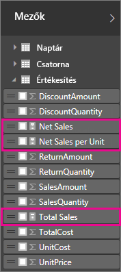
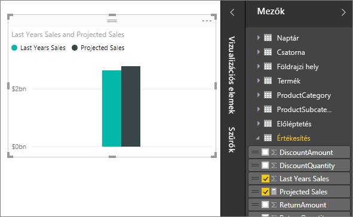
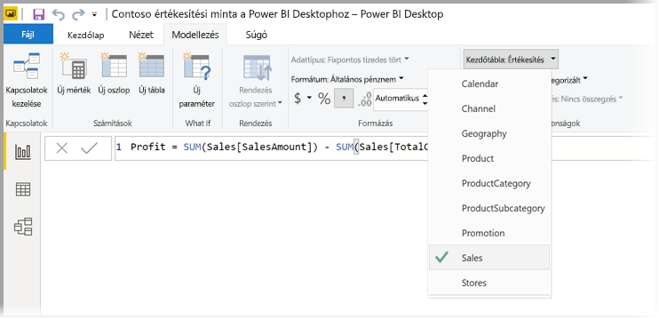
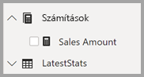

# <a name="create-measures-for-data-analysis-in-power-bi-desktop"></a>Mértékek létrehozása adatelemzéshez a Power BI Desktopban

A Power BI Desktop segítségével néhány kattintással készíthet elemzéseket adatairól. Néha azonban az adatok nem tartalmaznak minden információt, amelyre a legfontosabb kérdések megválaszolásához szüksége van. Ezeket a mértékek segítségével szerezheti meg.

Mértékeket a leggyakoribb adatelemzéseknél is használunk. Az egyszerű összesítések, például az összegek, átlagok, minimum, maximum és szám értékek a **Mezők** területen állíthatók be. A mértékek számított eredménye a jelentések használata során folyamatosan változik, ami lehetővé teszi az adatok gyors és dinamikus alkalmi felderítését. Lássuk mindezt közelebbről. További információt a [Számított mértékek létrehozása](/learn/modules/model-data-power-bi/4b-create-calculated-measures) című cikkben talál.

## <a name="understanding-measures"></a>A mértékek ismertetése

A Power BI Desktop *Jelentés nézetében* vagy az *Adatnézetben* hozhat létre jelentéseket. A saját készítésű mértékek a **Mezők** listában egy számológép ikon kíséretében jelennek meg. A mértékeknek bármilyen nevet adhat, és az egyéb mezőkhöz hasonlóan hozzáadhatja őket új vagy meglévő vizualizációkhoz.



> [!NOTE]
> Esetleg érdekelhetik a *gyorsmérők* is, amelyek párbeszédpanelekről kiválasztható kész mértékek. Ezeken keresztül könnyen elsajátítható a mértékek létrehozása, valamint a DAX-képletek használata is, mivel az automatikusan létrehozott DAX-képleteik áttekinthetők. További információt a [gyorsmérők](desktop-quick-measures.md) szakaszban találhat.
> 
> 

## <a name="data-analysis-expressions"></a>Adatelemzési kifejezések

A mértékek kifejezésképletekből számítják ki az eredményeket. Az egyéni mértékek a [Data Analysis Expressions](/dax/) (DAX) képletnyelv használatával hozhatók létre. A DAX egy több mint 200 függvényt, operátort és szerkezetet tartalmazó kódtárral is rendelkezik. Ez a kódtár rendkívüli rugalmasságot biztosít a mértékek létrehozása során, amelyek szinte bármilyen adatelemzési igényhez képesek eredményeket számítani.

A DAX-képletek nagyon hasonlóak az Excel-képletekhez. A DAX nyelvben számos Excel-függvény megtalálható, például a `DATE`, a `SUM` vagy a `LEFT`. A DAX-függvények azonban relációs adatok használatához készültek, amilyeneket a Power BI Desktop is használ.

## <a name="lets-look-at-an-example"></a>Vegyünk egy példát.

Jan a Contoso egyik értékesítési vezetője. Jannak viszonteladói értékesítési előrejelzéseket kell készítenie a következő pénzügyi évre. Jan úgy dönt, hogy a becsléseket a múlt évben értékesített mennyiségek alapján számítja ki, és hat százalékos éves növekedéssel számol a következő hat hónapra tervezett különféle promóciók várható eredményeként.

A becslések jelentéséhez az elmúlt év értékesítési adatait importálja a Power BI Desktopba. Jan megkeresi a **Reseller Sales** (Viszonteladói értékesítések) tábla **SalesAmount** (Értékesítési mennyiségek) mezőjét. Mivel az importált adatok csak a múlt évre vonatkozó értékesített mennyiségeket tartalmazzák, Jan átnevezi a **SalesAmount** mezőt, és a *Last Years Sales* (Tavalyi értékesítések) nevet adja neki. Ezután ráhúzza a **Last Years Sales** mezőt a jelentésvászonra. Ez egy diagramvizualizációban egyetlen értékként jelenik meg, amely a múlt évi összes viszonteladói értékesítés összegét adja meg.

Jan észreveszi, hogy bár ő maga nem adott meg számítást, a rendszer automatikusan készített egyet. A Power BI Desktop létrehozott egy saját mértéket a **Last Years Sales** mezőben lévő értékek összege alapján.

Jannek azonban egy olyan mértékre van szüksége, amely a következő évre vonatkozó előrejelzéseket adja meg, ami az elmúlt év értékesítési adatainak 1,06-szorosa, figyelembe véve a várható 6 százalékos üzleti növekedést. Ehhez a számításhoz Jan létrehoz egy egyéni mértéket. Az *Új mérték* funkcióval létrehoz egy új mértéket, amelyben a következő DAX-képletet adja meg:

```dax
    Projected Sales = SUM('Sales'[Last Years Sales])*1.06
```

Jan ezután a diagramra húzza a Projected Sales (Értékesítési előrejelzés) mértéket.



Jan így gyorsan és minimális erőfeszítéssel létrehozott egy mértéket az értékesítési előrejelzések kiszámítására. Az előrejelzéseket részletesebben is kielemezhetné, ha rászűrne adott viszonteladókra, vagy további mezőket adna a jelentéshez.

## <a name="data-categories-for-measures"></a>Adatkategóriák mértékekhez

Mértékekhez adatkategóriák is kiválaszthatók.

Ezek többek között lehetővé teszik, hogy mértékek használatával dinamikusan hozzon létre URL-eket, és hogy az adatkategóriát webes URL-ként jelölje meg.

Például létrehozhat táblázatokat, amelyben a mértékek webes URL-címekként jelennek meg, és a kiválasztásnak megfelelően a létrehozott URL-címek kattinthatók is lesznek. Ez különösen hasznos, ha más Power BI-jelentésekhez szeretne hivatkozásokat létrehozni [URL-szűrő paraméterekkel](service-url-filters.md).

## <a name="organizing-your-measures"></a>A mértékek szervezése

A mértékek egy *Kezdőlap* táblával rendelkeznek, amely meghatározza, hogy ezek a mezőlistában hol találhatók. Módosíthatja a helyüket, ha kiválaszt egy helyet a modell tábláiból.



Egy tábla mezőit *megjelenítési mappákba* is rendezheti. Válassza a **Modell** lehetőséget a Power BI Desktop bal szélén. A **Tulajdonságok** panelen az elérhető mezők közül válassza ki az áthelyezni kívánt mezőt. A **Megjelenítési mappában** hozzon létre egy mappát egy mappanév megadásával. A mappa létrehozása a kijelölt mezőt ebbe a mappába helyezi.


Almappákat a fordított perjel karakterrel hozhat létre. A *Finance\Currencies* például egy *Finance* (Pénzügy) mappát hoz létre, abban pedig egy *Currencies* (Pénznemek) mappát.

Egy mezőt több mappában is megjeleníthet, ha egy pontosvesszővel választja el a mappaneveket. Például a *Products\Names;Departments* kifejezés egy, a *Departments* (Részlegek) mappában megjelenő mezőt eredményez, amely emellett a *Products* (Termékek) mappa *Names* (Nevek) mappájában is megjelenik.

Létrehozhat egy speciális, csak mértékeket tartalmazó táblát. Ez a tábla mindig a **Mezők** panel tetején jelenik meg. Ehhez hozzon létre egy egy oszloppal rendelkező táblát. Ezt az **Adatbevitel** lehetőséggel teheti meg. Ezután helyezze át a mértékeket a táblába. Végül rejtse el a létrehozott oszlopot (de a táblázatot ne). Válassza a **Mezők** panel tetején található nyilat, így bezárhatja, majd újra megnyithatja a mezőlistát, és megtekintheti a módosításokat.



## <a name="learn-more"></a>További információ

Itt csak röviden bemutattuk a mértékeket. Sokkal többet is megtudhat a saját mértékek létrehozásáról. További információ: [Oktatóanyag: Saját mértékek létrehozása a Power BI Desktopban](desktop-tutorial-create-measures.md). Ebben a cikkben egy letöltött mintafájlon keresztül lépésenként sajátíthatja el a mértékek létrehozását.  

A DAX behatóbb megismeréséhez tekintse át [A DAX alapszintű használata a Power BI Desktopban](desktop-quickstart-learn-dax-basics.md) című cikket. A [Data Analysis Expressions-referencia](/dax/) részletes cikkeket tartalmaz az egyes függvényekkel, szintaxisokkal, operátorokkal és elnevezési konvenciókkal kapcsolatban. A DAX már elérhető néhány éve az Excelhez készült Power Pivotban és az SQL Server Analysis Servicesben. Itt számos további nagyszerű forrásanyag is rendelkezésre áll. Tekintse meg továbbá a [DAX forrásanyagközpont wikijét](https://social.technet.microsoft.com/wiki/contents/articles/1088.dax-resource-center.aspx), ahol a BI-közösség fontos tagjai osztják meg a DAX-szal kapcsolatos tudásukat.
