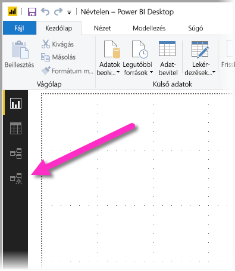
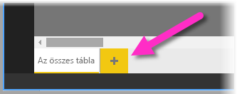
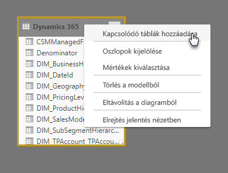
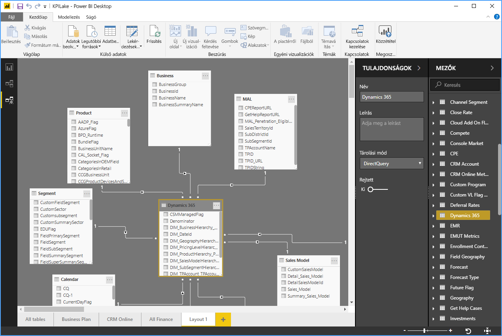
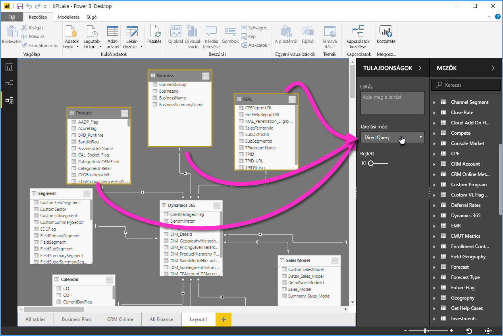

# A Modellező nézet használata a Power BI Desktopban

A **Power BI Desktopban** a **Modellező nézettel** sok táblát tartalmazó, összetett adathalmazokat tekinthet meg és használhat.

## A Modellező nézet használata

A Modellező nézet a **Power BI Desktop** bal oldalán található Modellező nézet ikont választva érhető el, ahogyan az alábbi ábrán látható.

## Külön diagramok létrehozása

Modellező nézetben olyan diagramokat készíthet a modelljéről, amelyek csak a modell tábláinak egy-egy részhalmazát tartalmazzák. Ezáltal átláthatóbbak lesznek azok a táblák, amelyekkel dolgozni kíván, és az összetett adathalmazokkal végzett munka egyszerűbbé válik. A tábláknak csak egy részhalmazát tartalmazó új diagram létrehozásához kattintson az **Összes tábla** lapfül melletti **+** jelre a Power BI Desktop ablakának alján.

Ezt követően áthúzhat egy táblát a **Mezők** listából a diagram felületére. Kattintson a jobb gombbal a táblára, majd válassza a **Kapcsolódó táblák hozzáadása** lehetőséget a felugró menüből.

Ennek hatására az eredeti táblához kapcsolódó táblák is megjelennek az új diagramon. Az alábbi kép azt mutatja be, hogy hogyan jelennek meg a kapcsolódó táblák a **Kapcsolódó táblák hozzáadása** menüelem kiválasztása után.

## Közös tulajdonságok beállítása

Modellező nézetben egyszerre több objektumot is kijelölhet, ha a **CTRL** billentyűt lenyomva tartva több táblára is rákattint. Ha több táblát is kijelöl, azok ki lesznek emelve a modellező nézetben. Amíg több tábla is ki van jelölve, a **Tulajdonságok** panelen végrehajtott módosítások az összes kijelölt táblára vonatkoznak.

Módosíthatja például a diagramon szereplő több tábla [tárolási módját](desktop-storage-mode.md), ha a **CTRL** billentyűt lenyomva tartva kijelöli a táblákat, majd a **Tulajdonságok** panelen megváltoztatja a tárolási mód beállítását.

## Következő lépések

Az alábbi cikkek bővebben ismertetik az adatmodelleket, és a DirectQuery részletes leírását is tartalmazzák.

* [Aggregációk a Power BI Desktopban (előzetes verzió)](desktop-aggregations.md)
* [Összetett modellek a Power BI Desktopban](desktop-composite-models.md)
* [Tárolási mód a Power BI Desktopban (előzetes verzió)](desktop-storage-mode.md)
* [Több a többhöz kapcsolatok a Power BI Desktopban](desktop-many-to-many-relationships.md)

A DirectQuery-vel kapcsolatos cikkek:

* [DirectQuery használata a Power BI-ban](desktop-directquery-about.md)
* [A DirectQuery által támogatott adatforrások a Power BI-ban](desktop-directquery-data-sources.md)
