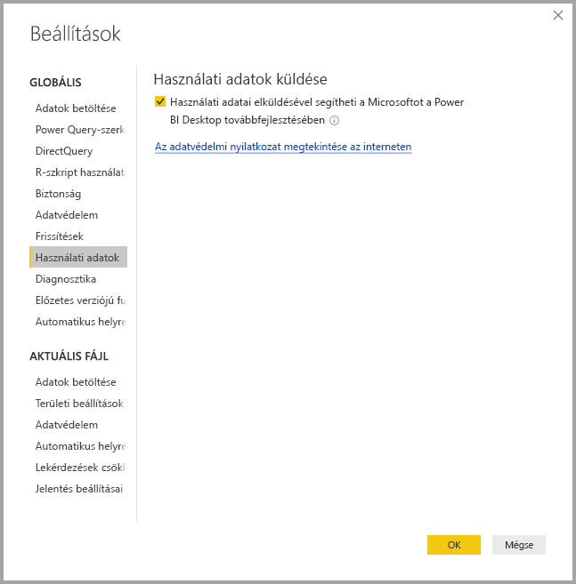
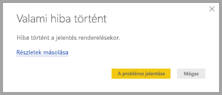

# A Power BI Desktop – adatvédelem

A Microsoftnál folyamatosan dolgozunk az adatai védelmén, miközben igyekszünk olyan termékeket kifejleszteni, amelyek megfelelnek az ügyfelek teljesítményre, hatékonyságra és kényelmes használatra vonatkozó igényeinek. A Microsoft a problémák diagnosztizálása és a termék fejlesztése érdekében adatokat gyűjt a Power BI Desktop használatáról. További információt a Microsoft adatvédelmi eljárásairól a Microsoft adatvédelmi nyilatkozatában találhat. Ez vonatkozik a **Power BI Desktop** használata során gyűjtött adatokra.
 
A **Power BI Desktop** felhasználóitól gyűjtött adatok az operációs rendszer, a Power BI Desktop és az Internet Explorer verzióinak adatait tartalmazhatják. 
 
Ha le szeretné tiltani az adatgyűjtést, a **Fájl > Lehetőségek és beállítások > Beállítások** terület **Használati adatok** lapján törölje a jelet a **Használati adatok küldése** jelölőnégyzetből, a következő ábrán látható módon.

## További adatok küldése

Ha összeomlik a program vagy egyéb problémát tapasztal, elküldheti a hibajelentéseket és további adatokat, amelyek segítségével kijavíthatjuk a problémát egy későbbi kiadásban. Emellett az épp megnyitott **Power BI Desktop**-fájl állapotáról is gyűjtünk adatokat, például a dokumentum területi beállítása, az engedélyezett előzetes verziós funkciók és a tárolási mód tekintetében. Ez tartalmazhat képernyőképeket, hibaüzeneteket és a modellből származó képleteket. Előfordulhat, hogy az elemek között a hiba észlelésekor használt fájl tartalmai is megtalálhatók, így érdemes ezeket átnéznie, mielőtt elküldené őket. Ne feledje: Ön dönti el, hogy milyen adatokat küld a Microsoftnak.  
 
Ha nem kívánja elküldeni ezeket az adatokat, kattintson a **Bezárás** gombra, ha hiba történik, vagy tiltsa le a fenti módon a használati adatok küldését. 

