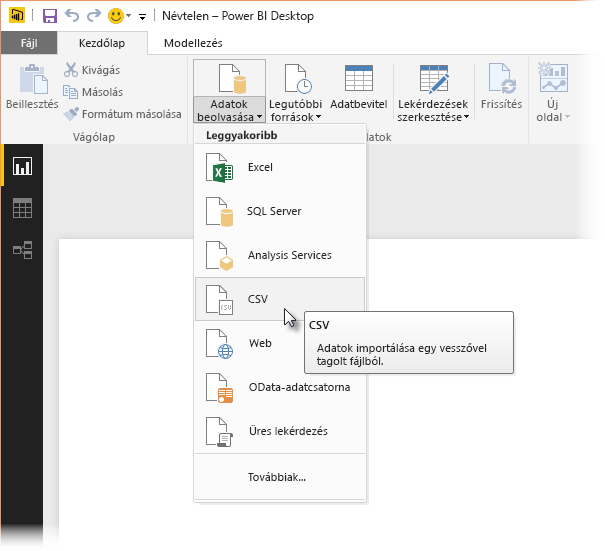
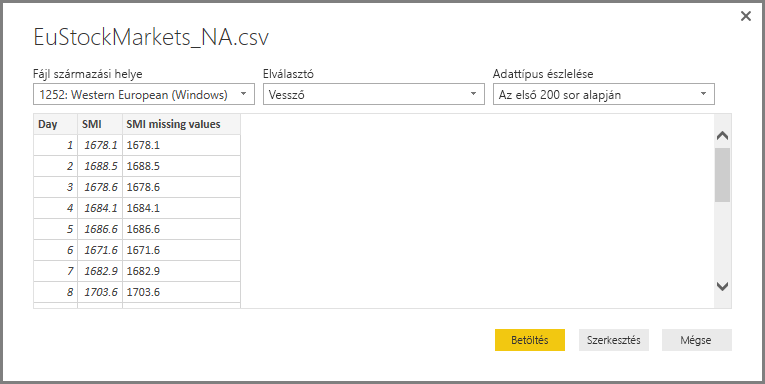
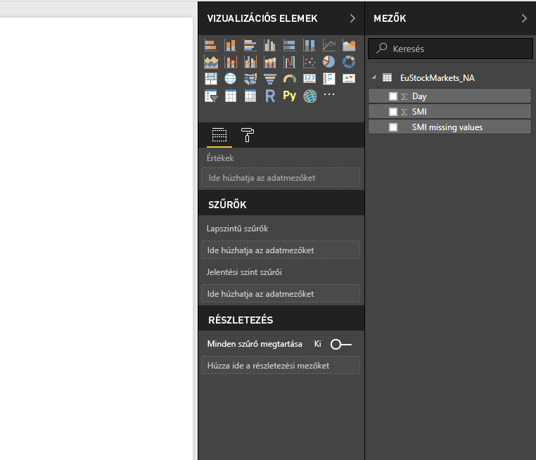
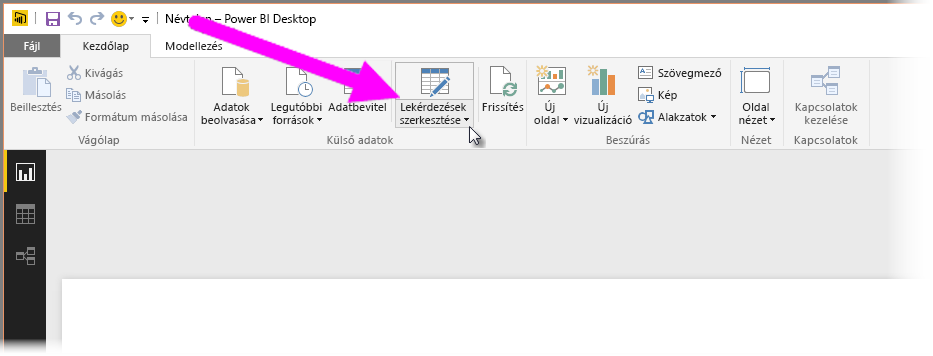
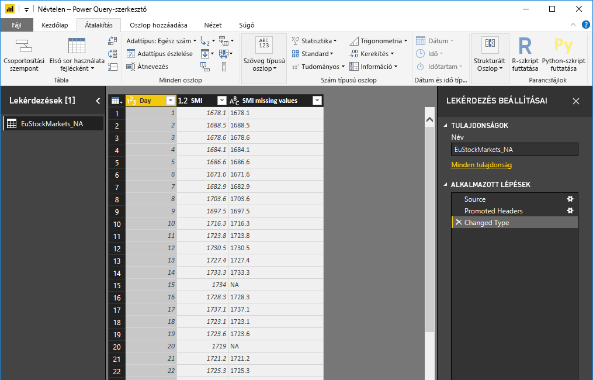
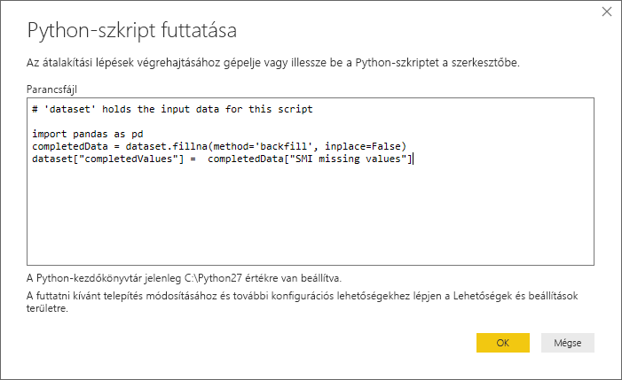
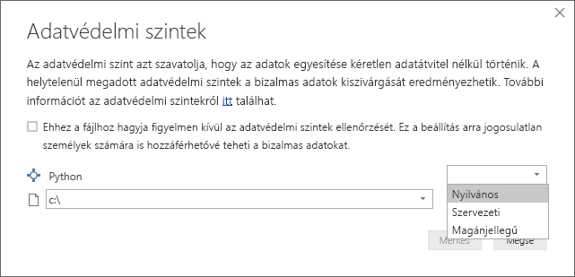
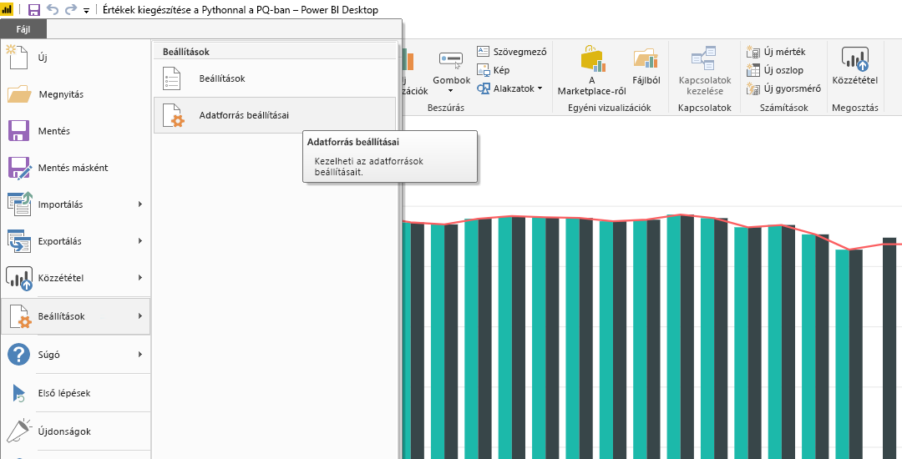
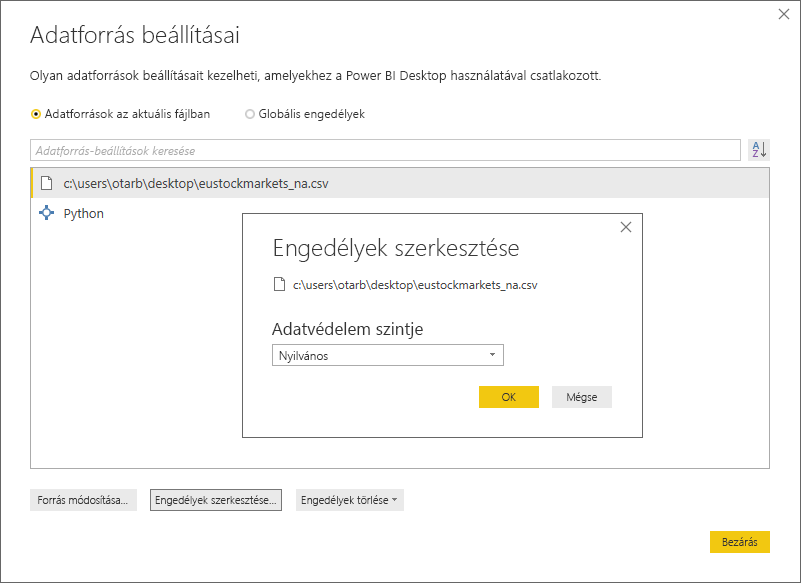

# <a name="use-python-in-query-editor"></a>A Python használata a Lekérdezésszerkesztőben
A Power BI Desktop **Lekérdezésszerkesztőjében** használhatja a statisztikusok, adatszakértők és adatelemzők által széles körben használt **Python** programozási nyelvet. A Python integrációja a **Lekérdezésszerkesztőbe** lehetővé teszi adattisztítás elvégzését a Python használatával, és összetett adatátalakítási és elemzési műveletek adatkészleteken történő elvégzését, beleértve többek között a hiányos adatok kiegészítését, az előrejelzéseket és a fürtözést. A **Python** egy sokoldalú nyelv, amely a **Lekérdezésszerkesztőben** is használható adatmodellek előkészítéséhez és jelentések létrehozásához.

## <a name="installing-python"></a>A Python telepítése
Ahhoz, hogy a **Pythont** a Power BI Desktop **Lekérdezésszerkesztőjében** használhassa, telepítenie kell a **Python** nyelvet a helyi számítógépre. A **Pythont** számos helyről ingyenesen letöltheti és telepítheti, például a [Python hivatalos letöltőoldaláról](https://www.python.org/) vagy az [Anaconda](https://anaconda.org/anaconda/python/) oldaláról.

## <a name="using-python-in-query-editor"></a>A Python használata a Lekérdezésszerkesztőben
A **Python** **Lekérdezésszerkesztőben** való használatának bemutatásához a tőzsdei adatkészletből használunk egy példát, amely egy .CSV-fájlon alapul. Ezt [innen töltheti le](https://download.microsoft.com/download/F/8/A/F8AA9DC9-8545-4AAE-9305-27AD1D01DC03/EuStockMarkets_NA.csv). A példa lépései a következők:

1. Első lépésként töltse be az adatokat a **Power BI Desktopba**. Ebben a példában töltse be az *EuStockMarkets_NA.csv* fájlt, és a **Power BI Desktop** **Kezdőlap** menüszalagján válassza az **Adatok beolvasása > CSV** lehetőséget.
   
   
2. Válassza ki a fájlt, és kattintson a **Megnyitás** elemre, ekkor a CSV megjelenik a **CSV-fájl** párbeszédpanelen.
   
   
3. Miután az adatok betöltődtek, a Power BI Desktop **Mezők** ablaktábláján jelennek meg.
   
   
4. A **Power BI Desktop** **Kezdőlapján** válassza a **Lekérdezések szerkesztése** lehetőséget a **Lekérdezésszerkesztő** megnyitásához.
   
   
5. Az **Átalakítás** lapon válassza a **Python-szkript futtatása** lehetőséget, ekkor megjelenik a **Python-szkript futtatása** szerkesztő (a következő lépésben látható). Figyelje meg, hogy a 15. és a 20. sorból adatok hiányoznak, ahogy egyéb, az alábbi képen nem látható sorokból is. Az alábbi lépések bemutatják, hogyan egészítheti és (egészíti) ki a Python nyelv ezeket a sorokat.
   
   
6. Ebben a példában az alábbi szkriptkódot adjuk meg:
   
    ```python
       import pandas as pd
       completedData = dataset.fillna(method='backfill', inplace=False)
       dataset["completedValues"] =  completedData["SMI missing values"]
   ```

   > [!NOTE]
   > A fenti szkriptkód megfelelő működéséhez rendelkeznie kell a Python-környezetben telepített *pandas* kódtárral. A pandas telepítéséhez futtassa a következő parancsot a Python-környezetben: |      > pip install pandas
   > 
   > 
   
   A **Python-szkript futtatása** párbeszédpanelre helyezve a kód az alábbi módon néz ki:
   
   
7. Ha az **OK** gombra kattintunk, a **Lekérdezésszerkesztő** egy, az adatvédelemről szóló figyelmeztetést jelenít meg.
   
   
8. Ahhoz, hogy a Python-szkriptek megfelelően működjenek a Power BI szolgáltatásban, minden adatforrást *nyilvánosra* kell állítani. További tudnivalókat az adatvédelmi beállításokról és azok következményeiről az [adatvédelmi szinteket](desktop-privacy-levels.md) ismertető szakaszban találhat.
   
   
   
   Ekkor egy új, *completedValues* nevű oszlop jelenik meg a **Mezők** panelen. Figyelje meg, hogy van néhány hiányzó adatelem, például a 15. és 18. sorban. A következő szakaszban megtekintheti, hogyan kezeli ezt a Python.
   

Mindössze öt sornyi Python-szkript használatát követően a **Lekérdezésszerkesztő** egy prediktív modellel kitöltötte a hiányzó értékeket.

## <a name="creating-visuals-from-python-script-data"></a>Vizualizációk létrehozása a Python-szkript adataiból
Most létrehozhatunk egy vizualizációt, amelyből látható, hogy a Python-szkriptkód hogyan használja a *pandas* kódtárat a hiányzó adatok kiegészítésére. Ezt az alábbi kép illusztrálja:


Miután a vizualizáció elkészült, bármely egyéb vizualizációval együtt amelyet a **Power BI Desktop** használatával szeretne létrehozni, mentheti a **Power BI Desktop-fájlt** (.pbix-fájlként), és utána a Power BI szolgáltatásban használhatja az adatmodellt, beleértve a részét képező Python-szkripteket.

> [!NOTE]
> Szeretne egy teljes .pbix-fájlt látni úgy, hogy ezek a lépések már be vannak fejezve? Szerencséje van – [innen](https://download.microsoft.com/download/A/B/C/ABCF5589-B88F-49D4-ADEB-4A623589FC09/Complete%20Values%20with%20Python%20in%20PQ.pbix) letöltheti az ebben a példában használt, teljes **Power BI Desktop-fájlt**.

Miután feltöltötte a .pbix-fájlt a Power BI szolgáltatásba, néhány további lépés szükséges az adatfrissítés engedélyezéséhez (a szolgáltatásban) és annak engedélyezéséhez, hogy a vizualizációk frissíthetők legyenek a szolgáltatásban (az adatoknak hozzáféréssel kell rendelkezniük a Pythonhoz, hogy a vizualizációk frissülhessenek). A további lépések a következők:

* **Adatkészlet ütemezett frissítésének engedélyezése** – a Python-szkripttel rendelkező adatkészletet tartalmazó munkafüzet ütemezett frissítésének engedélyezéséhez tekintse meg az [ütemezett frissítés konfigurálását](refresh-scheduled-refresh.md) ismertető részt, amely a **Privát átjáróról** is tartalmaz információkat.
* **Privát átjáró telepítése** – szüksége van egy arra a számítógépre telepített **Privát átjáróra**, amelyen a fájl található és amelyre a Python telepítve van. A Power BI szolgáltatásnak hozzáféréssel kell rendelkeznie ahhoz a munkafüzethez, és újra kell renderelnie a frissített vizualizációkat. További információt a [Privát átjáró telepítésével és konfigurálásával](personal-gateway.md) foglalkozó témakörben talál.

## <a name="limitations"></a>Korlátozások
A **Lekérdezésszerkesztőben** létrehozott Python-szkripteket tartalmazó lekérdezések némiképp korlátozottak:

* Minden Python-adatforrás beállításait *Nyilvánosra* kell állítani, és a **Lekérdezésszerkesztőben** létrehozott lekérdezés egyéb lépéseinek is nyilvánosnak kell lenniük. Az adatforrás-beállítások eléréshez a **Power BI Desktopban** válassza a **Fájl > Lehetőségek és beállítások > Adatforrás-beállítások** elemet.
  
  
  
  Az **Adatforrás-beállítások** párbeszédpanelen válassza ki az adatforrásokat, majd kattintson az **Engedélyek szerkesztése** elemre, és győződjön meg arról, hogy az **Adatvédelem szintje***Nyilvános* beállítású.
  
      
* A Python-vizualizációk vagy adatkészletek ütemezett frissítésének engedélyezéséhez engedélyeznie kell az **Ütemezett frissítést**, és rendelkeznie kell a munkafüzetet és a Python-környezetet tároló számítógépre telepített **Privát átjáróval**. Az ezekről szóló információkért tekintse meg a cikk korábbi szakaszait. A vonatkozó részekben található hivatkozásokkal további információhoz juthat.
* A beágyazott táblázatok (táblázatok táblázatai) jelenleg nem támogatottak. 

A Pythonnal és az egyéni lekérdezésekkel sok mindent tehet, például felderítheti adatait és olyanná alakíthatja, amilyen módon meg szeretné őket jeleníteni.

