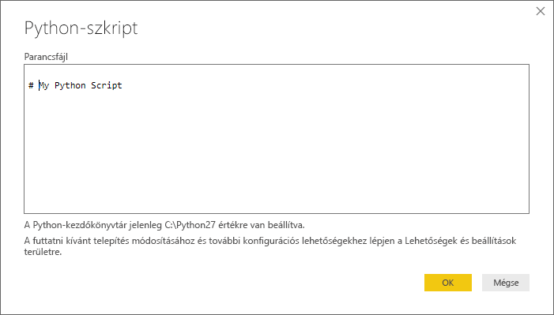
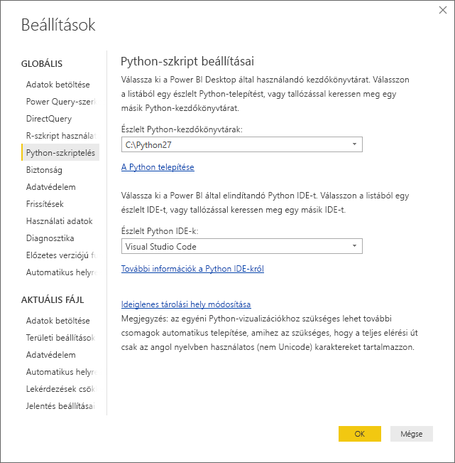

# Python-szkriptek futtatása a Power BI Desktopban
Python-szkripteket futtathat közvetlenül a **Power BI Desktopban** is, és az így kapott adatkészleteket importálhatja Power BI Desktop-adatmodellekbe.

## A Python telepítése
A Python-szkriptek a Power BI Desktopban való futtatásához telepítenie kell a **Pythont** a helyi gépen. A **Pythont** számos helyről ingyenesen letöltheti és telepítheti, például a [Python hivatalos letöltőoldaláról](https://www.python.org/) vagy az [Anaconda](https://anaconda.org/anaconda/python/) oldaláról. A Power BI Desktopban a Python-szkriptek támogatásának jelenlegi kiadása lehetővé teszi a Unicode karakterek, valamint a szóközök (üres karakterek) a telepítési útvonalban történő használatát.

## Python-szkriptek futtatása
A Power BI Desktopban mindössze néhány lépéssel, Python-szkriptek futtatásával létrehozhat egy adatmodellt, amelyből aztán jelentéseket hozhat létre, és megoszthatja azokat a Power BI szolgáltatásban.

### Python-szkript előkészítése
Ha egy Python-szkriptet szeretne futtatni a Power BI Desktopban, hozza létre a szkriptet a helyi Python-fejlesztői környezetben, és ellenőrizze, hogy sikeresen futtatható-e.

A szkript a Power BI Desktopban való futtatásához mindenképp ellenőrizze, hogy sikeresen lefut-e egy új és módosítatlan munkaterületen. Ez azt jelenti, hogy minden csomagot és függőséget kifejezetten be kell tölteni és le kell futtatni.

A Python-szkriptek előkészítésére és a Power BI Desktopban való futtatására vonatkozik néhány korlátozás:

* Csak a Pandas-adatkeretek lesznek importálva, ezért a Power BI-ba importálni kívánt adatokat mindenképp meg kell jeleníteni egy adatkeretben.
* A 30 percnél hosszabb ideig futó Python-szkriptek időtúllépési hibát adnak vissza.
* Ha a Python-szkriptben interaktív hívás van megadva (például felhasználói válaszra vár), az megszakítja a szkript futását.
* A Python-szkriptekben a munkakönyvtárak megadásánál teljes és nem relatív elérési utat *kell* megadni.
* A beágyazott táblázatok (táblázatok táblázatai) jelenleg nem támogatottak. 

### Python-szkriptek futtatása és az adatok importálása
1. A Power BI Desktopban a Python-szkriptek adatösszekötője az **Adatok lekérése** menüpontban található. A Python-szkript futtatásához válassza az **Adatok lekérése &gt; Továbbiak**, majd az **Egyéb &gt; Python-szkript** lehetőséget, amint az az alábbi ábrán is látható:
   
   
2. Ha a Python telepítve van a helyi gépen, a rendszer a legfrissebb telepített verziót választja Python-motorként. Egyszerűen másolja a szkriptet a szkriptablakba, és kattintson az **OK** gombra.
   
   
3. Ha a Python nincs telepítve, nem azonosítható, vagy több példányban is telepítve van a helyi gépen, egy figyelmeztetés jelenik meg.
   
   
   
   A Python telepítési beállításai terület a Beállítások párbeszédablak Python-szkriptek használata szakaszának közepén található. A Python telepítési beállításainak megadásához válassza a **Fájl > Lehetőségek és beállítások**, majd a **Beállítások > Python-szkriptek használata** elemet. Ha a Python több telepített verzióban is elérhető, egy legördülő menü jelenik meg, amelyből kiválaszthatja a használni kívánt verziót. Az **Egyéb** lehetőséget választva megadhat egy egyéni elérési utat.
   
   
4. Kattintson az **OK** gombra a Python-szkript futtatásához. Miután a szkript sikeresen lefutott, kiválaszthatja az eredményül kapott adatkereteket, és a Power BI-modellhez adhatja azokat.

### Frissítés
A Python-szkripteket frissítheti a Power BI Desktopban. A Python-szkriptek frissítésekor a Power BI Desktop újra lefuttatja a Python-szkriptet a Power BI Desktop környezetében.

## Következő lépések
Tekintse meg az alábbi, a Python programozási nyelv Power BI-ban történő használatára vonatkozó további információkat.

* [Python-vizualizációk létrehozása a Power BI Desktopban](desktop-python-visuals.md)
* [Külső Python-IDE használata a Power BI-ban](desktop-python-ide.md)