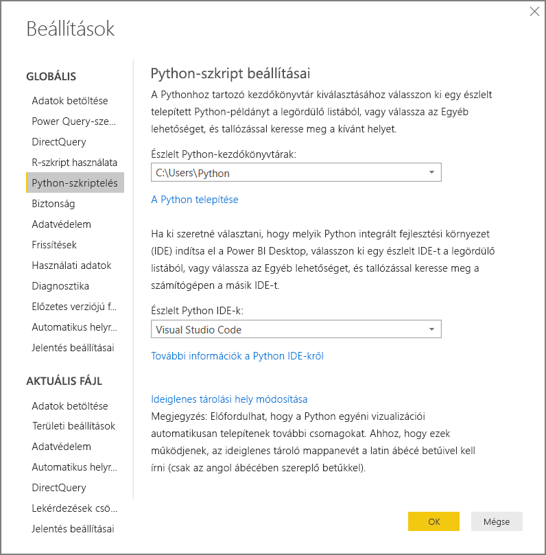
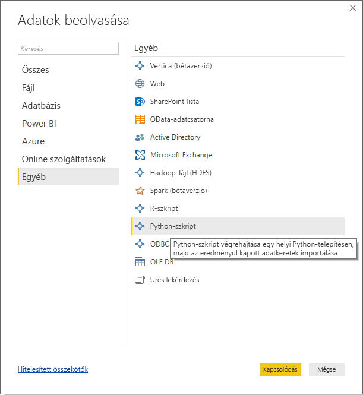
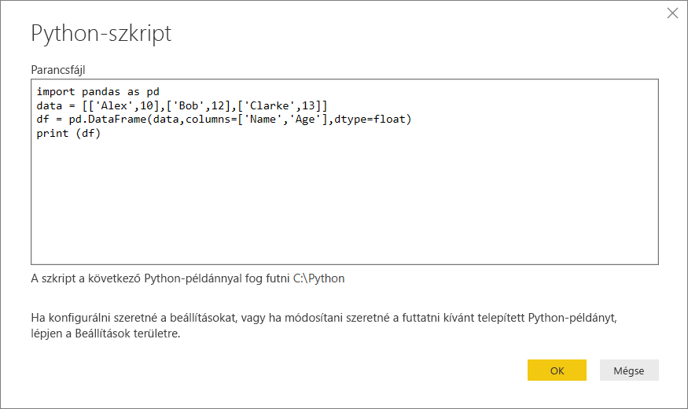
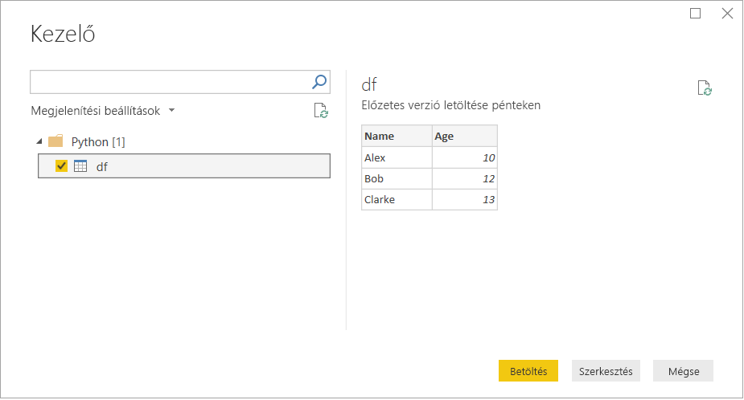
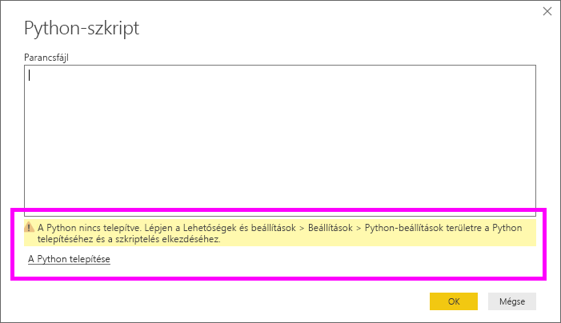

# <a name="run-python-scripts-in-power-bi-desktop"></a>Python-szkriptek futtatása a Power BI Desktopban

Python-szkripteket futtathat közvetlenül a **Power BI Desktopban** is, és az így kapott adathalmazokat importálhatja Power BI Desktop-adatmodellekbe.

## <a name="install-python"></a>A Python telepítése

A Python-szkriptek a Power BI Desktopban való futtatásához telepítenie kell a **Pythont** a helyi gépen. A **Python** a [Python hivatalos letöltési oldaláról](https://www.python.org/) tölthető le. Az aktuális szkriptelési Python-kiadás a Unicode karakterek és szóközök használatát is támogatja a telepítési útvonalban.

### <a name="install-required-python-packages"></a>A szükséges Python-csomagok telepítése

A Power BI Python-integrációjához két Python-csomag telepítése szükséges:

- [Pandas](https://pandas.pydata.org/) – Szoftverkódtár adatkezeléshez és -elemzéshez. Numerikus táblázatok és idősorok kezeléséhez kínál adatstruktúrákat és műveleteket. Az importált adatoknak egy [Pandas-adatkeretben](https://www.tutorialspoint.com/python_pandas/python_pandas_dataframe.htm) kell lenniük. Az adatkeret egy kétdimenziós adatstruktúra. Az adatok például táblázatszerűen sorokba és oszlopokba vannak rendezve.
- [Matplotlib](https://matplotlib.org/) – Ábrázolási kódtár a Pythonhoz és annak numerikus matematikai bővítményéhez, a [NumPy](https://www.numpy.org/)hoz. Objektumorientált API-t kínál grafikonok alkalmazásokba ágyazásához általános célú felhasználói felületi eszközkészletekkel (amilyen például a Tkinter, a wxPython, a Qt vagy a GTK+).

1. A két csomagot a konzolon vagy a rendszerhéjban telepítheti a [pip](https://pip.pypa.io/en/stable/) parancssori eszközzel. A pip eszköz az újabb Python-verziókhoz van csomagolva.

```CMD
pip install pandas
pip install matplotlib
```

## <a name="enable-python-scripting"></a>Python-szkriptelés engedélyezése

A Python-szkriptelés a következő módon engedélyezhető:

1. A Power BI Desktopban válassza a **Fájl** > **Lehetőségek és beállítások** > **Beállítások** > **Python-szkriptelés** lehetőséget. Megjelenik a Python-szkript beállításainak oldala.

   

1. Szükség esetén adja meg a Python helyi telepítési útvonalát az **Észlelt Python-kezdőkönyvtárak:** szövegmezőben. 

   A fenti ábrán a Python helyi telepítési útvonala **C:\Python**. Gondoskodjon arról, hogy az elérési út megegyezzen annak a helyi Python-telepítésnek a helyével, amelyet a Power BI Desktoppal használni kíván.

1. Kattintson az **OK** gombra.

Miután megadta a Python telepítési helyét, készen áll a Python-szkriptek futtatására a Power BI Desktopban.

## <a name="run-python-scripts"></a>Python-szkriptek futtatása

Már néhány lépésben futtathat Python-szkripteket és létrehozhat egy adatmodellt. Ebből a modellből jelentéseket hozhat létre, és megoszthatja azokat a Power BI szolgáltatásban.

### <a name="prepare-a-python-script"></a>Python-szkript előkészítése
Először hozzon létre egy szkriptet a helyi Python-fejlesztői környezetben, és ellenőrizze, hogy sikeresen futtatható-e. Az alábbi egyszerű Python-szkript például elvégzi a Pandas importálását, és egy adatkeretet használ:

```python
import pandas as pd
data = [['Alex',10],['Bob',12],['Clarke',13]]
df = pd.DataFrame(data,columns=['Name','Age'],dtype=float)
print (df)
```
Amikor fut, a következőket írja ki:

```python
     Name   Age
0    Alex  10.0
1     Bob  12.0
2  Clarke  13.0
```

A Python-szkriptek előkészítésére és a Power BI Desktopban való futtatására vonatkozik néhány korlátozás:

* Csak a Pandas-adatkeretek lesznek importálva, ezért a Power BI-ba importálni kívánt adatokat mindenképp meg kell jeleníteni egy adatkeretben
* A 30 percnél hosszabb ideig futó Python-szkriptek időtúllépési hibát adnak vissza.
* Ha a Python-szkriptben interaktív hívás van megadva (például felhasználói válaszra vár), az megszakítja a szkript futását.
* A Python-szkriptekben a munkakönyvtárak megadásánál teljes és nem relatív elérési utat *kell* megadni.
* A beágyazott táblázatok jelenleg nem támogatottak 

### <a name="run-your-python-script-and-import-data"></a>Python-szkriptek futtatása és az adatok importálása

A Python-szkript a következő módon futtatható a Power BI Desktopban:

1. A Kezdőlap menüszalagon válassza az **Adatok lekérése** > **Továbbiak...** lehetőséget.
   
1. Válassza az **Egyéb** > **Python-szkript** lehetőséget, ahogyan az alábbi képen látható:

   
   
1. Kattintson a **Csatlakozás** gombra. A rendszer a helyi gépre telepített legfrissebb Python-verziót választja Python-motorként. A szkriptet másolja be a megjelenő Python-szkript párbeszédablakba. Itt a korábban már látott egyszerű Python-szkriptet írtuk be.

   

1. Kattintson az **OK** gombra. Ha a szkript sikeresen lefut, megjelenik a Kezelő párbeszédpanel, ahol betöltheti és használhatja az adatokat. A példában jelölje be a **df** jelölőnégyzetet, ahogyan a képen látható, majd válassza a **Betöltés** lehetőséget.

    

### <a name="troubleshooting"></a>Hibaelhárítás

Ha a Python nincs telepítve vagy felismerve, figyelmeztetés jelenik meg. Akkor is figyelmeztetés jelenik meg, ha több telepítés is található a helyi gépen. Vizsgálja felül és tekintse át a Python korábbi telepítéseit és a Python-szkriptelés engedélyezésére vonatkozó szakaszokat.



### <a name="refresh"></a>Frissítés

A Python-szkripteket frissítheti a Power BI Desktopban. A frissítéshez nyissa meg a **Kezdőlap** menüszalagot, és válassza a **Frissítés** lehetőséget. Egy Python-szkript frissítésekor a Power BI Desktop újra lefuttatja ezt a Python-szkriptet.

## <a name="next-steps"></a>Következő lépések

Tekintse meg az alábbi, a Python programozási nyelv Power BI-ban történő használatára vonatkozó további információkat.

* [Python-vizualizációk létrehozása a Power BI Desktopban](desktop-python-visuals.md)
* [Külső Python-IDE használata a Power BI-ban](desktop-python-ide.md)
