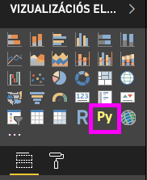
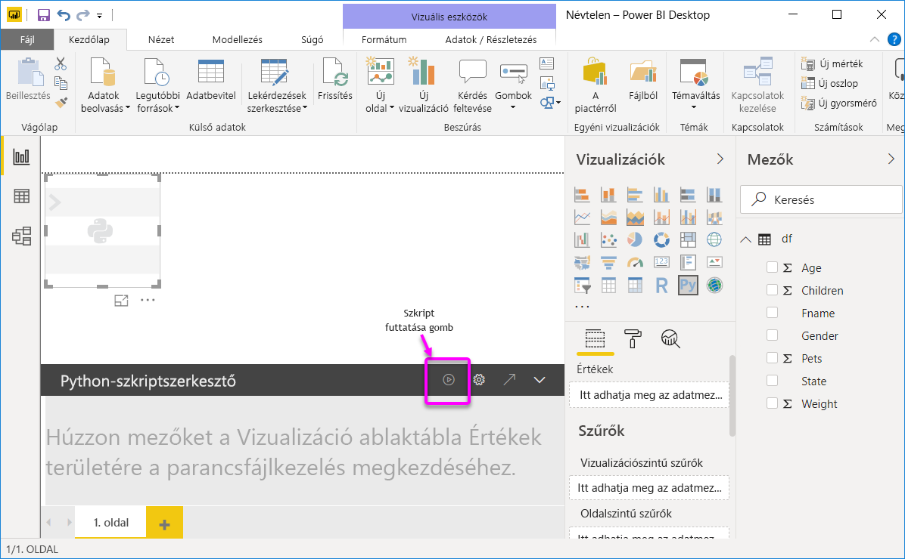
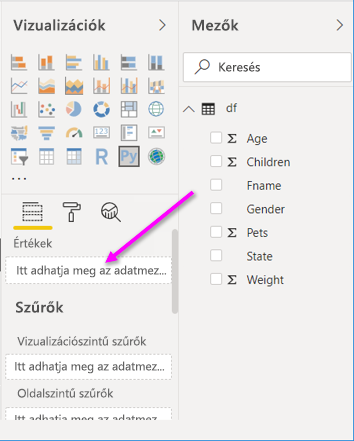
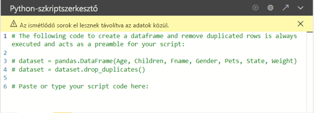
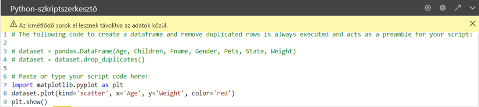

# <a name="create-power-bi-visuals-by-using-python"></a>Power BI-vizualizációk létrehozása a Python használatával

A *Power BI Desktopban* a Python használatával vizualizálhatja az adatokat.

## <a name="prerequisites"></a>Előfeltételek

Végezze el a [Python-szkriptek futtatása a Power BI Desktopban](desktop-python-scripts.md) oktatóanyagot az alábbi Python-szkript használatával:

```python
import pandas as pd 
df = pd.DataFrame({ 
    'Fname':['Harry','Sally','Paul','Abe','June','Mike','Tom'], 
    'Age':[21,34,42,18,24,80,22], 
    'Weight': [180, 130, 200, 140, 176, 142, 210], 
    'Gender':['M','F','M','M','F','M','M'], 
    'State':['Washington','Oregon','California','Washington','Nevada','Texas','Nevada'],
    'Children':[4,1,2,3,0,2,0],
    'Pets':[3,2,2,5,0,1,5] 
}) 
print (df) 
```

A [Python-szkriptek futtatása a Power BI Desktopban](desktop-python-scripts.md) című cikkből megtudhatja, hogyan lehet telepíteni a Pythont a helyi számítógépen, és hogyan lehet engedélyezni a Python-szkriptelést a Power BI Desktopban. Ez az oktatóanyag a fenti szkriptből származó adatok használatával szemlélteti a Python-vizualizációk létrehozását.

## <a name="create-python-visuals-in-power-bi-desktop"></a>Python-vizualizációk létrehozása a Power BI Desktopban

1. A **Vizualizáció** panelen válassza a **Python-vizualizáció** ikont.

   

1. A megjelenő **Parancsfájlok vizualizációinak engedélyezése** párbeszédpanelen válassza az **Engedélyezés** lehetőséget.

    Ha hozzáadunk egy jelentéshez egy Python-vizualizációt, a Power BI Desktop a következő műveleteket végzi el:

    - Megjelenik a jelentésvásznon egy helyőrző Python-vizualizációs kép.

    - A középső panel aljánál megjelenik a **Python-szkriptszerkesztő**.

    

1. Ezt követően húzza az **Age**, **Children**, **Fname**, **Gender**, **Pets**, **State** és **Weight** mezőket az **Értékek** szakaszba, ahol az **Adatmezők hozzáadása itt** szöveg látható.

    

   A Python-szkript csak az **Értékek** szakaszhoz már hozzáadott mezőket használhatja. A Python-parancsfájl használata közben hozzáadhat vagy eltávolíthat mezőket az **Értékek** szakaszból. A Power BI Desktop automatikusan észleli a mezők változásait.

   > [!NOTE]
   > A Python-vizualizációk összesítésének alapértelmezett típusa a *nincs összegzés*.
   > 
   > 

1. Ezután a kiválasztott adatok alapján létrehozhat egy rajzot.

    Ahogy mezőket adunk hozzá vagy távolítunk el, a Python-szkriptszerkesztő automatikusan létrehozza vagy eltávolítja a hozzájuk tartozó támogató kódot. 

    Ennek eredményeképp a Python-szkriptszerkesztő a következő kötési kódot hozta létre.

    - A szerkesztő létrehozott egy *adatkészlet* dataframe-et az Ön által hozzáadott mezőkkel.
    - Az alapértelmezett összesítés a *Nincs összegzés*.
    - A táblavizualizációkhoz hasonlóan a rendszer csoportosítja a mezőket, és a duplikált sorok csak egyszer jelennek meg.

    

     > [!TIP]
     > Bizonyos esetekben szükség lehet arra, hogy a rendszer ne végezzen automatikus csoportosítást, vagy minden sort megjelenítsen, a duplikáltakat is beleértve. Ebben az esetben hozzáadhat egy indexmezőt az adatkészlethez, amelynek hatására a rendszer minden sort egyedinek tekint, így megakadályozza a csoportosítást.

   Az adatkészlet oszlopai a saját nevük alapján érhetők el. Például a Python-szkriptben a `dataset["Age"]` használatával hozzáférhet az age (kor) mezőhöz.

1. Mivel az adathalmaz automatikusan létrejön a kiválasztott mezők alapján, most már írhat olyan Python-szkripteket, amelyek a Python alapértelmezett eszközére küldik az ábrázolást. Ha a szkript elkészült, válassza a **Futtatás** lehetőséget a **Python-szkriptszerkesztő** címsorában.

   A Power BI Desktop újrarajzolja a vizualizációt, ha a következő események bármelyike előfordul:

   - Ha a **Futtatás** lehetőséget választja a **Python-szkriptszerkesztő** címsorán
   - Ha az adatok frissítés, szűrés vagy kiemelés miatt változnak

   Ha egy Python-szkript futtatása hibát eredményez, a rendszer nem ábrázolja a Python-vizualizációt, hanem egy hibaüzenetet jelenít meg a vásznon. A hiba részleteinek megtekintéséhez az üzenetben válassza a **Részletek megjelenítése** lehetőséget.

   A vizualizációk nagyobb méretű megtekintése érdekében a **Python-szkriptszerkesztő** kis méretűre állítható.

Most hozzunk létre néhány vizualizációt.

## <a name="create-a-scatter-plot"></a>Pontdiagram létrehozása

Hozzunk létre egy pontdiagramot, hogy megnézhessük, van-e összefüggés a kor és a súly között.

1. Az **Illessze vagy gépelje be R-szkriptje kódját** területen írja be az alábbi kódot:

   ```python
   import matplotlib.pyplot as plt 
   dataset.plot(kind='scatter', x='Age', y='Weight', color='red')
   plt.show() 
   ```  

   A Python parancsfájl-szerkesztő paneljének ekkor az alábbihoz hasonlóan kell kinéznie:

   

   A rendszer importálja a **matplotlib** kódtárat a vizualizációk ábrázolásához és létrehozásához.

1. Ha a parancsfájl **futtatása** gombra kattint, a következő pontdiagram jön létre a helyőrző Python-vizualizációs képen.

   

## <a name="create-a-line-plot-with-multiple-columns"></a>Vonaldiagram létrehozása több oszloppal

 Minden személyhez hozzunk létre egy vonaldiagramot, amely a gyerekeik és kisállataik számát mutatja. Az **Illessze vagy gépelje be R-szkriptje kódját** területen távolítsa el vagy helyezze megjegyzések közé a kódot, és írja be az alábbi Python-kódot:

 ```python
 import matplotlib.pyplot as plt 
ax = plt.gca() 
dataset.plot(kind='line',x='Fname',y='Children',ax=ax) 
dataset.plot(kind='line',x='Fname',y='Pets', color='red', ax=ax) 
plt.show() 
```

Ha a parancsfájl **futtatása** gombra kattint, megjelenik a következő többoszlopos vonaldiagram.


## <a name="create-a-bar-plot"></a>Sávdiagram létrehozása

Hozzunk létre egy sávdiagramot minden személy korához. Az **Illessze vagy gépelje be R-szkriptje kódját** területen távolítsa el vagy helyezze megjegyzések közé a kódot, és írja be az alábbi Python-kódot:

```python
import matplotlib.pyplot as plt 
dataset.plot(kind='bar',x='Fname',y='Age') 
plt.show() 
```

Ha a **Futtatás** gombra kattint, megjelenik a következő sávdiagram:

 

## <a name="security"></a>Biztonság

> [!IMPORTANT] 
> **Python-szkriptek biztonsága:** A Python-vizualizációk alapjait a Python-szkriptek jelentik, amelyek biztonsági vagy adatvédelmi kockázatot jelentő kódot tartalmazhatnak. Egy Python-vizualizáció első alkalommal való megtekintésekor vagy használatakor egy biztonsági figyelmeztető üzenet jelenik meg. Csak akkor engedélyezze a Python-vizualizációkat, ha megbízik a szerzőben és a forrásban, vagy ha már áttekintette és értelmezte a Python-szkriptet.
>  

## <a name="more-information-about-plotting-with-matprolib-pandas-and-python"></a>További információ ábrázolásáról a Matprolib, a Pandas és a Python használatával

Ez az oktatóanyag segítséget nyújt az első lépésekhez vizualizációk Python használatával történő létrehozásához a Power BI Desktopban. Csak egy kis részletét mutatja be annak a sok-sok lehetőségnek és funkciónak, melyek elérhetőek vizualizációs jelentések létrehozásához a Python, a Pandas és a Matprolib kódtár használatával. Ezen kívül számos más forrás is elérhető még, de az első lépésekhez az alábbi néhány hivatkozást is használhatja.

- Dokumentáció a [Matplotlib](https://matplotlib.org/) webhelyén. 
- [Matplotlib-oktatóanyag: Alapszintű útmutató a Matplotlib és a Python használatához](https://www.datasciencelearner.com/matplotlib-tutorial-complete-guide-to-use-matplotlib-with-python/) 
- [Matplotlib-oktatóanyag – Python Matplotlib-kódtár példákkal](https://www.edureka.co/blog/python-matplotlib-tutorial/) 
- [Pandas API-referencia](https://pandas.pydata.org/pandas-docs/stable/reference/index.html) 
- [Python-vizualizációk a Power BI szolgáltatásban](https://powerbi.microsoft.com/blog/python-visualizations-in-power-bi-service/) 
- [Python-vizualizációk használata Power BI-ban](https://www.absentdata.com/how-to-user-python-and-power-bi/)

## <a name="known-limitations"></a>Ismert korlátozások

A Power BI Desktopban a Python-vizualizációkra vonatkozik néhány korlátozás:

- Adatméretre vonatkozó korlátozások. A Python-vizualizáció által az ábrázoláshoz felhasznált adatmennyiség 150 000 sorban van korlátozva. 150 000-nél több sor kiválasztásakor a rendszer csak az első 150 000 sort használja fel, és megjelenít egy üzenetet a képen.
- Felbontás. Minden Python-vizualizáció 72 DPI felbontású.
- A számítási időre vonatkozó korlátozások. Ha egy Python-vizualizáció számítási ideje meghaladja az öt percet, végrehajtási időtúllépés történik, ami egy hibát eredményez.
- Kapcsolatok. A Power BI Desktop többi vizualizációjához hasonlóan, ha több adatmezőt választ ki különböző táblákból, amelyek közt nincs meghatározott kapcsolat, akkor a rendszer hibát jelez.
- A Python-vizualizációk az adatok frissítésekor, szűrésekor és kiemelésekor frissülnek. Ugyanakkor a kép maga nem interaktív és nem szolgálhat keresztszűrés forrásaként.
- A Python-vizualizációk reagálnak más vizualizációk kiemeléseire, de nem lehet az elemeikre kattintva keresztszűrni más elemeket.
- A vásznon csak az alapértelmezett Python megjelenítőeszközön ábrázolt ábrázolások jelennek meg helyesen. Kerülje az eltérő Python megjelenítőeszközök használatát.

## <a name="next-steps"></a>Következő lépések

Tekintse meg az alábbi, a Python programozási nyelv Power BI-ban történő használatára vonatkozó további információkat.

- [Python-szkriptek futtatása a Power BI Desktopban](desktop-python-scripts.md)
- [Külső Python-IDE használata a Power BI-ban](desktop-python-ide.md)

