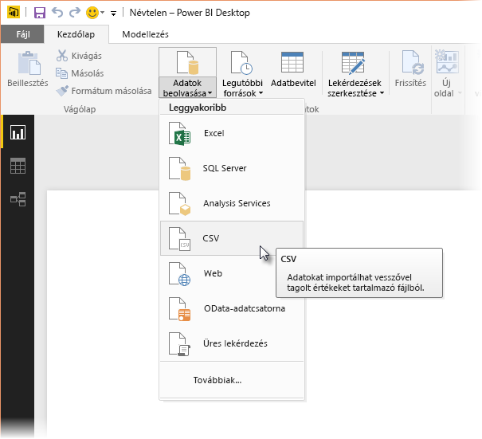
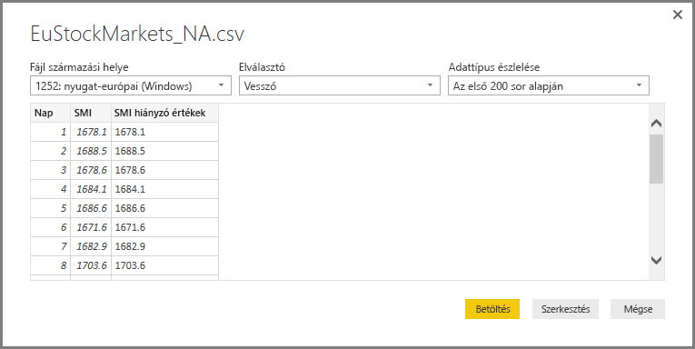
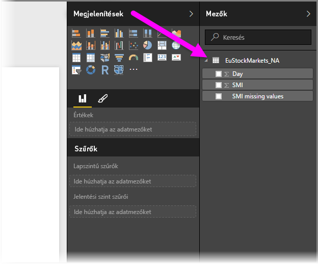
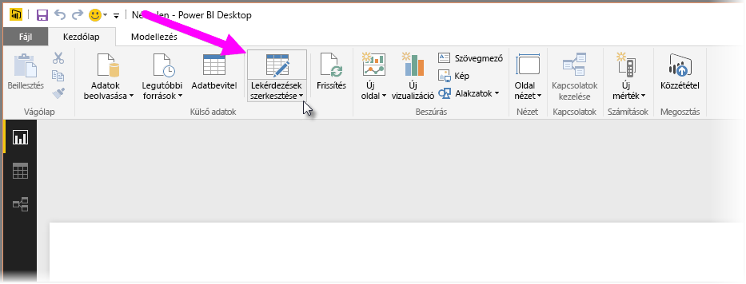
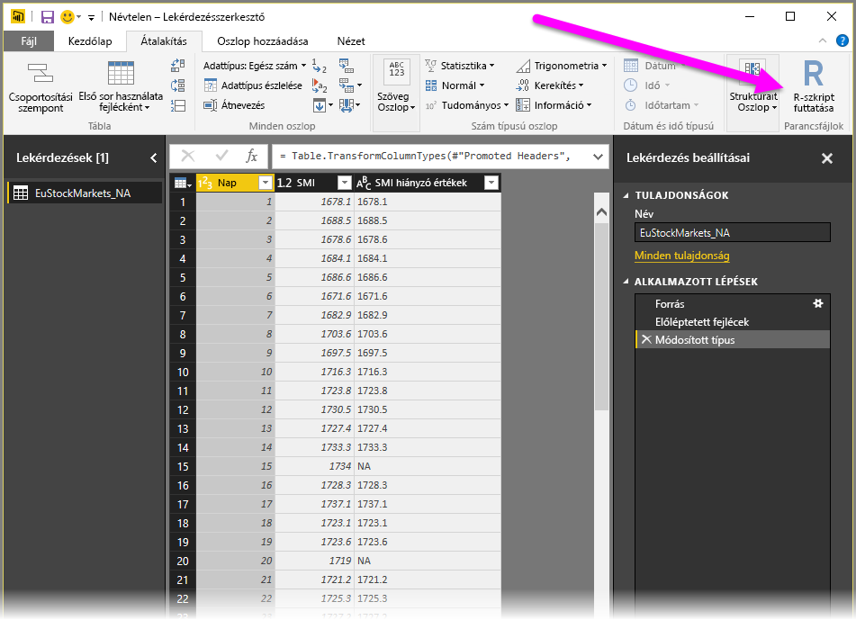
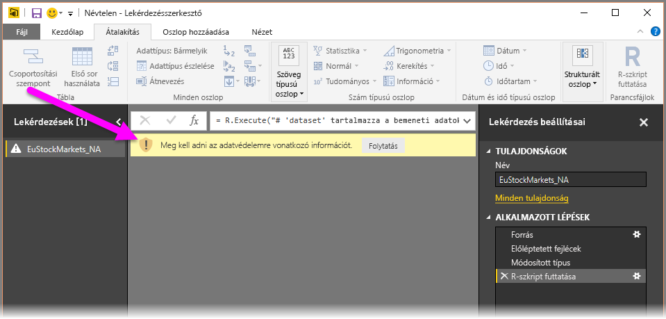
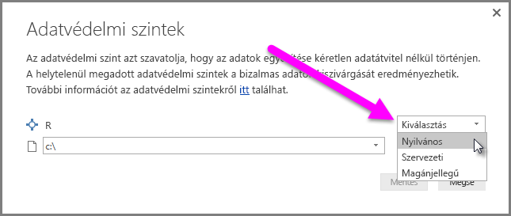
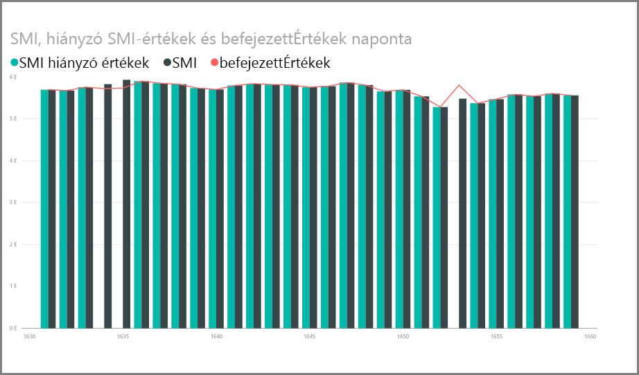
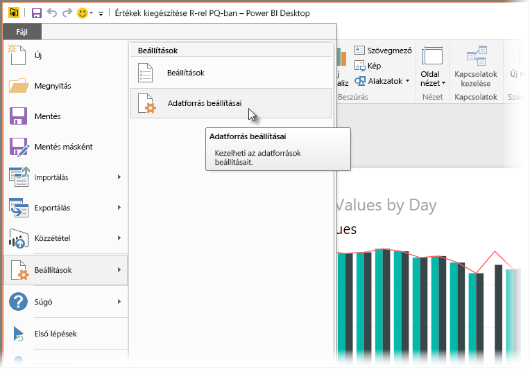
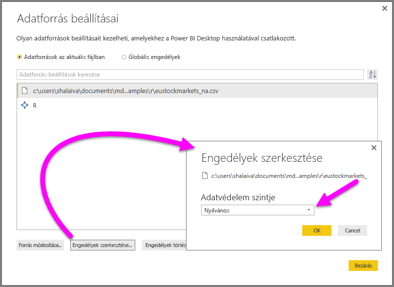

# <a name="use-r-in-power-query-editor"></a>Az R használata a Power Query szerkesztőben

[Az R nyelv](https://mran.microsoft.com/documents/what-is-r) hatékony programnyelv, amelyet sok statisztikus, adatszakértő és adatelemző használ. Az R nyelvet a következőre használhatja a Power BI Desktop Power Query-szerkesztőjében:

* Adatmodellek előkészítése.

* Jelentések létrehozása.

* Végezhet adattisztítást, speciális adatátalakítást és adathalmaz-elemzést, amely magában foglalja a hiányzó adatok kiegészítését, az előrejelzéseket, a fürtözést és még sok mást.  

## <a name="install-r"></a>Az R telepítése

Az R ingyenesen letölthető a [Revolution R Open letöltési oldaláról](https://mran.revolutionanalytics.com/download/) és a [CRAN adattárból](https://cran.r-project.org/bin/windows/base/).

## <a name="install-mice"></a>A mice telepítése

Előfeltételként telepítenie kell az R-környezetben a [mice kódtárat](https://www.rdocumentation.org/packages/mice/versions/3.5.0/topics/mice). A mice nélkül a mintaszkript kódja nem működik megfelelően. A mice csomag értelmez egy metódust, amely a hiányzó adatokat kezeli.

A mice kódtár telepítése:

1. Indítsa el az R.exe programot (például C:\Program Files\Microsoft\R Open\R-3.5.3\bin\R.exe).  

2. Futtassa a telepítési parancsot az R parancssorából:

   ``` 
   install.packages('mice') 
   ```

## <a name="use-r-in-power-query-editor"></a>Az R használata a Power Query szerkesztőben

Az R használatát a Power Query-szerkesztőben egy tőzsdei példa-adathalmazzal mutatjuk be, amelyet egy .csv-fájl tartalmaz, és a következő lépésekkel használható:

1. [Töltse le az EuStockMarkets_NA.csv fájlt](https://download.microsoft.com/download/F/8/A/F8AA9DC9-8545-4AAE-9305-27AD1D01DC03/EuStockMarkets_NA.csv). Jegyezze meg, hogy hová menti.

1. Töltse be a fájlt a Power BI Desktopba. A **Kezdőlapon** válassza az **Adatok betöltése** > **Szöveg/CSV** elemet.

   

1. Jelölje ki az EuStockMarkets_NA.csv fájlt, majd válassza a **Megnyitás** lehetőséget. A CSV adatai megjelennek a **Szöveges/CSV-fájl** párbeszédablakban.

   

1. Töltse be az adatokat a fájlból a **Betöltés** lehetőség választásával. Miután a Power BI betöltötte az adatokat, új tábla jelenik meg a **Mezők** panelen.

   

1. A Power Query-szerkesztő megnyitásához válassza a **Kezdőlap** menüszalag **Lekérdezések szerkesztése** elemét.

   

1. Az **Átalakítás** lapon válassza az **R-szkript futtatása** lehetőséget. Megnyílik az **R-szkript futtatása** szerkesztő. A 15. és a 20. sorban adatok hiányoznak, ahogyan a képen nem látható további sorokban is. Az alábbi lépések bemutatják, hogyan egészíti ki az R nyelv ezeket a sorokat.

   

1. A példába kedvéért illessze be az alábbi szkriptkódot az **R-szkript futtatása** ablak **Szkript** mezőjébe. A *&lt;Your File Path&gt;* helyére írja be az EuStockMarkets_NA.csv fájl helyi fájlrendszerben érvényes elérési útját, például C:/Users/Kiss Anna/Documents/Microsoft/EuStockMarkets_NA.csv.

    ```r
       dataset <- read.csv(file="<Your File Path>/EuStockMarkets_NA.csv", header=TRUE, sep=",")
       library(mice)
       tempData <- mice(dataset,m=1,maxit=50,meth='pmm',seed=100)
       completedData <- complete(tempData,1)
       output <- dataset
       output$completedValues <- completedData$"SMI missing values"
    ```

    > [!NOTE]
    > Lehetséges, hogy felül kell írnia egy *output* nevű változót ahhoz, hogy az új adathalmaz megfelelően jöjjön létre a szűrők alkalmazásával.

7. Válassza az **OK** lehetőséget. A Power Query-szerkesztő egy, az adatvédelemről szóló figyelmeztetést jelenít meg.

   
8. A figyelmeztető üzenetben válassza a **Tovább** lehetőséget. A megnyíló **Adatvédelmi szintek** párbeszédablakban állítson minden adatforrást **Nyilvánosra**, hogy az R-szkriptek megfelelően működjenek a Power BI szolgáltatásban. 

   

   Az adatvédelmi beállításokról és azok következményeiről a [Power BI Desktop adatvédelmi szintjeit](desktop-privacy-levels.md) ismertető szakaszban találhat további információt.

 9. Válassza a **Mentés** lehetőséget a szkript futtatásához. 

   Ekkor egy új, **completedValues** nevű oszlop jelenik meg a **Mezők** panelen. Az oszlopban van néhány hiányzó adatelem, például a 15. és 18. sorban. Azt, hogy ezeket az R hogyan kezeli, a következő szakaszban láthatjuk.

   Mindössze öt sornyi R-szkript használatát követően a Power Query-szerkesztő egy prediktív modellel kitöltötte a hiányzó értékeket.

## <a name="create-visuals-from-r-script-data"></a>Vizualizációk létrehozása az R-szkript adataiból

Most létrehozhatunk egy vizualizációt, amelyen látható, hogyan tölti ki a hiányzó értékeket az R-szkript kódja a mice kódtár használatával.



Az összes elkészült vizualizációt mentheti egy Power BI Desktop .pbix-fájlba, az adatmodellt és annak R-szkriptjeit pedig felhasználhatja a Power BI szolgáltatásban.

> [!NOTE]
> [Letölthet egy .pbix-fájlt](https://download.microsoft.com/download/F/8/A/F8AA9DC9-8545-4AAE-9305-27AD1D01DC03/Complete%20Values%20with%20R%20in%20PQ.pbix), amelyen ezeket a lépéseket már végrehajtották.

Miután feltöltötte a .pbix-fájlt a Power BI szolgáltatásba, további lépésekkel kell engedélyeznie a szolgáltatásnak az adatok és a vizualizációk frissítését:  

* **Ütemezett frissítés engedélyezése az adathalmazhoz**: Az [Ütemezett frissítés konfigurálása](refresh-scheduled-refresh.md) című cikkből tájékozódhat az R-szkriptekkel rendelkező adathalmazt tartalmazó munkafüzet ütemezett frissítésének engedélyezéséről. Ez a cikk a privát átjárókkal kapcsolatos információkat is tartalmaz.

* **Privát átjáró telepítése**: Azon a gépen, amelyen a fájl és az R található, telepítve kell lennie egy privát átjárónak. A Power BI szolgáltatás hozzáfér ehhez a munkafüzethez, és újrarendereli a módosított vizualizációkat. További információ: [Privát átjárók használata a Power BI-ban](service-gateway-personal-mode.md).

## <a name="limitations"></a>Korlátozások

A Power Query-szerkesztőben létrehozott R-szkripteket tartalmazó lekérdezésekre vonatkozik néhány korlátozás:

* Minden R-adatforrást **nyilvánosra** kell beállítani. A Power Query-szerkesztőben készült lekérdezés minden további lépésének is nyilvánosnak kell lennie. 

   Az adatforrás-beállítások eléréshez a Power BI Desktopban válassza a **Fájl** > **Lehetőségek és beállítások** > **Adatforrás-beállítások** elemet.

   

   Az **Adatforrás beállításai** párbeszédablakban jelöljön ki egy vagy több adatforrást, majd válassza az **Engedélyek szerkesztése** lehetőséget. Az **Adatvédelmi szintet** állítsa be **Nyilvánosra**.

     
  
* Az R-vizualizációk vagy adathalmazok ütemezett frissítéséhez engedélyeznie kell az ütemezett frissítést, és telepítenie kell egy privát átjárót a munkafüzetet és az R-t tartalmazó számítógépre. 

R- és egyéni lekérdezésekkel sok mindent megtehet. Feltárhatja és úgy alakíthatja az adatokat, ahogyan azokat meg szeretné jeleníteni.

## <a name="next-steps"></a>Következő lépések

* [Az R bemutatása](https://mran.microsoft.com/documents/what-is-r) 

* [R-szkriptek futtatása a Power BI Desktopban](desktop-r-scripts.md) 

* [Külső R IDE környezet használata a Power BI-jal](desktop-r-ide.md) 

* [Vizualizációk létrehozása R-csomagokkal a Power BI szolgáltatásban](service-r-packages-support.md)
