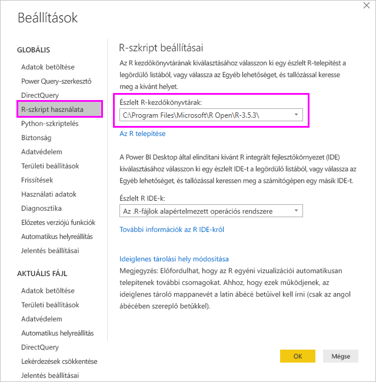
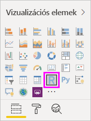
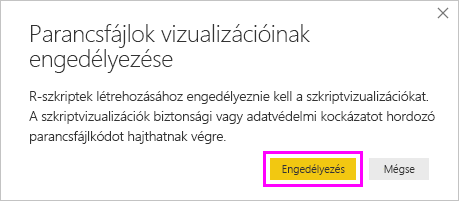
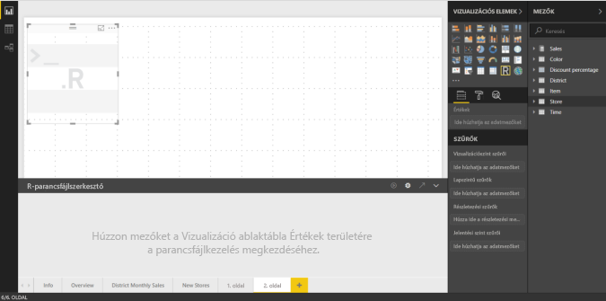
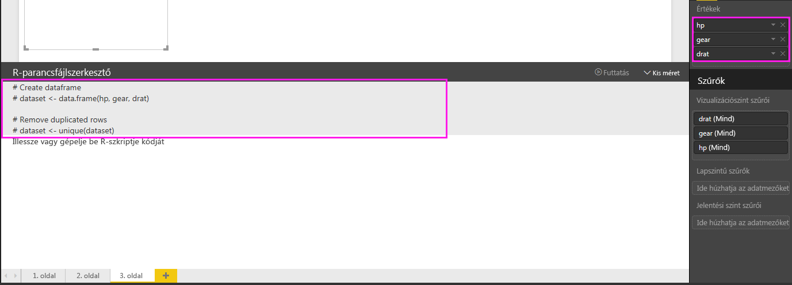
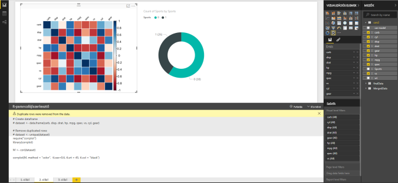
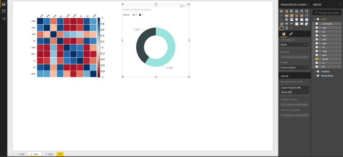
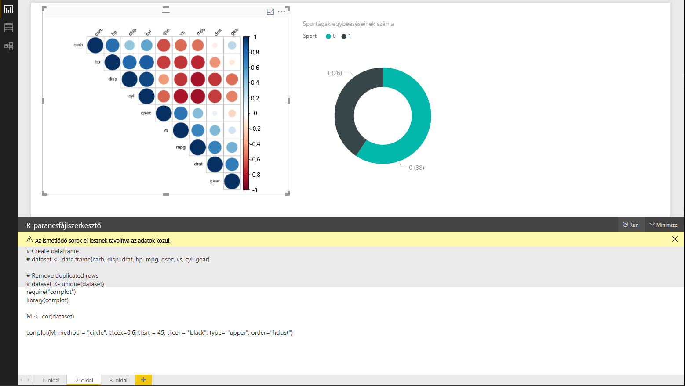
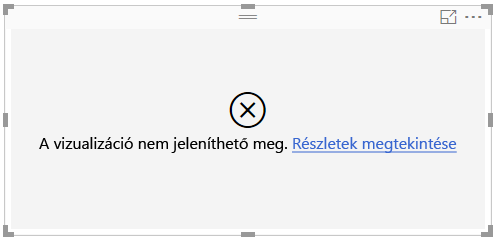

# <a name="create-power-bi-visuals-using-r"></a>Power BI-vizualizációk létrehozása az R programozási nyelvvel
A Power BI Desktopban az *R* használatával vizualizálhatja az adatokat. Az [R](https://mran.revolutionanalytics.com/documents/what-is-r) egy statisztikai számításokhoz és grafikus megjelenítéshez használható nyelv és környezet.

## <a name="install-r"></a>Az R telepítése
A Power BI Desktop alapértelmezés szerint nem tartalmazza, helyezi üzembe vagy telepíti az R-motort. Az R-szkriptek Power BI Desktopban való futtatásához külön kell telepítenie az R-t a helyi számítógépen. Az R-t számos helyről ingyen letöltheti és telepítheti, például a [Revolution Open letöltőoldalról](https://mran.revolutionanalytics.com/download/) vagy a [CRAN-adattárból](https://cran.r-project.org/bin/windows/base/). A Power BI Desktopban használható R-szkriptek jelenlegi kiadása támogatja a Unicode karaktereket és a szóközöket (üres karaktereket) a telepítési útvonalban.

## <a name="enable-r-visuals-in-power-bi-desktop"></a>R-vizualizációk engedélyezése a Power BI Desktopban
Az R telepítése után a Power BI Desktop automatikusan engedélyezi a környezetet. Annak ellenőrzéséhez, hogy a Power BI Desktop a megfelelő helyen engedélyezte-e az R-t, kövesse az alábbi lépéseket: 

1. A Power BI Desktop menüjében válassza a **Fájl** > **Lehetőségek és beállítások** > **Beállítások** elemet. 

2. A **Beállítások** lap bal oldalán, a **Globális** területen válassza az **R-szkript használata** lehetőséget. 

3. Az **R-szkript beállításai** területen ellenőrizze, hogy a helyi R-telepítés meg van-e adva az **Észlelt R-kezdőkönyvtárak** területen, és hogy megfelelően megjelenik-e a helyi R-telepítés helye, amelyet a Power BI Desktoppal használni szeretne. A következő képen az R helyi telepítési útvonala **C:\Program Files\R Open\R-3.5.3\\** .
   
   

Miután ellenőrizte az R telepítési helyét, készen áll az R-vizualizációk létrehozására.

## <a name="create-r-visuals-in-power-bi-desktop"></a>R-vizualizációk létrehozása a Power BI Desktopban
1. Egy R-vizualizáció hozzáadásához kattintson az **R-vizualizáció** ikonra a **Vizualizáció** panelen.
   
   

2. A megjelenő **Szkriptek vizualizációinak engedélyezése** ablakban válassza az **Engedélyezés** lehetőséget.

   

   Ha hozzáad egy jelentéshez egy R-vizualizációt, a Power BI Desktop a következő módosításokat hajtja végre:
   
   - Megjelenik a jelentésvásznon egy helyőrző R-vizualizációs kép.
   
   - A középső panel aljánál megjelenik az **R-parancsfájlszerkesztő**.
   
   

3. Húzza a **Vizualizáció** panel **Értékek** szakaszába a **Mezők** panelen található azon mezőket, amelyeket fel szeretne használni az R-szkriptben, ahogy azt a Power BI Desktop bármely más vizualizációja esetében is tenné. Azt is megteheti, hogy a mezőket közvetlenül a **Mezők** panelen választja ki.
    
    Az R-szkript számára csak az **Értékek** szakaszhoz hozzáadott mezők érhetők el. Amikor az **R-szkriptszerkesztőben** az R-szkripten dolgozik, új mezőket adhat hozzá, vagy eltávolíthatja a szükségtelen mezőket az **Értékek** szakaszból. A Power BI Desktop automatikusan észleli, hogy mely mezők lettek hozzáadva vagy eltávolítva.
   
   > [!NOTE]
   > Az R-vizualizációk összesítésének alapértelmezett típusa a *nincs összegzés*.
   > 
   > 
   
4. Ezután a kiválasztott adatok alapján létrehozhat egy rajzot: 

    - A mezők kiválasztásakor az **R-szkriptszerkesztő** létrehozza a támogató R-szkriptkötő kódot a szerkesztőpanel tetején lévő a szürke rész adott mezői számára.
    - Ha eltávolít egy mezőt, az **R-szkriptszerkesztő** automatikusan eltávolítja az adott mezőhöz tartozó támogató kódot.
   
   A következő képen látható példában három mező van kiválasztva: hp, gear és drat. Ennek eredményeképp az R-szkriptszerkesztő kötőkódot hoz létre, amely a következőképpen összegezhető:
   
   * Létrehoz egy **dataset** nevű adathalmazt, amely a felhasználó által kiválasztott különböző mezőkből áll.
   * Az alapértelmezett összesítés a *Nincs összegzés*.
   * A táblavizualizációkhoz hasonlóan a rendszer csoportosítja a mezőket, és a duplikált sorok csak egyszer jelennek meg.
   
   
   
   > [!TIP]
   > Bizonyos esetekben szükség lehet arra, hogy a rendszer ne végezzen automatikus csoportosítást, vagy minden sort megjelenítsen, a duplikáltakat is beleértve. Ebben az esetben adjon hozzá egy index mezőt az adatkészlethez, amelynek hatására a rendszer minden sort egyedinek tekint, így megakadályozza a csoportosítást.
   > 
   > 
   
   A létrejött adathalmaz neve **dataset**, a kiválasztott oszlopokat pedig a saját nevük alapján érheti el. Például a gear mező úgy érhető el, ha az R-szkriptbe beírja a *dataset$gear* kifejezést. A szóközöket vagy egyéb speciális karaktereket tartalmazó mezőknél használjon aposztrófot.

5. Mivel az adathalmaz automatikusan létrejön a kiválasztott mezők alapján, most már írhat R-szkripteket, amelyeket a Power BI Desktop ábrázol az alapértelmezett R-eszközön. Ha a szkript elkészült, kattintson a **Futtatás** elemre az **R-szkriptszerkesztő** címsorának jobb oldalán.
   
    A **Szkript futtatása** lehetőség kiválasztásakor a Power BI Desktop azonosítja az ábrázolást, és megjeleníti a vásznon. Mivel a folyamat végrehajtása a helyi R-telepítésen történik, győződjön meg arról, hogy a szükséges R-csomagok telepítve vannak.
   
   A Power BI Desktop újrarajzolja a vizualizációt, ha a következő események bármelyike előfordul:
   
   * Ha a **Szkript futtatása** lehetőséget választja az **R-szkriptszerkesztő** címsorán.
   * Adatváltozás történik az adatok frissítése, szűrése vagy kiemelése miatt.

     A következő képen egy példa látható a korrelációrajzolási kódra, amely a különböző típusú gépkocsik tulajdonságai közötti korrelációkat ábrázolja.

     

6. A vizualizáció nagyobb méretű megtekintése érdekében állítsa kis méretűre az **R-szkriptszerkesztőt**. A Power BI Desktop egyéb vizualizációihoz hasonlóan a korrelációs ábrázoláson keresztszűrést is alkalmazhat úgy, ha csak egy bizonyos szakaszt (például a sportkocsikat) választ ki a gyűrű alakú diagramon (a jobb oldali kerek vizualizáció).

    

7. Módosíthatja az R-szkriptet a vizualizáció testreszabásához, és az R képességeit kihasználva paramétereket adhat az ábrázolási parancshoz.

    Az eredeti ábrázolási parancs a következő:

    ```
    corrplot(M, method = "color",  tl.cex=0.6, tl.srt = 45, tl.col = "black")
    ```

    Módosítsa az R-szkriptet úgy, hogy az ábrázolási parancs a következő legyen:

    ```
    corrplot(M, method = "circle", tl.cex=0.6, tl.srt = 45, tl.col = "black", type= "upper", order="hclust")
    ```

    Ennek eredményeképp az R-vizualizáció most csak köröket ábrázol, csak a felső felet veszi figyelembe, és újrarendezi a mátrixot a korrelált attribútumok fürtösítéséhez.

    

    Ha egy R-szkript futtatása hibát eredményez, az R-vizualizáció ábrázolása helyett egy hibaüzenet jelenik meg a vásznon. A hiba részleteinek megtekintéséhez kattintson a **Részletek megtekintése** elemre az R-vizualizációs hibaüzenetben.

    

## <a name="r-scripts-security"></a>R-parancsfájlok biztonsága 
A R-vizualizációk alapjait az R-szkriptek jelentik, amelyek biztonsági vagy adatvédelmi kockázatot jelentő kódot tartalmazhatnak. Egy R-vizualizáció első alkalommal való megtekintésekor vagy használatakor egy biztonsági figyelmeztető üzenet jelenik meg. Csak akkor engedélyezze az R-vizualizációkat, ha megbízik a szerzőben és a forrásban, vagy ha már áttekintette és értelmezte az R-szkriptet.


## <a name="known-limitations"></a>Ismert korlátozások
A Power BI Desktop-beli R-vizualizációk a következő korlátozásokkal rendelkeznek:

* Adatméret: Az R-vizualizációk által az ábrázoláshoz felhasznált adatmennyiség 150 000 sorban van korlátozva. 150 000-nél több sor kiválasztásakor a rendszer csak az első 150 000 sort használja fel, és megjelenít egy üzenetet a képen.

* Felbontás: Minden R-vizualizáció 72 DPI-vel jelenik meg.

* Eszköz ábrázolása: Csak az alapértelmezett eszközre való ábrázolás támogatott. 

* Számítási idő: Ha az R-vizualizáció számítási ideje meghaladja az öt percet, időtúllépési hiba történik.

* Kapcsolatok: A Power BI Desktop többi vizualizációjához hasonlóan, ha több adatmezőt választ ki különböző táblákból, amelyek közt nincs meghatározott kapcsolat, akkor a rendszer hibát jelez.

* Frissítések: Az R-vizualizációk az adatok frissítésekor, szűrésekor és kiemelésekor frissülnek. Ugyanakkor a kép maga nem interaktív és nem szolgálhat keresztszűrés forrásaként.

* Legfontosabb tudnivalók: Az R-vizualizációk reagálnak más vizualizációk kiemeléseire, de nem lehet az elemeiket kijelölve keresztszűrni más elemeket.

* Eszközök megjelenítése: A vásznon csak az alapértelmezett R megjelenítő eszközön ábrázolt ábrázolások jelennek meg helyesen. Kerülje az eltérő R megjelenítő eszközök használatát.

* RRO-telepítések: Ebben a kiadásban az RRO-telepítéseket a Power BI Desktop 32 bites verziója nem azonosítja automatikusan, így az R telepítési könyvtárának elérési útját manuálisan kell megadni a **Lehetőségek és beállítások** > **Beállítások** > **R-szkript használata** ablakban.

## <a name="next-steps"></a>Következő lépések
Az R Power BI-beli használatával kapcsolatos további információkat az alábbi cikkekben olvashat:

* [R-szkriptek futtatása a Power BI Desktopban](desktop-r-scripts.md)
* [Külső R IDE környezet használata a Power BI-jal](desktop-r-ide.md)

