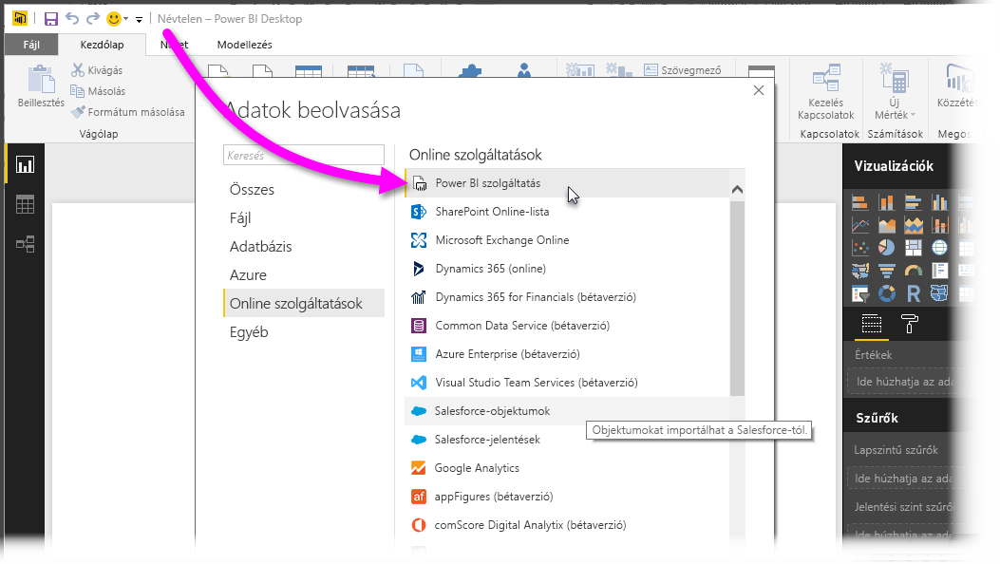
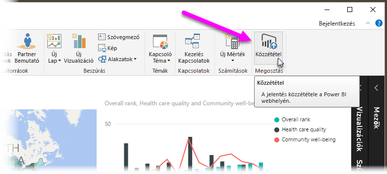
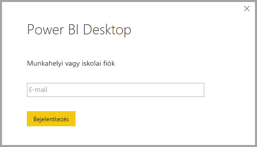
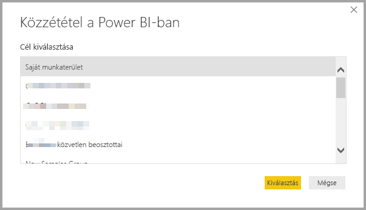
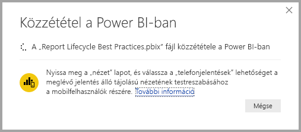
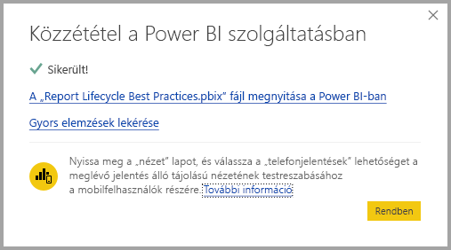
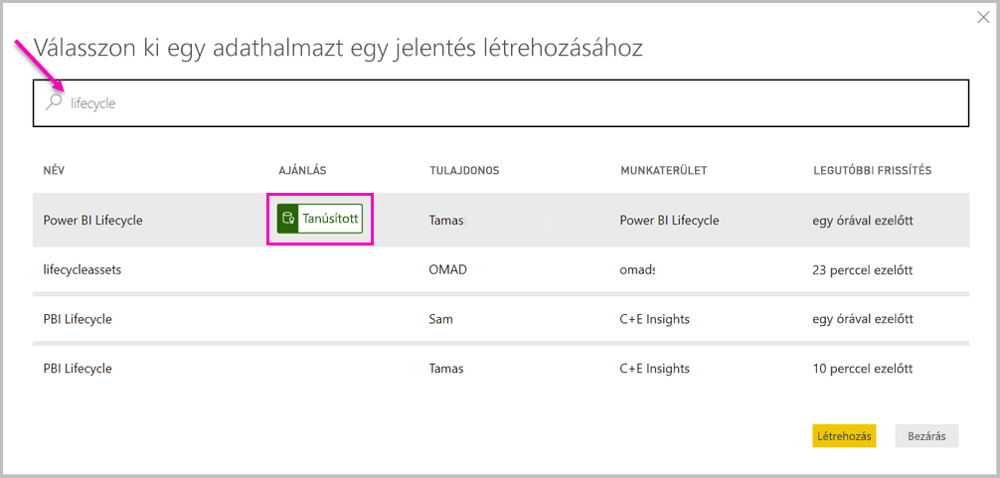
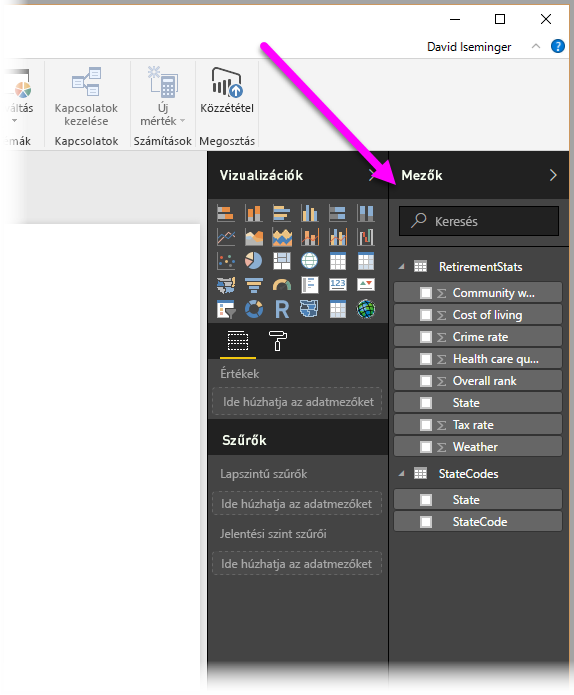

# Kapcsolódás a Power BI szolgáltatásban lévő adatkészletekhez a Power BI Desktopból

Létrehozhat élő kapcsolatot a *Power BI szolgáltatás* egy megosztott adatkészletével, és számos különböző jelentést hozhat létre ugyanabból az adatkészletből. Létrehozhatja a tökéletes adatmodellt a Power BI Desktopban, majd közzéteheti a Power BI szolgáltatásban. Ezután Ön és mások különböző jelentéseket (külön . *.pbix*-fájlokat) készíthetnek a közös adatmodellből, és ezeket különböző munkaterületekre menthetik. Ennek a szolgáltatásnak *Élő kapcsolat Power BI szolgáltatással* a neve.

A szolgáltatásnak számos előnye van, beleértve a jelen cikkben később tárgyalt ajánlott eljárásokat. Javasolt áttekinteni a funkció [megfontolandó szempontjait és korlátozásait](#limitations-and-considerations).

## Az Élő kapcsolat Power BI-szolgáltatással használata a jelentések életciklusának kezeléséhez

A Power BI népszerűségével kapcsolatban az egyik kihívást a jelentések, irányítópultok és az alapul szolgáló adatmodellek elterjedése jelenti. Egyszerű lenyűgöző jelentéseket létrehozni a Power BI Desktopban, majd [közzétenni](desktop-upload-desktop-files.md) ezeket a jelentéseket a Power BI szolgáltatásban, majd nagyszerű irányítópultokat létrehozni az adatkészletekből. Minthogy oly sokan teszik így, az azonos (vagy majdnem azonos) adatkészletek használata, annak észben tartása, hogy melyik jelentés melyik adatkészleten alapult – és melyik adatkészlet mennyire naprakész –, gyakran már komoly kihívást jelent. Az Élő kapcsolat Power BI-szolgáltatással a válasz erre a kihívásra, hiszen egyszerűbbé és konzisztenssé teszi a közös adatkészleten alapuló jelentések és irányítópultok létrehozását, megosztását és bővítését.

### Mindenki által használható adatkészletek létrehozása, majd megosztása

Tegyük fel, hogy Anna egy üzleti elemző az Ön csapatában. Anna jártas a jó minőségű adatmodellek (más néven adatkészletek) létrehozásában. Anna létrehoz egy adatkészletet és egy jelentést, majd megosztja a jelentést a Power BI szolgáltatásban.

Anna jelentésével és adatkészletével mindenki nagyon elégedett. Itt kezdődik a probléma. A csapat összes tagja megpróbálja létrehozni Anna adatkészletéből a *saját verzióját*, majd megosztják a jelentéseket a csapattal. Hirtelen különböző adatkészletekre támaszkodó jelentések egész hada jelenik meg a csapat munkaterületén a Power BI szolgáltatásban. Melyik a legújabb? Egyeznek vajon az adatkészletek, vagy csak majdnem? Milyen különbségeik vannak? Az Élő kapcsolat Power BI-szolgáltatással révén a helyzet sokkal egyszerűbbé válik. A következő szakaszban meglátjuk, hogyan tudják felhasználni mások Anna közzétett adathalmazát a saját jelentéseikhez a saját munkaterületeiken, és hogyan használhatja mindenki ugyanazt a stabil, ellenőrzött és megosztott adathalmazt a saját egyedi jelentéseihez.

### Csatlakozás a Power BI szolgáltatás adatkészletéhez élő kapcsolattal

Anna létrehoz egy jelentést, és létrehozza az alapul szolgáló adatkészletet. Anna ezután közzéteszi ezt a Power BI szolgáltatásban. A jelentés megjelenik a csapat munkaterületén a Power BI szolgáltatásban. Ha Anna egy *új felületű munkaterületen* menti a jelentést, akkor beállíthatja az *Összeállítási engedélyt*, hogy a munkaterületen belül és azon kívül mindenki számára elérhetővé, láthatóvá és használhatóvá tegye.

További információ az új felületű munkaterületekről: [Munkaterületek](service-new-workspaces.md).

Anna munkaterületének más tagjai ekkor létrehozhatnak egy élő kapcsolatot Anna megosztott adatmodelljével (az Élő kapcsolat Power BI-szolgáltatással szolgáltatás révén). Létrehozhatják az *ő eredeti adatkészletük* alapján a saját egyedi jelentéseiket a *saját új felületű munkaterületeken*.

A következő ábrán láthatjuk, hogy Anna létrehoz egy Power BI Desktop-jelentést, majd közzéteszi (az adatmodellel együtt) a Power BI szolgáltatásban. Ekkor mások is csatlakozhatnak Anna adatmodelljéhez az Élő kapcsolat Power BI szolgáltatással használatával, és létrehozhatják a saját egyedi jelentéseiket a saját munkaterületükön Anna adathalmaza alapján.

> [!NOTE]
> Ha adathalmazát [klasszikus megosztott munkaterületre](service-create-workspaces.md) menti, akkor csak annak a munkaterületnek a tagjai készítenek jelentéseket az adathalmazára alapozva. Az Élő kapcsolat Power BI-szolgáltatással létrehozásához az adatkészletnek, amelyhez csatlakozni kíván, egy olyan megosztott munkaterületen kell lennie, amelynek Ön a tagja.
> 
> 

## Lépésenkénti útmutató az Élő kapcsolat Power BI-szolgáltatással használatához

Most, hogy már tudjuk, milyen hasznos az Élő kapcsolat Power BI szolgáltatással funkció, és hogyan használhatjuk ajánlott eljárásként a jelentések életciklusának kezeléséhez, nézzük végig, hogyan jutottunk el Anna nagyszerű jelentésétől (és adathalmazától) egy olyan adathalmazig, amelyet a Power BI-csapattársai is használhatnak.

### Power BI-jelentés és -adatkészlet közzététele

Az első lépés, ha egy jelentés életciklusát az Élő kapcsolat Power BI-szolgáltatással használatával kezeljük, hogy olyan jelentésünk (és adatkészletünk) legyen, amelyet a csapattársaink is szívesen használnának. Tehát Annának előbb *közzé kell tennie* a jelentését a Power BI Desktopból. A Power BI Desktop **Kezdőlap** szalagján válassza a **Közzététel** lehetőséget.

Ha Anna nincs bejelentkezve a Power BI szolgáltatás fiókjába, a Power BI erre kéri majd.

Innen Anna kiválaszthatja a cél munkaterületet, ahol közzéteszi a jelentést és az adatkészletet. Bizonyára emlékszik, hogy ha Anna egy új felületű munkaterületre menti azt, akkor az Összeállítási engedéllyel rendelkezők mind hozzáférhetnek ehhez az adathalmazhoz. Az Összeállítási engedély be lesz állítva a Power BI szolgáltatásban a közzététel után. Ha klasszikus munkaterületre menti a munkát, csak olyan csapattagok férhetnek hozzá a jelentés adathalmazához az Élő kapcsolat Power BI-szolgáltatással segítségével, akik rendelkeznek hozzáféréssel a munkaterülethez, ahol a jelentés közzé van téve.

Megkezdődik a közzétételi folyamat, és a Power BI Desktop megjeleníti a folyamatot.

Ha kész, a Power BI Desktop tájékoztatja a sikerről, és biztosítja a hivatkozásokat, amelyekkel elérhető maga a jelentés a Power BI szolgáltatásban, illetve amelyekkel gyors elemzéseket kérhet le a jelentésről.

Most, hogy a jelentés az adathalmazával együtt a Power BI szolgáltatásban van, *meg is hirdetheti* azt. Ezzel igazolhatja annak minőségét és megbízhatóságát. Azt is kérheti, hogy egy központi szolgáltató *minősítse* azt az Ön Power BI-bérlőjében. Adathalmaza mindkét támogatási mód esetén mindig a lista elején jelenik meg, amikor valaki adathalmazt keres. További információ: [Adatkészlet meghirdetése](service-datasets-promote.md).

Az utolsó lépés az Összeállítási engedély beállítása ahhoz az adathalmazhoz, amelyen a jelentés alapul. Az Összeállítási engedély határozza meg, hogy ki láthatja és használhatja az adathalmazt. Ezt beállíthatja magán a munkaterületen, vagy amikor alkalmazást oszt meg a munkaterületről. További információ: [Megosztott adathalmazokra vonatkozó összeállítási engedélyek](service-datasets-build-permissions.md).

Ezután nézzük meg, hogyan csatlakozhatnak az adatkészlethez, majd hozhatják létre a saját jelentéseiket a csapattársak, akiknek hozzáférésük van a munkaterülethez, ahol a jelentés (és az adatkészlet) közzé lett téve.

### Az Élő kapcsolat Power BI-szolgáltatással létrehozása a közzétett adatkészlethez

Ha csatlakozni szeretne a közzétett jelentéshez, és létre szeretné hozni a saját jelentését a közzétett adathalmaz alapján, válassza az **Adatok lekérése** lehetőséget a Power BI Desktop **Kezdőlap** menüszalagján, válassza a **Power Platform** lehetőséget a bal oldali panelen, majd a **Power BI-adathalmazok** lehetőséget.

Ha nincs bejelentkezve, a Power BI megkéri erre. A bejelentkezés után a Power BI megmutatja, Ön mely munkaterületeknek a tagja. Kiválaszthatja, hogy melyik munkaterület tartalmazza azt az adatkészletet, amelyhez élő kapcsolatot szeretne kialakítani a Power BI-szolgáltatással.

A listában lévő adathalmazok mind megosztott adathalmazok, amelyekhez Összeállítási engedéllyel rendelkezik valamely munkaterületen. Rákereshet egy adott adathalmazra, és láthatja annak nevét, tulajdonosát, a munkaterületet, ahol található, valamint az utolsó frissítése időpontját. Itt látja az **AJÁNLÁST** a minősített vagy meghirdetett adatkészletekhez a lista elején.

A **Létrehozás** lehetőség kiválasztásával élő kapcsolatot hoz létre a kiválasztott adatkészlethez. A Power BI Desktop valós időben betölti a mezőket és azok látható értékeit a Power BI Desktopba.

Ekkor létrehozhat és megoszthat (ahogy mások is) egyéni jelentéseket ugyanabból az adatkészletből. Ez a módszer remek módja annak, hogy egy szakértő hozzon létre egy helyesen formázott adatkészletet, ahogyan Anna is tette. A megosztott adatkészlettel számos csoporttársa létrehozhat saját jelentéseket.

## Korlátozások és szempontok

Az Élő kapcsolat Power BI-szolgáltatással használatára vonatkozik néhány korlátozás és egyéb szempont.

* Egy közzétett adathalmazhoz csak azok a felhasználók csatlakozhatnak az Élő kapcsolat Power BI szolgáltatással segítségével, akik Összeállítási engedéllyel rendelkeznek az adathalmazon.
* Az ingyenes felhasználók csak a **saját** és a Premium-alapú munkaterületeken lévő adathalmazokat látják.
* Mivel ez a kapcsolat élő, a bal oldali navigációs panel és a modellezés le van tiltva. Minden jelentésben csak egy adatkészlethez csatlakozhat. Ez a viselkedés hasonlít az *SQL Server Analysis Services* szolgáltatáshoz való csatlakozáshoz.
* Mivel ez egy élő kapcsolat, kényszerítve van a sorszintű biztonság (RLS) és az ehhez hasonló kapcsolati viselkedések. Ugyanez történik az SQL Server Analysis Services-hez való kapcsolódás esetén is.
* Ha tulajdonos módosítja az eredeti *.pbix*-fájlt, azzal felülírja a Power BI szolgáltatásban megosztott adatkészletet és jelentést. Az erre az adathalmazra alapuló jelentések nem lesznek felülírva, de a jelentés tükrözni fogja az adathalmaz módosításait.
* Munkaterület tagjai az eredetileg megosztott jelentést nem cserélhetik ki. Ha ezzel próbálkozik, a rendszer felszólítja a fájl átnevezésére és közzétételére.
* Ha törli a Power BI szolgáltatásban megosztott adathalmazt, akkor az adathalmazra alapuló más jelentések nem működnek jól, vagy nem tudják megjeleníteni a vizualizációkat.
* Tartalomcsomagok esetében először létre kell hoznia egy másolatot a tartalomcsomagról, mielőtt alapul használhatná egy *.pbix*-jelentés és adatkészlet megosztására a Power BI szolgáltatásban.
* A *Saját szervezet* tartalomcsomagjai esetében, ha már másolva lettek, nem lehet kicserélni a szolgáltatáson létrehozott jelentést vagy egy élő kapcsolattal rendelkező tartalomcsomag másolása részeként létrehozott jelentést. Ha ezzel próbálkozik, a rendszer felszólítja a fájl átnevezésére és közzétételére. Ebben a helyzetben csak a közzétett élő kapcsolattal rendelkező jelentéseket cserélheti le.
* Ha töröl egy megosztott adathalmazt a Power BI szolgáltatásból, akkor senkinek sem lesz tovább hozzáférése ahhoz az adathalmazhoz a Power BI Desktopban.
* A Power BI szolgáltatásban adatkészletet használó jelentések nem támogatják az automatikus üzembe helyezést a Power BI REST API használatával.
