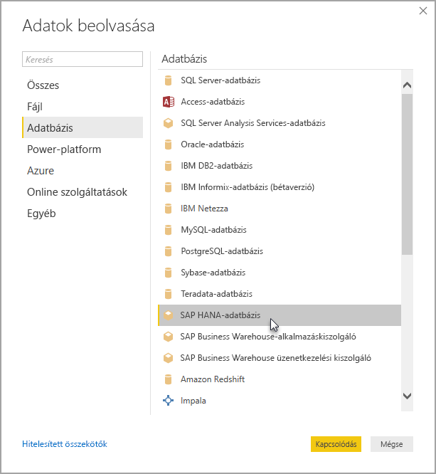

# Kapcsolódás SAP HANA-adatbázisokhoz aPower BI Desktopban
A Power BI Desktoppal mostantól hozzáférhet az **SAP HANA**-adatbázisokhoz. Az **SAP HANA**-adatbázisok használatához telepíteni kell az SAP HANA ODBC-illesztőprogramot a helyi ügyfélszámítógépen, hogy a Power BI Desktop **SAP HANA**-adatkapcsolat megfelelően működjön. Az SAP HANA-ügyféleszközöket az [SAP fejlesztési eszközök](https://tools.hana.ondemand.com/#hanatools) területről töltheti le, ahol megtalálható a szükséges ODBC-illesztő. Másik lehetőségként az [SAP Software Download Centerből](https://support.sap.com/swdc) is letöltheti. A Software portálon keresse meg a Windows rendszerű számítógépekhez készült SAP HANA-ügyfelet. Mivel az **SAP Software Download Center** szerkezete gyakran változik, a helyet nem tudjuk pontosabban meghatározni.

Ha **SAP HANA**-adatbázishoz szeretne csatlakozni, válassza az **Adatok lekérése > Adatbázis > SAP HANA-adatbázis** lehetőséget az alábbi ábrának megfelelően:

SAP HANA-adatbázishoz való kapcsolódáskor adja meg a kiszolgáló nevét. Ezután a legördülő listában és a beviteli mezőben adja meg a portot.

Ebben a kiadásban az **SAP HANA**[DirectQuery](desktop-directquery-sap-hana.md) módban támogatott a Power BI Desktopban és a Power BI szolgáltatásban, és a **SAP HANA**-adatbázist DirectQuery módban használó jelentéseket tehet közzé és tölthet fel a Power BI szolgáltatásban. A Power BI szolgáltatásban akkor is közzétehet és feltölthet jelentéseket, ha nem **SAP HANA**-adatbázist használ DirectQuery módban.

## Az SAP HANA támogatott funkciói
Ebben a kiadásban számos képesség érhető el az **SAP HANA**-hoz, például a következők:

* Az **SAP HANA**-hoz készült Power BI-összekötő az SAP ODBC-illesztőprogramját használja a legjobb felhasználói élményt érdekében
* Az **SAP HANA** a DirectQuery és az importálási lehetőségeket is támogatja
* A Power BI támogatja a HANA-információmodelleket (például az elemzési és számítási nézeteket), és optimalizált navigációval rendelkezik
* Az **SAP HANA** használatával a közvetlen SQL funkciót is használhatja a sor- és oszloptáblázatokhoz való csatlakozáshoz
* Optimalizált navigáció érhető el a HANA-modellekhez
* A Power BI támogatja az **SAP HANA** változóit és bemeneti paramétereit
* HDI-tárolóalapú számítási nézetek
  * A Power BI Desktop 2019. augusztusi kiadása nyilvános előzetes verzióban támogatja a HDI-tárolóalapú számítási nézeteket. A HDI-tárolóalapú számítási nézetek eléréséhez győződjön meg róla, hogy a Power BI-jal használt HANA-adatbázis-felhasználók hozzáféréssel rendelkeznek az elérni kívánt nézeteket tároló HDI-futtatókörnyezet tárolójához. A hozzáférés megadásához létre kell hoznia egy olyan szerepkört, amely engedélyezi a HDI-tárolóhoz való hozzáférést, majd hozzárendelnie a Power BI-jal használt HANA-adatbázis-felhasználóhoz (a felhasználónak emellett engedéllyel kell rendelkeznie a \_SYS\_ BI-séma rendszertábláinak olvasásához is). Az adatbázis-szerepkörök létrehozásának és hozzárendelésének módját a hivatalos SAP-dokumentációban tekintheti meg. [Ez az SAP-blogbejegyzés](https://blogs.sap.com/2018/01/24/the-easy-way-to-make-your-hdi-container-accessible-to-a-classic-database-user/) jó kiindulópontként szolgálhat.
  * A HDI-alapú számítási nézetekhez tartozó HANA-változók jelenleg rendelkeznek némi korlátozásokkal. Ezek HANA-oldali korlátok, amelyeket az SAP HANA későbbi kiadásaiban orvosolunk. Először is nem alkalmazható HANA-változó egy HDI-tárolóalapú számítási nézet megosztott oszlopain. Ez a korlátozás feloldható, ha a HANA 2 37.02-es vagy újabb, vagy a HANA 2 42-es vagy újabb verziójára frissít. Emellett jelenleg nem jelennek meg a Power BI felhasználói felületén a változók és paraméterek alapértelmezett értékei. Ezt is az SAP HANA egy hibája okozza, azonban ehhez még nem várható javítás.

## Az SAP HANA korlátozásai
Az **SAP HANA** használatára a következő néhány korlátozás vonatkozik:

* Az NVARCHAR sztringeket a rendszer legfeljebb 4000 Unicode karakter hosszúságúra csonkolja
* A SMALLDECIMAL nem támogatott
* A VARBINARY nem támogatott
* Az érvényes dátumok 1899/12/30 és 9999/12/31 közöttiek

## Következő lépések
Az SAP HANA-val és a DirectQueryvel kapcsolatos további információkért tekintse meg az alábbi forrásanyagokat:

* [DirectQuery és SAP HANA](desktop-directquery-sap-hana.md)
* [A DirectQuery használata a Power BI-ban](desktop-directquery-about.md)
* [A DirectQuery által támogatott adatforrások](desktop-directquery-data-sources.md)
* [Az SAP HANA titkosításának engedélyezése](desktop-sap-hana-encryption.md)

