# <a name="tutorial-shape-and-combine-data-in-power-bi-desktop"></a>Oktatóanyag: Adatok formázása és összevonása a Power BI Desktopban

A Power BI Desktoppal számos különféle típusú adatforráshoz csatlakozhat, és igény szerint formázhatja az adatokat, így másokkal megosztandó jelentéseket hozhat létre. A *formázás* az adatok átalakítását jelenti: oszlopok vagy táblázatok átnevezését, szöveg számokká alakítását, sorok eltávolítását, az első sorok fejléccé alakítását stb. Az adatok *összevonásakor* két vagy több adatforráshoz csatlakozik, amelyeket igény szerint formázhat, majd hasznos lekérdezéssé vonhat össze.

Ebből az oktatóanyagból az alábbiakat sajátíthatja el:

* Adatok formázása a Lekérdezésszerkesztővel.
* Csatlakozás különböző adatforrásokhoz.
* Az adatforrások kombinálása és jelentésekben felhasználható adatmodell létrehozása.

Ez az oktatóanyag bemutatja a lekérdezések formázását a Power BI Desktoppal, és kiemeli a gyakran használt feladatokat. Az itt használt lekérdezés részletesebb leírását – például teljesen új lekérdezés létrehozásának lépéseit – az [Első lépések a Power BI Desktopban](desktop-getting-started.md) című témakörben találja.

A Power BI Desktop Lekérdezésszerkesztőjében a funkciók sokféle helyi menüben és az **Átalakítás** menüszalagon is elérhetők. A menüszalag elemeinek nagy része egy adott elemre, például oszlopra a jobb gombbal kattintva megjelenő menüből is elérhető.

## <a name="shape-data"></a>Adatok formázása
Amikor a Lekérdezésszerkesztőben formázza az adatokat, részletes utasításokat ad meg a Lekérdezésszerkesztő számára, hogy az milyen módosításokat végezzen az adatok betöltésekor és megjelenítésekor. Az eredeti adatforrást nem érintik a változtatások, csak az adatok adott nézete lesz módosítva vagy *formázva*.

A Lekérdezésszerkesztő rögzíti a megadott lépéseket (például egy tábla átnevezését, egy adattípus átalakítást vagy egy oszlop törlését). Amikor ez a lekérdezés az adatforráshoz csatlakozik, a Lekérdezésszerkesztő mindig végrehajtja ezeket a lépéseket, így az adatok mindig a megadott módon lesznek formázva. Ez a folyamat minden alkalommal végbemegy, amikor a Lekérdezésszerkesztőt használja, valamint akkor is, ha egy másik felhasználó elindít egy megosztott lekérdezést, például a Power BI szolgáltatásban. A lépések a megadott sorrendben rögzítve lesznek a **Lekérdezés beállításai** panel **Alkalmazott lépések** területen. Ezeket a lépéseket részletesen is leírják a következő bekezdések.

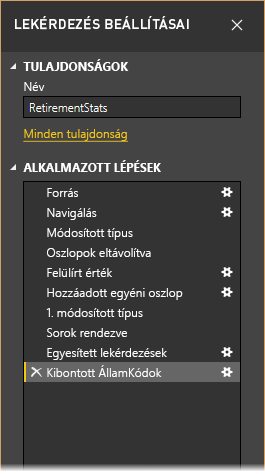

Használjuk az [Első lépések a Power BI Desktopban](desktop-getting-started.md) témakörben található, nyugdíjba vonulással kapcsolatos adatokat, amelyeket egy webes adatforráshoz csatlakozva találtunk meg, hogy aztán az igényeink szerint formázhassuk azokat. Egyéni oszlopot adunk hozzá, amely kiszámítja az összes, egyenlő tényezőként szereplő adat rangsorát, majd összehasonlítjuk ezt az oszlopot a meglévő **Rangsor** oszloppal.  

1. Az **Oszlop hozzáadása** menüszalagon válassza az **Egyéni oszlop** lehetőséget, amellyel egyéni oszlopot szúrhat be.

    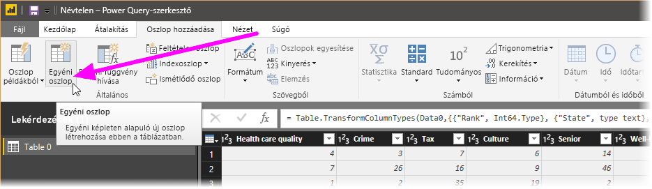

1. Az **Egyéni oszlop** ablak **Új oszlop neve** mezőjében adja meg a _New Rank_ (új rangsor) nevet. Az **Egyéni oszlopképlet** mezőbe illessze be a következőt:

    ```
    ([Cost of living] + [Weather] + [Health care quality] + [Crime] + [Tax] + [Culture] + [Senior] + [#"Well-being"]) / 8
    ```
 
1. Ellenőrizze, hogy az állapotüzenet a következő: *No syntax errors have been detected* (Nem találhatók szintaktikai hibák), majd válassza az **OK** lehetőséget.

    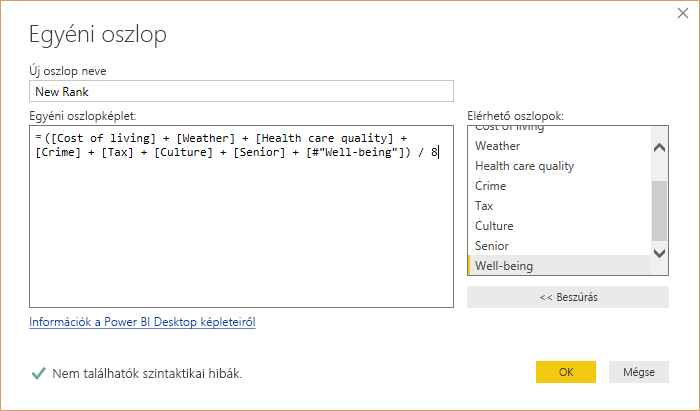

1. Ahhoz, hogy az oszlop adatai konzisztensek maradjanak, alakítsa egész számokká az új oszlop értékeit. Ezek módosításához kattintson a jobb gombbal az oszlop fejlécére, és válassza a **Típus módosítása \> Egész szám** lehetőséget. 

    Ha egynél több oszlopot szeretne kijelölni, jelöljön ki egy oszlopot, a **SHIFT** billentyűt lenyomva tartva jelölje ki a szomszédos oszlopokat, és kattintson a jobb gombbal egy oszlopfejlécre. A **CTRL** billentyűvel nem szomszédos oszlopokat is kijelölhet.

    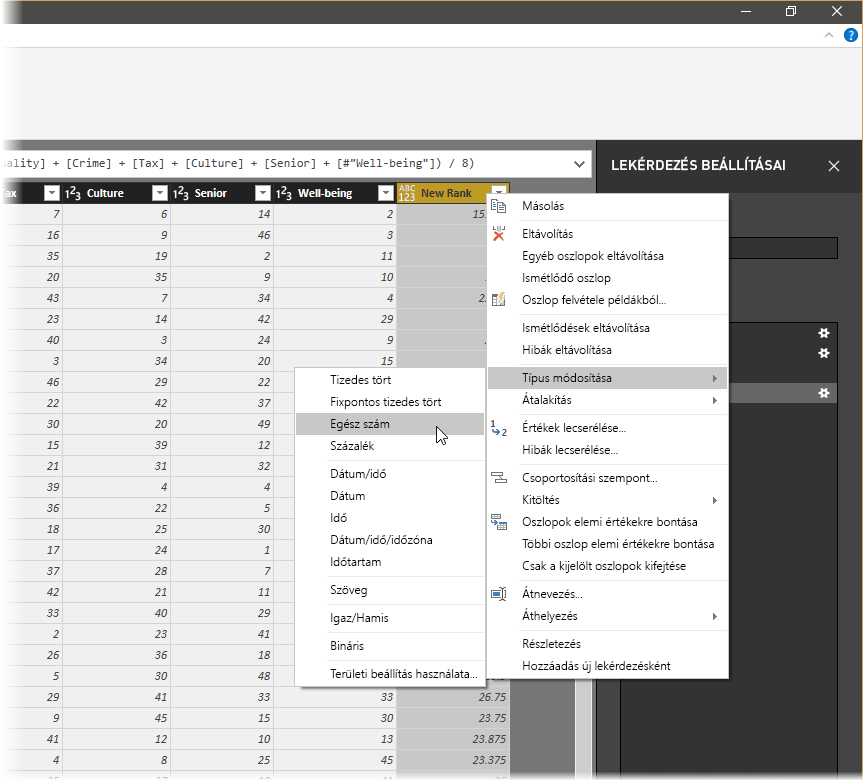

1. Egy oszlop adattípusának *átalakításához*, ha a jelenlegi adattípust egy másikra alakítja át, válassza az **Átalakítás** menüszalag **Adattípus: szöveg** lehetőségét. 

   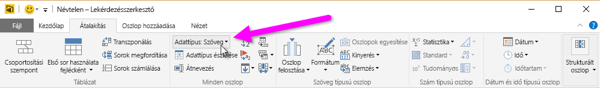

1. A **Lekérdezés beállításai** panel **Alkalmazott lépések** listáján minden végrehajtott adatformázási lépés megjelenik. Egy lépést úgy távolíthat el a formázási folyamatból, hogy az adott lépés bal oldalán található **×** jelre kattint. 

    Az alábbi ábrán az **Alkalmazott lépések** listában az eddig hozzáadott lépések láthatók: 
     - **Forrás**: Csatlakozás a webhelyhez.
     - **Navigálás**: A tábla kijelölése. 
     - **Típus módosítva**: Szövegként tárolt számot tartalmazó oszlopok típusának módosítása *Szöveg* típusról *Egész szám* típusra. 
     - **Egyéni beszúrva**: Egyéni oszlop beszúrása.
     - **Típus módosítva1**: Az utoljára alkalmazott lépés.

       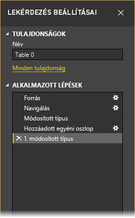

## <a name="adjust-data"></a>Adatok módosítása

Mielőtt használhatnánk a lekérdezést, végre kell hajtanunk néhány változtatást, hogy az adatokat az igényeinkhez igazítsuk:

   - A rangsorolás módosítása egy oszlop eltávolításával.

       Úgy ítéltük, hogy a **Megélhetési költség** nem fontos tényező az eredmények között. Miután eltávolítottuk ezt az oszlopot, azt tapasztaltuk, hogy az adatok nem módosultak. 

   - Néhány hibajavítás.

       Mivel eltávolítottunk egy oszlopot, most módosítanunk kell a számításainkat a **New Rank** oszlopban, ehhez pedig át kell írnunk egy képletet.

   - Az adatok rendezése.

       Rendezze az adatokat a **New Rank** (új rangsor) és a **Rank** (rangsor) oszlop szerint.
 
   - Az adatok cseréje.

       Kiemelt leírást adunk egy adott érték lecseréléséről, és arról hogy szükség van egy **Alkalmazott lépés** beillesztésére is.

   - A tábla átnevezése. 

       Mivel a **Table 0** nem ad hasznos leírást a tábláról, megváltoztatjuk annak nevét.

1. A **Cost of living** (megélhetési költségek) oszlop eltávolításához jelölje ki ezt az oszlopot, válassza a **Kezdőlap** lapfület a menüszalagon, majd válassza az **Oszlopok eltávolítása** lehetőséget.

    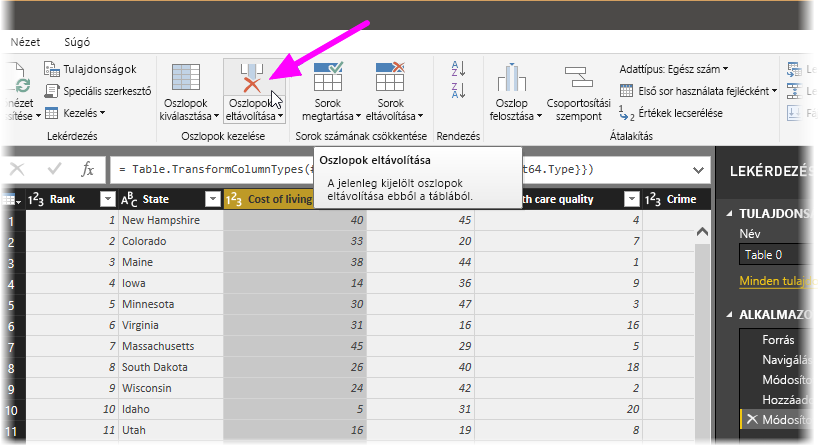

   Figyelje meg, hogy a **New Rank** értékei nem változtak meg. Ez a lépések sorrendje miatt van így. Mivel a Lekérdezésszerkesztő sorrendben, de egymástól függetlenül rögzíti a lépéseket, lehetősége van minden **alkalmazott lépést** feljebb vagy lejjebb mozgatni a sorrendben. 

1. Kattintson a jobb gombbal az egyik lépésre. A Lekérdezésszerkesztő megjelenít egy menüt, amelyben a következő feladatokat végezheti el: 
   - **Átnevezés**: A lépés nevének megváltoztatása.
   - **Törlés**: A lépés törlése.
   - **Összes további** **törlése**: Az aktuális lépés és az összes azt követő lépés törlése.
   - **Mozgatás felfelé**: A lépés feljebb mozgatása a listában.
   - **Mozgatás lefelé**: A lépés lejjebb mozgatása a listában.

1. Mozgassa az **Oszlopok eltávolítva** lépést közvetlenül az **Egyéni beszúrva** lépés fölé.

   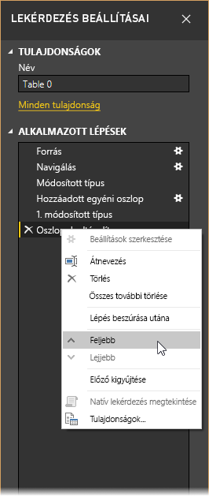

1. Jelölje ki az **Egyéni beszúrva** lépést. 

   Figyelje meg, hogy az adatmezőkben az _Error_ (hiba) szó látható, amire megoldást kell találnunk.

   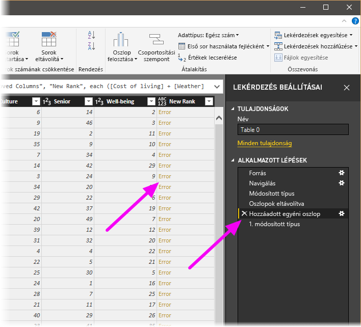

   Íme néhány módszer, amellyel további információt tudhatunk meg az egyes hibákról. Ha úgy jelöli ki a cellát, hogy nem kattint az *Error* szóra, a Lekérdezésszerkesztő az ablak alsó részében megjeleníti a hibával kapcsolatos információkat.

   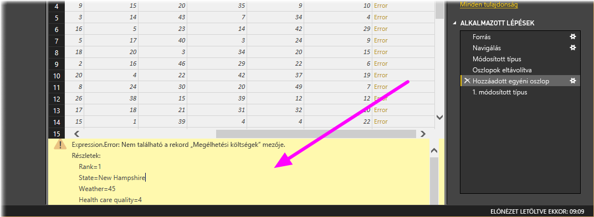

   Ha közvetlenül az *Error* szót választja, a Lekérdezésszerkesztő egy **alkalmazott lépést** hoz létre a **Lekérdezés beállításai** panelen, és megjeleníti a hibával kapcsolatos információkat. 

1. Mivel a hibával kapcsolatos információk megjelenítésére nincs szükség, válassza a **Mégse** lehetőséget.

1. A hibák kijavításához kattintson a **New Rank** oszlopra, majd jelenítse meg az oszlop adatképletét a **Megtekintés** lapon található **Szerkesztőléc** jelölőnégyzet bejelölésével. 

   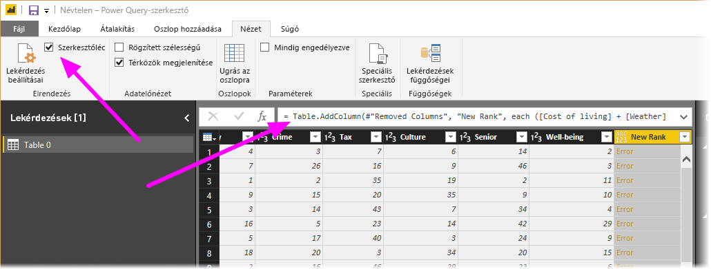

1. Távolítsa el a _Cost of living_ paramétert, és csökkentse az osztót a képlet alábbi módosításával: 
   ```
    Table.AddColumn(#"Removed Columns", "New Rank", each ([Weather] + [Health care quality] + [Crime] + [Tax] + [Culture] + [Senior] + [#"Well-being"]) / 7)
   ```

1. Válassza a szerkesztőléc bal oldalán lévő zöld pipát, vagy nyomja le az **Enter** billentyűt.

  A Lekérdezésszerkesztő az újraszámított értékekkel írja felül az adatokat, és az **Egyéni hozzáadva** lépés hiba nélkül fejeződik be.

   > [!NOTE]
   > A **Hibák eltávolítása** műveletet is kiválaszthatja a menüszalagon vagy a helyi menüben, ami minden hibát tartalmazó sort eltávolít. Ebben az oktatóanyagban azért nem ezt tettük, mert meg akartuk őrizni a táblában lévő adatokat.

1. Rendezze az adatokat a **New Rank** oszlop szerint. Először válassza az utolsóként alkalmazott **Típus módosítva1** lépést a legutóbbi adatok megjelenítéséhez. Ezután válassza ki a **New Rank** oszlop fejléce melletti legördülő listát, és ott kattintson az **Növekvő sorrend** lehetőségre.

   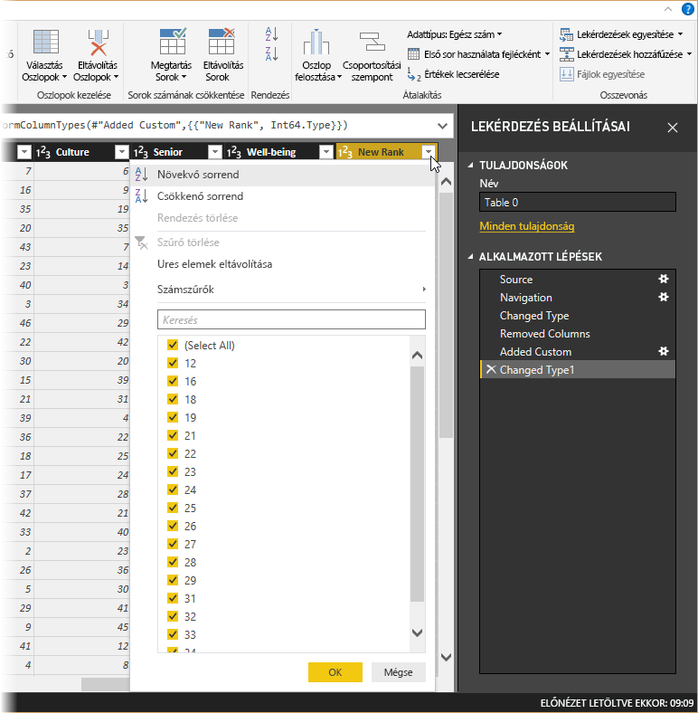

   Az adatok ekkor a **New Rank** értéke szerint vannak rendezve. Ennek ellenére a **Rank** oszlopot megvizsgálva azt fogja látni, hogy ott, ahol a **New Rank** is ugyanazt az értéket tartalmazza, nem megfelelő az elrendezés. Ezt a következő lépésben fogjuk kijavítani.

1. Az adatrendezési probléma javításához kattintson a **New Rank** elemre, és módosítsa a következőképpen a **Szerkesztőlécen** látható képletet:

   ```
    = Table.Sort(#"Changed Type1",{{"New Rank", Order.Ascending},{"Rank", Order.Ascending}})
   ```

1. Válassza a szerkesztőléc bal oldalán lévő zöld pipát, vagy nyomja le az **Enter** billentyűt. 

   A sorok most a **New Rank** és a **Rank** értékek szerint is rendezve vannak. Továbbá kiválaszthat egy **alkalmazott lépést** bárhol a listában, és onnantól folytathatja az adatok formázását. A Lekérdezésszerkesztő automatikusan beszúr egy új lépést közvetlenül a jelenleg kijelölt **Alkalmazott lépés** után. 

1. Az **Alkalmazott lépés** területen válassza az egyéni oszlopot megelőző lépést, amely az **Oszlopok eltávolítva** lépés. Itt a **Weather** (időjárás) értékelés arizonai értékét fogjuk cserélni. Kattintson a jobb gombbal az Arizona **Weather** rangsorolását tartalmazó megfelelő mezőre, majd válassza az **Értékek cseréje** lehetőséget. Figyelje meg, hogy melyik **Alkalmazott lépés** van jelenleg kijelölve.

   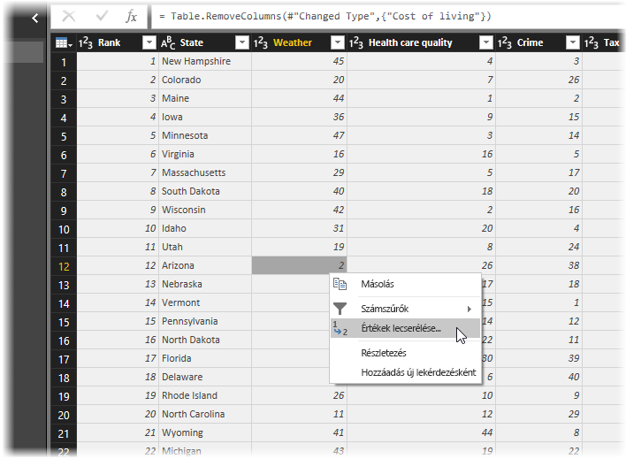

1. Válassza a **Beszúrás** lehetőséget.

    Mivel be szeretnénk szúrni egy lépést, a Lekérdezésszerkesztő figyelmeztet ennek veszélyeire: az ezt követő lépések a lekérdezés meghibásodását okozhatják. 

    

1. Módosítsa _51_-re az adat értékét. 

   A Lekérdezésszerkesztő kicseréli az Arizonához tartozó adatot. Amikor új **Alkalmazott lépést** hoz létre, a Lekérdezésszerkesztő a művelet alapján nevezi el. Ebben az esetben az **Érték felülírva** nevet kapja. Ha több azonos nevű lépés szerepel a lekérdezésben, a Lekérdezésszerkesztő (egymást követő) sorszámozással tesz különbséget az **Alkalmazott lépések** között.

1. Válassza ki az utolsó **Alkalmazott lépést**, a **Sorok rendezve** lépést. 

   Figyelje meg, hogy az adatok Arizona új rangsorolásának megfelelően módosultak. Ez a változás azért történt, mert jó helyre, vagyis az **Egyéni oszlop hozzáadva** lépés elé szúrtuk be a **Érték felülírva** lépést.

1. Utolsó lépésként módosítsuk a táblázat nevét egy leíró névre. A **Lekérdezési beállítások** panel **Tulajdonságok** területén adja meg a tábla új nevét, majd nyomja le az **Enter** billentyűt. A tábla neve legyen *RetirementStats*.

   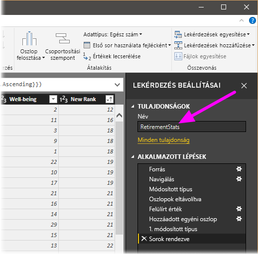

   A jelentéskészítés megkezdésekor hasznos, ha a tábláknak beszédes nevük van, különösen akkor, ha több adatforráshoz csatlakozunk, amelyek a **Jelentés** nézet **Mezők** paneljén vannak felsorolva.

   Most már a kellő mértékben átalakítottuk az adatokat. Csatlakozzunk egy másik adatforráshoz, és vonjuk össze az adatokat.

## <a name="combine-data"></a>Adatok összevonása
Érdekes adataink vannak az egyes államokról, amelyeknek még hasznát fogjuk venni újabb elemzések és lekérdezések készítésekor. Ám van egy probléma: a legtöbb helyen az államok a kétbetűs rövidítésükkel szerepelnek, nem a teljes nevükkel. Módot kell találnunk az államok neveinek és azok rövidítéseinek egymáshoz rendelésére.

Szerencsére létezik egy másik nyilvános adatforrás, amely pontosan erre használható. Azonban jelentős formázást kell rajta végrehajtanunk, hogy csatlakoztathassuk a nyugdíjba vonulással kapcsolatos adatokat tartalmazó táblázatunkhoz. Az adatok formázáshoz végezze el az alábbi lépéseket:

1. A Lekérdezésszerkesztőben a **Kezdőlap** menüszalagon válassza az **Új forrás \> Web** lehetőséget. 

2. Adja meg az államnevek rövidítéseit tartalmazó webhely címét, *https://en.wikipedia.org/wiki/List_of_U.S._state_abbreviations* , majd válassza a **Csatlakozás** lehetőséget.

   A Kezelő megjeleníti a webhely tartalmát.

    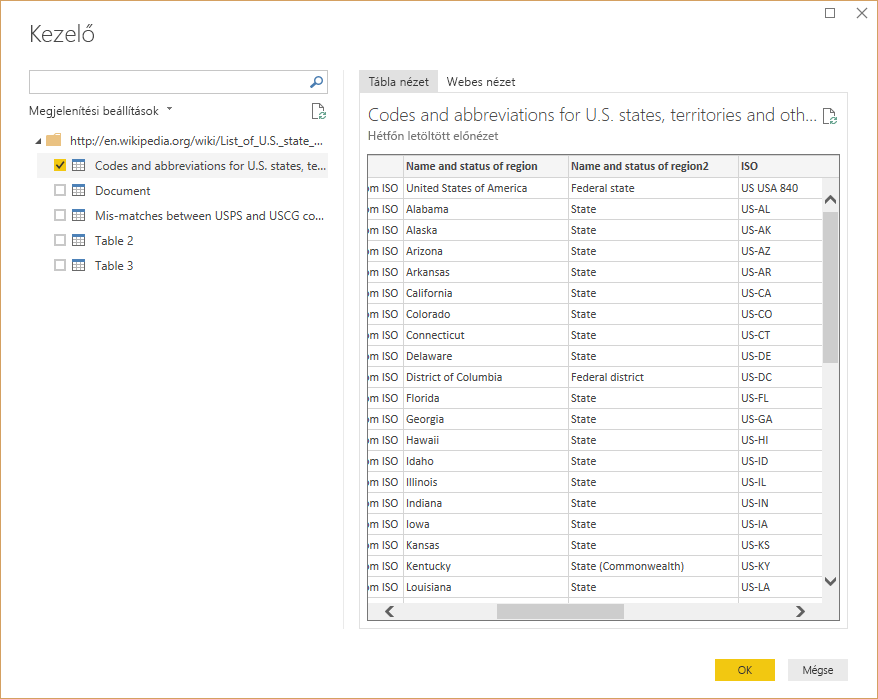

1. Válassza a **Kódok és rövidítések** lehetőséget. 

   > [!TIP]
   > Nem kevés átalakítást igényel, hogy egy ilyen a táblázatot az igényeinknek megfelelően átalakítsunk. Létezik egyszerűbb módja az alábbi lépések végrehajtásának? Igen, létrehozhatunk egy *kapcsolatot* a két táblázat között, és ez alapján is formázhatjuk az adatokat. A következő lépések hasznosak, hiszen a segítségükkel megismerheti a táblázatok kezelését, de a kapcsolatok segítségével gyorsan felhasználhat több táblázatból származó adatokat is.
> 
> 

Az adatok formázásához hajtsa végre a következő lépéseket:

1. Az első sor eltávolítása. Mivel ez a webhelyen létrehozott táblázat maradványa, nincs szükség rá. A **Kezdőlap** menüszalagról válassza a **Sorok számának csökkentése \> Sorok eltávolítása \> Legelső sorok eltávolítása** lehetőséget.

    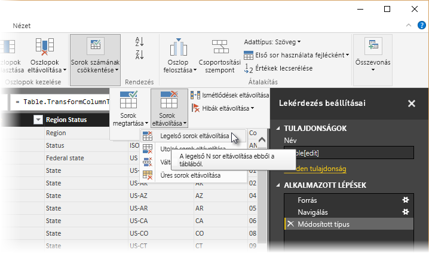

    Ekkor megjelenik a **Legelső sorok eltávolítása** ablak, amelyben megadhatja a törölni kívánt sorok számát.

    > [!NOTE]
    > Ha a Power BI véletlenül sorként importálja a tábla fejléceit az adattáblába, a javításhoz válassza az **Első sor használata fejlécként** lehetőséget a **Kezdőlap** vagy az **Átalakítás** lapról.

1. Az utolsó 26 sor eltávolítása. Ezek a sorok az USA olyan területei, amelyeket nem kell felhasználnunk. A **Kezdőlap** menüszalagról válassza a **Sorok számának csökkentése \> Sorok eltávolítása \> Utolsó sorok eltávolítása** lehetőséget.

    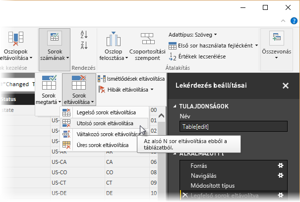

1. Mivel a RetirementStats táblázat nem tartalmaz adatokat Washington államról, ezt az államot ki kell szűrnünk a listánkból. Válassza a **Region Status** legördülő listát, majd törölje a jelölést a **Federal district** melletti jelölőnégyzetből.

    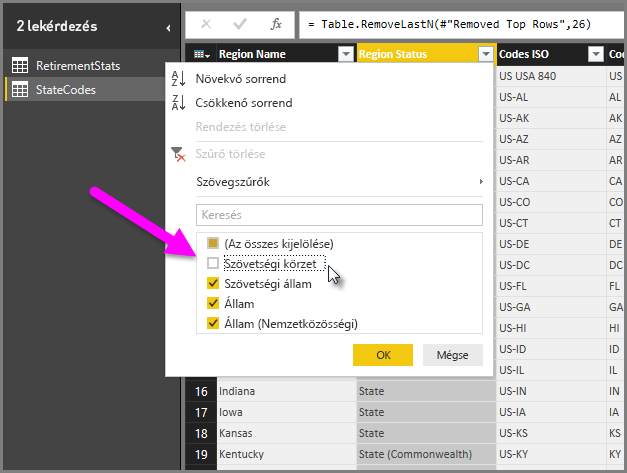

1. Néhány szükségtelen oszlop eltávolítása. Mivel csak a hivatalos kétbetűs rövidítésükre kell leképeznünk az államneveket, a következő oszlopokat törölhetjük: **Column1**, **Column3**, **Column4**, valamint **Column6**-tól **Column11**-ig. Először jelölje ki a **Column1** oszlopot, majd a **CTRL** billentyű lenyomva tartása mellett jelölje ki a többi eltávolítandó oszlopot. A menüszalag **Kezdőlap** területéről válassza az **Oszlopok eltávolítása \> Oszlopok eltávolítása** lehetőséget.

   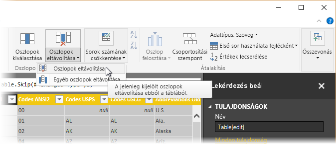

   > [!NOTE]
   > Itt érdemes megemlíteni, hogy a Lekérdezésszerkesztőben az alkalmazott lépések *sorrendje* fontos, mert meghatározhatja, hogyan lesznek formázva az adatok. Érdemes azt is megfontolni, hogy egy adott lépés hogyan befolyásolhatja a soron következő lépéseket. Ha az Alkalmazott lépések közül eltávolít egy lépést, lehetséges, hogy a lekérdezés lépéseinek sorrendjéből adódóan a következő lépések nem úgy fognak működni, ahogyan eredetileg tervezte.

   > [!NOTE]
   > Ha átméretezi a Lekérdezésszerkesztő ablakát, például csökkenti a szélességét, a menüszalag egyes elemei összecsukódnak a látható terület legjobb kihasználása érdekében. Ha növeli a Lekérdezésszerkesztő ablakának szélességét, a menüszalag elemei kibomlanak, hogy a lehető legjobban kihasználják a nagyobb menüszalag területét.

1. Az oszlopok és a tábla átnevezése. Egy oszlop többféleképpen is átnevezhető: Először jelölje ki az oszlopot, majd válassza az **Átnevezés** lehetőséget a menüszalag **Átalakítás** füléről, vagy kattintson a jobb gombbal és válassza az **Átnevezés** menüpontot. Az alábbi képen mindkét lehetőséget nyíl mutatja. Ezek közül elég az egyiket kiválasztania.

   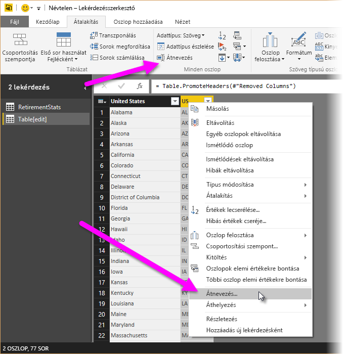

1. Adja az oszlopoknak a *State name* és *State Code* nevet. A tábla átnevezéséhez írja be a **Név** értékét a **Lekérdezés beállításai** panelen. A táblának adja a *StateCodes* nevet.

## <a name="combine-queries"></a>Lekérdezések egyesítése

Miután a kívánt módon átalakítottuk a StateCodes táblát, már egyesíthetjük ezt a két táblát vagy lekérdezést. Mivel a tábláink az adatokon alkalmazott lekérdezések eredményezi, gyakran ezeket is *lekérdezéseknek* nevezzük.

A lekérdezések összevonásának két fő módja van: *egyesítés* és *hozzáfűzés*.

- Ha hozzá szeretne adni egy vagy több oszlopot egy másik lekérdezéshez, *egyesítse* a lekérdezéseket. 
- Ha további sorokat szeretne hozzáadni egy meglévő lekérdezéshez, *fűzze őket hozzá* a lekérdezéshez.

Ebben az esetben érdemes egyesíteni a lekérdezéseket. Ehhez kövesse az alábbi lépéseket:
 
1. A Lekérdezésszerkesztő bal oldali paneljén jelölje ki azt a lekérdezést, *amelybe* egyesíteni szeretné a másikat. Ez ebben az esetben a **RetirementStats**. 

1. Válassza az **Összevonás \> Lekérdezések egyesítése** lehetőséget a menüszalag **Kezdőlap** fülén.

   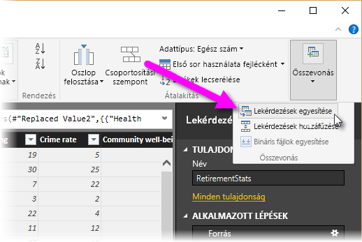

   A rendszer felkérheti az adatvédelmi szintek beállítására. Ezzel elkerülheti, hogy nem kívánt adatokat jelöljön ki vagy helyezzen át az adatok összevonásakor.

   Megjelenik az **Egyesítés** ablak. A rendszer megkérdezi, hogy melyik táblát egyesítse a már kiválasztott táblába, és az egyesítéshez használni kívánt oszlopokat. 

1. Jelölje ki a RetirementStats tábla **State** oszlopát, majd a **StateCodes** lekérdezést. 

   Ha a megfeleltetéshez használható oszlopokat választ, engedélyezve lesz az **OK** gomb.

   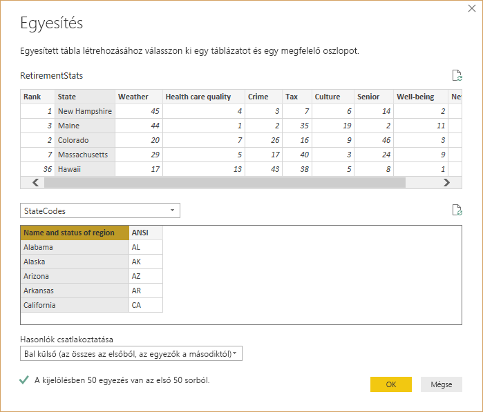

1. Kattintson az **OK** gombra.

   A Lekérdezésszerkesztő a lekérdezés végén létrehoz egy **NewColumn** nevű oszlopot, amely a meglévő lekérdezéssel egyesített tábla (lekérdezés) adatait tartalmazza. Az egyesített lekérdezés összes oszlopa a **NewColumn** oszlopba lesz sűrítve, de a **Kibonthatja** a táblázatot, és tetszőleges oszlopokat adhat hozzá.

   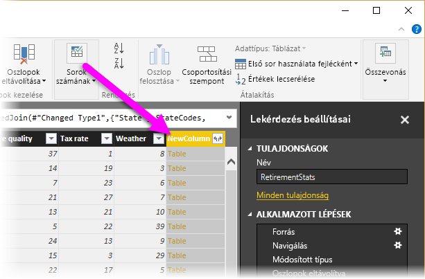

1. Az egyesített tábla kibontásához és a kívánt oszlopok kiválasztásához válassza a kibontás ikont (). 

   Ekkor megjelenik a **Kibontás** ablak.

   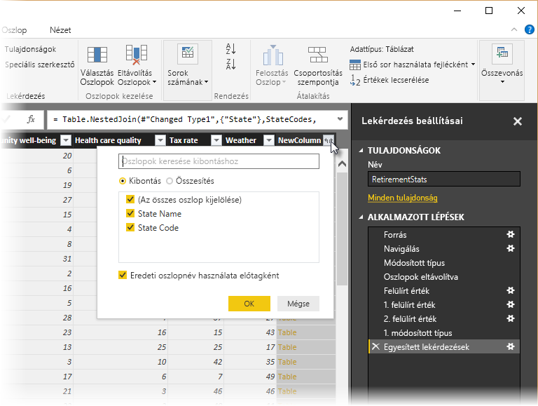

1. Ebben az esetben csak a **State Code** oszlopra van szükség. Jelölje ki ezt az oszlopot, törölje az **Eredeti oszlopnév használata előtagként** jelölését, majd válassza az **OK** gombot.

   Ha bejelölve hagytuk volna az **Eredeti oszlopnév használata előtagként** jelölőnégyzetet, az egyesített oszlop neve **NewColumn.State Code** lenne.

   > [!NOTE]
   > Szeretné kipróbálni, hogyan hozhatja be a NewColumn táblát? Nyugodtan kísérletezhet, és ha nem a kívánt eredményt kapja, egyszerűen törölje az adott lépést a **Lekérdezés beállításai** panel **Alkalmazott lépések** listájából. Ekkor a lekérdezés visszatér a **Kibontás** lépés alkalmazása előtti állapotra. Tetszőleges számú alkalommal próbálkozhat, amíg a kibontási folyamattal a kívánt eredményt nem éri el.

   Most egyetlen lekérdezésünk (táblánk) van, amelyben két, igényeink szerint formázott adatforrás van összevonva. Ez a lekérdezés alapul szolgálhat számos más érdekes adatkapcsolathoz, például az államokra lebontott lakhatási költségek statisztikái, demográfiai adatok vagy munkalehetőségek megjelenítéséhez.

1. A módosítások mentéséhez és a Lekérdezésszerkesztő bezárásához válassza a **Bezárás és alkalmazás** elemet a menüszalag **Kezdőlap** fülén. 

   Az átalakított adatkészlet ezután megjelenik a Power BI Desktopban, és elérhető jelentések készítéséhez.

   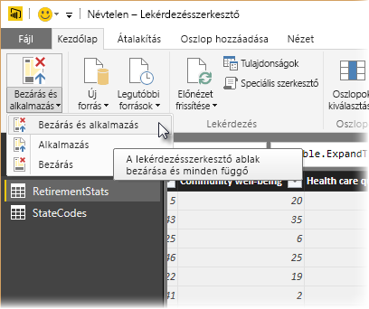

## <a name="next-steps"></a>Következő lépések
A Power BI Desktopról és annak képességeiről az alábbi forrásanyagokban talál további információt:

* [Mi az a Power BI Desktop?](desktop-what-is-desktop.md)
* [Lekérdezések áttekintése a Power BI Desktopban](desktop-query-overview.md)
* [Adatforrások a Power BI Desktopban](desktop-data-sources.md)
* [Csatlakozás adatokhoz a Power BI Desktopban](desktop-connect-to-data.md)
* [Gyakori lekérdezési feladatok a Power BI Desktopban](desktop-common-query-tasks.md)   

