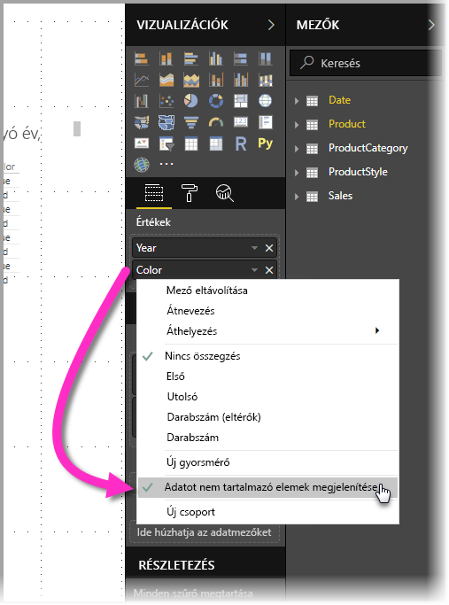
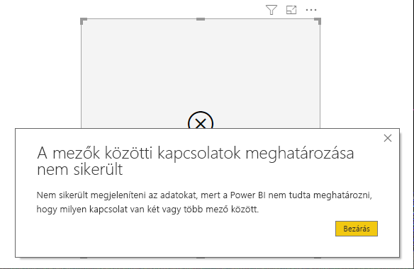

# Adatot nem tartalmazó elemek megjelenítése a Power BI-ban

A Power BI segítségével különféle forrásokból származó sokféle adatból hozhat létre vizualizációt. Vizualizáció létrehozásakor a Power BI csak a releváns adatokat jeleníti meg, hogy megfelelően kezelhesse az adatok bemutatásának és megjelenítésének módját. A Power BI az adatok relevanciáját a vizualizáció beállítása és az alapul szolgáló adatmodell alapján határozza meg. Ez a cikk azt ismerteti, hogyan viselkedik a Power BI a releváns adatok meghatározásakor a meghatározás módját bemutató példákkal.

## A releváns adatokat meghatározása

Első lépésként annak megértéséhez, hogyan határozza meg a Power BI, milyen adatok megjelenítése a releváns, vegyünk egy egyszerű példát, egy asztalt. Fontolja meg, hogy a cikk végén található minták szakaszban jelölt modell használatával létrehoz egy táblát a következő beállításokkal:

**1. Csoportok ugyanabból a táblából:** *Termék[Szín] - Termék[méret]*

|*Termék[Szín]*  |*Termék[Méret]*  |
|---------|---------|
|Kék     |Nagy         |
|Kék     |Közepes         |
|Kék     |Kicsi         |
|Vörös     |Nagy         |

Ebben a példában a Power BI azt a *[Szín-Méret]* kombinációt jeleníti meg, amely a *[Termék]* táblában van. 

Most nézzünk meg egy másik kombinációt:

**2. Csoportok különböző, de közvetlenül kapcsolódó táblákból és egy mérték:** *Termékstílus[Felület] - Termék[Szín] - Sum(Értékesítések[Mennyiség])*

|*Termékstílus[Felület]*  |*Termék[Szín]*  |*[SumMennyiség]*  |
|---------|---------|---------|
|Fényes     |Kék         |10         |
|Matt     |Kék         |15         |

Ebben a példában a Power BI-ban csak a létező kombinációk jelennek meg. Nem jelennek meg például a („Nincs” + „Kék”) vagy a („Matt” + „Vörös”) kombinációk, mert ezek a kombinációk nincsenek benne a modellben. A feltétel, amely meghatározza, hogy mely kombinációk léteznek az, hogy a *Sum(Értékesítések[Mennyiség])* értéke nem lehet üres.

Most nézzünk meg egy másik példát: 

**3. Csoportok különböző, de kapcsolódó táblákból, és nincs mérték:** *Termékstílus[Felület] - Termék[Szín]*

|*Termékstílus[Felület]*  |*Termék[Szín]*  |
|---------|---------|
|Fényes     |Kék         |
|Fényes     |Vörös         |
|Matt     |Kék         |

Mivel nincs explicit mérték, és a két tábla közvetlenül kapcsolódó, a Power BI megpróbál beszúrni egy mértéket az eredményül kapott kombinációk korlátozásához. Ebben az esetben a Power BI egy *CALCULATE(COUNTROWS('Termék'))* mértéket szúr be, amely nem lehet üres, mert a *Termék* az a tábla, amely mindkét tábla esetén közös.

Mint ilyen, a Power BI megjeleníti azokat a kombinációkat, amelyek rendelkeznek bejegyzések a Termék táblában, ami kizárja a *(„Nincs” + „Kék”)* és a *(„Matt” + „Vörös”)* kombinációt.

**4. Csoportok különböző és nem kapcsolódó táblákból**

A mintamodell nem rendelkezik ezzel a kombinációval, de ha vannak csoportok különböző és nem kapcsolódó táblákból, a Power BI nem fog tudni kapcsolatot megállapítani két oszlop között. Az eredmény az összes oszlop minden értékének cross join művelettel kapott eredménye lesz. Ebben az esetben a Power BI *korlátozás nélküli összekapcsolás* típusú hibát jelez, mivel az ilyen cross join műveletek sok számítást igényelnek az adatbázisban, és nem szolgálnak sok információval a felhasználó számára. 

## Adatot nem tartalmazó elemek megjelenítése

Az előz szakasz azt írta le, hogyan határozza meg a Power BI, hogy mely adatok megjelenítése releváns. De néha előfordulhat, hogy *szeretne* adatot nem tartalmazó elemeket megjeleníteni. 

Az **Adatot nem tartalmazó elemek megjelenítése** funkció pontosan ezt teszi lehetővé – olyan adatsorok és oszlopok belefoglalását, amelyek nem tartalmaznak mértékadatokat (üres mértékadatok).

Az **Adatot nem tartalmazó elemek megjelenítése** funkció engedélyezéséhez válasszon ki egy vizualizációt, majd a **Mezők** forrásban kattintson a jobb gombbal a mezőre, és a megjelenő menüben válassza az **Adatot nem tartalmazó elemek megjelenítése** lehetőséget az alábbi képen látható módon:

Az **Adatot nem tartalmazó elemek megjelenítése** funkciónak *nincs* hatása a következő esetekben:

* Nincs mérték hozzáadva a vizualizációhoz, és a csoportosítási oszlopok ugyanabból a táblából származnak
* A csoportok nem kapcsolódónak; a Power BI nem futtat lekérdezéseket nem kapcsolódó csoportokkal rendelkező vizualizációkhoz
* A mérték nem kapcsolódik egyik csoporthoz sem; ez azért van, mert a mérték sohasem lesz üres csak néhány csoportkombinációhoz
* Van olyan felhasználó által meghatározott mértékszűrő, amely kizárja az üres mértékeket, például: *ÉrtékesítésekÖsszeg > 0*

### Az Adatot nem tartalmazó elemek megjelenítése funkció működése

Az **Adatot nem tartalmazó elemek megjelenítése** funkció legérdekesebb használati esetei, azok amikor vannak mértékek. Tekintsük át azt az esetet, amikor a csoportok ugyanabból a táblából származnak, vagy egy elérési úton keresztül kapcsolhatók a modellben. A *Termékstílus* például közvetlenül kapcsolódik a *Termék* és közvetetten az *Értékesítések*, *Termékstílus* elemekhez, és a *Termékkategória* kapcsolódhat a *Termék* táblán keresztül, és így tovább.

Nézzünk meg néhány érdekes eseteket, és hasonlítsuk össze, a mikor az **Adatot nem tartalmazó elemek megjelenítése** ki van kapcsolva, majd amikor be van kapcsolva. 

**1. Egyazon tábla oszlopainak csoportosítása:** *Termék[Szín] - Termék[Méret] - Sum(Értékesítések[Mennyiség])*

Ha az **Adatot nem tartalmazó elemek megjelenítése** funkció ki van kapcsolva, így jelenik meg:

|*Termék[Szín]*  |*Termék[Méret]*  |*[SumMennyiség]*  |
|---------|---------|---------|
|Kék     |Közepes         |15         |
|Kék     |Kicsi         |10         |

Ha az **Adatot nem tartalmazó elemek megjelenítése** funkció be van kapcsolva, így jelenik meg:

|*Termék[Szín]*  |*Termék[Méret]*  |*[SumMennyiség]*  |
|---------|---------|---------|
|Kék     |Nagy         |         |
|Kék     |Közepes         |15         |
|Kék     |Kicsi         |10         |
|Vörös     |Nagy         |         |

Figyelje meg, hogyan jelent meg két új kombináció, amikor be volt kapcsolva a funkció: *Kék - Nagy* és *Vörös - Nagy*. Ezek a tételeket nem rendelkeznek megfelelő *Mennyiség* elemmel az *Értékesítések* táblában. Azonban ezek megjelennek a *Termék* táblában.

**2. Kapcsolódó táblák oszlopainak csoportosítása:** *Termékstílus[Felület] - Termék[Szín] - Sum(Értékesítések[Mennyiség])*

Ha az **Adatot nem tartalmazó elemek megjelenítése** funkció ki van kapcsolva, így jelenik meg:

|*Termékstílus[Felület]*  |*Termék[Szín]*  |*[SumMennyiség]*  |
|---------|---------|---------|
|Fényes     |Kék         |10         |
|Matt     |Kék         |15         |

Ha az **Adatot nem tartalmazó elemek megjelenítése** funkció be van kapcsolva, így jelenik meg:

|*Termékstílus[Felület]*  |*Termék[Szín]*  |*[SumMennyiség]*  |
|---------|---------|---------|
|Fényes     |Kék         |10         |
|Fényes     |Vörös         |         |
|Matt     |Kék         |15         |
|Nincs     |         |         |

Figyelje meg hogyan jelent meg a *(Fényes-Vörös)* és a *(Nincs-Üres)* kombinációkként. Íme az ok, amiért megjelentek:
* A Power BI először a Termékstílus[Felület] bejegyzést fontolta meg, és kiválasztotta az összes megjelenítendő értéket – ennek az eredménye a Fényes, a Matt és a Nincs.
* Ezeknek az értékeknek a felhasználásával a Power BI kiválasztotta az összes megfelelő *Termék[Szín]* bejegyzést 
* Mivel a *Nincs* nem felel meg egyetlen *Termék[Szín]* bejegyzésnek sem, ehhez az értékhez az üres jelenik meg.

Fontos tudni, hogy az oszlopok értékeinek kiválasztási módszere sorrendfüggő, és felfogható a táblák közötti *bal oldali külső illesztési* műveletként. Ha az oszlopok sorrendje megváltozik, az eredmények is megváltoznak.

Vessünk egy pillantást egy olyan példára, amelyben megváltozik a sorrend, és hogy ez hogyan befolyásolja az eredményeket. Ez azonos ennek a szakasznak a **2.** elemével, de megváltozott sorrenddel.

**Termék[Szín] - Termékstílus[Felület] - Sum(Értékesítések[Mennyiség])**

Ha az **Adatot nem tartalmazó elemek megjelenítése** funkció be van kapcsolva, így jelenik meg:

|*Termék[Szín]* |*Termékstílus[Felület]*  |*[SumMennyiség]*  |
|---------|---------|---------|
|Kék     |Fényes         |10         |
|Kék     |Matt         |15         |
|Vörös     |Fényes         |         |

Ebben az esetben figyelje meg, hogy a *Termékstílus[Felület]=Nincs* nem jelenik meg a táblában. Ez azért van így, mert a Power BI először az összes *Szín* értéket választotta ki a *Termék* táblában. Ekkor az egyes színekhez a Power BI kiválasztotta a megfelelő *Felület* értékeket, amelyek tartalmaztak adatokat. Mivel a *Nincs* egyetlen *Szín* kombinációjában sem jelenik meg, ez nem lett kiválasztva.

## Példa adatmodell

Ez a szakasz a cikk példáiban használt minta adatmodellt mutatja be.

**Modell**: 

**Adatok**:

|Termék[Termékazonosító]|    Termék[Terméknév]|   Termék[Szín]| Termék[Méret]|  Termék[Kategóriakód]|    Termék[Stílusazonosító]|
|---------|---------|---------|---------|---------|---------|
|1  |Termék1  |Kék   |Kicsi  |1  |1 |
|2  |Termék2  |Kék   |Közepes |2  |2 |
|3  |Termék3  |Vörös    |Nagy  |1  |1 |
|4  |Termék4  |Kék   |Nagy  |2  |2 |

|Termékkategória[Kategóriakód]|   Termékkategória[Kategórianév]|
|---------|---------|
|1  |Telefon   |
|2  |Kamera |
|3  |TV |

|Termékstílus[Stílusazonosító]| Termékstílus[Felület]|   Termékstílus[Fényezett]|
|---------|---------|---------|
|1  |Fényes  |Igen |
|2  |Matt  |Nem |
|3  |Nincs   |Nem |

|Értékesítések[ÉrtékesítésiAzonosító]| Értékesítések[Termékkód]|   Értékesítések[Dátum]|    Értékesítések[Mennyiség]|
|---------|---------|---------|---------|
|1  |1  |2012. 01. 01. 0:00| 10 |
|2  |2  |2013. 01. 01. 0:00| 15 |

## Következő lépések

Ez a cikk azt ismerteti, hogyan engedélyezheti az **Adatot nem tartalmazó elemek megjelenítése** funkciót a Power BI-ban. Az alábbi cikkeket is érdekesnek találhatja: 

* [Alapértelmezett tag többdimenziós modellekben a Power BI-ban](desktop-default-member-multidimensional-models.md)
