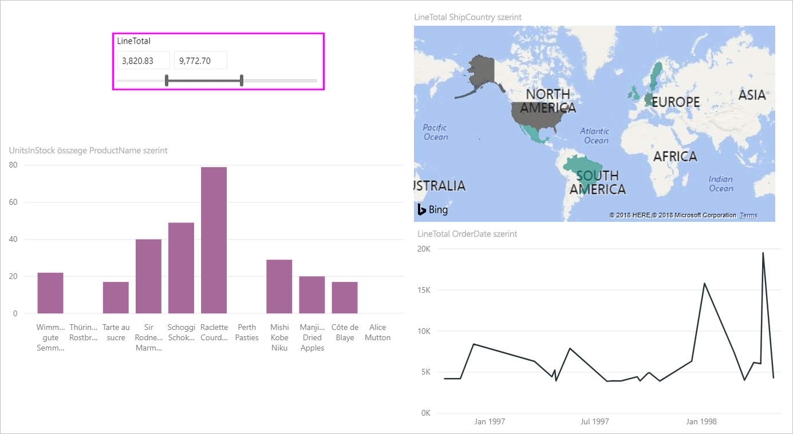
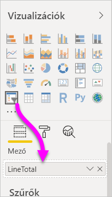
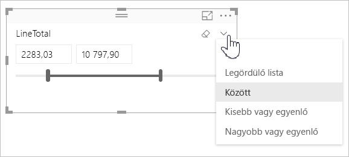
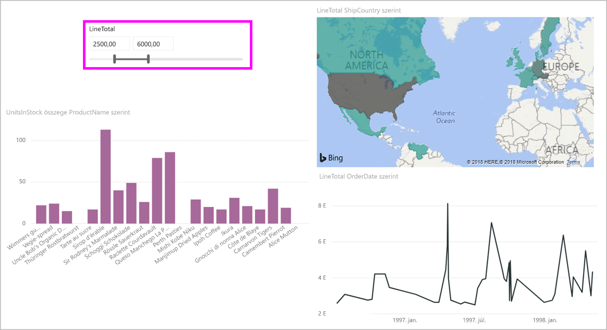
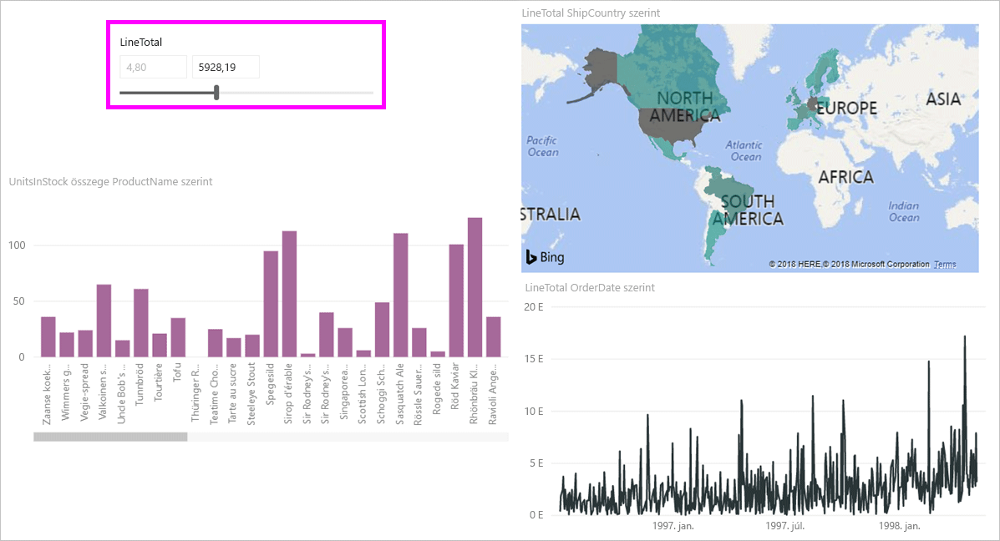
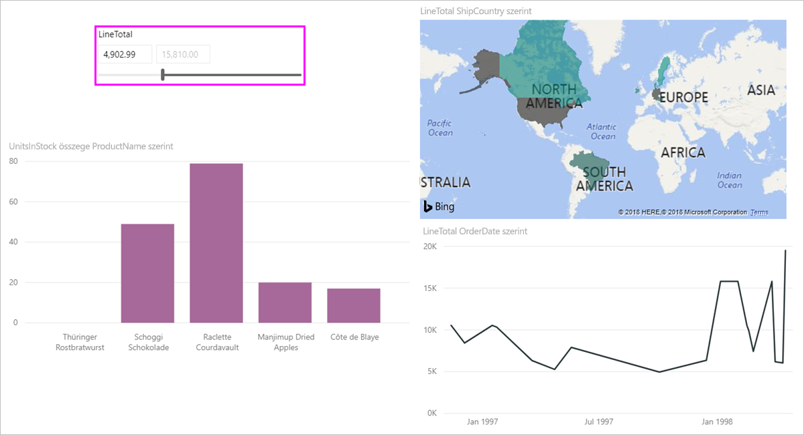

# A numerikustartomány-szeletelő használata a Power BI Desktopban
A numerikustartomány-szeletelővel számos különféle szűrőt alkalmazhat az adatmodellek bármely numerikus oszlopára. Numerikus adatok háromféleképpen szűrhetők: két szám közötti, egy számnál kisebb vagy egyenlő vagy egy számnál nagyobb vagy egyenlő értékekre szűrhet. Egyszerűnek tűnhet, mégis hatékony módja az adatok szűrésének.

## Numerikustartomány-szeletelő használata
A numerikustartomány-szeletelőt bármely más szeletelőhöz hasonlóan használhatja. Csak hozzon létre egy **szeletelő** vizualizációt a jelentéshez, majd válasszon ki egy numerikus értéket a **Mező** értékeként. A következő képen a **LineTotal** (Sor összege) mezőt jelöltük ki.

Kattintson a lefelé mutató nyilat ábrázoló hivatkozásra a **numerikustartomány-szeletelő** jobb felső sarkában, és megjelenik egy menü.

Numerikus tartományok esetében a következő három lehetőség közül választhat:

* **Között**
* **Kisebb vagy egyenlő**
* **Nagyobb vagy egyenlő**

Ha a menüből a **Között** lehetőséget választja, megjelenik egy csúszka. A csúszka használatával jelölheti ki a két szám közé eső értékeket. A csúszka finom beosztása miatt olykor nem könnyű a kívánt számokat beállítani. A csúszka használatakor a két mezőbe is begépelheti a kívánt értékeket. Ez a lehetőség akkor hasznos, ha meghatározott számok alapján szeretne szeletelni. 

A következő képen a jelentésoldal a 2500,00 és 6000,00 közötti tartományban lévő **LineTotal** értékekre szűr.

Amikor a **Kisebb vagy egyenlő** lehetőséget választja, eltűnik a csúszkasáv bal oldali (legalacsonyabb értékhez tartozó) fogója, és csak a csúszka felső korlátját módosíthatja. A következő képen az 5928,19 maximális értékre állítjuk a csúszkasávot.

Végül, ha a **Nagyobb vagy egyenlő** lehetőséget választja, a csúszkasáv jobb oldali (legmagasabb értékhez tartozó) fogója tűnik el. Ilyenkor az alsó értéket állíthatja be a következő képen látható módon. Most csak a 4902,99-nél nagyobb vagy azzal egyenlő **LineTotal** értékek jelennek meg a jelentésoldal vizualizációiban.

## Egész számhoz illeszkedés a numerikustartomány-szeletelőnél

A numerikustartomány-szeletelő egész számokhoz illeszkedik, ha a mögöttes mező adattípusa **Egész szám**. Ez a funkció teszi lehetővé, hogy a szeletelőt pontosan egy egész számra tudja beállítani. A **Tizedes tört** típusú mezőkbe törtszámokat írhat be. A szövegmezőben beállított formázás megegyezik a mező formázásával, bár beírhat vagy kijelölhet pontosabb számokat.

## Formázás megjelenítése a dátumtartomány-szeletelővel

Amikor szeletelő használatával jelenít meg vagy állít be dátumtartományokat, a dátumok a **rövid dátumformátumban** jelennek meg. A dátumformátumot a felhasználó böngészőjének vagy operációs rendszerének területi beállításai határozzák meg. Emiatt a megjelenítési formátum mindig ez lesz, a mögöttes adatok vagy modellek adattípus-beállításaitól függetlenül. 

Lehetséges például, hogy a mögöttes adattípus hosszú dátumformátumú. Ilyen esetben például az *éééé. hhhh nn., nnnn* dátumformátum más vizualizációkban vagy más körülmények között a *2001. március 14., szerda* megjelenítési formát eredményezné. A dátumtartomány-szeletelőben viszont a *2001. 03. 14.* formában jelenik meg ez a dátum.

A szeletelőben a **Rövid dátum** formátum használata biztosítja, hogy a sztring hossza ne változzon, és elférjen a szeletelőben. 

## Korlátozások és szempontok
A **numerikustartomány-szeletelőre** a következő korlátozások és szempontok érvényesek :

* A **numerikustartomány-szeletelő** az adatokban lévő összes alapul szolgáló sorra szűr, nem az összesített értékekre. Tegyük fel például, hogy egy *Értékesített mennyiség* mezőt használ. A szeletelő ekkor minden tranzakciót az értékesített mennyiség, és nem a vizualizáció adatpontjaira összegzett mennyiségek alapján fog szűrni.
* Ez mértékekkel jelenleg nem működik.
* A numerikus szeletelők szövegmezőibe bármilyen számot beírhat, akkor is, ha az kívül esik mögöttes oszlop értéktartományán. Ezzel a lehetőséggel szűrőket állíthat be, ha tudja, hogy az adatok változni fognak.
