# Oszlop szerinti rendezés a Power BI Desktopban
A Power BI Desktopban és a Power BI szolgáltatásban módosíthatja egy vizualizáció kinézetét, ha különböző adatmezők szerint rendezi. A vizualizáció rendezésének módosításával kiemelheti a közvetíteni kívánt információt, és biztosíthatja, hogy a vizualizáció tükrözze ezt a trendet (vagy hangsúlyt).

Akár numerikus adatokat használ (például értékesítési adatokat), akár szöveges adatokat (például államneveket), rendezheti a vizualizációkat és az adatok megjelenését. A Power BI nagyon rugalmas rendezhetőséget és egyszerűen használható menüket biztosít. Egy vizualizáció rendezéséhez válassza annak **További műveletek** (...) menüjét, a **Rendezési szempont** lehetőséget, majd jelölje ki a mezőt, amely alapján rendezni szeretne.

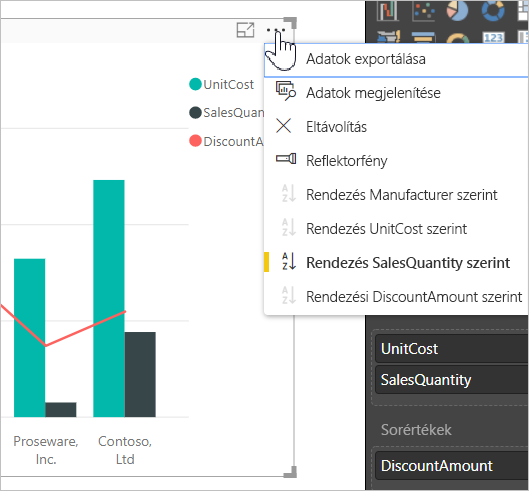

## Példa rendezésre
Vizsgáljuk meg egy komolyabb példa használatával, hogyan működik a Power BI Desktopban.

Az alábbi vizualizáció költségeket, mennyiségeket és összegeket mutat be a gyártók neve szerint. A vizualizáció további rendezés nélkül az itt látható módon jelenik meg:

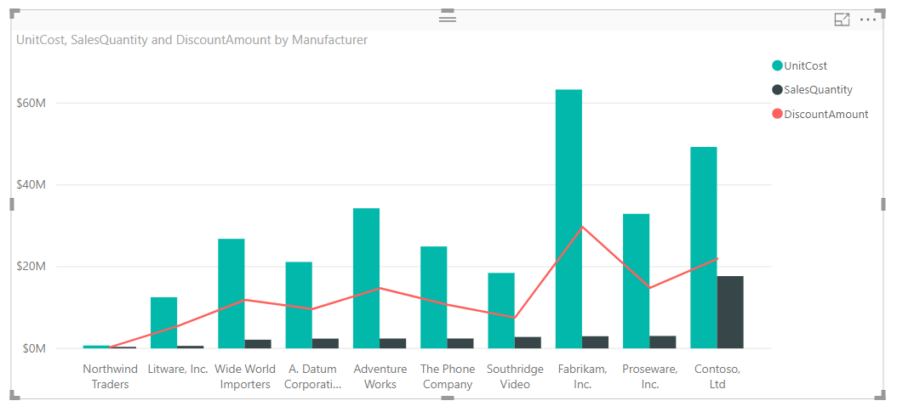

A vizualizáció jelenleg a **SalesQuantity** oszlop szerint van rendezve. A rendezési oszlop felismerhető, ha egyezteti a növekvő sávok színét a jelmagyarázattal, de jobb mód is van az aktuális rendezési oszlop meghatározására: a vizualizáció jobb felső sarkában lévő, a három ponttal (...) elérhető **További lehetőségek** menü.

A rendezési kijelölések a következők:

* Az aktuális rendező mező a **SalesQuantity**, amit a **SalesQuantity** félkövér kiemelése és a sárga sáv jelez. 

* Az aktuális rendezési irány növekvő, amit a **Növekvő sorrend** félkövér kiemelése és a sárga sáv jelez.

A rendezési mezőt és irányt a következő két szakasz tárgyalja.

## A rendezéshez használt oszlop kiválasztása
Megfigyelhette a **További beállítások** menüben a **SalesQuantity** előtti sárga sávot, amely azt jelzi, hogy a vizualizáció a **SalesQuantity** oszlop szerint van rendezve. Másik oszlop szerint is egyszerűen rendezhet: a három pont (...) választásával nyissa meg a **További lehetőségek** menüt, válassza a **Rendezési szempont** elemet, majd válasszon másik oszlopot.

Az alábbi ábrán a **DiscountAmount** oszlop van kiválasztva, hogy a rendszer aszerint rendezze az adatokat. Ez az oszlop az egyik vonalként jelenik meg a vizualizáción, nem pedig sávként. 

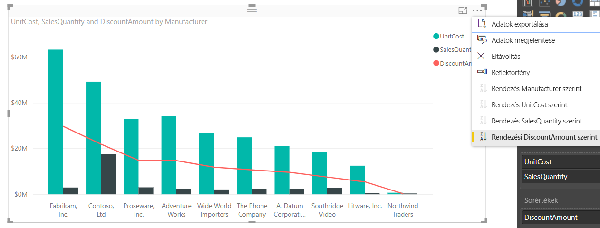

Vegye észre, hogy megváltozott a vizualizáció. Az értékek most a legmagasabb **DiscountAmount**-értéktől (Fabrikam Inc.) a Northwind Tradershez tartozó legalacsonyabb értékig vannak rendezve. 

De mi történik, ha növekvő sorba szeretnénk rendezni az adatokat csökkenő helyett? A következő szakaszban bemutatjuk, milyen egyszerű ez.

## Rendezési sorrend kiválasztása
Az előző ábrán látható **További lehetőségek** menün látható, hogy a **Csökkenő rendezés** félkövéren van kiemelve, és sárga sáv előzi meg.

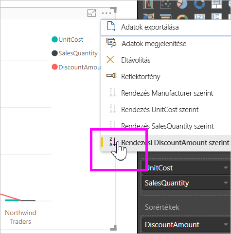

Ha **Csökkenő rendezés** van kiválasztva, az azt jelenti, hogy a vizualizációt a rendszer a kiválasztott oszlop szerint, a legnagyobb értéktől a legkisebbig rendezi. Szeretné ezt módosítani? Nem gond, csak válassza a **Növekvő rendezést**, és a kiválasztott oszlop rendezési sorrendje megfordul a legkisebbtől a legnagyobb érték fel.

Itt ugyanez a vizualizáció látható, miután megváltoztattuk a **DiscountAmount** szerinti rendezést. Figyelje meg, hogy most a Northwind Traders az elsőként feltüntetett gyártó, a Fabrikam Inc. pedig az utolsó. A sorrend éppen ellentétes az előbbivel.

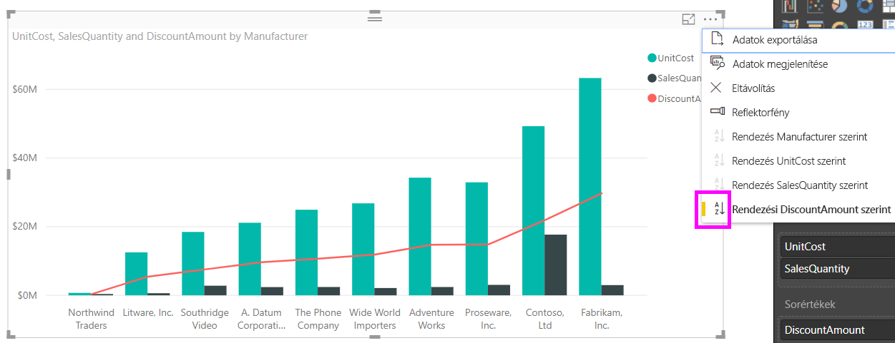

A rendezés a vizualizáció bármelyik oszlopa alapján elvégezhető. A **SalesQuantity** oszlopot ugyanúgy kiválaszthattuk volna rendezési szempontként, hogy elsőnek a legnagyobb mennyiség látsszon, és a vizualizáció többi oszlopa is megmaradjon, amely az adott gyártóról tartalmaz adatot. Itt láthatjuk a vizualizációt ezekkel a beállításokkal:

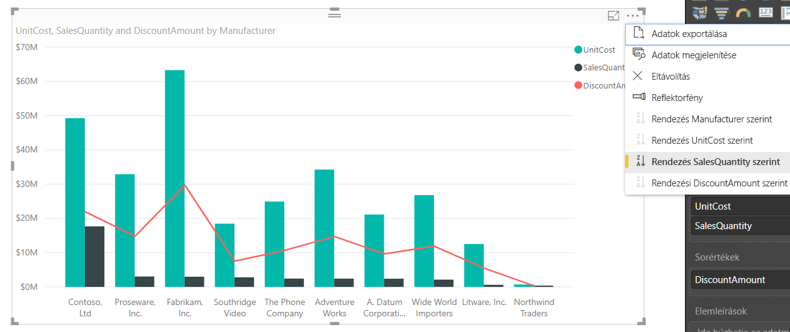

## Rendezés a Rendezés oszlop szerint gombbal
Van más mód is az adatok rendezésére: használhatjuk a **Rendezés oszlop szerint** gombot a **Modellezés** menüszalagon.

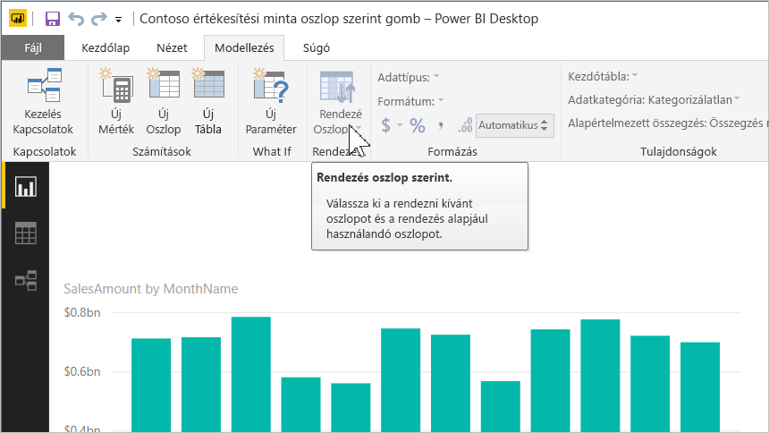

Ehhez a rendezési módszerhez az szükséges, hogy először válassza ki a rendezési oszlopot (mezőt) a **Mezők** panelen, majd a **Modellezés** > **Rendezés oszlop szerint** lehetőséggel rendezze a vizualizációt. Ha nem jelöl ki oszlopot, a **Rendezés oszlop szerint** gomb inaktív.

Lássunk egy tipikus példát. Az év minden hónapjához van adata, és ezeket az adatokat időrendbe szeretné rendezni. Az alábbi lépések bemutatják, hogyan oldhatja ezt meg:

1. Figyelje meg, hogy ha kijelöli a vizualizációt, de nem választ ki oszlopot a **Mezők** panelen, a **Rendezés oszlop szerint** gomb inaktív (szürkén jelenik meg).
   
   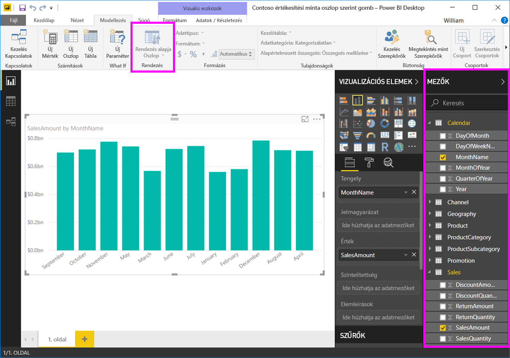

2. Ha kiválasztjuk az oszlopot, amely szerint rendezni szeretnénk az adatokat, a **Mezők** panelen aktívvá válik a **Rendezés oszlop szerint** gomb.
   
   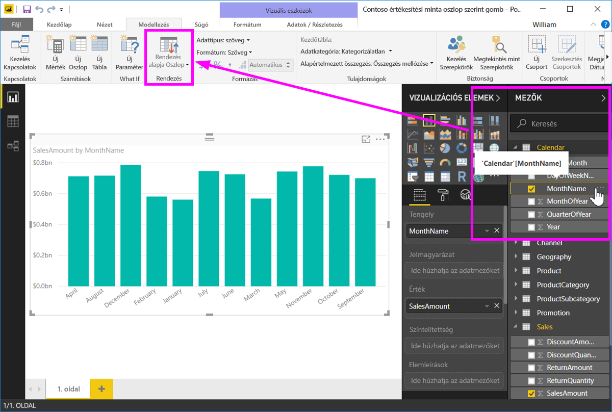
3. Ekkor, ha ki van jelölve a vizualizáció, kiválaszthatja a **MonthOfYear** (Év hónapja) oszlopot az alapértelmezett (**MonthName**, Hónap neve) oszlop helyett, és a vizualizáció a kívánt sorrendben, a hónapok szerint rendezi az adatokat.
   
   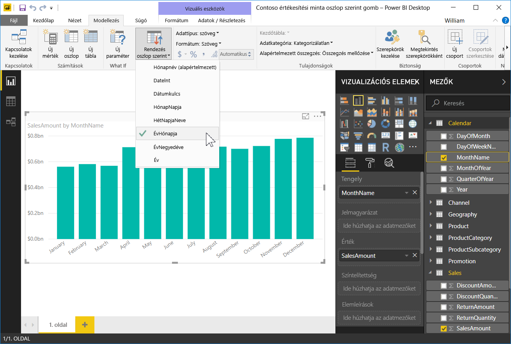

<!---
This functionality is no longer active. Jan 2020

## Getting back to default column for sorting
You can sort by any column you'd like, but there may be times when you want the visual to return to its default sorting column. No problem. For a visual that has a sort column selected, open the **More options** menu and select that column again, and the visualization returns to its default sort column.

For example, here's our previous chart:

When we go back to the menu and select **SalesQuantity** again, the visual defaults to being ordered alphabetically by **Manufacturer**, as shown in the following image.

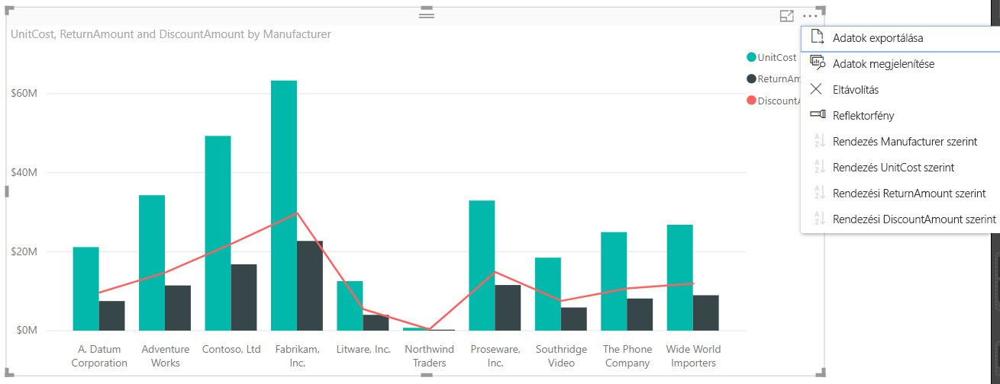

With so many options for sorting your visuals, creating just the chart or image you want is easy.
--->

## Következő lépések

Az alábbi cikkeket is érdekesnek találhatja:

* [Jelentésközi részletezés a Power BI Desktopban](desktop-cross-report-drill-through.md)
* [Szeletelők a Power BI-ban](visuals/power-bi-visualization-slicers.md)

