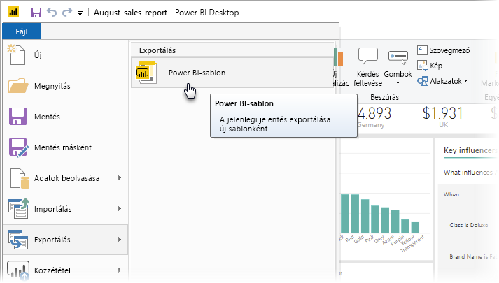
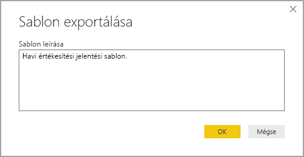
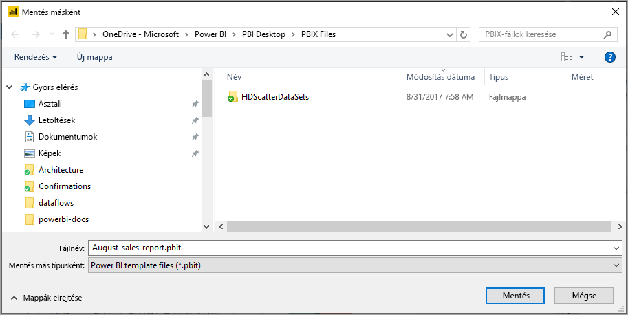
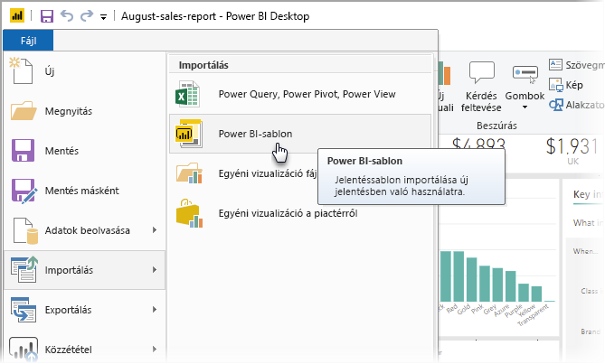
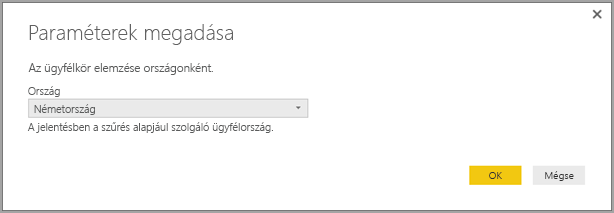
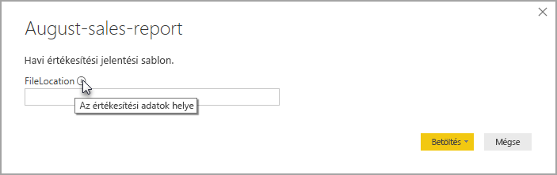

# Sablonok használata a Power BI Desktopban

A **Power BI Desktoppal** látványos jelentéseket hozhat létre, amelyek elemzési eredményeket osztanak meg az egész vállalattal. A Power BI Desktop **sablonjaival** hatékonyabbá teheti munkáját, ha meglévő sablon alapján jelentéssablont hoz létre, amelyet Ön és a vállalatánál mások is felhasználhatnak kiindulásként egy új jelentés elrendezéséhez, adatmodelljéhez és lekérdezéseihez. A **Power BI Desktopbeli** sablonok segítenek a jelentések létrehozásának gyors elindításában és egységesítésében.

## Sablonok létrehozása

A Power BI-jelentéssablon a következő információkat tartalmazza abból a jelentésből, amelyből létre lett hozva:

* A jelentés **oldalai**, vizualizációi és más vizuális elemei
* Az **adatmodell-definíció**, beleértve a sémát, a kapcsolatokat, a mértékeket és a modelldefiníció más összetevőit
* Minden **lekérdezésdefiníció**, így a lekérdezések, a lekérdezési paraméterek és más lekérdezési elemek

A sablon *nem* tartalmazza a jelentésbeli adatokat. 

A jelentéssablonok fájlkiterjesztése .PBIT (a Power BI Desktop-jelentések .PBIX kiterjesztéséhez hasonló). 

Jelentéssablon létrehozásához válassza a menü **Fájl > Exportálás > Power BI-sablon** elemét, amely az alábbi ablakot nyitja meg. Ebben megadhatja a sablon leírását. Ebben a példában a sablon leírása *Monthly sales report template* (Sablon havi értékesítési jelentéshez).

Válassza az **OK** gombot, és a rendszer rákérdez a .PBIT-sablonfájl tárolási helyére.

Ennyi az egész. A Power BI-sablon létre lett hozva .PBIT kiterjesztésű fájlként a megadott helyen.

> [!NOTE]
> A Power BI-sablonfájlok általában sokkal kisebbek a Power BI Desktop-jelentéseknél, hiszen a sablonok nem tartalmaznak adatokat, csak a sablondefiníciókat. 

## Sablonok használata

Power BI-jelentéssablon használatához csak meg kell nyitni azt a Power BI Desktopban, és máris használatba veheti. Power BI-jelentéssablont két módon nyithat meg:

* Ha duplán kattint egy .PBIT-fájlra, automatikusan elindul a Power BI Desktop, és betölti a sablont
* Válassza a Power BI Desktop **Fájl > Importálás > Power BI-sablon** menüpontját

Jelentéssablon megnyitásakor párbeszédpanel jelenik meg az összes olyan paraméter értékéhez, amely a sablon alapjául szolgáló jelentésben definiálva van. Ha egy jelentés például ország vagy régió alapján elemzi az ügyfeleket, és egy *Ország* paramétert használ az ügyfélbázis megadásához, megjelenik egy párbeszédpanel, amelyen az *Ország* értéket a paraméter definiálásakor megadott értékek listájából választhatja ki. 

A szükséges paraméterek megadása után a rendszer a jelentéshez tartozó mögöttes adatok helyének megadását kéri. Az aktuális jelentéskészítő ekkor a saját hitelesítő adataival csatlakozhat az adatokhoz.

A paraméterek és az adatok megadása után létrejön egy jelentés, amely az összes olyan oldalt, vizualizációt, adatmodell-összetevőt és lekérdezést tartalmazza, amely a sablon alapjául szolgáló jelentés része volt. 

Ennyi az egész. A Power BI Desktopban egyszerűen hozhat létre és használhat jelentéssablonokat, így könnyedén megismételheti egy jelentés jól sikerült elrendezését és más jellemzőit, és másokkal is megoszthatja azokat.

## Következő lépések
További információ a **lekérdezési paraméterről**:
* [Lekérdezési paraméterek használata a Power BI Desktopban](https://docs.microsoft.com/power-query/power-query-query-parameters)

A Power BI Desktop emellett műveletek és lehetőségek széles tárházát tartalmazza. A program képességeivel kapcsolatos további információkért lásd az alábbi forrásanyagokat:

* [Mi az a Power BI Desktop?](desktop-what-is-desktop.md)
* [Lekérdezések áttekintése a Power BI Desktopban](desktop-query-overview.md)
* [Adattípusok a Power BI Desktopban](desktop-data-types.md)
* [Adatok formázása és kombinálása a Power BI Desktoppal](desktop-shape-and-combine-data.md)
* [Gyakori lekérdezési feladatok a Power BI Desktopban](desktop-common-query-tasks.md)    
