# Oktatóanyag: Saját mértékek létrehozása a Power BI Desktopban
A Power BI Desktop leghatékonyabb adatelemzési megoldásait mértékek segítségével alakíthatja ki. A mértékek segítségével számításokat hajthat végre az adatokon a jelentések használata közben. Ez az oktatóanyag ismerteti a mértékekről, és bemutatja, hogy miképpen hozhatja létre a saját alapvető mértékeit a Power BI Desktopban.

## Előfeltételek

- Az oktatóanyag olyan Power BI-felhasználóknak szól, akik már jól ismerik a speciálisabb modellek létrehozásának eljárásait a szolgáltatásban. Ehhez ismernie kell, hogyan importálhat adatokat az adatok lekérése és a lekérdezésszerkesztő segítségével, hogyan dolgozhat több kapcsolódó táblával, és hogyan adhat mezőket a jelentésvászonhoz. Ha még csak most ismerkedik a Power BI Desktoppal, mindenképp tekintse át a [Power BI Desktop használatának első lépéseit](desktop-getting-started.md) ismertető témakört.
  
- Ez az oktatóanyag a [Power BI Desktophoz készült Contoso értékesítési mintafájlt](https://download.microsoft.com/download/4/6/A/46AB5E74-50F6-4761-8EDB-5AE077FD603C/Contoso%20Sales%20Sample%20for%20Power%20BI%20Desktop.zip) használja, amely a Contoso nevű fiktív vállalat online értékesítési adatait tartalmazza. Mivel ezek az adatok egy adatbázisból lettek importálva, nem tud az adatforráshoz kapcsolódni, illetve megtekinteni azt a Lekérdezésszerkesztőben. Töltse le és csomagolja ki a fájlt a számítógépen.

## Automatikus mértékek

A Power BI Desktop által létrehozott mértékek többnyire automatikusan jönnek létre. Ha szeretné megtekinteni, hogy a Power BI Desktop hogyan hozza létre a mértékeket, kövesse az alábbi lépéseket:

1. A Power BI Desktopban válassza a **Fájl** > **Megnyitás** lehetőséget, tallózással keresse meg a *Contoso Sales Sample for Power BI Desktop.pbix* fájlt, majd válassza a **Megnyitás** elemet.

2. A **Mezők** panelen bontsa ki a **Sales** táblát. Ezután jelölje be a **SalesAmount** mező melletti jelölőnégyzetet, vagy húzza a **SalesAmount** mezőt a jelentésvászonra.

    Ekkor egy megjelenik új oszlopdiagram, amely a **Sales** tábla **SalesAmount** oszlopában található összes érték összegét mutatja.

    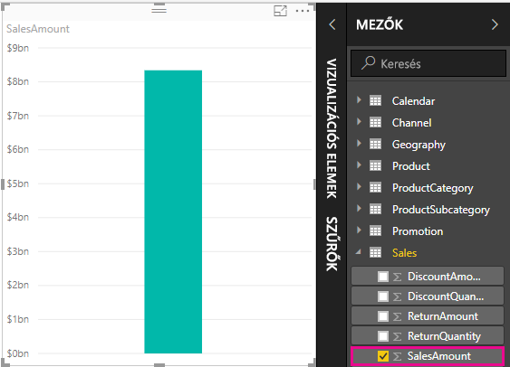

A **Mezők** panel minden szigma ikonnal  ellátott mezője (oszlopa) numerikus, és az értékei összesíthetők. Egy sok értékkel (a **SalesAmount** esetében kétmillió sor) rendelkező tábla megjelenítése helyett a Power BI Desktop automatikusan létrehoz és kiszámít egy mértéket az adatok összesítéséhez, ha numerikus adattípust észlel. A numerikus adattípusok alapértelmezett összesítése az összeg, de könnyedén alkalmazhat más összesítéseket is, mint például az átlag vagy a darabszám. A mértékek megértéséhez elengedhetetlen az összesítések megértése, mert minden mérték valamilyen típusú összesítést hajt végre. 

A diagram összesítésének módosításához kövesse az alábbi lépéseket:

1. Válassza ki a **SalesAmount** vizualizációt a jelentésvásznon.  

1. A **Vizualizációk** panel **Érték** területén válassza a **SalesAmount** jobb oldalán lévő lefelé mutató nyilat. 

1. A megjelenő menüből válassza az **Average** (Átlag) lehetőséget. 

    A vizualizáció módosul, és a **SalesAmount** mező értékesítési értékeinek átlagát mutatja.

    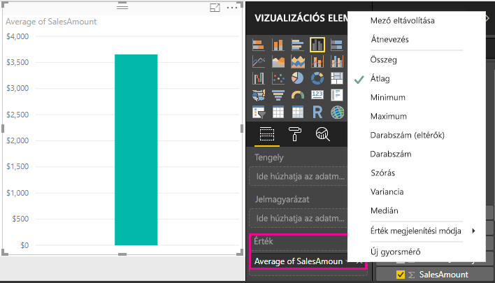

A kívánt eredménytől függően módosíthatja az összesítés típusát. Azonban nem minden típusú összesítés alkalmazható minden numerikus adattípusra. A **SalesAmount** mező esetében például hasznos a Sum és az Average, valamint a Minimum és a Maximum is alkalmazható. A Count típusnak azonban nincs értelme, mert bár a **SalesAmount** mező numerikus értékeket tartalmaz, ezek valójában pénznemben kifejezett összegek.

A mértékekből számított értékek a jelentésben végrehajtott beállításoktól függően változnak. Ha például áthúzza a **RegionCountryName** mezőt a **Geography** táblából a meglévő **SalesAmount** diagramba, az országonkénti átlagos értékesítési összeget jeleníti meg.

Amikor egy mérték eredménye a jelentés használata közben módosul, lényegében a mérték *környezetét* módosítja. Azaz minden alkalommal, amikor módosítja a jelentés vizualizációit, azt a környezetet módosítja, amelynek alapján a mérték az eredményeit kiszámítja és megjeleníti.

## Saját mértékek létrehozása és használata

A legtöbb esetben a Power BI Desktop automatikusan számítja ki és adja vissza az értékeket a kiválasztott mezők és összesítések típusainak megfelelően. Egyes esetekben azonban az összetettebb, egyedi számításokhoz saját mértékeket érdemes létrehoznia. A Power BI Desktopban a Data Analysis Expressions (Adatelemzési kifejezések, DAX) képletnyelv használatával hozhatja létre a saját mértékeket. 

A DAX-képletek számos olyan függvényt, műveletet és szintaxist használnak, amelyek megegyeznek az Excel-képletekével. A DAX-függvények azonban relációs adatbázisokhoz lettek kialakítva, és a jelentések használata során dinamikusabb számításokat hajtanak végre. Összesen több mint 200 DAX-függvény létezik az olyan egyszerű összesítő függvényektől, mint az összeg és az átlag, az összetettebb statisztikai és szűrőfüggvényekig. A DAX használatáról számos forrásból tájékozódhat. Az oktatóanyag befejezése után lásd: [A DAX alapszintű használata a Power BI Desktopban](desktop-quickstart-learn-dax-basics.md).

Amikor saját mértékeket hoz létre, az egy *modell* mérték, és felkerül a kívánt tábla **Mezők** listájára. A modellmértékek néhány előnye, hogy tetszés szerint elnevezheti őket, így könnyebben azonosíthatók; használhatja őket argumentumokként más DAX-kifejezésekben; valamint gyorsan végrehajthat velük összetett számításokat.

### Gyorsmérők

A Power BI Desktop 2018. februári kiadásától kezdődően számos általános számítás *gyorsmérő* néven érthető el, amelyek az ablakokban megadott bemenetek alapján írják meg Önnek a DAX-képleteket. Ezek a hatékony gyorsszámítások kiválóan alkalmasak a DAX használatának gyakorlására és az egyéni mértékek feltöltésére is. 

Hozzon létre egy gyorsmérőt a következő módszerek egyikével: 
 - A **Mezők** panel egyik táblájában kattintson a jobb gombbal vagy válassza a **További beállítások** ( **...** ) elemre, majd válassza a listából az **Új gyorsmérő** lehetőséget.

 - A Power BI Desktop menüszalagjának **Kezdőlapján** található **Számítások** területen válassza az **Új gyorsmérő** lehetőséget.

További információ a gyorsmérők létrehozásáról és használatáról: [A gyorsmérők használata](desktop-quick-measures.md).

### Mérték létrehozása

Tegyük fel, hogy szeretné elemezni a nettó értékesítéseket úgy, hogy levonja a kedvezményeket és a visszafizetéseket az értékesítés teljes összegéből. A vizualizációban lévő környezethez egy olyan mértékre van szüksége, amely levonja a DiscountAmount és a ReturnAmount összegét a SalesAmount összegéből. Bár a **Fields** listában nincs mező a nettó értékesítésnek, rendelkezik azokkal az elemekkel, amelyekből létrehozhat egy saját mértéket a nettó értékesítés számításához. 

Mérték létrehozásához kövesse az alábbi lépéseket:

1. A **Mezők** panelen kattintson a jobb gombbal a **Sales** táblára, vagy vigye az egérmutatót a tábla fölé, és válassza a **További beállítások** ( **...** ) lehetőséget. 

1. A megjelenő menüben válassza az **Új mérték**lehetőséget. 

    Ez a művelet menti az új mértéket a **Sales** táblában, ahol könnyen megtalálható.
    
    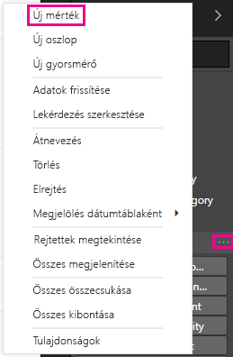
    
    Új mértékek létrehozásához választhatja az **Számítások** területen található **Új mérték** lehetőséget is a Power BI Desktop menüszalagjának **Kezdőlapján**.
    
    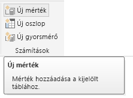
    
    >[!TIP]
    >A menüszalagról bármelyik táblában létrehozhat mértékeket, azonban ha ott hozza létre, ahol használni szeretné majd, egyszerűbb lesz megtalálni. Ebben az esetben először a **Sales** táblát válassza ki, és csak ezután az **Új mérték** lehetőséget. 
    
    A szerkesztőléc a jelentésvászon felső részén található, ahol átnevezheti a mértéket, és megadhatja a DAX-képletet.
    
    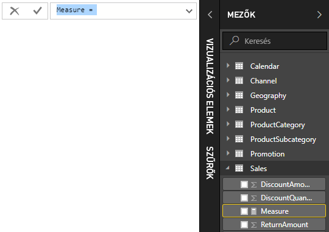
    
1. Alapértelmezés szerint minden új mérték neve *Mérték*. Ha nem nevezi át, a további új mértékek a *Mérték 2*, *Mérték 3* stb. nevet kapják majd. Mivel azt szeretnénk, hogy a mérték jobban azonosítható legyen, emelje ki a *Mérték* nevet a szerkesztőlécen, majd módosítsa a *Net Sales* (Nettó értékesítés) névre.
    
1. Kezdje el beírni a képletet. Az egyenlőségjel után kezdje begépelni a *Sum* (Összeg) szót. Gépelés közben megjelenik egy legördülő javaslatlista, amely az Ön által beírt betűvel kezdődő DAX-függvényeket jeleníti meg. Ha szükséges, görgessen le, és válassza ki a listából a **SUM** függvényt, majd nyomja le az **ENTER** billentyűt.
    
    
    
    Ekkor megjelenik egy nyitó zárójel, valamint a SUM függvénybe beadható oszlopokat tartalmazó legördülő javaslatlista.
    
    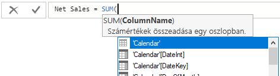
    
1. A kifejezések mindig zárójelek között jelennek meg. Ebben a példában a kifejezés egyetlen argumentumot tartalmaz, amelyet beadunk a SUM függvénybe: a **SalesAmount** oszlopot. Kezdje el beírni a *SalesAmount* kifejezést, amíg csak a **Sales(SalesAmount)** érték marad a listában. 

    Az oszlop neve előtt szereplő tábla nevét az oszlop teljes nevének nevezzük. A teljes oszlopnevekkel a képletek könnyebben olvashatóak.
    
    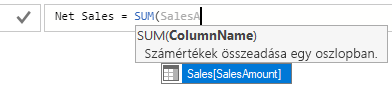
    
1. Válassza ki a listából a **Sales[SalesAmount]** elemet, majd írjon be egy záró zárójelet.
    
    > [!TIP]
    > A szintaxishibákat leggyakrabban a hiányzó vagy rossz helyre beírt záró zárójelek okozzák,
    
    
    
1. Vonja le a képletben a két másik oszlopot.

    a. Az első kifejezés záró zárójele után írjon be egy szóközt, majd egy mínusz operátort (-) és végül még egy szóközt. 

    b. Ezután adjon meg még egy SUM függvényt, és kezdje el beírni a *DiscountAmount* kifejezést, amíg meg nem jelenik a **Sales[DiscountAmount]** oszlop, amelyet kiválaszthat az argumentumként. Írja be a záró zárójelet. 

    c. Írjon be egy szóközt, egy mínusz operátort, egy szóközt, még egy SUM függvényt a **Sales[ReturnAmount]** argumentummal és egy záró zárójelet.
    
    
    
1. A képlet véglegesítéséhez és ellenőrzéséhez nyomja le az **Enter** billentyűt, vagy válassza a szerkesztőlécen lévő **Véglegesítés** lehetőséget (pipa ikon). 

    Az ellenőrzött **Net Sales** mérték most már készen áll a **Sales** táblában a **Mezők** panelen.
    
    
    
1. Ha a képlet beírásánál elfogy a hely, vagy szeretné több sorba rendezni a képletet, válassza a lefelé mutató nyilat a képletsáv jobb oldalán több hely megjelenítéséhez. 

    A lefelé mutató nyíl felfelé mutató nyíllá változik, és megjelenik egy nagy mező.

    

1. A képlet egyes részeit az **Alt** + **Enter** billentyűk lenyomásával választhatja szét önálló sorokra, vagy a **Tab** billentyű lenyomásával adhat hozzá tabulátort.

   

### A mérték használata a jelentésben
Adja hozzá a **Net Sales** értéket a jelentésvászonhoz, és a rendszer a jelentéshez hozzáadott összes mezőre számolni fogja a nettó értékesítést. 

Nettó értékesítés megtekintése országonként:

1. Kattintson a **Sales** tábla **Net Sales** mértékére, vagy húzza át a jelentésvászonra.
    
1. Válassza a **RegionCountryName** (Régió/országnév) mezőt a **Geography** (Földrajzi hely) táblából, vagy húzza a **Net Sales** diagramra.
    
    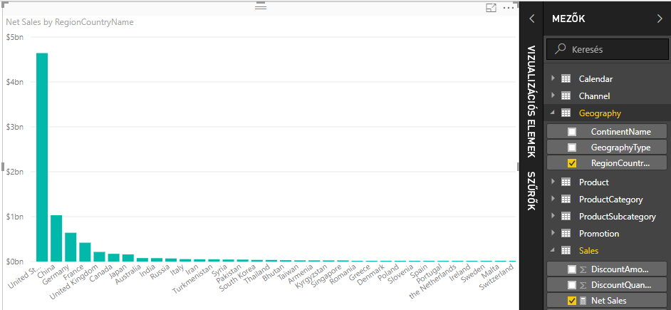
    
1. Válassza ki a **SalesAmount** mezőt, vagy húzza a diagramra, hogy a nettó értékesítés és az értékesítés összege közti különbség is látható legyen. 

    

    Az ábra most két mértéket használ: a Power BI által automatikusan összegzett **SalesAmount**, valamint a manuálisan létrehozott **Net Sales** mértéket. A rendszer mindkét mértéket egy másik mező, a **RegionCountryName** környezetében számította ki.
    
### Saját mérték használata szeletelővel

Adjon hozzá egy szeletelőt, hogy tovább szűrhesse a nettó értékesítés és az értékesítés összegét naptári évek szerint:
    
1. Válasszon ki egy üres területet a diagram mellett. A **Vizualizációk** panelen válassza ki a **Table** vizualizációt. 

    Ez a művelet létrehoz egy üres táblavizualizációt a jelentésvásznon.
    
    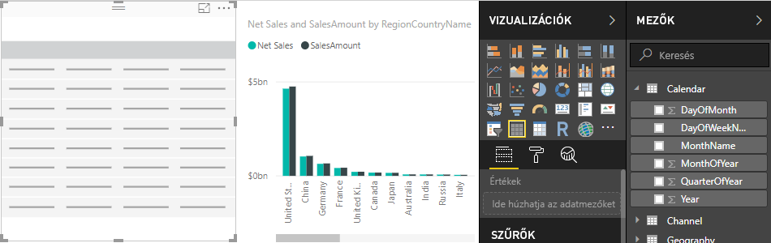
    
1. Húzza a **Year** (Év) mezőt a **Calendar** (Naptár) táblából erre az új üres táblavizualizációra. 
    
    Mivel a **Year** numerikus mező, a Power BI Desktop összegzi a benne lévő értékeket. Ez az összegzés nem működik jól összesítésként, amivel a következő lépésben fogunk foglalkozni.

    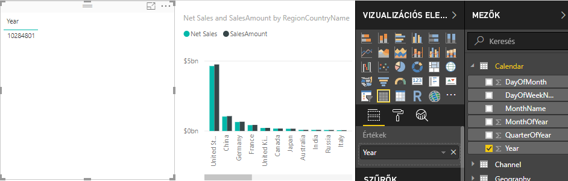
    
3. A **Vizualizációk** panel **Értékek** mezőjében válassza a lefelé mutató nyilat a **Year** mellett, majd válassza a listából az **Összegzés mellőzése** lehetőséget. A tábla most már az egyes éveket mutatja.
    
    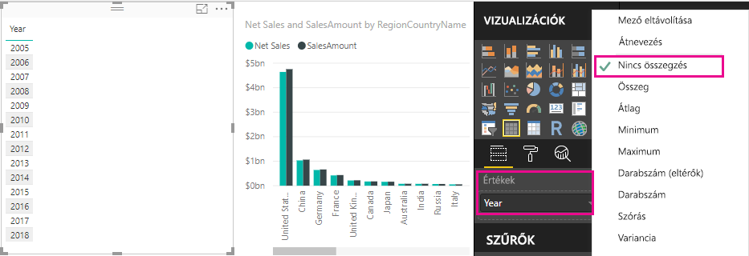
    
4.  A tábla szeletelővé alakításához válassza a **Szeletelő** ikont a **Vizualizációk** panelen. Ha a vizualizáció lista helyett egy csúszkát jelenít meg, válassza ki a csúszkán lévő lefelé mutató nyíllal a **Lista** elemet.

    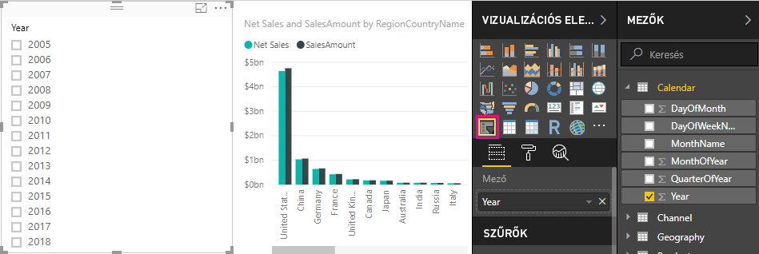
    
5.  Válasszon ki egy értéket a **Year** szeletelőben a **Net Sales and Sales Amount by RegionCountryName** (Nettó értékesítés és Értékesítés összege Régió/országnév alapján) diagram megfelelő szűréséhez. A rendszer újraszámítja a **Net Sales** és a **SalesAmount** mértékeket, és megjeleníti az eredményeket a kiválasztott **Year** mező környezetében. 
    
    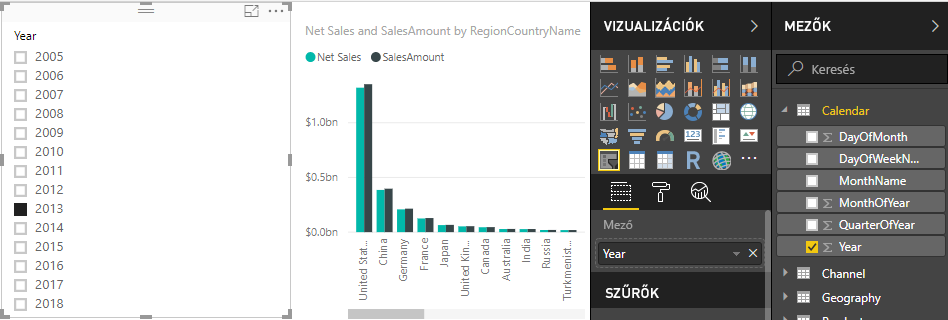

### Saját érték használata egy másik értéken belül

Tegyük fel, hogy azt szeretné megtudni, hogy melyik az eladott egységenként legnagyobb nettó értékesítési összeget produkáló termékünk. Szüksége lesz egy olyan mértékre, amely elosztja a nettó értékesítést az értékesített egységek mennyiségével. Hozzon létre egy új értéket, amely elosztja a **Net Sales** mérték eredményét a **Sales[SalesQuantity]** összegével.

1.  A **Mezők** panelen hozzon létre egy új mértéket **Net Sales per Unit** (Nettó értékesítés egységenként) néven a **Sales** táblában.
    
1. A szerkesztőlécen kezdje begépelni a *Net Sales* kifejezést. A javaslatlistában jelennek meg a lehetőségek, amelyek közül választhat. Válassza a **[Net Sales]** mértéket.
    
    
    
1. A mértékekre úgy is hivatkozhat, ha csak egy nyitó szögletes zárójelet ( **[** ) ír be. A javaslatlistában csak a képlethez hozzáadható mértékek jelennek meg.
    
    
    
1. Írjon be egy szóközt, egy osztás operátort (/), még egy szóközt, egy SUM függvényt, majd írja be a *Quantity* (Mennyiség) nevet. A javaslatlista ekkor az összes olyan oszlopot tartalmazza, amelynek a nevében szerepel a *Quantity* kifejezés. Válassza a **Sales[SalesQuantity]** lehetőséget, írja be a záró zárójelet, majd nyomja le az **ENTER** billentyűt, vagy válassza a **Véglegesítés** lehetőséget (pipa ikon) a képlet ellenőrzéséhez. 

    Az eredményül kapott képlet a következőképpen jelenik meg:
    
    `Net Sales per Unit = [Net Sales] / SUM(Sales[SalesQuantity])`
    
1. Válassza a **Net Sales per Unit** mértéket a **Sales** táblából, vagy húzza át egy üres területre a jelentésvásznon. 

    A diagram a nettó értékesítés összegét mutatja egységenként az összes eladott termékre vetítve. Ez a diagram nem nyújt túl sok információt, ezért ezzel a témakörrel a következő lépésben foglalkozunk.
    
    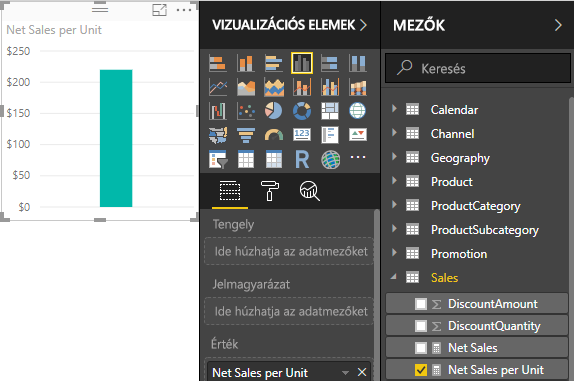
    
1. A megjelenítés megváltoztatásához módosítsa a diagramvizualizáció típusát **Faszerkezetes térképre**.
    
    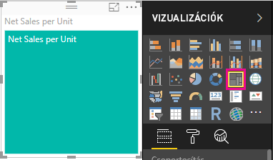
    
1. Válassza ki a **Product Category** mezőt, vagy húzza át a **Vizualizációk** panelen található fatérképre vagy a **Group** mezőre. Ezek már fontos információk!
    
    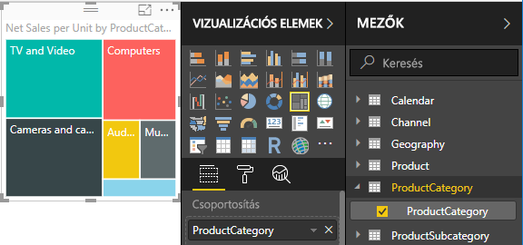
    
7. Próbálja meg eltávolítani a **ProductCategory** mezőt, és helyette a **ProductName** mezőt húzza a diagramra. 
    
    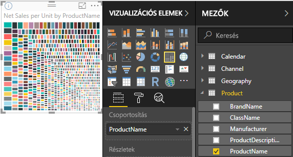
    
   Rendben, ez itt most csak játszadozás, de azért elég menő, ezt be kell látnia! Kísérletezzen bátran a vizualizáció egyéb szűrési és formázási lehetőségeivel is.

## Az oktatóanyag összefoglalása
A mértékekkel hozzájuthat az adatokból kinyerni kívánt megállapításokhoz. Ez az oktatóanyag megmutatta, hogyan hozhat létre mértékeket a szerkesztőléc használatával, hogyan adhat nekik könnyen értelmezhető nevet, és hogyan találhatja meg, illetve választhatja ki a megfelelő képletelemeket a DAX javaslati listákkal. Tájékozódhatott a környezetekről is, hiszen a mértékekkel végzett számítások aszerint változnak, hogy milyen más mezők és kifejezések jelennek még meg a képletben.

## Következő lépések
- További információk a Power BI Desktop számos gyakori számítást nyújtó gyorsmérőiről: [A gyorsmérők használata általános és nagy igényű számítások egyszerű végrehajtásához](desktop-quick-measures.md).
  
- A DAX-képletek részletesebb megismeréséhez és speciálisabb mértékek létrehozásához lásd: [A DAX alapszintű használata a Power BI Desktopban](desktop-quickstart-learn-dax-basics.md). Ez a cikk a DAX alapvető fogalmaira, a szintaxisra, a függvényekre és a környezet alaposabb megértésére összpontosít.
  
- Mindenképp vegye fel a [Data Analysis Expressions (DAX) referenciát](https://docs.microsoft.com/dax/index) a kedvencei közé. Ebben a referenciában találja részletesen leírva a DAX-szintaxist, az operátorokat, valamint a több mint 200 DAX-függvényt.

