# Oktatóanyag: Facebook-adatok elemzése a Power BI Desktoppal

Ez az oktatóanyag az adatok Facebookból való importálását és azok Power BI Desktopban való használatát ismerteti. Ön adatokhoz fog kapcsolódni, importálni fogja az adatokat a Power BI Facebook-oldaláról, átalakításokat fog végezni az importált adatokon, valamint jelentésbeli vizualizációkban fogja használni az adatokat.

> [!WARNING]
> A Facebook App engedélyekre vonatkozó megkötései miatt az összekötőnek az ebben a cikkben leírt képességei jelenleg nem működnek megfelelően. A Facebookkal közösen dolgozunk azon, hogy ez a funkció minél hamarabb helyreálljon.

## Kapcsolódás egy Facebook-oldalhoz

Ez az oktatóanyag a [Microsoft Power BI Facebook-oldaláról](https://www.facebook.com/microsoftbi) származó adatokat használja. Nincs szükség semmilyen különleges hitelesítő adatra a kapcsolódáshoz, illetve az adatok oldalról való importálásához, kivéve személyes Facebook-fiók használatakor.

1. Nyissa meg a Power BI Desktopot, válassza az **Adatok lekérése** elemet az **Első lépések** párbeszédpanelen, vagy a **Kezdőlap** szalagfülön válassza az **Adatok lekérése**, majd a **Továbbiak** elemet.
   
2. Az **Adatok lekérése** párbeszédpanelen válassza a **Facebook** elemet az **Online szolgáltatások** csoportban, majd válassza a **Kapcsolódás** parancsot.
   
   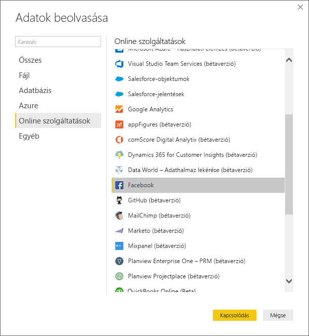
   
   Egy párbeszédpanel jelenik meg, amely a külső szolgáltatások használatának kockázataira figyelmeztet.
   
   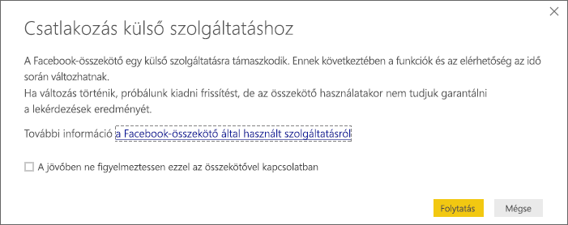
   
3. Válassza a **Folytatás** lehetőséget. 
   
4. A **Facebook** párbeszédpanelen írja vagy illessze be az oldal nevét (**microsoftbi**) a **felhasználónév** szövegmezőbe, válassza a **Bejegyzések** lehetőséget a **Kapcsolat** legördülő menüből, majd kattintson az **OK** gombra.
   
   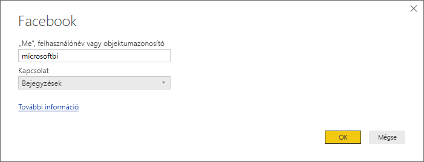
   
5. Amikor a rendszer a hitelesítő adatokat kéri, jelentkezzen be a saját Facebook-fiókjába, és engedélyezze, hogy a Power BI hozzáférjen a fiókjához.
   
   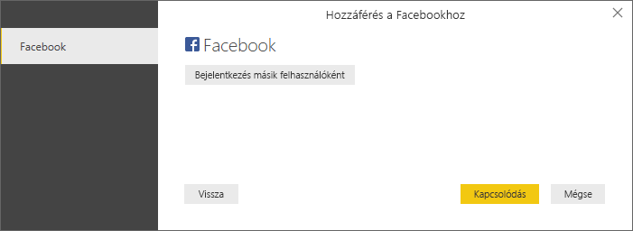

   Miután csatlakozott a Power BI Facebook-oldalához, megjelenik az oldal bejegyzések típusú adatainak előnézete. 
   
   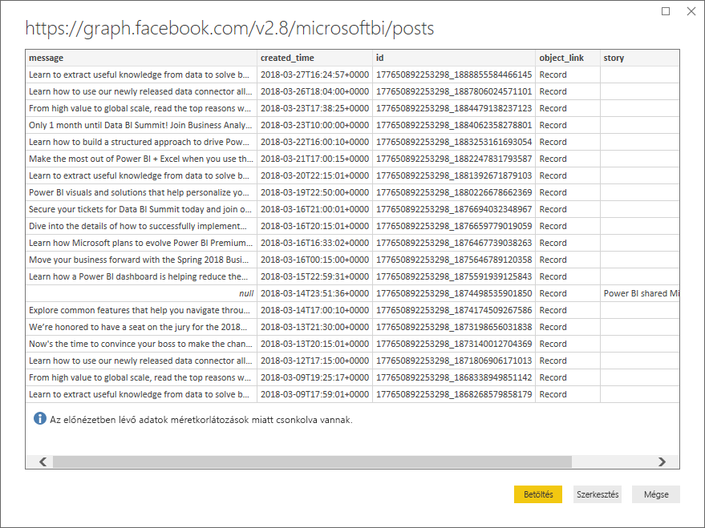
   
## Az importált adatok formázása és átalakítása

Tegyük fel, szeretné látni és megjeleníteni, hogy mely bejegyzések rendelkeznek a legtöbb hozzászólással adott időszakban, de észreveszi, hogy a bejegyzések típusú adatok előnézetében a **created_time** adatai nehezen olvashatók és érthetők, és egyáltalán nincsenek hozzászólási adatok. A legjobb eredmény eléréséhez el kell végezni az adatok formázását és tisztítását. Ehhez használja a Power BI Desktop Power Query-szerkesztőjét, amellyel szerkesztheti az adatokat a Power BI Desktopba való importálás előtt vagy után. 

### A dátum/idő oszlop felosztása

Először a **created_time** oszlopban található dátum- és időértékeket válassza szét a jobb olvashatóság érdekében. 

1. A Facebook adatelőnézeti területén válassza a **Szerkesztés** elemet. 
   
   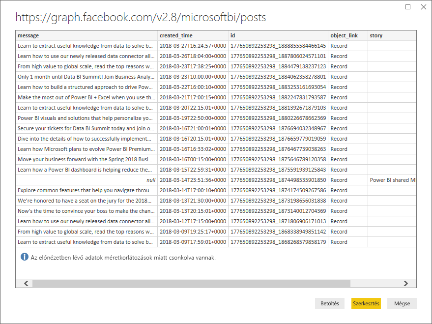
   
   A Power BI Desktop Power Query-szerkesztője egy új ablakban nyílik meg, és megjeleníti a Power BI Facebook-oldaláról származó adatelőnézetet. 
   
   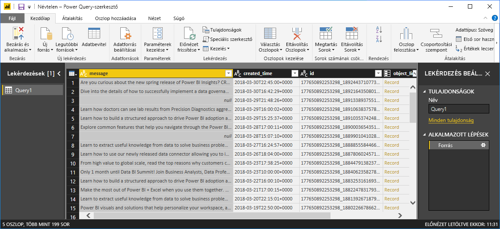
   
2. Válassza ki a **created_time** oszlopot. Vegye figyelembe, hogy az oszlop jelenleg **szöveges** adattípusnak minősül, amelyet a fejlécben az **ABC** ikon jelöl. Kattintson a jobb gombbal a fejlécre, és válassza az **Oszlop felosztása** > **Elválasztó alapján** elemet a legördülő listából. Vagy válassza az **Oszlop felosztása** > **Elválasztó alapján** lehetőséget az **Átalakítás** csoportban a szalag **Kezdőlap** lapján.  
   
   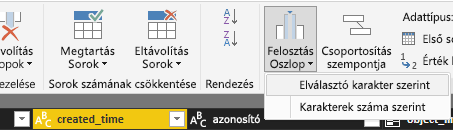
   
3. Az **Oszlop felosztása elválasztó alapján** párbeszédpanelen válassza az **Egyéni** lehetőséget a legördülő menüből, és írja be a **T** karaktert a beviteli mezőbe (ez az a karakter, amely a **created_time** értékeinek időre vonatkozó részével kezdődik), majd kattintson az **OK** gombra. 
   
   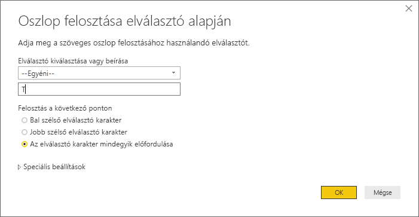
   
   A rendszer két olyan oszlopra osztja fel az eredeti oszlopot, amelyek a *T* elválasztó előtti és utáni sztringeket tartalmazzák. Az új oszlopok neve **created_time.1** és **created_time.2**. A Power BI automatikusan észleli és **Dátum** adattípusra módosítja az első oszlop adattípusát, míg **Idő** adattípusra a második oszlop adattípusát, és úgy formázza a dátum- és időértékeket, hogy azok olvashatóbbak legyenek.
   
4. A két oszlop átnevezése. Válassza ki a **created_time.1** lehetőséget, majd az **Átnevezés** lehetőséget a **Bármely oszlop** csoportban a menüszalag **Átalakítás** fülén. Vagy kattintson duplán az oszlopfejlécre, és írja be az új oszlop nevét: **created_date**. Ismételje meg ezt a **created_time.2** oszloppal, és nevezze át **created_time** névre.
   
   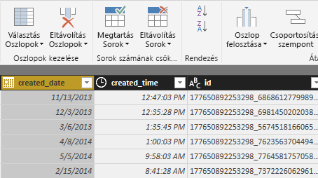
   
### A beágyazott oszlop kibontása

Most, hogy a dátum- és időadatok a kívánt módon jelennek meg, a beágyazott oszlop kibontásával jelenítheti meg a hozzászólások adatait. 

1. Válassza az  ikont az **object_link** oszlop tetején a **Kibontás/összesítés** párbeszédpanel megnyitásához. Válassza a **kapcsolatok** elemet, majd válassza az **OK** gombot. 
   
   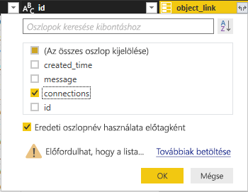
   
   Az oszlopfejléc a következőre változik: **object_link.connections**.
2. Válassza a  ikont az **object_link.connections** oszlop tetején, majd válassza a **hozzászólások** elemet, és kattintson az **OK** gombra. Az oszlopfejléc a következőre változik: **object_link.connections.comments**.
   
3. Válassza a  ikont az **object_link.connections.comments** oszlop tetején, majd a **Kibontás** helyett ezúttal válassza az **Összesítés** elemet a párbeszédpanelen. Válassza az **Azonosító száma** lehetőséget, majd válassza az **OK** gombot. 
   
   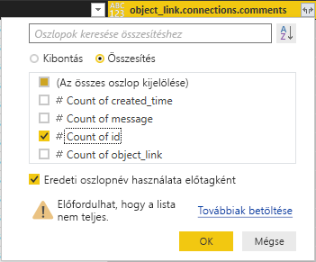
   
   Az oszlop most már az egyes üzenetekhez tartozó hozzászólások számát mutatja. 
   
4. Nevezze át az **object_link.connections.comments.id száma** oszlopot a következőre: **Hozzászólások száma**.
   
5. Válassza ki a **Hozzászólások száma** oszlopfejléc melletti lefelé mutató nyilat, majd a **Csökkenő rendezés** kiválasztásával tekintheti meg a bejegyzéseket csökkenő sorrendben rendezve. 
   
   
   
### Lekérdezési lépések áttekintése

Miután a Power Query-szerkesztő használatával elvégzi az adatok formázását és átalakítását, a rendszer minden egyes lépést rögzít a **Power Query-szerkesztő** ablak jobb oldalán lévő **Lekérdezés beállításai** ablaktábla **Alkalmazott lépések** területén. Az **Alkalmazott lépések** területén visszaléphet, és megtekintheti, pontosan milyen változtatásokat végzett, és szerkesztheti, törölheti vagy átrendezheti őket, szükség szerint. Legyen óvatos, amikor ezeket a lépéseket módosítja, mert a megelőző lépések megváltoztatásával megakadályozhatja a további lépések eredményességét. 

Az eddigi adatátalakítások alkalmazása után az **Alkalmazott lépések** a következőképpen jelennek meg:
   
   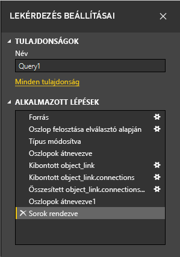
   
   >[!TIP]
   >Az **Alkalmazott lépések** alapjául a [Power Query M nyelvén írt képletek](https://docs.microsoft.com/powerquery-m/quick-tour-of-the-power-query-m-formula-language) szolgálnak. A **Kezdőlap** szalagfül **Lekérdezés** csoportjában lévő **Speciális szerkesztő** kiválasztásával megtekintheti és szerkesztheti a képleteket. 

### Az átalakított adatok importálása

Ha elégedett az adatokkal, a **Kezdőlap** szalagfül **Bezárás és alkalmazás** > **Bezárás és alkalmazás** elemének kiválasztásával importálhatja azokat a Power BI Desktop alkalmazásba. 
   
   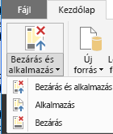
   
   Egy párbeszédpanel jelenik meg, amelyen az adatoknak a Power BI Desktop-adatmodellbe való betöltése követhető nyomon. 
   
   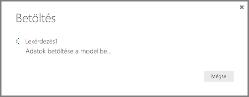
   
   A betöltést követően az adatok a **Jelentés** nézetben jelennek meg a **Mezők** panel új lekérdezéseként.
   
   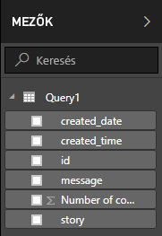
   
## Az adatok használata jelentésbeli vizualizációkban 

Most, miután betöltötte az adatokat a Facebook-oldalról, a vizualizációk használatával gyorsan és egyszerűen elemezheti azokat. A vizualizációk létrehozása egyszerű, egyszerűen válasszon ki egy mezőt, vagy húzza át azt a **Mezők** panelről a jelentésvászonra.

### Sávdiagram létrehozása

1. A Power BI Desktop **Jelentés** nézetében válassza ki az **üzenet** elemet a **Mezők** panelről, vagy húzza azt át a vászonra. Az összes bejegyzésüzenetet tartalmazó tábla megjelenik a vásznon. 
   
   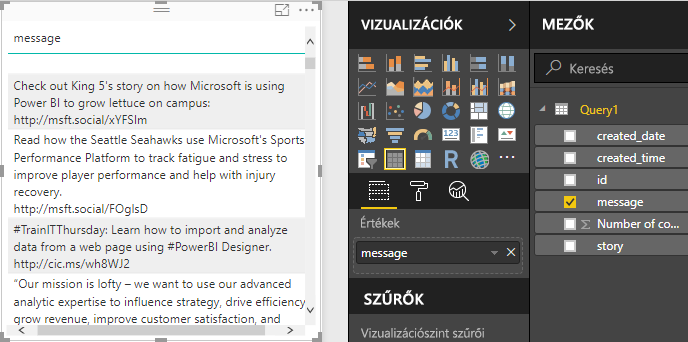
   
2. A tábla kijelölése után válassza a **Hozzászólások száma** elemet a **Mezők** panelen, vagy húzza azt át a táblába. 
   
3. Válassza a **Halmozott sávdiagram** ikont a **Megjelenítések** ablaktáblán. A tábla olyan sávdiagramra változik, amely a bejegyzésenkénti hozzászólások számát mutatja. 
   
   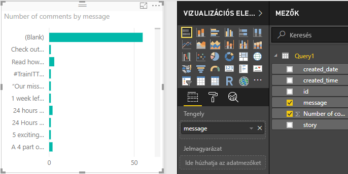
   
4. Válassza a **További lehetőségek** (...) elemet a vizualizáció mellett, majd a **Rendezés** > **Hozzászólások száma szerint** lehetőséget a tábla hozzászólások száma szerinti csökkenő sorrendbe rendezéséhez. 

   Vegye észre, hogy a rendszer a legtöbb hozzászólást **(Üres)** üzenettel társította (elképzelhető, hogy ezek a bejegyzések történetek, hivatkozások, videók vagy egyéb nem szöveges tartalmak lehetettek). 
   
5. Az üres sorok kiszűréshez válassza a **Szűrők** ablaktáblán az **üzenet (összes)** lehetőséget, válassza az **Összes kijelölése**, majd az **(Üres)** lehetőséget a kijelölés eltávolításához. 

   A **Szűrők** ablaktáblán a bejegyzés az **üzenet nem (üres)**  értékre változik, és az **(Üres)** sor eltűnik a diagramos vizualizációból.
   
   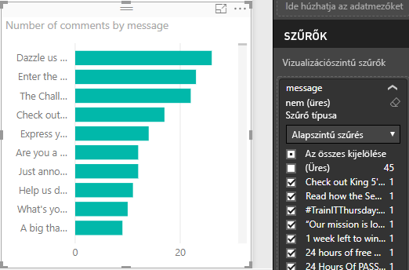
   
### A diagram formázása

A vizualizáció kezd érdekes lenni, de nem túl sok bejegyzésszöveg látható a diagramon. További bejegyzésszöveg megjelenítése:

1. A diagramos vizualizáció fogópontjainak használatával méretezze át a diagramot úgy, hogy az a lehető legnagyobb legyen. 
   
2. A diagram kijelölése után válassza a **Formázás** ikont (festőhenger) a **Megjelenítések** ablaktáblán.
   
3. Válassza az **Y tengely** melletti lefelé mutató nyilat, és húzza a **Maximális méret** csúszkát teljesen jobbra (**50%** ). 
4. Továbbá csökkentse a **Szövegméret** beállítását **10** pontos értékre, hogy még több szöveg férjen el.
   
   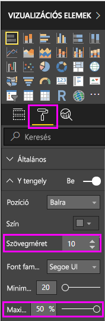
   
   A diagramon most már több látszik a bejegyzés tartalmából. 
   
   
   
A diagram X tengelye (hozzászólások száma) nem pontos értékeket mutat, és zavarosnak tűnik a diagram alján. Ehelyett használjon inkább adatfeliratokat: 

1. Válassza a **Formázás** ikont, majd az **X tengely** melletti csúszka használatával kapcsolja **Ki** az X tengelyt. 
   
2. Kapcsolja **Be** az **Adatcímkék** csúszkát. 

   A diagramon most már megjelenik az egyes bejegyzésekhez tartozó hozzászólások pontos száma.
   
   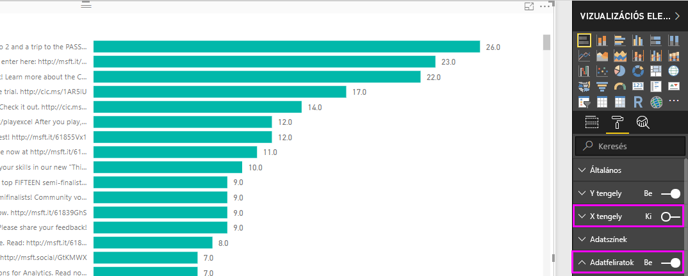
   
### Az adattípus szerkesztése

Ez így már jobb, de az adatfeliratok mindegyike **,0** tizedesértékkel rendelkezik, amely zavaró és félrevezető, mivel a **Bejegyzések száma** értékének egész számnak kell lennie. A javításukhoz módosítani kell a **Bejegyzések száma** oszlop adattípusát **egész számra**:

1. Kattintson a jobb gombbal a **Mezők** panelen a **Query1** elemere, vagy vigye fölé az egérmutatót, és válassza a **További beállítások** (...) lehetőséget. 

2. A helyi menüből válassza a **Lekérdezés szerkesztése** lehetőséget. Vagy válassza ki a **Lekérdezések szerkesztése** > **Lekérdezések szerkesztése** lehetőséget a **Külső adatok** csoportban a **Kezdőlap** szalagfülön. 
   
3. A **Power Query-szerkesztőben** válassza a **Hozzászólások száma** oszlopot, majd módosítsa az adattípust egész számra az alábbi lépések valamelyikének követésével: 
   - Válassza az **1.2** ikont a **Hozzászólások száma** oszlopfejléc mellett, majd az **Egész szám** lehetőséget a legördülő menüből.
   - Kattintson a jobb gombbal az oszlop fejlécére, és válassza a **Típus módosítása** > **Egész szám** lehetőséget.
   - Válassza az **Adattípus: Tizedes tört** szám lehetőséget a **Kezdőlap** szalagfül **Átalakítás** csoportjában, vagy válassza az **Átalakítás** szalagfül **Minden oszlop** csoportjában az **Egész szám** lehetőséget.
   
   Az oszlopfejléc ikonja **123** értékre változik, így jelölve az **Egész szám** adattípust.
   
   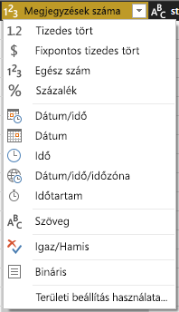
   
3. A módosítások alkalmazásához válassza a **Fájl** > **Bezárás és alkalmazás** lehetőséget, vagy válassza a **Fájl** > **Alkalmaz** lehetőséget a **Power Query-szerkesztő** ablakának nyitva tartásához. 

   A módosítások betöltését követően a diagram adatfeliratai egész számokra változnak.
   
   
   
### Dátumszeletelő létrehozása

Tegyük fel, hogy vizualizálni szeretné a bejegyzések hozzászólásainak számát adott időszakban. Szeletelői vizualizáció létrehozásával szűrni lehet a diagram adatait a különböző időkereteknek megfelelően. 

1. Válasszon egy üres területet a vásznon, majd válassza a **Megjelenítések** panelen a **Szeletelő** ikont. 

   Megjelenik egy üres szeletelői vizualizáció.
   
   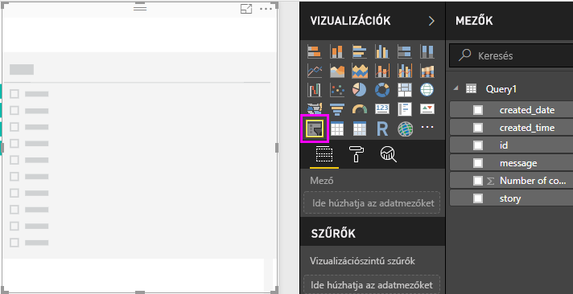
   
2. Válassza a **created_date** mezőt a **Mezők** listából, vagy húzza át az új szeletelőre. 

   A szeletelő egy dátumtartomány típusú csúszkává változik a mező **Dátum** adattípusa alapján.
   
   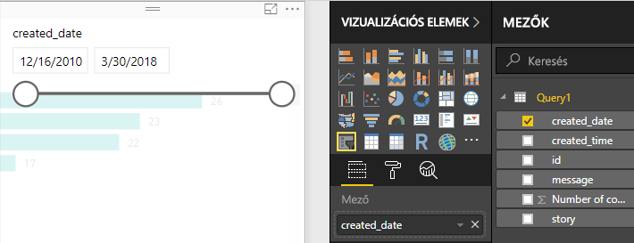
   
3. A csúszka fogópontjainak mozgatásával különböző dátumtartományokat választhat ki, és észreveheti, hogy a diagram adatait a rendszer ennek megfelelően szűri. A dátummezőket is használhatja a szeletelőben, és konkrét dátumokat írhat be, vagy kiválaszthatja azokat a felbukkanó naptárból.
    
   
   
### A vizualizációk formázása

Adjon a diagramnak egy még inkább leíró jellegű, vonzó címet: 

1. Miközben ki van jelölve a diagram, válassza a **Formázás** ikont a **Megjelenítések** panelen, majd a kibontásához válassza a **Cím** melletti legördül menü nyilát.

2. Módosítsa a **Címszöveget** a következőre: **Hozzászólások bejegyzésenként**. 

3. Válassza a **Betűszín** melletti lefelé mutató nyilat, majd válasszon zöld színt a vizualizáció zöld sávjaihoz való illeszkedés céljából.

4. Növelje a **Szövegméretet** **10 pt** értékre, és módosítsa a **Betűtípus** beállítását **Segoe (fékövér)** értékre.

5. Kísérletezzen a további formázási lehetőségekkel és beállításokkal a vizualizációk megjelenésének módosításához. 

   

## További vizualizációk létrehozása

Amint láthatja, a jelentésekben könnyen testre szabhatók a vizualizációk, így tetszőleges módon lehet bemutatni az adatokat. Például az importált Facebook-adatok használatával próbálja meg létrehozni ezt a vonaldiagramot, amely a hozzászólások számát mutatja adott időszakban.

A Power BI Desktop teljes körű szolgáltatást nyújt, lehetővé téve az adatok számos különféle adatforrásból való beszerzését, az elemzési igényeknek megfelelő átalakítását, valamint látványos és interaktív módon történő megjelenítését. Miután elkészült a jelentés, [feltöltheti azt a Power BI szolgáltatásba](desktop-upload-desktop-files.md), és létrehozhat azon alapuló irányítópultokat, amelyeket más Power BI-felhasználókkal is megoszthat.

## Következő lépések
* [Olvassa el a többi Power BI Desktop-oktatóanyagot](https://go.microsoft.com/fwlink/?LinkID=521937)
* [Tekintse meg a Power BI Desktop videóit](https://go.microsoft.com/fwlink/?LinkID=519322)
* [Látogasson el a Power BI fórumára](https://go.microsoft.com/fwlink/?LinkID=519326)
* [Látogasson el a Power BI blogra](https://go.microsoft.com/fwlink/?LinkID=519327)

