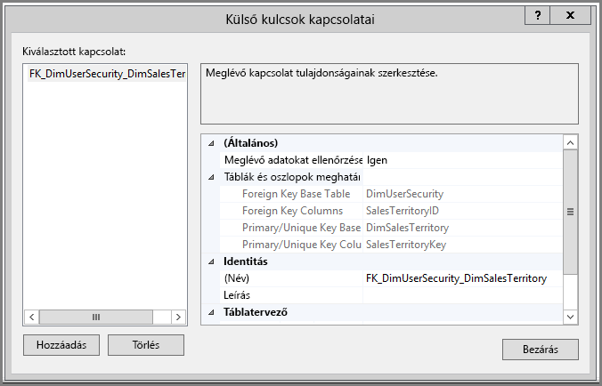
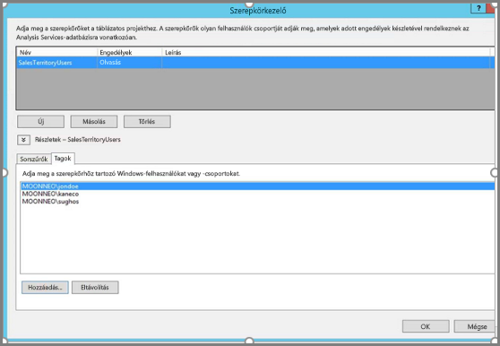
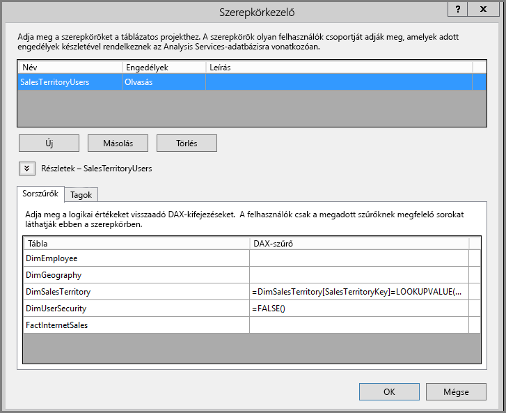
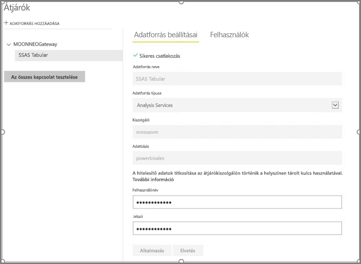
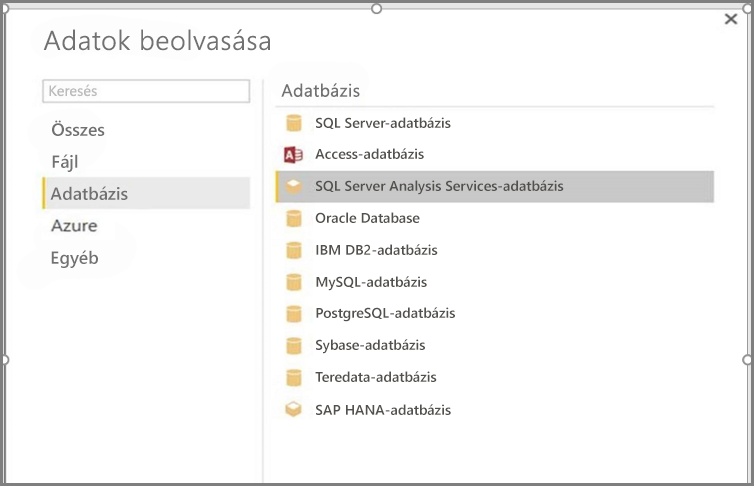
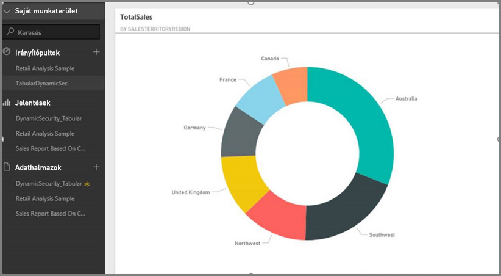
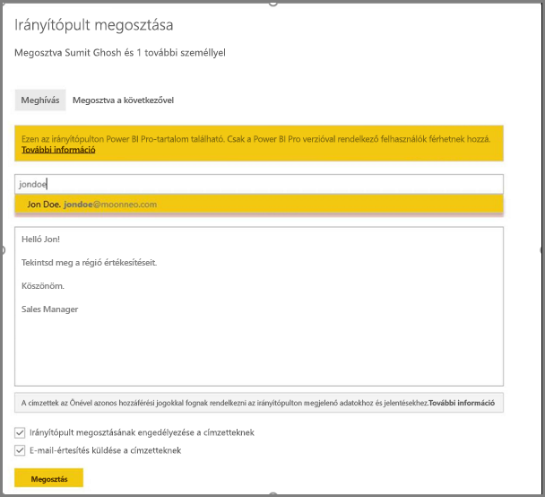
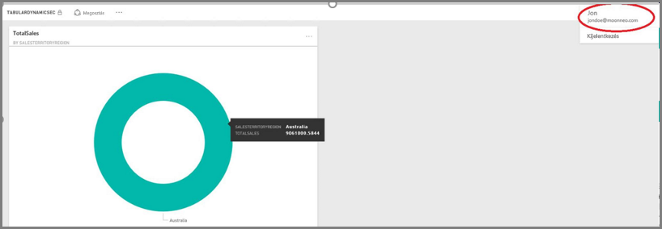

# <a name="dynamic-row-level-security-with-analysis-services-tabular-model"></a>Dinamikus sorszintű biztonság Analysis Services-beli táblázatos modellel

Az alábbi lépéseket egy minta-adathalmazzal végrehajtva ebből az oktatóanyagból megismerheti a [**sorszintű biztonság**](service-admin-rls.md) megvalósítását egy **Analysis Services-beli táblázatos modellben**, amelyet aztán felhasználhat egy Power BI-jelentésben. 

* Új táblázat létrehozása az [**AdventureworksDW2012** adatbázisban](https://github.com/Microsoft/sql-server-samples/releases/tag/adventureworks)
* A táblázatos modell felépítése a szükséges tény- és dimenziótáblákkal
* Felhasználói szerepkörök és engedélyek definiálása
* A modell üzembe helyezése egy **Analysis Services-beli táblázatos** példányon
* A jelentést elérő felhasználóhoz igazított adatokat megjelenítő Power BI Desktop-jelentés készítése
* A modell üzembe helyezése a **Power BI szolgáltatáson**
* Új irányítópult létrehozása a jelentés alapján
* Az irányítópult megosztása munkatársaival 

Ehhez az oktatóanyaghoz szüksége lesz az [**AdventureworksDW2012** adatbázisra](https://github.com/Microsoft/sql-server-samples/releases/tag/adventureworks).

## <a name="task-1-create-the-user-security-table-and-define-data-relationship"></a>1. feladat: A felhasználói biztonság tábla létrehozása és az adatkapcsolat meghatározása

Számos cikkben találhat leírást arról, hogy hogyan állítható be a sorszintű dinamikus biztonság az **SQL Server Analysis Services-beli (SSAS) táblázatos** modellel. Ehhez a mintához a [Dinamikus biztonság implementálása sorszűrőkkel](https://msdn.microsoft.com/library/hh479759.aspx) című cikket használjuk. 

Az itt ismertetett lépésekhez az **AdventureworksDW2012** relációs adatbázist kell használnia.

1. Hozzon létre egy **DimUserSecurity** táblát az **AdventureworksDW2012** adatbázisban az alább látható módon. A tábla létrehozásához használhatja az [SQL Server Management Studiót (SSMS)](https://docs.microsoft.com/sql/ssms/download-sql-server-management-studio-ssms).
   
   

2. A tábla létrehozása és mentése után létre kell hozni a kapcsolatot a **DimUserSecurity** tábla **SalesTerritoryID** oszlopa és a **DimSalesTerritory** tábla **SalesTerritoryKey** oszlopa között az alábbi ábra alapján. 

   Az **SSMS-ben** kattintson a jobb gombbal a **DimUserSecurity** táblára, majd válassza a **Tervezés** menüpontot. Ezután válassza a **Táblatervező -> Kapcsolatok...** lehetőséget. Ha végzett, mentse a táblát.
   
   

3. Vegyen fel felhasználókat a táblához: kattintson a jobb gombbal a **DimUserSecurity** táblára, és válassza a **Felső 200 sor szerkesztése** lehetőséget. A felhasználók hozzáadása után a **DimUserSecurity** táblának az alábbihoz hasonlóan kell megjelennie, a saját felhasználói adataival:
   
   
   
   Ezekkel a felhasználókkal a későbbi feladatok során még találkozni fog.

4. A következő lépés egy *belső illesztés* létrehozása a **DimSalesTerritory** táblával, amely a felhasználóhoz társított régió részleteit mutatja. A *belső illesztést* az alábbi SQL-kód valósítja meg, az ábrán pedig az eredményül kapott tábla látható.
   
       select b.SalesTerritoryCountry, b.SalesTerritoryRegion, a.EmployeeID, a.FirstName, a.LastName, a.UserName from [dbo].[DimUserSecurity] as a join  [dbo].[DimSalesTerritory] as b on a.[SalesTerritoryID] = b.[SalesTerritoryKey]
   
   

   A képen a **2. lépésben** létrehozott kapcsolatnak köszönhetően látszik, hogy ki felel az egyes értékesítési régiókért. Látható például, hogy **John Doe** felelős **Ausztráliáért**. 

## <a name="task-2-create-the-tabular-model-with-facts-and-dimension-tables"></a>2. feladat: A táblázatos modell létrehozása a tény- és dimenziótáblákkal

1. Miután a relációs adattárház elérhető, meg kell határoznia a táblázatos modellt. A modellt létrehozhatja az [**SQL Server Data Tools (SSDT)**](https://docs.microsoft.com/sql/ssdt/sql-server-data-tools) használatával. További információ: [Új táblázatos modellprojekt létrehozása](https://msdn.microsoft.com/library/hh231689.aspx).

2. Importáljon minden szükséges táblát a modellbe a lent látható módon.
   
    

3. A szükséges táblák importálása után meg kell határoznia egy **Olvasás** engedéllyel rendelkező **SalesTerritoryUsers** szerepkört. Az SQL Server Data Toolsban válassza a **Modell** menüt, majd a **Szerepkörök** lehetőséget. A **Szerepkörkezelő** párbeszédpanelen válassza az **Új** lehetőséget.

4. A **Szerepkörkezelő** **Tagok** lapján adja hozzá az **1. feladat 3. lépésében** a **DimUserSecurity** táblában meghatározott felhasználókat.
   
    

5. Ezután adja hozzá a megfelelő függvényeket a **DimSalesTerritory** és **DimUserSecurity** táblákhoz a **Sorszűrők** lap alatt a képen látható módon.
   
    

6. Ebben a lépésben a **LOOKUPVALUE** függvény használatával egy oszlop értékeit adjuk vissza, amelyben a Windows-felhasználónév megegyezik a **USERNAME** függvény által visszaadottal. Ez után a lekérdezéseket leszűkítheti azokra, ahol a **LOOKUPVALUE** által visszaadott értékek megegyeznek az ebben vagy egy kapcsolódó táblában lévőkkel. A **DAX-szűrő** oszlopba írja be a következő képletet:
   
       =DimSalesTerritory[SalesTerritoryKey]=LOOKUPVALUE(DimUserSecurity[SalesTerritoryID], DimUserSecurity[UserName], USERNAME(), DimUserSecurity[SalesTerritoryID], DimSalesTerritory[SalesTerritoryKey])

    Ebben a képletben a **LOOKUPVALUE** függvény a **DimUserSecurity[SalesTerritoryID]** oszlop minden értékét visszaadja, ahol a **DimUserSecurity[UserName]** megegyezik az aktuálisan bejelentkezett Windows-felhasználónévvel, az **DimUserSecurity[SalesTerritoryID]** pedig ugyanaz, mint a **DimSalesTerritory[SalesTerritoryKey]**.
   
    > [!IMPORTANT]
    > Sorszintű biztonság használatakor a [USERELATIONSHIP](https://msdn.microsoft.com/query-bi/dax/userelationship-function-dax) DAX-függvény nem támogatott.

   A **LOOKUPVALUE** által visszaadott értékesítési SalesTerritoryKey értékek halmazát ezután a **DimSalesTerritory** sorainak korlátozására használja a rendszer. Csak azok a sorok jelennek meg, ahol a **SalesTerritoryKey** értéke megtalálható a **LOOKUPVALUE** függvény által visszaadott azonosítók között.

7. A **DimUserSecurity** tábla **DAX-szűrő** oszlopába szúrja be a következő képletet:
   
       =FALSE()

    A képlet alapján minden oszlop `false` értékkel lesz feloldva, tehát a **DimUserSecurity** tábla oszlopait nem lehet lekérdezni.

8. Most fel kell dolgoznia és üzembe kell helyeznie a modellt. További információkat az [Üzembe helyezés című cikkben](https://msdn.microsoft.com/library/hh231693.aspx) talál.

## <a name="task-3-add-data-sources-within-your-on-premises-data-gateway"></a>3. feladat: Adatforrások hozzáadása a helyszíni adatátjáróban

Miután üzembe helyezte a táblázatos modellt, és az készen áll a használatára, egy adatforrás-kapcsolatot kell hozzáadnia a helyszíni Analysis Services-beli táblázatos kiszolgálóhoz.

1. Annak engedélyezéséhez, hogy a **Power BI szolgáltatás** hozzáférhessen a helyszíni elemzési szolgáltatáshoz, egy telepített és konfigurált **[Helyszíni adatátjáróval](service-gateway-onprem.md)** kell rendelkeznie a környezetben.

2. Az átjáró helyes konfigurálása után létre kell hoznia egy adatforrás-kapcsolatot az **Analysis Services-beli** táblázatos példányhoz. További információ: [Az adatforrás kezelése – Analysis Services](service-gateway-enterprise-manage-ssas.md).
   
   

  Ha az előző lépés kész, az átjáró konfigurálva van, és készen áll a helyszíni **Analysis Services**-adatforrással való kommunikációra.

## <a name="task-4-create-report-based-on-analysis-services-tabular-model-using-power-bi-desktop"></a>4. feladat: Analysis Services-beli táblázatos modellen alapuló jelentés létrehozása a Power BI Desktop segítségével

1. Indítsa el a **Power BI Desktop** szolgáltatást, és válassza az **Adatok lekérése > Adatbázis** lehetőséget.

2. Az adatforrások listájából válassza ki az **SQL Server Analysis Services-adatbázist**, majd válassza a **Kapcsolódás** elemet.
   
   

3. Adja meg az **Analysis Services-beli** táblázatos példány részleteit, és válassza az **Élő csatlakozás** lehetőséget. Ezután válassza az **OK** gombot. A **Power BI** szolgáltatással a dinamikus biztonság csak **Élő kapcsolattal** működik.
   
   

4. Láthatja, hogy az üzembe helyezett modell az **Analysis Services**-példányon van. Válassza ki a megfelelő modellt, majd válassza az **OK** gombot.
   
   

   A **Power BI Desktop** mostantól megjeleníti az összes elérhető mezőt, a **Mezők** ablaktáblán a vászon jobb oldalán.

5. A jobb oldali **Mezők** ablaktáblán válassza ki a **SalesAmount** mértéket a **FactInternetSales** táblából, és a **SalesTerritoryRegion** dimenziót a **SalesTerritory** táblából.

6. A jelentés egyszerűsége érdekében egyelőre nem adunk hozzá több oszlopot. Az adatok kifejezőbb megjelenítéséhez módosítsa **Fánkdiagramra** a vizualizációt.
   
   

7. Ha elkészült a jelentés, közvetlenül közzé teheti azt a Power BI portálon. A **Power BI Desktop** **Kezdőlap** szalagján válassza a **Közzététel** lehetőséget.

## <a name="task-5-create-and-share-a-dashboard"></a>5. feladat: Irányítópult létrehozása és megosztása

1. Létrehozta a jelentést, és közzétette a **Power BI** szolgáltatásban. A korábbi lépésekben létrehozott példát használva most próbára teheti a modell biztonságát.
   
   **Értékesítési vezető** szerepkörében Sumit láthatja a különböző értékesítési régiókból származó adatokat. Sumit létrehozza ezt a jelentést (az előző lépésekben létrehozott jelentést) és közzéteszi azt a Power BI szolgáltatásban.
   
   Miután Sumit közzétette a jelentést, létrehozza a jelentésen alapuló **TabularDynamicSec** nevű irányítópultot a Power BI szolgáltatásban. Figyelje meg a következő képen, hogy Sumit megtekintheti az összes értékesítési régiónak megfelelő adatot.
   
   

2. Sumit most megosztja az irányítópultot a munkatársával, Jon Doe-val, aki az ausztráliai régióban történő értékesítésért felelős.
   
   
   
   

3. Amikor Jon Doe bejelentkezik a **Power BI** szolgáltatásba, és megtekinti a Sumit által létrehozott, megosztott irányítópultot, **csak** a saját régiója értékesítéseit fogja látni. 
   
   

    Gratulálunk! A **Power BI szolgáltatásban** a helyszíni **Analysis Services-beli** táblázatos modellben meghatározott sorszintű biztonság van érvényben. A Power BI az **EffectiveUserName** tulajdonságot használja az aktuális Power BI felhasználói hitelesítő adatok helyszíni adatforrásokhoz történő elküldésére, hogy azok futtassák a lekérdezéseket.

## <a name="task-6-understand-what-happens-behind-the-scenes"></a>6. feladat: Ami a színfalak mögött történik

Ez a feladat feltételezi az [SQL Profiler](https://docs.microsoft.com/sql/tools/sql-server-profiler/sql-server-profiler) ismeretét, ugyanis egy SQL Server Profiler-nyomkövetést kell rögzítenie a helyszíni SSAS-beli táblázatos példányon.

1. A munkamenet inicializálva lesz, amint a felhasználó (Jon Doe) eléri az irányítópultot a Power BI szolgáltatásban. Láthatja, hogy a **salesterritoryusers** szerepkör azonnal életbe lép a hatályos felhasználónévvel a következő formában: **<EffectiveUserName>jondoe@moonneo.com</EffectiveUserName>**
   
       <PropertyList><Catalog>DefinedSalesTabular</Catalog><Timeout>600</Timeout><Content>SchemaData</Content><Format>Tabular</Format><AxisFormat>TupleFormat</AxisFormat><BeginRange>-1</BeginRange><EndRange>-1</EndRange><ShowHiddenCubes>false</ShowHiddenCubes><VisualMode>0</VisualMode><DbpropMsmdFlattened2>true</DbpropMsmdFlattened2><SspropInitAppName>PowerBI</SspropInitAppName><SecuredCellValue>0</SecuredCellValue><ImpactAnalysis>false</ImpactAnalysis><SQLQueryMode>Calculated</SQLQueryMode><ClientProcessID>6408</ClientProcessID><Cube>Model</Cube><ReturnCellProperties>true</ReturnCellProperties><CommitTimeout>0</CommitTimeout><ForceCommitTimeout>0</ForceCommitTimeout><ExecutionMode>Execute</ExecutionMode><RealTimeOlap>false</RealTimeOlap><MdxMissingMemberMode>Default</MdxMissingMemberMode><DisablePrefetchFacts>false</DisablePrefetchFacts><UpdateIsolationLevel>2</UpdateIsolationLevel><DbpropMsmdOptimizeResponse>0</DbpropMsmdOptimizeResponse><ResponseEncoding>Default</ResponseEncoding><DirectQueryMode>Default</DirectQueryMode><DbpropMsmdActivityID>4ea2a372-dd2f-4edd-a8ca-1b909b4165b5</DbpropMsmdActivityID><DbpropMsmdRequestID>2313cf77-b881-015d-e6da-eda9846d42db</DbpropMsmdRequestID><LocaleIdentifier>1033</LocaleIdentifier><EffectiveUserName>jondoe@moonneo.com</EffectiveUserName></PropertyList>

2. A hatályos felhasználónév-kérés alapján az Analysis Services konvertálja a kérést a tényleges moonneo\jondoe hitelesítő adattá a helyi Active Directory lekérdezése után. Amint az **Analysis Services** megkapja a hitelesítő adatokat, az **Analysis Services** visszaadja azokat az adatokat, amelyek megtekintésére és elérésére a felhasználó jogosult.

3. Ha további tevékenység észlelhető az irányítópulton, például Jon Doe az irányítópultról az alapul szolgáló jelentéshez lép, az SQL Profilerrel Ön egy, az Analysis Servicesbeli táblázatos modellhez DAX-lekérdezésként visszaérkező adott lekérdezést fog látni.
   
   

4. Alább a jelentés adatainak feltöltéséhez futtatott DAX-lekérdezést is megtekintheti.
   
   ```
   EVALUATE
     ROW(
       "SumEmployeeKey", CALCULATE(SUM(Employee[EmployeeKey]))
     )
   
   <PropertyList xmlns="urn:schemas-microsoft-com:xml-analysis">``
             <Catalog>DefinedSalesTabular</Catalog>
             <Cube>Model</Cube>
             <SspropInitAppName>PowerBI</SspropInitAppName>
             <EffectiveUserName>jondoe@moonneo.com</EffectiveUserName>
             <LocaleIdentifier>1033</LocaleIdentifier>
             <ClientProcessID>6408</ClientProcessID>
             <Format>Tabular</Format>
             <Content>SchemaData</Content>
             <Timeout>600</Timeout>
             <DbpropMsmdRequestID>8510d758-f07b-a025-8fb3-a0540189ff79</DbpropMsmdRequestID>
             <DbPropMsmdActivityID>f2dbe8a3-ef51-4d70-a879-5f02a502b2c3</DbPropMsmdActivityID>
             <ReturnCellProperties>true</ReturnCellProperties>
             <DbpropMsmdFlattened2>true</DbpropMsmdFlattened2>
             <DbpropMsmdActivityID>f2dbe8a3-ef51-4d70-a879-5f02a502b2c3</DbpropMsmdActivityID>
           </PropertyList>
   ```

## <a name="considerations"></a>Megfontolandó szempontok

* Helyszíni sorszintű biztonság a Power BI szolgáltatással csak élő kapcsolattal érhető el.

* A modell feldolgozása után az adatok bármely módosítása azonnal elérhetővé válik a jelentést a Power BI szolgáltatásból **Élő kapcsolaton** keresztül elérő felhasználók számára.

