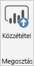
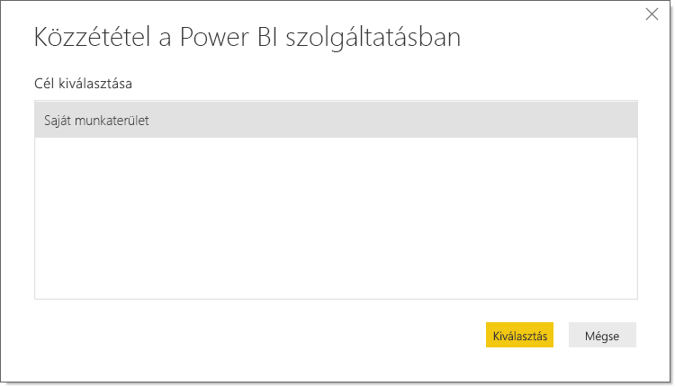
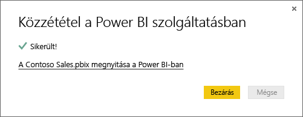

# Adatkészletek és jelentések közzététele a Power BI Desktopból
Amikor közzétesz egy **Power BI Desktop-fájlt** a **Power BI szolgáltatásban**, a rendszer a modellben található adatokat és a **Jelentés** nézetben létrehozott jelentéseket közzéteszi az Ön Power BI-munkaterületén. A munkaterület-kezelőben megjelenik egy ugyanilyen nevű új adatkészlet, valamint az összes jelentés.

A **Power BI Desktopból** való közzétételnek az eredménye ugyanaz, mintha a Power BI-ban az **Adatok lekérése** használatával csatlakozunk és feltöltünk egy **Power BI Desktop**-fájlt.

> [!NOTE]
> A jelentésnek a Power BI-ban elvégzett bármilyen módosítása – például vizualizációk hozzáadása, törlése és módosítása – nem lesz mentve az eredeti **Power BI Desktop**-fájlban.
> 
> 

## Power BI Desktop-adatkészletek és -jelentések közzététele
1. A Power BI Desktopban válassza a **Fájl** \> **Közzététel** \> **Közzététel a Power BI-ban** lehetőséget, vagy a menüszalagon a **Közzététel** elemet.  

   

2. Jelentkezzen be a Power BI szolgáltatásba.
3. Válassza ki a célt.

   

Amikor végzett, egy hivatkozást kap, amely a jelentésére mutat. A hivatkozásra kattintva megnyithatja a jelentést saját Power BI-webhelyén.

## Egy Power BI Desktoppal közzétett adatkészlet újbóli közzététele vagy cseréje
Egy **Power BI Desktop-fájl** közzétételekor a rendszer a **Power BI Desktopban** létrehozott adatkészletet és jelentéseket közzéteszi az Ön Power BI-webhelyén. Egy **Power BI Desktop-fájl** újbóli közzétételekor a rendszer a Power BI-webhelyen található adatkészletet lecseréli a **Power BI Desktop-fájlból** származó frissített adatkészletre.

Mindez egyszerű, de van néhány dolog, amit érdemes tudni:

* Ha a Power BI-ban kettő vagy több adatkészletnek ugyanaz a neve, mint a **Power BI Desktop-fájlnak**, akkor a közzététel meghiúsulhat. Ügyeljen arra, hogy a Power BI-ban csak egy adatkészletnek legyen ugyanaz a neve. Át is nevezheti a fájlt, és közzéteheti úgy, amivel létrehoz egy új, a fájllal megegyező nevű adatkészletet.
* Ha átnevez vagy töröl egy oszlopot vagy mértéket, a Power BI-ban az adott mezőre hivatkozó vizualizációk meghibásodhatnak. 
* A Power BI a meglévő oszlopok esetében bizonyos formázási módosításokat figyelmen kívül hagy. Ilyen például, ha egy oszlop formátumát 0,25-ről 25%-ra módosítjuk.
* Ha a Power BI-ban egy meglévő adatkészlethez konfigurálva van egy frissítési ütemezés, és a fájlhoz új adatforrásokat adunk hozzá, majd újra közzétesszük a fájlt, akkor az ütemezett frissítést megelőzően be kell jelentkezni az adatforrásokba az *Adatforrások kezelése* felületen.
* Amikor újból közzétesz egy a **Power BI Desktopban** közzétett adatkészletet, és egy frissítési ütemterv van meghatározva, az adatkészlet frissítése az ismételt közzététel után azonnal megkezdődik. 

