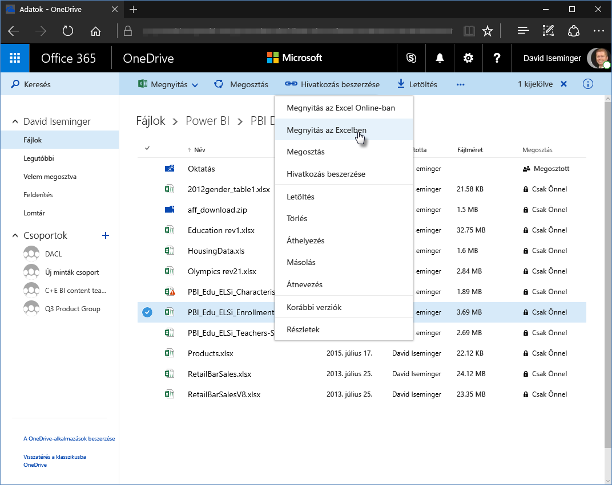
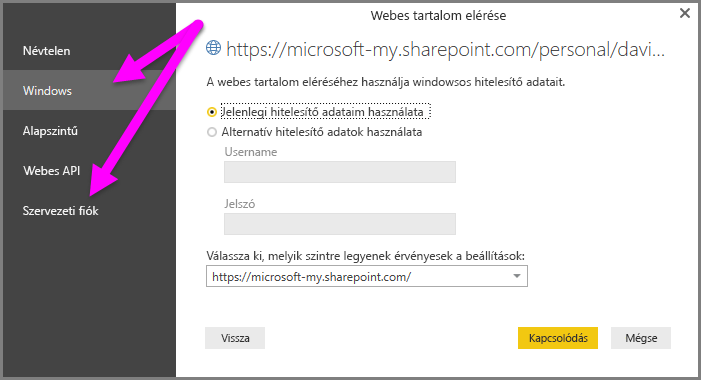

# A OneDrive Vállalati verzió hivatkozásainak használata a Power BI Desktopban
Sokan tárolnak olyan Excel-munkafüzeteket a OneDrive Vállalati verziójában, amelyeket kiválóan tudnának a Power BI Desktopban használni. A Power BI Desktopban használhat a OneDrive Vállalati verziójában tárolt Excel-fájlokra mutató online hivatkozásokat jelentések és vizualizációk létrehozásához. Ehhez használhat OneDrive Vállalati verzió-csoportfiókot, vagy a saját OneDrive Vállalati verzió-fiókját.

Egy OneDrive Vállalati verzióra mutató online hivatkozás beállításához szükség van néhány konkrét lépésre. Az alábbi szakaszok ismertetik ezeket a lépéseket, amelyek segítségével megoszthatja a fájlhivatkozást különböző csoportokkal, gépekkel és munkatársakkal.

## Hivatkozás kiolvasása az Excelből
1. Lépjen egy böngésző segítségével a OneDrive Vállalati verzió helyére. Kattintson a jobb gombbal a használni kívánt fájlra, majd válassza a **Megnyitás Excelben** lehetőséget.
   
   > [!NOTE]
   > Előfordulhat, hogy a böngészője felülete nem egyezik teljes mértékben az alábbi ábrával. A OneDrive vállalati verzió böngészőfelületén található fájlokhoz több módon is kiválaszthatja a **Megnyitás Excelben** lehetőséget. Bármelyik lehetőség megfelel, amellyel meg tudja nyitni a fájlt Excelben.
   > 
   > 
   
   
2. Az Excelben válassza a **Fájl** > **Információk** lehetőséget, majd a **Munkafüzet védelme** feletti **Elérési út másolása** lehetőséget.
   
   

## A hivatkozás használata a Power BI Desktopban
A Power BI Desktopban használhatja az imént a vágólapra másolt hivatkozást. Hajtsa végre a következő lépéseket:

1. A Power BI Desktopban válassza az **Adatok beolvasása** > **Web** lehetőséget.
   
   
2. Az **Alapszintű** beállítás kijelölésével illessze be a hivatkozást a **Webről** párbeszéablakba.
3. A hivatkozás végéről távolítsa el a *?web=1* sztringet, hogy a Power BI Desktop megfelelően állapíthassa meg a fájl helyét, majd válassza az **OK** lehetőséget.
   
     
4. Ha a Power BI Desktop hitelesítő adatokat kér, válassza a **Windows** (helyszíni SharePoint-helyeknél) vagy a **Vállalati fiók**(Office 365- vagy OneDrive Vállalati verzióhoz tartozó helyeknél) lehetőséget.
   
   

   Megjelenik egy **Kezelő** párbeszédpanel, ahol választhat az Excelben talált táblák, lapok és tartományok listájáról. Ettől kezdve ugyanúgy használhatja a OneDrive Vállalati verziójában tárolt fájlt, mint bármelyik Excel-fájlt. Létrehozhat jelentéseket, és ugyanúgy felhasználhatja adathalmazokban, mint bármely más adatforrást.

> [!NOTE]
> Ha egy OneDrive Vállalati verzióbeli fájlt úgy szeretne adatforrásnak használni a Power BI szolgáltatásban, hogy a **Szolgáltatásfrissítés** be van kapcsolva, ügyeljen arra, hogy az **OAuth2** **hitelesítési módszert** válassza a frissítési beállítások konfigurálásakor. Ellenkező esetben hiba (például egy *Az adatforrás hitelesítő adatainak frissítése sikertelen volt* üzenet) jelentkezhet a csatlakozás vagy a frissítés során. Ha hitelesítési módszernek az **OAuth2** módszert használja, megszűnik a hitelesítési hiba.
> 
> 

