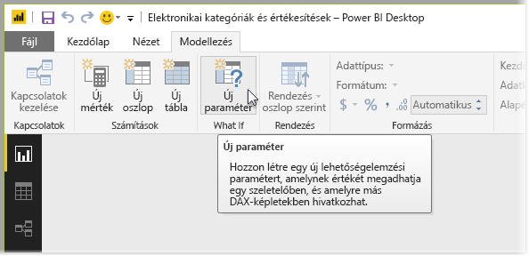
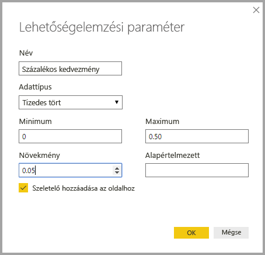
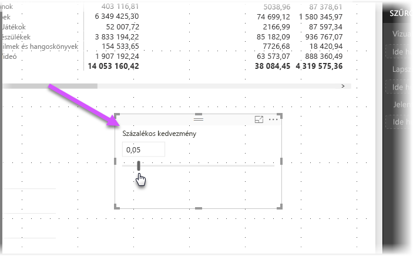
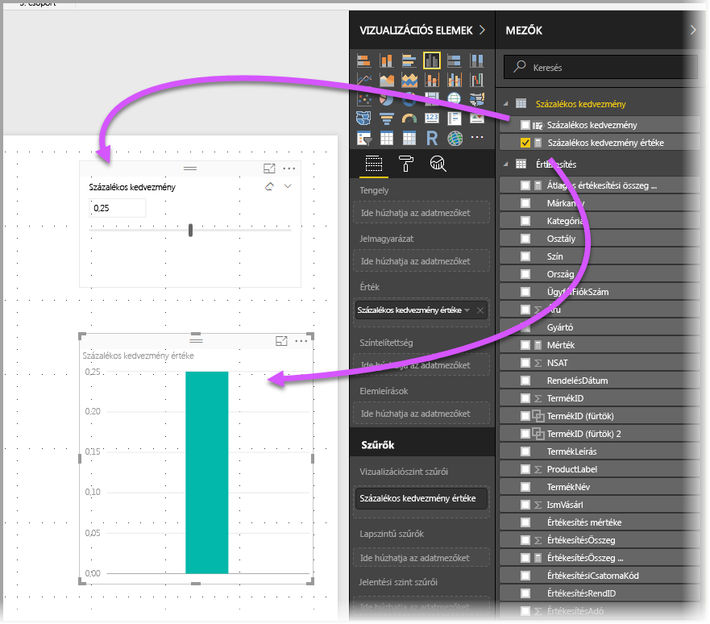
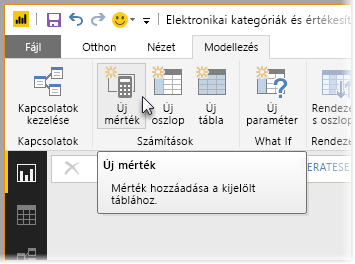
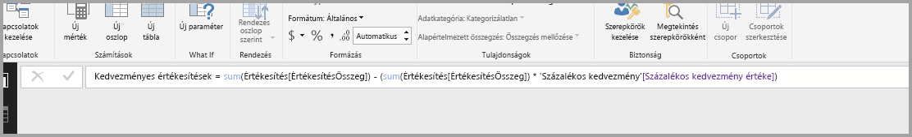
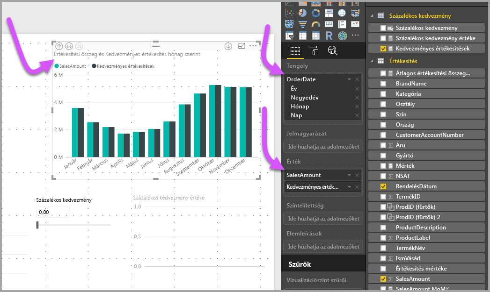
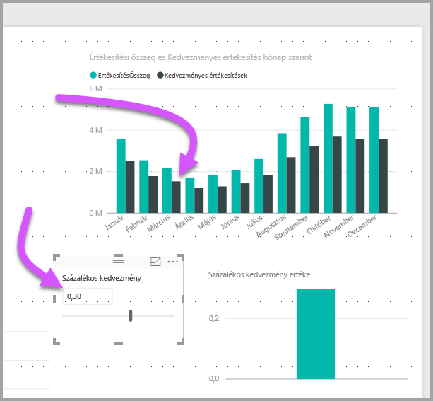

# Lehetőségelemzési paraméter létrehozása és használata változók vizualizációjához a Power BI Desktopban

A *Power BI Desktop* 2018. augusztusi kiadásától kezdve létrehozhat *lehetőségelemzési* változókat a jelentésekhez, szeletelőként dolgozhat a változókkal, valamint megjelenítheti és számszerűsítheti a jelentésekben szereplő különböző kulcsértékeket.

*Lehetőségelemzési* paramétert a Power BI Desktop **Modellezés** lapján hozhat létre. Ennek kiválasztáskor megjelenik egy párbeszédpanel, ahol beállíthatja a paramétert.

## Lehetőségelemzési paraméter létrehozása

Lehetőségelemzési paraméter létrehozásához válassza a Power BI Desktop **Modellezés** lapjának **Új paraméter** elemét. Az alábbi képen létrehoztunk egy *Kedvezmény százaléka* nevű paramétert, és az adattípusát **Tizedes törtre** állítottuk. A **minimális** érték nulla. A **maximum** 0,50 (50 százalék). A **Növekményt** 0,05-re, vagyis 5%-ra állítottuk. Ennyit fog a paraméter módosítani, ha egy jelentésben dolgozik vele.

> [!NOTE]
> Tizedes törtek esetén mindig írja ki a tizedesjel előtti nullát (például 0,50 a ,50 alak helyett). Ellenkező esetben a szám nem lesz érvényesítve, és az **OK** gomb nem válaszható ki.
> 
> 

Kényelmi funkcióként a **Szeletelő hozzáadása az oldalhoz** jelölőnégyzet automatikusan elhelyez egy szeletelőt a lehetőségelemzési paraméterrel a jelentés aktuális oldalán.

Egy Lehetőségelemzési paraméter létrehozása a paraméter mellet egy mértéket is létrehoz, amely a lehetőségelemzési paraméter aktuális értékének megjelenítésére használható.

Érdemes és hasznos megjegyezni, hogy miután létrehozott egy lehetőségelemzési paramétert, a paraméter és a mérték is a modell része lesz. Ezért elérhetők a jelentésen keresztül, és a jelentés egyéb oldalain is használhatók. Emellett, mivel ezek a modell részei, a szeletelőt törölheti is a jelentésoldalról. Ha vissza szeretné állítani, csak húzza át a lehetőségelemzési paramétert a **Mezők** listájából a vászonra, majd állítsa át szeletelőre a vizualizációt.

## Lehetőségelemzési paraméter használata

Hozzunk létre egy, a lehetőségelemzési paraméter használatát bemutató, egyszerű példát. A lehetőségelemzési paramétert már létrehoztuk az előző szakaszban. Most egy új mérték létrehozásával vesszük használatba, amelynek az értéke a csúszka helyzetének megfelelően változik.

Az új mérték egyszerűen a teljes értékesítés mennyisége lesz, a kedvezménnyel együtt. Összetett és érdekes mértékeket is létrehozhat, amelyek lehetővé teszik a jelentések felhasználói számára, hogy megjelenítsék a lehetőségelemzési paraméter változóját. Például létrehozhat egy jelentést, amely lehetővé teszi az értékesítés területén dolgozó személyeknek a kompenzáció megtekintését, ha elérnek bizonyos értékesítési célokat vagy százalékokat, vagy megtekinthetik a megnövekedett értékesítés nagyobb kedvezményekre gyakorolt hatását.

Írja be a mérték képletét a képletsávba, és adja a képletnek az *Értékesítés kedvezmény után* nevet.

Ezután létrehozunk egy oszlopvizualizációt **OrderDate** névvel a tengelyen, valamint a **SalesAmount** és a most létrehozott **Értékesítés kedvezmény után** mértékkel mint értékekkel.

Ezután ahogy mozgatjuk a csúszkát, láthatjuk, hogy az **Értékesítés kedvezmény után** oszlop a kedvezményes értékesítések mennyiségét tükrözi.

Ennyi az egész! Lehetőségelemzési paraméterek sokféle helyzetben használhatók. Ilyen paraméterekkel lehetővé teheti a jelentések felhasználói számára, hogy a jelentésekben létrehozott különböző forgatókönyvekkel dolgozzanak.
