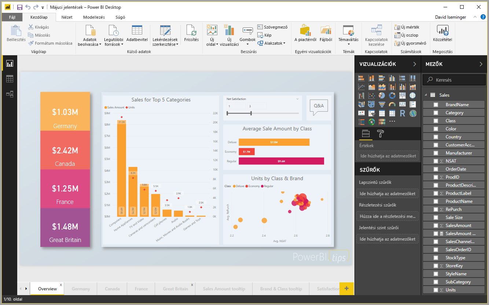
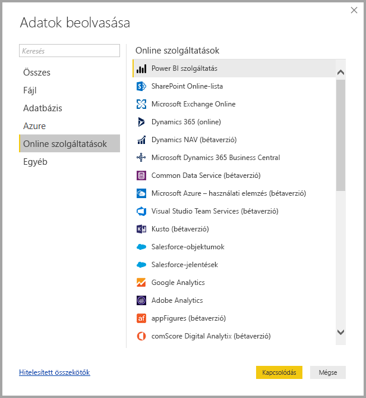
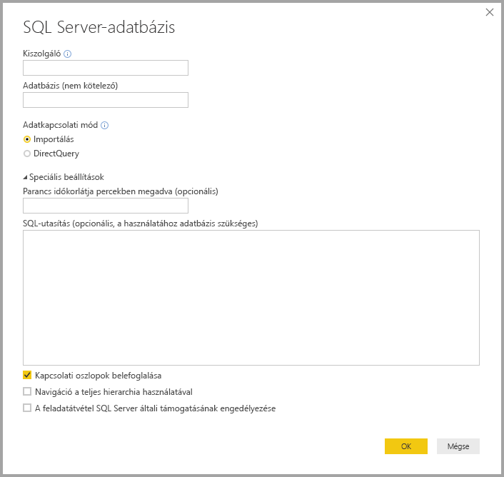
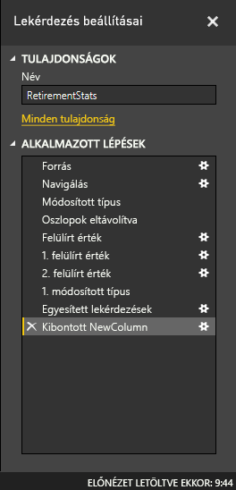
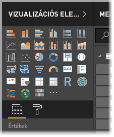
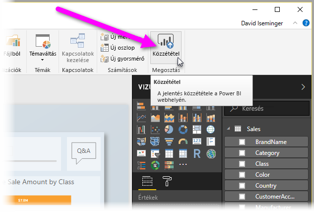

# Mi az a Power BI Desktop?

A *Power BI Desktop* egy ingyenes alkalmazás, amelyet a helyi számítógépén telepíthet, és amellyel csatlakozhat adatokhoz, amelyeket átalakíthat és vizualizációkkal megjeleníthet. A Power BI Desktoppal több különböző adatforráshoz csatlakozhat, és egy adatmodellben egyesítheti ezeket (ezt gyakran *modellezésnek* nevezik). Az adatmodellel vizualizációkat ás vizualizációgyűjteményeket készíthet, amelyeket jelentésként megoszthat a szervezet további tagjaival. Az üzleti intelligenciát alkalmazó projekteken dolgozó legtöbb felhasználó a Power BI Desktop használatával hoz létre jelentéseket, amelyeket a *Power BI szolgáltatással* oszt meg másokkal.

A Power BI Desktop leggyakoribb alkalmazási helyzetei az alábbiak:

* Csatlakozás adatokhoz
* Az adatok átalakítása és megtisztítása és adatmodell létrehozása
* Vizualizációk, például diagramok és grafikonok létrehozása, amelyekkel vizuálisan bemutathatók az adatok
* Vizualizációkból álló jelentések létrehozása egy vagy több jelentésoldalon
* Jelentések megosztása másokkal a Power BI szolgáltatással

Az ilyen feladatokat végzőket általában *adatelemzőknek* (ritkábban egyszerűen *elemzőknek* is) vagy üzleti intelligenciával foglalkozó szakembereknek (őket gyakran *jelentéskészítőknek* is) nevezzük. Ezzel együtt azonban nagyon sokan használják még a Power BI Desktopot, akik nem tekintik magukat elemzőnek vagy jelentéskészítőnek, de szeretnének lenyűgöző jelentéseket létrehozni, vagy sok különféle forrásból származó adatból adatmodelleket szeretnének létrehozni, amelyeket aztán megosztanak a cégen belüli munkatársakkal.

A Power BI Desktopban három nézet érhető el, amelyek a vászon bal oldalán válaszhatók ki. Ezek a következők (megjelenési sorrendben):
* **Jelentés**: Itt hozhat létre jelentéseket és vizualizációkat, és a kreatív folyamat nagy része itt zajlik.
* **Adatok**: Itt láthatja a jelentéshez tartozó adatmodellben használt táblákat, mértékeket és egyéb adatokat, és itt alakíthatja át az adatokat a jelentésmodellhez leginkább megfelelő formában.
* **Modell**: Ebben a nézetben megtekintheti és kezelheti az adatmodell tábláinak kapcsolatait.

A következő képen a vászon bal oldalán látható három nézet található:

 

## Csatlakozás adatokhoz
A Power BI Desktoppal való munka első lépéseként csatlakoznia kell az adatokhoz. A Power BI Desktop használatával számos adatforráshoz csatlakozhat. 

Csatlakozás adatokhoz:

1. A **Kezdőlap** menüszalagon válassza az **Adatok lekérése** > **Továbbiak** lehetőséget. 

   Ekkor megjelenik az **Adatok lekérése** ablak, amelyen látható, milyen sokféle adatforráshoz lehet csatlakozni a Power BI Desktoppal.

   

2. Az adattípus kiválasztásánál a rendszer kérni fog néhány információt, például az URL-címet és a hitelesítő adatokat, amelyekre a Power BI Desktopnak szüksége van ahhoz, hogy az Ön nevében csatlakozni tudjon az adatforráshoz.

   

3. Miután csatlakozott egy vagy több adatforráshoz, az adatokat bizonyára át kell alakítania, hogy használni tudja őket.

## Adatok átalakítása és megtisztítása, adatmodell létrehozása

A Power BI Desktopban a beépített [Power Query-szerkesztővel](https://docs.microsoft.com/power-bi/desktop-query-overview) alakíthatja át és tisztíthatja meg az adatokat. A Power Query-szerkesztővel módosításokat végezhet az adatokon, például megváltoztathatja az adattípust, eltávolíthat oszlopokat, vagy több forrásból származó adatokat kombinálhat. Ez hasonlít a szobrászathoz: egy nagyobb tömb agyaggal kezdi (esetünkben az adatokkal), és szükség szerint elkezd kisebb darabokat levágni, esetleg újabbakat hozzátenni egészen addig, amíg az adatok pontosan úgy nem néznek ki, ahogy azt Ön szeretné. 

A Power Query-szerkesztő indítása:

- Válassza a **Lekérdezések szerkesztése** > **Lekérdezések szerkesztése** lehetőséget a **Kezdőlap** menüszalagon.

   Megnyílik a **Power Query-szerkesztő** ablaka.

   

A Power Query-szerkesztő az adatátalakítás minden lépését (például egy tábla átnevezését, egy adattípus átalakítását vagy egy oszlop törlését) rögzíti. Ezek a lépések lesznek végrehajtva minden alkalommal, amikor a lekérdezés csatlakozik az adatforráshoz, így az adatok mindig a megadott módon lesznek formálva.

Az alábbi képen egy olyan lekérdezéssel látható a **Power Query-szerkesztő** ablaka, amelyet már formáztak és adatmodellé alakítottak át.

 

Ha az adtok formájával meg van elégedve, létrehozhat vizualizációkat. 

## Vizualizációk létrehozása 

Ha már rendelkezik adatmodellel, a jelentésvászonra húzhat *mezőket*, és így hozhat létre *vizualizációkat*. A vizualizáció a modellben lévő adatok grafikus megjelenítése. A Power BI Desktopban számos különféle vizualizáció közül választhat. Az alábbi vizualizáció egy egyszerű oszlopdiagramot mutat. 

Vizualizáció létrehozása vagy módosítása: 

- A **vizualizációk** panelen válassza a vizualizáció ikont. 

   

   Ha a jelentésvásznon már ki van választva egy vizualizáció, az az Ön által kiválasztott típusúra módosul. 

   Ha nincs kiválasztva vizualizáció a vásznon, ekkor létrejön egy új vizualizáció a kiválasztás alapján.

## Jelentések létrehozása

A leggyakrabban több vizualizációból álló csoportot érdemes létrehozni, amelyek a Power BI Desktop adatmodelljének létrehozásához használt adatok különféle aspektusait világítják meg. A vizualizációk csoportját a Power BI Desktop-fájlban *jelentésnek* nevezzük. A jelentés egy vagy több oldalból is állhat, ahogyan egy Excel-fájl is tartalmazhat több munkalapot is. 

A Power BI Desktoppal összetett és gazdag vizualizációkkal rendelkező jelentéseket hozhat létre sok különféle adatforrás használatával, és mindezt egyetlen jelentésként oszthatja meg a cég többi munkatársával.

Az alábbi képen egy Power BI Desktop-jelentés első oldala látható **Overview** (Áttekintés) névvel (a lapfül a kép alján látható). 

## Jelentések megosztása

Ha a jelentéssel elkészült, és az már megosztható másokkal, a jelentést *közzéteheti* a Power BI szolgáltatásban, és így elérhetővé teheti a cégen belül mindenki számára, aki rendelkezik Power BI-licenccel. 

Power BI Desktop-jelentés közzététele: 

1. A **Kezdőlap** menüszalagon válassza a **Közzététel** lehetőséget.

   

   A Power BI Desktop a Power BI-fiókjával csatlakoztatja Önt a Power BI szolgáltatáshoz. 

2. A Power BI megkéri, hogy válassza ki, a Power BI szolgáltatás mely részén szeretné megosztani a jelentést, például a saját munkaterületen, a csoport munkaterületén, vagy a szolgáltatás más szakaszában. 

   Ahhoz, hogy jelentéseket oszthasson meg a Power BI szolgáltatásban, Power BI-licenccel kell rendelkeznie.

## Következő lépések

A Power BI Desktop használatának megkezdéséhez először töltse le és telepítse az alkalmazást. A Power BI Desktopot kétféle módon szerezheti be:

* [A Power BI Desktopot beszerezheti a Windows Áruházból](https://aka.ms/pbidesktopstore)
* [A Power BI Desktopot letöltheti az internetről](https://docs.microsoft.com/power-bi/desktop-get-the-desktop#download-power-bi-desktop-directly)

