# <a name="tutorial-developing-a-power-bi-visual"></a>Oktatóanyag: Power BI-vizualizáció fejlesztése

Lehetővé tesszük a fejlesztők számára, hogy könnyedén hozzáadjanak a Power BI-hoz az irányítópultokon és a jelentésekben használható egyéni vizualizációkat. Hogy segítsük az első lépések megtételét, közzétettük az összes vizualizációnk kódját a GitHubon.

A vizualizációs keretrendszerrel együtt elérhetővé tettük a tesztelői csomagot és eszközöket is, hogy a közösség minél jobb minőségű vizualizációkat hozhasson létre a Power BI-hoz.

Ez az oktatóanyag bemutatja, hogyan hozható létre egy egyéni Power BI-vizualizáció Circle Card néven, amely egy formázott mérési értéket jelenít meg egy kör belsejében. A Circle Card vizualizáció lehetővé teszi a kitöltőszín és a körvonal vastagságának testreszabását.

A Power BI Desktop-jelentésben a kártyák kerek kártyákká módosíthatók.

  

Az oktatóanyag a következőket ismerteti:
> [!div class="checklist"]
> * Egyéni Power BI-vizualizáció létrehozása.
> * Az egyéni vizualizáció testreszabása D3 vizuális elemekkel.
> * A vizuális elemekhez tartozó adatkötés konfigurálása.
> * Adatértékek formázása.

## <a name="prerequisites"></a>Előfeltételek

* Ha még nem regisztrált a **Power BI Pro** szolgáltatásra, a kezdés előtt [hozzon létre egy ingyenes próbaverziós fiókot](https://powerbi.microsoft.com/pricing/).
* Szüksége lesz a [Visual Studio Code](https://www.visualstudio.com/) telepített példányára.
* Windows-felhasználóknak a [Windows PowerShell](https://docs.microsoft.com/powershell/scripting/setup/installing-windows-powershell?view=powershell-6) 4-es vagy újabb verziójára, OSX-felhasználóknak a [Terminal](https://macpaw.com/how-to/use-terminal-on-mac) segédprogramra van szükségük.

## <a name="setting-up-the-developer-environment"></a>A fejlesztői környezet beállítása

Az előfeltételek mellett néhány további eszközt is telepíteni kell.

### <a name="installing-nodejs"></a>A Node.js telepítése

1. A Node.js telepítéséhez egy webböngészőben navigáljon a [Node.js](https://nodejs.org) webhelyére.

2. Töltse le a legújabb MSI-telepítőt.

3. Futtassa a telepítőt, és hajtsa végre a telepítési lépéseket. Fogadja el a licencszerződés feltételeit és az alapértelmezett beállításokat.

   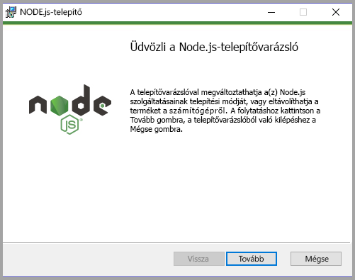

4. Indítsa újra a számítógépet.

### <a name="installing-packages"></a>Csomagok telepítése

Telepítenie kell a **pbviz** csomagot.

1. Nyissa meg a Windows PowerShellt, miután a számítógép újraindult.

2. A pbviz telepítéséhez írja be a következő parancsot.

    ```powershell
    npm i -g powerbi-visuals-tools
    ```

### <a name="creating-and-installing-a-certificate"></a>Tanúsítvány létrehozása és telepítése

#### <a name="windows"></a>Windows

1. Egy tanúsítvány létrehozásához és telepítéséhez írja be a következő parancsot.

    ```powershell
    pbiviz --install-cert
    ```

    A visszaadott eredmény létrehoz egy *jelszót*. Ebben az esetben a *jelszó* a következő: **_15105661266553327_** . Ez a tanúsítványimportáló varázslót is elindítja.

    

2. A Tanúsítványimportáló varázslóban figyeljen arra, hogy a tárolás helye az Aktuális felhasználó legyen. Ezután kattintson a *Tovább* gombra.

      

3. Az **Importálandó fájl** lépésnél kattintson a *Tovább* gombra.

4. A **Titkos kulcs védelme** lépésnél a Jelszó mezőbe illessze be a tanúsítvány létrehozásakor kapott jelszót.  Az esetünkben ez az **_15105661266553327_** .

      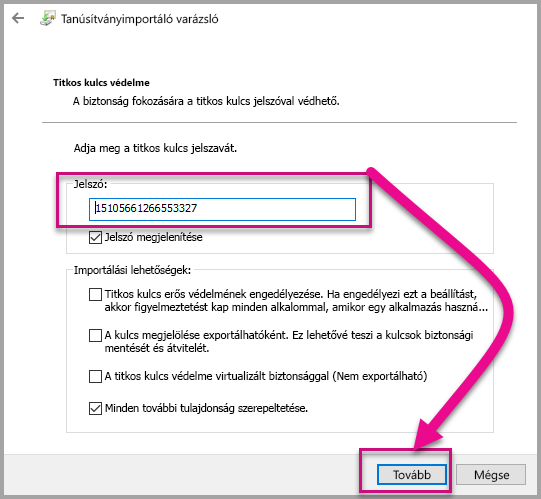

5. A **Tanúsítványtároló** lépésnél válassza ki a **Minden tanúsítvány tárolása ebben a tárolóban** lehetőséget. Kattintson a *Tallózás* elemre.

      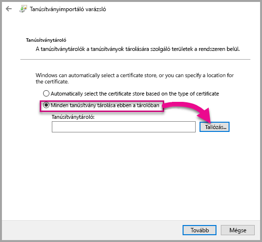

6. A **Tanúsítványtároló kiválasztása** ablakban válassza a **Megbízható legfelső szintű hitelesítésszolgáltatók** tárolót, majd kattintson az *OK* gombra. Ezután kattintson a *Tovább* gombra a **Tanúsítványtároló** képernyőn.

      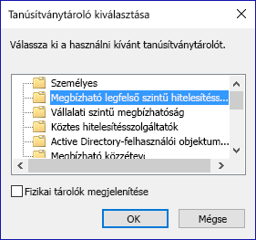

7. Az importálás befejezéséhez kattintson a **Befejezés** gombra.

8. Ha megjelenik egy biztonsági figyelmeztetés, kattintson az **Igen** válaszra.

    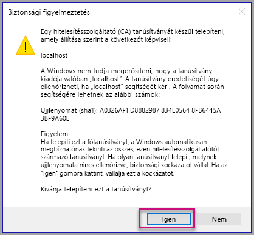

9. Ha megjelenik egy értesítés arról, hogy az importálás sikeres volt, kattintson az **OK** gombra.

    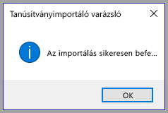

> [!Important]
> Ne zárja be a Windows PowerShell-munkamenetet.

#### <a name="osx"></a>OSX

1. Ha a bal felső sarokban látható lakat zárva van, kattintással vagy koppintással nyissa ki. Keressen rá a *localhost* szóra, és kattintson duplán a tanúsítványra.

    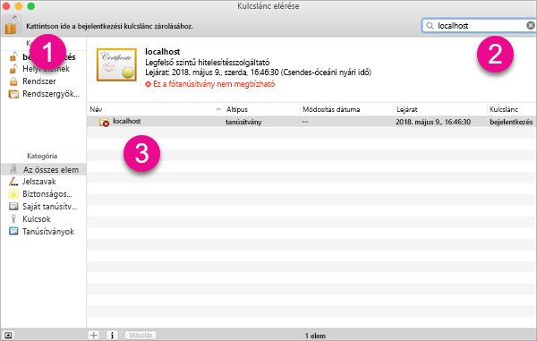

2. Válassza a **Mindig legyen megbízható** lehetőséget, és zárja be az ablakot.

    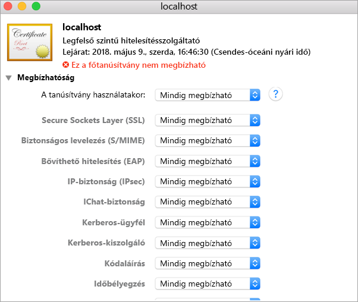

3. Adja meg a felhasználónevét és a jelszavát. Válassza a **Beállítások frissítése** gombot.

    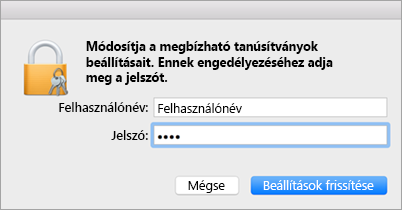

4. Ha van nyitva böngésző, zárja be.

> [!NOTE]
> Ha a rendszer nem ismeri fel a tanúsítványt, valószínűleg újra kell indítani a számítógépet.

## <a name="creating-a-custom-visual"></a>Egyéni vizualizáció létrehozása

Most, hogy beállította a környezetet, ideje létrehozni az egyéni vizualizációt.

Az oktatóanyag teljes forráskódját [innen letöltheti](https://github.com/Microsoft/PowerBI-visuals-circlecard).

1. Győződjön meg róla, hogy már telepítve van a Power BI vizuális eszközeit tartalmazó csomag.

    ```powershell
    pbiviz
    ```
    Ekkor a súgónak kell megjelennie.

    <pre><code>
        +syyso+/
    oms/+osyhdhyso/
    ym/       /+oshddhys+/
    ym/              /+oyhddhyo+/
    ym/                     /osyhdho
    ym/                           sm+
    ym/               yddy        om+
    ym/         shho /mmmm/       om+
        /    oys/ +mmmm /mmmm/       om+
    oso  ommmh +mmmm /mmmm/       om+
    ymmmy smmmh +mmmm /mmmm/       om+
    ymmmy smmmh +mmmm /mmmm/       om+
    ymmmy smmmh +mmmm /mmmm/       om+
    +dmd+ smmmh +mmmm /mmmm/       om+
            /hmdo +mmmm /mmmm/ /so+//ym/
                /dmmh /mmmm/ /osyhhy/
                    //   dmmd
                        ++

        PowerBI Custom Visual Tool

    Usage: pbiviz [options] [command]

    Commands:

    new [name]        Create a new visual
    info              Display info about the current visual
    start             Start the current visual
    package           Package the current visual into a pbiviz file
    update [version]  Updates the api definitions and schemas in the current visual. Changes the version if specified
    help [cmd]        display help for [cmd]

    Options:

    -h, --help      output usage information
    -V, --version   output the version number
    --install-cert  Install localhost certificate
    </code></pre>

    <a name="ssl-setup"></a>

2. Tekintse át a kimenetet, amely a támogatott parancsok listáját tartalmazza.

     

3. Egy egyéni vizualizációs projekt létrehozásához futtassa a következő parancsot. A projekt neve **CircleCard**.

    ```PowerShell
    pbiviz new CircleCard
    ```
    

    > [!Note]
    > Az új projektet a kérés jelenlegi helyén hozza létre.

4. Lépjen a projekt mappájára.

    ```powershell
    cd CircleCard
    ```
5. Indítsa el az egyéni vizualizációt. A CircleCard vizualizáció most már fut, és a helyi számítógép tárolja.

    ```powershell
    pbiviz start
    ```

    

> [!Important]
> Ne zárja be a Windows PowerShell-munkamenetet.

### <a name="testing-the-custom-visual"></a>Az egyéni vizualizáció tesztelése

Ebben a szakaszban tesztelni fogjuk a CircleCard egyéni vizualizációt. Ehhez feltöltünk egy Power BI Desktop-jelentést, majd szerkesztjük a jelentést az egyéni vizualizáció megjelenítéséhez.

1. Jelentkezzen be a [PowerBI.com](https://powerbi.microsoft.com/) webhelyen > kattintson a **fogaskerék ikonra** > válassza a **Beállítások** lehetőséget.

      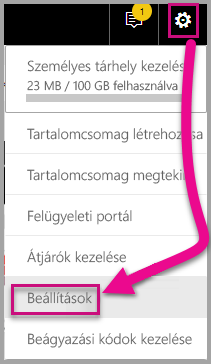

2. Válassza a **Fejlesztő** elemet, majd jelölje be a **Fejlesztői vizualizáció engedélyezése teszteléshez** jelölőnégyzetet.

    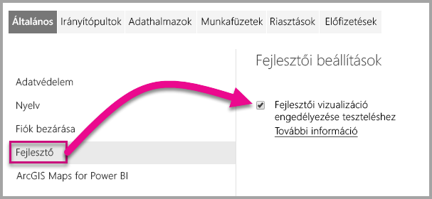

3. Töltsön fel egy Power BI Desktop-jelentést.  

    Adatok lekérése > Fájl > Mappa.

    Ha még nem hozott létre egy Power BI Desktop-jelentést, [letölthet](https://microsoft.github.io/PowerBI-visuals/docs/step-by-step-lab/images/US_Sales_Analysis.pbix) egy mintajelentést.

     

    A jelentés megtekintéséhez válassza a **US_Sales_Analysis** elemet a bal oldali navigációs panel **Jelentés** szakaszában.

    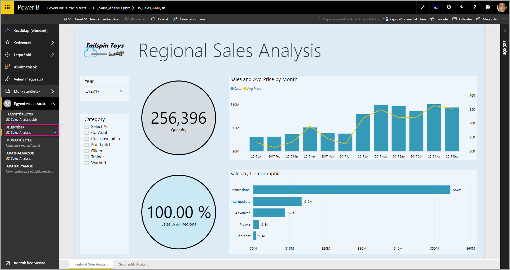

4. Most szerkesztenie kell a jelentést a Power BI szolgáltatásban.

    Lépjen a **Jelentés szerkesztése** elemre.

    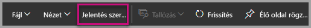

5. Válassza a **Fejlesztői vizualizáció** lehetőséget a **Vizualizációk** panelen.

    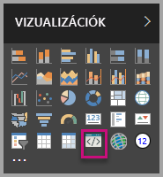

    > [!Note]
    > Ez a vizualizáció jelöli azt az egyéni vizualizációt, amelyet elindított a számítógépén. Csak akkor érhető el, ha a fejlesztői beállítások engedélyezve lettek.

6. Figyelje meg, hogy a jelentésvásznon megjelent egy új vizualizáció.

    

    > [!Note]
    > Ez egy nagyon egyszerű vizualizáció, amely megjeleníti, hogy az Update (Frissítés) metódus hány alkalommal lett meghívva. Egyelőre a vizualizáció nem kap adatokat.

7. Amikor kiválasztja a jelentésben az új vizualizációt, lépjen a Mezők ablaktáblára > bontsa ki a Sales (Értékesítés) elemet > kattintson a Quantity (Mennyiség) elemre.

    

8. Az új vizualizáció teszteléséhez méretezze át a vizualizációt, majd figyelje meg, hogy a frissítési érték megnövekszik.

    

A PowerShellben az egyéni vizualizáció futtatásának leállításához nyomja le a Ctrl+C billentyűparancsot. Ha a rendszer megkérdezi, hogy leállítja-e a kötegelt feladatot, nyomja le az Y, majd az Enter billentyűt.

## <a name="adding-visual-elements"></a>Vizualizációs elemek hozzáadása

Telepítenie kell a **D3 JavaScript-kódtárat**. A D3 egy JavaScript-kódtár a webböngészőkben megjelenő dinamikus, interaktív adatvizualizációk létrehozásához. A széles körben elterjedt SVG HTML5 és CSS szabványt használja.

Most testreszabhatja az egyéni vizualizációt, hogy megjelenítsen egy szöveget tartalmazó kört.

> [!Note]
> Az oktatóanyag számos szöveges bejegyzése kimásolható [innen](https://github.com/Microsoft/powerbi-visuals-circlecard).

1. A **D3 kódtár** PowerShell-beli telepítéséhez futtassa az alábbi parancsot.

    ```powershell
    npm i d3@3.5.5 --save
    ```

    

2. A **D3 kódtár** típusdefinícióinak telepítéséhez futtassa az alábbi parancsot.

    ```powershell
    npm i @types/d3@3.5
    ```

    

    Ez a parancs telepíti a JavaScript-fájlokon alapuló TypeScript-definíciókat, ezzel lehetővé téve az egyéni vizualizáció testreszabását a TypeScript segítségével (amely a JavaScript egy bővített változata). A Visual Studio Code egy remekül használható IDE a TypeScript-alkalmazások fejlesztéséhez.

3. Indítsa el a [Visual Studio Code](https://code.visualstudio.com/)-ot.

    A **Visual Studio Code** a PowerShellből az alábbi paranccsal futtatható.

    ```powershell
    code .
    ```

4. Az **Explorer** ablaktáblán bontsa ki a **node_modules** mappát, és ellenőrizze, hogy a **d3 kódtár** telepítve lett-e.

    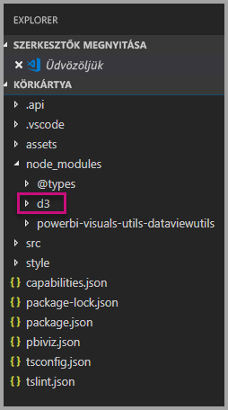

5. Figyelje meg az **index.d.ts** nevű TypeScript-fájlt, amelyet az **Explorer ablaktáblán** a node_modules > @types > d3 elemet kibontva talál meg.

    

6. Válassza ki a **pbiviz.json** fájlt.

7. A **d3 kódtár** regisztrálásához adja hozzá az alábbi fájlhivatkozást az externalJS tömbhöz. Ügyeljen arra, hogy tegyen egy *vesszőt* a meglévő fájlhivatkozás és az új fájlhivatkozás közé.

    ```javascript
    "node_modules/d3/d3.min.js"
    ```
    

8. Mentse a **pbiviz.json** fájl módosításait.

### <a name="developing-the-visual-elements"></a>Vizualizációs elemek testreszabása

Most már megnézhetjük, hogyan lehet testreszabni az egyéni vizualizációt, hogy megjelenítsen egy kört és egy mintaszöveget.

1. Az **Explorer ablaktáblán** bontsa ki az **src** mappát, és válassza ki a **visual.ts** fájlt.

    > [!Note]
    > Figyelje meg a **visual.ts** fájl tetején található megjegyzéseket. A Power BI egyéni vizuális csomagjainak használatára vonatkozó engedély az MIT-licenc feltételei szerint ingyenes. Az egyezmény értelmében ezeket a megjegyzéseket itt kell hagyni a fájl tetején.

2. Távolítsa el a következő alapértelmezett egyéni vizualizációs logikát a Visual (Vizualizáció) osztályból.
    * A négy osztályszintű privát változódeklaráció.
    * A konstruktor összes kódsora.
    * Az update (frissítés) metódus összes kódsora.
    * A modulban található minden fennmaradó sor, beleértve a parseSettings és enumerateObjectInstances metódust.

    Győződjön meg arról, hogy a modul kódja az alábbihoz hasonlóan néz ki.

    ```typescript
    module powerbi.extensibility.visual {
    "use strict";
    export class Visual implements IVisual {

        constructor(options: VisualConstructorOptions) {

        }

        public update(options: VisualUpdateOptions) {

            }
        }
    }
    ```

3. A *Visual* osztálydeklaráció alatt szúrja be a következő osztályszintű tulajdonságokat.

    ```typescript
     private host: IVisualHost;
     private svg: d3.Selection<SVGElement>;
     private container: d3.Selection<SVGElement>;
     private circle: d3.Selection<SVGElement>;
     private textValue: d3.Selection<SVGElement>;
     private textLabel: d3.Selection<SVGElement>; 
    ```

    

4. Adja hozzá a következő kódot a *konstruktorhoz*.

    ```typescript
    this.svg = d3.select(options.element)
                 .append('svg')
                 .classed('circleCard', true);
    this.container = this.svg.append("g")
                         .classed('container', true);
    this.circle = this.container.append("circle")
                             .classed('circle', true);
    this.textValue = this.container.append("text")
                                 .classed("textValue", true);
    this.textLabel = this.container.append("text")
                                 .classed("textLabel", true);
    ```

    Ez a kód hozzáad egy SVG-csoportot a vizualizációhoz, majd hozzáad három alakzatot: egy kört és két szöveges elemet.

    A dokumentumban található kód formázásához kattintson a jobb gombbal bárhol a **Visual Studio Code-dokumentumban**, majd válassza a **Dokumentum formázása** parancsot.

      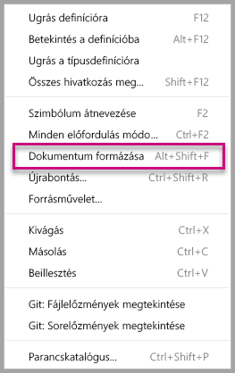

    A jobb olvashatóság érdekében javasoljuk, hogy a kódrészletek bemásolásakor minden alkalommal formázza a dokumentumot.

5. Adja hozzá a következő kódot az *update* (frissítés) metódushoz.

    ```typescript
    let width: number = options.viewport.width;
    let height: number = options.viewport.height;
    this.svg.attr({
     width: width,
     height: height
    });
    let radius: number = Math.min(width, height) / 2.2;
    this.circle
     .style("fill", "white")
     .style("fill-opacity", 0.5)
     .style("stroke", "black")
     .style("stroke-width", 2)
    .attr({
     r: radius,
     cx: width / 2,
     cy: height / 2
    });
    let fontSizeValue: number = Math.min(width, height) / 5;
    this.textValue
     .text("Value")
     .attr({
         x: "50%",
         y: "50%",
         dy: "0.35em",
         "text-anchor": "middle"
     }).style("font-size", fontSizeValue + "px");
    let fontSizeLabel: number = fontSizeValue / 4;
    this.textLabel
     .text("Label")
     .attr({
         x: "50%",
         y: height / 2,
         dy: fontSizeValue / 1.2,
         "text-anchor": "middle"
     })
     .style("font-size", fontSizeLabel + "px");
    ```

    *Ez a kód beállítja a vizualizáció szélességét és magasságát, majd inicializálja a vizualizációs elemek attribútumait és stílusait.*

6. Mentse a **visual.ts** fájlt.

7. Válassza ki **capabilities.json** fájlt.

    A 14. sortól kezdve távolítsa el a teljes „objects” elemet (14–60. sor).

8. Mentse a **capabilities.json** fájlt.

9. A PowerShellben indítsa el az egyéni vizualizációt.

    ```powershell
    pbiviz start
    ```

### <a name="toggle-auto-reload"></a>Átváltás automatikus újrabetöltésre

1. Lépjen vissza a Power BI-jelentéshez.
2. A fejlesztői vizualizáció fölött lebegő eszköztáron válassza az **Átváltás automatikus újrabetöltésre** lehetőséget.

    

    Ez a beállítás biztosítja, hogy a vizualizáció minden alkalommal automatikusan újra betöltődjön a projekt módosításainak mentésekor.

3. A **Mezők ablaktábláról** húzza a **Mennyiség** mezőt a fejlesztői vizualizációba.

4. Győződjön meg arról, hogy a vizualizáció az alábbihoz hasonlóan néz ki.

    

5. Méretezze át a vizualizációt.

    Figyelje meg, hogy a kör és a szöveg méretezési értékei igazodnak a vizualizáció elérhető méretéhez.

    A rendszer folyamatosan meghívja az update (frissítés) metódust a vizualizáció átméretezésével, ezzel kiváltva a vizualizációs elemek folyamatos átméretezését.

    Ezzel befejezte a vizualizációs elemek testreszabását.

6. Folytassa a vizualizáció futtatását.

## <a name="configuring-data-binding"></a>Adatkötés konfigurálása

Határozza meg az adatszerepköröket és az adatnézet-leképezéseket, majd módosítsa az egyéni vizualizáció logikáját, hogy megjelenítse egy mérőszám értékét és megjelenítendő nevét.

### <a name="configuring-the-capabilities"></a>A képességek konfigurálása

Módosítsa a **capabilities.json** fájlt az adatszerepkör és az adatnézet-leképezések meghatározásához.

1. A Visual Studio Code-ban távolítson el minden tartalmat a **capabilities.json** fájl **dataRoles** tömbjéből (3–12. sor).

2. Szúrja be a **dataRoles** tömbbe a következő kódot.

    ```json
    {
     "displayName": "Measure",
     "name": "measure",
     "kind": "Measure"
    }
    ```
    A **dataRoles** tömb mostantól egyetlen, **measure** (mérték) típusú szerepkört határoz meg, amelynek neve **measure**, és **mértékként** jelenik meg. Ez az adatszerepkör lehetővé teszi egy mértékmező vagy egy összesített mező átadását.

3. Távolítson el minden tartalmat a **dataViewMappings** tömbből (10–31. sor).

4. Szúrja be a **dataViewMappings** tömbbe a következő tartalmat.

    ```json
            {
            "conditions": [
                { "measure": { "max": 1 } }
            ],
            "single": {
                "role": "measure"
            }
           }
    ```
    A **dataViewMappings** tömb mostantól egy mezőt határoz meg, amely átadható a **measure** (mérték) nevű adatszerepkörnek.

5. Mentse a **capabilities.json** fájlt.

6. A Power BI-ban figyelje meg, hogy a vizualizáció most már konfigurálható a **mértékkel**.

    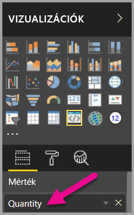

    > [!Note]
    > A vizualizációs projekt még nem tartalmaz adatkötési logikát.

### <a name="exploring-the-dataview"></a>Adatnézet exportálása

1. A vizualizáció fölött lebegő eszköztáron válassza a **Dataview megjelenítése** lehetőséget.

    

2. Bontsa ki az elemeket a **single** (egyetlen) elemig, majd figyelje meg az értéket.

    

3. Bontsa ki az elemeket a **metadata** (metaadatok) elemig, majd a **columns** (oszlopok) tömbig, és figyelje meg a **format** (formátum) és **displayName** (megjelenített név) értéket.

    

4. A vizualizációra való visszaváltáshoz a vizualizáció fölött lebegő eszköztáron válassza a **Dataview megjelenítése** lehetőséget.

    

### <a name="configuring-data-binding"></a>Adatkötés konfigurálása

1. A **Visual Studio Code**-ban, a **visual.ts** fájlban adja hozzá az alábbi utasítást az update (frissítés) metódus első utasításaként.

    ```typescript
    let dataView: DataView = options.dataViews[0];
    ```
    

    Ez az utasítás társítja a *dataView* objektumot egy változóhoz a könnyebb hozzáférés érdekében, és meghatározza, hogy a változó a *DataView* objektumra hivatkozzon.

2. Az **update** metódusban cserélje le a **.text("Value")** részt a következőre.

    ```typescript
    .text(dataView.single.value as string)
    ```
    

3. Az **update** metódusban cserélje le a **.text("Label")** részt a következőre.

    ```typescript
    .text(dataView.metadata.columns[0].displayName)
    ```
    

4. Mentse a **visual.ts** fájlt.

5. A **Power BI**-ban tekintse át a vizualizációt, amely most már megjeleníti az értéket és a megjelenítendő nevet.

Ezzel konfigurálta az adatszerepköröket, és hozzárendelte a vizualizációt az adatnézethez.

A következő oktatóanyagból megtudhatja, hogyan adhat hozzá formázási beállításokat az egyéni vizualizációhoz.

## <a name="debugging"></a>Hibakeresés

Az egyéni vizualizációban végzett hibakereséssel kapcsolatban a [hibakeresési útmutató](https://microsoft.github.io/PowerBI-visuals/docs/how-to-guide/how-to-debug/) szolgál hasznos tanácsokkal.

## <a name="next-steps"></a>Következő lépések

> [!div class="nextstepaction"]
> [Formázási beállítások hozzáadása](custom-visual-develop-tutorial-format-options.md)
