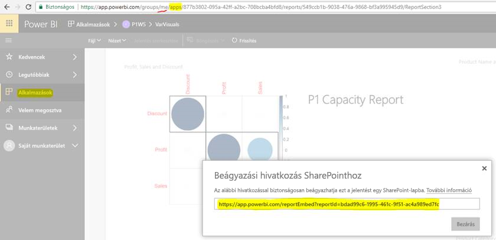

# Jelentések és irányítópultok beágyazása alkalmazásokból

A Power BI-ban létrehozhat az irányítópultokat és jelentéseket egy helyen összefűző alkalmazásokat. Ezután közzéteheti azokat a vállalat nagy csoportjai számára. Ezen alkalmazások használata akkor válik fontossá, ha minden felhasználója Power BI-felhasználó. Ekkor a Power BI-alkalmazásokon keresztül oszthat meg velük tartalmakat. A cikk bemutatja, hogyan kell beágyazni egy közzétett Power BI-alkalmazásból származó tartalmat egy külső alkalmazásba.

## Jelentési embedURL beszerzése beágyazáshoz

1. Példányosítsa az alkalmazást a **Saját munkaterület** nevű felhasználói munkaterületen. Ezt ossza meg saját magával, vagy irányítson hozzá egy másik felhasználót.

2. Nyissa meg a kívánt jelentést a Power BI szolgáltatásban.

3. Válassza a **Fájl** > **Beágyazás a SharePoint Online-ba** lehetőséget, és megtalálhatja a jelentés beágyazási URL-címét (embedURL). Az alábbi képernyőképen láthat egy minta beágyazási URL-címet. Alternatív megoldásként meghívhatja a GetReports/GetReport REST API-t, és a válaszból kinyerheti a megfelelő jelentés embedURL mezőjét. A REST-hívás URL-címe elvileg nem tartalmaz munkaterület-azonosítót, mivel az alkalmazás a felhasználó munkaterületén lett példányosítva.

    

4. Használja a 3. lépésben lekért embedURL-t a JavaScript SDK-val.

## Irányítópult embedURL-jének beszerzése beágyazáshoz

1. Példányosítsa az alkalmazást a **Saját munkaterület** nevű felhasználói munkaterületen. Ezt ossza meg saját magával, vagy irányítson hozzá egy másik felhasználót.

2. Alternatív megoldásként meghívhatja a GetDashboards REST API-t, és kinyerheti a válaszból a megfelelő irányítópult-embedURL-mezőt. A REST-hívás URL-címe elvileg nem tartalmaz munkaterület-azonosítót, mivel az alkalmazás a felhasználó munkaterületén lett példányosítva.

3. Használja a 2. lépésben lekért embedURL-t a JavaScript SDK-val.

## Következő lépések

Tekintse át, hogyan ágyazhat be tartalmakat a munkaterületről külső ügyfelekhez és a szervezetbe:

> [!div class="nextstepaction"]
>[Beágyazás külső ügyfelek számára](embed-sample-for-customers.md)

> [!div class="nextstepaction"]
>[Beágyazás a cég számára](embed-sample-for-your-organization.md)
