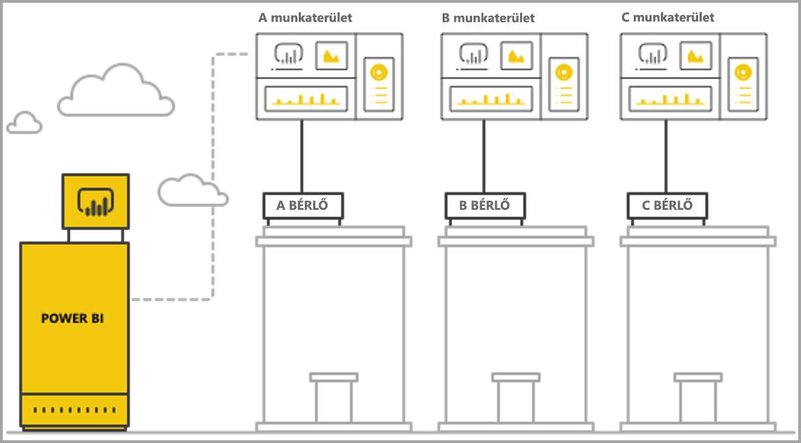
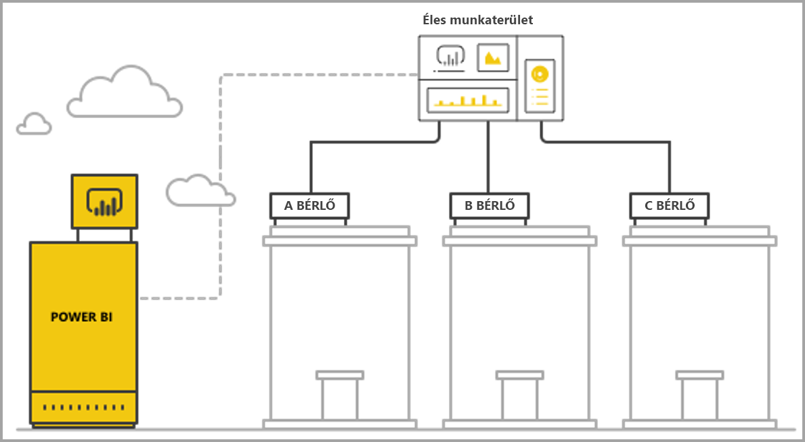

# Több-bérlős konfiguráció kezelése Power BI Embedded-analitikával

Több-bérlős SaaS-alkalmazás tervezése során körültekintően kell kiválasztani az SaaS-alkalmazás igényeinek leginkább megfelelő bérlői modellt. Ez az eljárás az SaaS-alkalmazás részeként, beágyazott analitikaként használt Power BI-ra is vonatkozik. A bérlői modell határozza meg, hogy az egyes bérlők adatai hogyan vannak leképezve és kezelve a Power BI-ban és a tárfiókban. A bérlői modell az alkalmazás tervezését és kezelését is érinti. Más modellre később áttérni költséges lehet, és megzavarhatja a folyamatos használatot.

A Power BI Embedded használatával a bérlők elkülönítése két alapvető módszerrel tartható fenn.

   1. **Munkaterület-alapú elkülönítés** – bérlőnként külön Power BI-munkaterület létrehozása.
   2. **Elkülönítés sorszintű biztonság alapján** – az adatokhoz való hozzáférés felhasználónkénti vagy csoportonkénti szabályozása és felügyelete a mögöttes adatok használatával.

Ez a cikk ismerteti és többféle kiértékelési szempont alapján elemzi a különböző módszereket.

## Fogalmak és szakkifejezések

**[AAD](https://docs.microsoft.com/azure/active-directory/fundamentals/active-directory-whatis)** – Azure Active Directory.

**AAD-alkalmazás** – Alkalmazás-identitás az AAD-ben. A hitelesítéshez AAD-alkalmazás szükséges.

**SaaS-alkalmazás (szoftverszolgáltatás)** – Nagyvállalat vagy független szoftverszállító által megvalósított rendszer, többnyire online szolgáltatás. Összefüggő szoftverek rendszere is lehet, amely több ügyfél-bérlőt (vállalatot) is kiszolgál. Ebben a cikkben **az SaaS-alkalmazás a Power BI Embedded használatával nyújt elemzéseket különböző bérlőinek**. A Power BI Embedded bármilyen típusú alkalmazáshoz használható, ha az rendelkezik online kapcsolattal.

**Bérlő** – Egyetlen ügyfél (vállalat), amely az SaaS-alkalmazást használja, valamint minden olyan erőforrás és adat, amelyet az ügyfél beemel az SaaS-alkalmazásba.

**[Power BI](../fundamentals/power-bi-overview.md)** – A Power BI a Power BI Embedded platformjaként szolgáló felhőszolgáltatás.

**Power BI-bérlő** – Egyetlen AAD-bérlőhöz társított Power BI-erőforrások halmaza.

**[Power BI-munkaterület](../service-create-workspaces.md)** – Tároló Power BI-beli tartalomhoz.

**Power BI-összetevők** – A Power BI-munkaterületeken több Power BI-összetevő, például irányítópult, jelentés, adathalmaz és adatfolyam is lehet.

**[Power BI Embedded](azure-pbie-what-is-power-bi-embedded.md)** – Nyilvános API-k készlete, melyekkel a fejlesztők a Power BI-tartalmat kezelő és Power BI-elemeket beágyazó alkalmazásokat készíthetnek.

**[Sorszintű biztonság (RLS)](embedded-row-level-security.md)** – Lehetővé teszi a felhasználók adatokhoz való hozzáférésének a tábla egyes soraira vonatkozó szabályozását. Sorszintű biztonság megvalósítható az adatforrás szintjén, vagy a Power BI szemantikai modelljében.

**Fő felhasználó** – Az SaaS-alkalmazást a Power BI-ban képviselő identitás, amelyet az SaaS-alkalmazás a Power BI API-k hívása során használ. Power BI Pro-licenccel rendelkező AAD-felhasználónak kell lennie.

**AAD-alkalmazás felhasználó (szolgáltatásnév)** – Az SaaS-alkalmazást a Power BI-ban képviselő identitás, amelyet az SaaS-alkalmazás a Power BI API-k hívása során használ. AAD-webalkalmazásnak kell lennie. Helyettesítheti a *fő* felhasználót a Power BI-jal való hitelesítésnél.

**Kapacitás** – A Power BI szolgáltatás futtatásához dedikált erőforrások halmaza. A [Power BI Premium-kapacitások](../service-premium-what-is.md) a Power BI-t belsőleg használó nagyvállalatoknak, a [Power BI Embedded-kapacitások](azure-pbie-create-capacity.md) pedig SaaS-alkalmazásokat külső felek számára készítő alkalmazásfejlesztőknek ajánlottak.

**[Power BI Pro-licenc](../service-admin-purchasing-power-bi-pro.md)** – Felhasználói szintű licenc, amely jogot biztosít tartalom munkaterületeken való közzétételére, prémium szintű kapacitás nélküli alkalmazások felhasználására, irányítópultok megosztására, valamint irányítópultokra és jelentésekre való feliratkozásra.

**[Adatkapcsolati módok](../desktop-directquery-about.md)** – Csatlakozás Power BI-beli adatforrásokhoz, amely többféle módon valósítható meg:

   * Importálás – az adatok elérésének leggyakoribb módja.
   * DirectQuery – csatlakozás közvetlenül az adatokhoz azok forrás-adattárában.
   * Élő kapcsolat – egy másik mód, amely közvetlenül csatlakozik (Azure-beli és helyszíni) Analysis Services-adatokhoz.

## Kiértékelési szempontok

Az SaaS-alkalmazásához leginkább megfelelő bérlői modell egyebek mellett függhet az adott üzleti és technikai követelményektől, és az adatok architektúrájától. Ezeknek a követelményeknek, valamint a bérlői modell rendelkezésre álló beállításinak és azok hasznosságának alapos megértése segíthet erőteljes, nagy teljesítményű, költséghatékony és méretezhető architektúrát kialakítani SaaS-alkalmazásához.

Az alábbiak olyan területek, amelyeket érdemes mérlegelni a különböző bérlői modellek közötti választás során.

### Adatarchitektúra

A Power BI Embedded használatával alkalmazásokat készítő fejlesztők többnyire már rendelkeznek egy- vagy több-bérlős adatbázissal. Egyszerűbb a Power BI Embedded egy olyan bérlői modelljét használni, amely hasonlít az adatbázis bérlői modelljéhez. Ha az adatbázis bérlői modellje még nincs definiálva, akkor az architektúráról meghozandó döntés során további szempontokat is érdemes figyelembe venni.

### Adatelkülönítés

Mennyire bizalmasak a tárolt adatok? Milyen szinten kell elkülöníteni a különböző ügyfelek bérlőit? A válasz más üzletágak és bizonyos követelményeket támasztó ügyfelek esetén eltérő lehet.

### Méretezhetőség

A legjobb megoldás megkeresése érdekében meg kell határozni az előrelátható jövőben elérhető méretet. Lényeges, hogy egy jelenleg megfelelő megoldás a használat és az adattömeg növekedése esetén már nem lesz elégséges. A méretezhetőség elemzése során az alábbi szempontokat érdemes figyelembe venni:

   * A bérlők (ügyfelek) száma.
   * Az egyes bérlők jelentéseinek, irányítópultjainak és adathalmazainak mennyisége.
   * Az egyes adathalmazokban lévő adatok mennyisége és a frissítések gyakorisága.
   * A felhasználók száma.
   * Az egyidejű felhasználók száma csúcsidőszakban.

Egyes kevés felhasználós, keveset használt SaaS-alkalmazások nagy adattömegeket kezelhetnek. Másokat sokan és gyakran használnak, de ügyfelenként csak kevés adattal és jelentéssel. A magas értékek minden ilyen helyzetben kihatnak a jövőbeli költségekre és az üzemeltetés bonyolultságára.

### Automatizálás és az üzemeltetés bonyolultsága

Azonosítsa a rendszeresen ismétlődő folyamatokat, amelyek automatizálást igényelnek.

   * Milyen gyakran kerül sor új bérlők bevezetésére? Milyen műveletek szükségesek a teljes bevezetésükhöz?
   * Milyen az üzembe helyezendő új vagy frissített Power BI-tartalom kiadási üteme?
   * Hány sorszintű biztonsági szerepkör van definiálva az egyes bérlőkhöz?  

Ezeknek a folyamatoknak és azok kezelési módjának azonosítása hozzájárulhat az egyes modellek fenntartásával járó üzemeltetési bonyolultság megértéséhez.

### Az adatok tárolási helyére vonatkozó követelmények és több földrajzi hely támogatásának igénye

A Power BI Embedded támogatja a több földrajzi helyen történő üzembe helyezést (előzetes funkció). [Több földrajzi hely](embedded-multi-geo.md) használatával a Power BI Embedded-erőforrások különböző régiókban helyezhetők üzembe úgy, hogy a meghatározott tartalmak meghatározott régiókban legyenek elhelyezve. Ez a funkció minden modellhez használható, de befolyásolhatja a kezelendő tartalom mennyiségét és a költséget. A több földrajzi hely használata jelenleg az adatok elhelyezésére vonatkozó követelmények kielégítését szolgálja, és nem a teljesítménynek az adatok ügyfelekhez közelebbi elhelyezésével való javítását.

### Cost

A [Power BI Embedded](https://azure.microsoft.com/services/power-bi-embedded/) erőforrás-alapú vásárlási modelje a **Power BI Premiuméhoz** hasonló. Egy vagy több, rögzített számítási teljesítménnyel és memóriával rendelkező kapacitás vásárolható meg. A **Power BI Embeddeddel** végzett munka során ez a kapacitás a költség fő tétele. A kapacitást használó felhasználók száma nincs korlátozva. Az egyetlen korlát a kapacitás teljesítménye. Minden *fő* felhasználónak vagy olyan megadott felhasználónak, akinek el kell érnie a Power BI portált, [Power BI Pro-licenccel](../service-admin-licensing-organization.md) kell rendelkeznie.

A kapacitás várható terhelését ajánlott élő környezet és használat szimulálásával, és a kapacitáson futtatott terheléstesztekkel tesztelni és mérni. A terhelés és a teljesítmény az Azure-kapacitás vagy a [prémium szintű kapacitás metrika-alkalmazásában](../service-admin-premium-monitor-capacity.md) elérhető különböző metrikákkal mérhető.

### Tartalom testreszabása és szerzői műveletek

Az SaaS-alkalmazások két módon kínálnak lehetőséget a felhasználóknak jelentések szerkesztésére és létrehozására, valamint adatoknak a folyamat részeként a szolgáltatásba való feltöltésére:

   * [Szerkesztés/Létrehozás mód beágyazott iFrame-ben](https://github.com/Microsoft/PowerBI-JavaScript/wiki/Create-Report-in-Embed-View) – A felhasználó az SaaS-alkalmazáson belül tekintheti meg a jelentést, vagy egy üres vásznat. Így a Power BI-eszköztár használatával hozhat létre tartalmat egy a munkaterületen lévő adathalmaz alapján. Ez az ajánlott megoldás, hiszen ez a felhasználó számára ismerős környezet. Könnyebb megkezdeni a munkát és a szerkesztést, a felhasználó pedig egy meglévő adathalmazhoz társított jelentést hoz létre.

   * Tartalom létrehozása a Power BI Desktop használatával, majd feltöltése a munkaterületre az SaaS-alkalmazás felhasználói felületén keresztül. Ezen a módon a Power BI Desktopot használó felhasználók több eszközzel dolgozhatnak. Ez a módszer mégsem ajánlott, ugyanis a felhasználóknak az SaaS-alkalmazáson kívüli, újabb eszközzel is meg kell ismerkedniük. PBIX-fájl feltöltésével a felhasználó újabb adathalmazt ad a munkaterülethez, amely egy már meglévő duplikálása is lehet.

## Elkülönítés Power BI-munkaterületek alapján

A Power BI-munkaterületeken alapuló elkülönítéssel az SaaS-alkalmazás több bérlőt támogat egyetlen Power BI-bérlőből. A munkaterület-alapú elkülönítés a különböző bérlők által használt összes Power BI-tartalmat magában foglalja. A bérlők elkülönítése a Power BI-munkaterületek szintjén, külön munkaterületek létrehozásával valósul meg. Minden munkaterület tartalmazza az adott bérlőhöz tartozó adathalmazokat, jelentéseket és irányítópultokat. Az egyes munkaterületek csak az adott bérlő adataihoz csatlakoznak. További elkülönítés igénye esetén minden munkaterülethez és annak tartalmához létrehozhat egy *fő* felhasználót vagy szolgáltatásnevet.

### Adatarchitektúra

A bérlők adatainak felügyeletére két fő módszer használatos.

* Bérlőnként külön adatbázis
* Egyetlen több-bérlős adatbázis

Ha az SaaS-alkalmazás tárolója bérlőnként külön adatbázist tart fenn, akkor magától értetődő választás a Power BI-ban egybérlős adathalmazokat használni, ahol az egyes adathalmazok kapcsolati sztringje mutat a megfelelő adatbázisra.

Amennyiben az SaaS-alkalmazás tárolója minden bérlőhöz egy több-bérlős adatbázist használ, akkor a bérlők könnyen elkülöníthetők munkaterületek szerint. A Power BI-adathalmaz adatbázis-kapcsolata paraméteres adatbázis-lekérdezéssel konfigurálható, amely csak a megfelelő bérlő adatait adja vissza. A kapcsolati sztring a [Power BI Desktoppal](../desktop-query-overview.md), vagy az [API-val](https://docs.microsoft.com/rest/api/power-bi/datasets/updatedatasourcesingroup) frissíthető, a lekérdezés [paramétereivel](https://docs.microsoft.com/rest/api/power-bi/datasets/updateparametersingroup).

### Adatelkülönítés

Ebben a bérlői modellben az adatok a munkaterületek szintjén vannak elkülönítve. A munkaterületek és bérlők közötti egyszerű leképezés akadályozza meg, hogy a felhasználók egy másik bérlőtől származó tartalmat lássanak. Egyetlen *fő* felhasználó használatakor követelmény, hogy az összes munkaterülethez hozzáférjen. A végfelhasználók számára megjelenítendő adatok köre a [beágyazási token generálása](https://docs.microsoft.com/rest/api/power-bi/embedtoken) során van meghatározva. A felhasználók ezt a háttérbeli folyamatot nem látják, és nem módosíthatják.

További elkülönítés érhető el, ha az alkalmazásfejlesztő több munkaterülethez hozzáférő egyetlen *fő* felhasználó vagy alkalmazás helyett munkaterületenként ad meg *fő* felhasználót vagy alkalmazást. Így biztosítható, hogy egy emberi mulasztás vagy a hitelesítő adatok nyilvánosságra kerülése ne tegye sebezhetővé egyszerre több ügyfél adatait.

### Méretezhetőség

Ennek a modellnek az egyik előnye az, hogy az adatok bérlőnkénti adathalmazokra való felosztása enyhíti az [egy adathalmaz méretére vonatkozó korlátozást](https://docs.microsoft.com/power-bi/service-premium-large-datasets) (jelenleg 10 GB egy kapacitásban). Ha a kapacitás betelik, kizárhatja a nem használt adathalmazokat, hogy memóriát szabadítson fel az aktív adathalmazok számára. Ez egyetlen nagy adathalmazzal nem oldható meg. Több adathalmaz használata mellett a bérlők szükség esetén több Power BI-kapacitásba is elkülöníthetők.

Mindezen előnyök ellenére érdemes átgondolni, hogy milyen méretet érhet el az SaaS-alkalmazás a jövőben. Megtörténhet például, hogy a kezelhető összetevők száma ér el egy korlátot. Erről a cikk üzembe helyezési [korlátozásokról](#summary-comparison-of-the-different-approaches) szóló szakaszában talál további részleteket. A használt kapacitás-SKU korlátozza be az egyes adathalmazok számára elérhető memória mennyiségét, az egyidejűleg futtatható frissítések számát, és az adatfrissítések gyakoriságát. Több száz, vagy több ezer adathalmaz felügyelete estén ezt ajánlatos tesztelni. Ajánlott még figyelembe venni a használat átlagos mértékét és csúcsértékét, valamint a nagy adathalmazokat vagy eltérő használati mintákat használó, a többi bérlőtől eltérő módon kezelt bérlőket is.

### Automatizálás és az üzemeltetés bonyolultsága

Power BI-munkaterület alapján történő elkülönítés esetén az alkalmazásfejlesztőnek esetleg összetevők százait vagy ezreit kell kezelnie. Az alkalmazás-életciklus kezelésben fontos meghatározni a rendszeresen lezajló folyamatokat, és gondoskodni a megfelelő eszközökről, amelyekkel ezek a műveletek tömegesen elvégezhetők a bérlői modellben. Néhány példa ilyen műveletekre:

   * Új bérlő (ügyfél) felvétele
   * Jelentés vagy irányítópult frissítése egy bérlő, vagy az összes számára
   * Az adathalmaz-séma frissítése egy bérlő, vagy az összes számára
   * Előre nem tervezett testreszabások adott bérlők számára
   * Az adathalmaz-frissítések gyakorisága

Munkaterület létrehozása új bérlő számára például gyakori feladat, amelyet automatizálni kell. A [Power BI REST API-val](https://docs.microsoft.com/rest/api/power-bi/) elérhető [a munkaterületek létrehozásának teljes automatizálása](https://powerbi.microsoft.com/blog/duplicate-workspaces-using-the-power-bi-rest-apis-a-step-by-step-tutorial/).

### Több földrajzi helyre vonatkozó igények

Több földrajzi hely használatához sok egyéb mellett gondoskodni kell kapacitás vásárlásáról a kívánt régiókban, valamint egy munkaterület hozzárendeléséről ehhez a kapacitáshoz. Ha különböző régiókban kell különböző bérlőket támogatni, akkor a bérlők munkaterületét a kívánt régióban lévő kapacitáshoz kell rendelni. Ez egy egyszerű művelet, amely nem jár magasabb költséggel, mint ha minden munkaterület ugyanabban a kapacitásban volna. Olyan bérlők esetén azonban, akiknek több régióban elhelyezkedő adatokra van szükségük, a munkaterület valamennyi összetevőjét duplikálni kell minden regionális kapacitásban, ezáltal pedig a költség magasabbá, a felügyelet pedig bonyolultabbá válik.

### Cost

A Power BI Embeddedet használó alkalmazásfejlesztőknek [az éles üzemeltetéshez Power BI Embedded-kapacitást kell vásárolniuk](embed-sample-for-customers.md#move-to-production).  Fontos tisztában lenni a munkaterületen alapuló elkülönítési modell következményeivel és a kapacitásokra gyakorolt hatásával.

A munkaterület-alapú elkülönítési modell az alábbi okokból felel meg a kapacitásoknak:

   * A munkaterület a kapacitáshoz függetlenül hozzárendelhető legkisebb objektum (jelentést például nem lehet hozzárendelni), így a bérlők munkaterületek alapján történő elkülönítésével az egyes bérlők, és azok teljesítménnyel kapcsolatos igényei teljesen rugalmasan kezelhetők, a kapacitás kihasználtsága pedig fel- és leméretezéssel optimalizálható. Így például a kiemelt fontosságú bérlők, ameyek nagy és változó teljesítményt kívánnak, a szolgáltatás állandó színvonala érdekében külön kapacitásban kezelhetők, míg a kisebb bérlők költségkímélés céljából egy másik kapacitásban csoportosíthatók.

   * A munkaterületek elkülönítésével együtt jár az adathalmazok bérlők közötti elkülönítése is, így az adatmodellek kisebb darabok lehetnek egyetlen nagy adathalmaz helyett. Ezen a módon a kapacitás jobban kezeli a memóriahasználatot, kizárva a kicsi, nem használt adathalmazokat, ha azokra nincs szükség, ugyanakkor kielégítő teljesítményt nyújtva az ügyfeleknek.

Az alkalmazásfejlesztőknek számolniuk kell a párhuzamos frissítések számára vonatkozó korlátozással, a frissítési folyamatok ugyanis több adathalmaz esetén külön kapacitást igényelhetnek.

### Tartalom testreszabása és szerzői műveletek

A tartalomkészítés fő használati eseteiben az alkalmazásfejlesztőnek gondosan kell mérlegelnie, hogy mely bérlők rendelkezhetnek szerkesztési lehetőséggel, és hogy az egyes bérlőkben hány felhasználó végezhet szerkesztést. Egy bérlőn belül több felhasználó feljogosítása sok tartalom létrehozását, ezáltal pedig olyan adathalmaz-korlátok túllépését eredményezheti, mint az adathalmazonkénti jelentések, vagy a munkaterületenkénti adathalmazok számára vonatkozók. Amennyiben a felhasználók erre lehetőséget kapnak, ajánlott figyelemmel kísérni a tartalom keletkezését, és szükség esetén felméretezést végrehajtani. Ugyanezen okból nem ajánlott ezt a képességet tartalom személyre szabására használni, ilyenkor ugyanis minden felhasználó kisebb módosításokat végezhet egy jelentésen, amelyet aztán menthet magának. Ha az SaaS-alkalmazás engedélyezi a tartalom személyre szabását, megfontolandó a munkaterület felhasználóspecifikus tartalmakra vonatkozó adatmegőrzési szabályzatának bevezetése és kihirdetése, amely végrehajtja a tartalom törlését, ha a végfelhasználók új beosztást kapnak, távoznak a vállalattól, vagy már nem használják a platformot.

## Elkülönítés sorszintű biztonság alapján

Sorszintű biztonság alapján történő elkülönítés esetén az SaaS-alkalmazás egyetlen munkaterületet használ több bérlő kiszolgálására. Ez azt jelenti, hogy minden Power BI-összetevő (jelentés, irányítópult és adathalmaz) egyszer van létrehozva, és minden bérlő azt használja. A bérlők közötti adatelkülönítés [sorszintű biztonság](embedded-row-level-security.md) használatával valósul meg a több-bérlős adathalmazban. Amikor egy végfelhasználó bejelentkezik az SaaS-alkalmazásba és megnyit egy tartalmat, létrejön egy beágyazási token a felhasználói munkamenethez olyan szerepkörökkel és szűrőkkel, amelyek biztosítják, hogy a felhasználó csak olyan adatokat lásson, amelyekhez jogosultsággal rendelkezik. Ha egy bérlőn belül a felhasználók nem ugyanazoknak az adatoknak a megtekintésére jogosultak, akkor az alkalmazásfejlesztőnek hierarchikus szerepköröket kell kialakítania a bérlők között, és egy bérlőn belül is.

### Adatarchitektúra

A sorszintű biztonságon alapuló elkülönítés a legegyszerűbben akkor valósítható meg, ha minden bérlő adatai egyetlen adattárházban vannak tárolva. Ilyen esetben az alkalmazásfejlesztő csak a megfelelő adatokat adja át a Power BI-adathalmazba, akár DirectQuery, akár adatimportálás használatával. Ha az adatbázisban az adatok bérlőnként el vannak különítve, akkor egyetlen adathalmazzá kell kombinálni őket, ez pedig alacsonyabb szintű elkülönítést eredményez a bérlők között, mint az adatbázisban meglévő.

### Adatelkülönítés

Sorszintű biztonságon alapuló elkülönítés esetén az adatelkülönítés [sorszintű biztonsági definíciók](embedded-row-level-security.md) használatával valósul meg az adathalmazban, tehát minden adat egyszerre lehet jelen. Az adatelkülönítésnek ennél a formájánál nagyobb a fejlesztői hibából következő adatszivárgás kockázata. Bár a sorszintű biztonság a háttérben, a végfelhasználótól elzárva működik, szigorúan bizalmas adatok esetén, vagy ha az ügyfelek kérik az adatok elkülönítését, érdemesebb lehet munkaterület-alapú elkülönítést használni.

### Méretezhetőség

Sorszintű biztonságon alapuló elkülönítés használatakor az adatoknak el kell férniük az adathalmaz méretkorlátján belül, amely jelenleg 10 GB. A [növekményes frissítés](../service-premium-incremental-refresh.md) bevezetésével, és egy Power BI-adathalmazokhoz készülő XMLA-végpont közeljövőbeli megjelenésével várható, hogy az adathalmaz méretkorlátja jelentősen emelkedni fog. Az adatoknak azonban továbbra is el kell férniük a kapacitás memóriájában úgy, hogy elég memória maradjon az adatfrissítések futásához. A nagyméretű üzembe helyezett példányok nagy kapacitást igényelnek, hogy a felhasználók ne tapasztaljanak problémákat a jelenlegi kapacitás korlátait túllépő memóriahasználat miatt. A méretezés kezelésének további módja az **[összesítések](../desktop-aggregations.md)** használata, vagy az adatforráshoz való közvetlen csatlakozás DirectQuery vagy élő kapcsolat használatával ahelyett, hogy minden adat a Power BI-kapacitásban van gyorsítótárazva.

### Automatizálás és az üzemeltetés bonyolultsága

Az összetevők sokkal kényelmesebben kezelhetők sorszintű biztonságon alapuló, mint munkaterület-alapú elkülönítéssel, hiszen ilyenkor minden környezetben (fejlesztői/teszt/éles) csak az összetevők egy változata van jelen, nem pedig bérlőnként egy változat. Nagy méreteknél az összetevőkezelés néhányszor tíz összetevő frissítését és kezelését jelenti több ezer vagy több tízezer helyett.

A Power BI egyelőre nem rendelkezik sorszintű biztonsági szerepkörök és szabályok kezelésére szolgáló API-val. Szerepkörök csak manuálisan vehetők fel és módosíthatók a Power BI Desktopban. Ha sorszintű biztonsági hierarchiát kell alkalmazni, annak kezelése nem kellően gondos tervezés esetén bonyolult lehet, és sok hibalehetőséggel jár.

Ha az alkalmazásfejlesztőnek sok olyan szerepkört és szerepkör-definíciót kell kezelnie, amelyeket gyakran kell létrehozni vagy frissíteni, a sorszintű biztonságon alapuló elkülönítés a kezelhetőség szempontjából nem lesz méretezhető.

Az üzemeltetést tovább bonyolítja az a követelmény, hogy a memóriahasználatot gondosan figyelni kell, és erőteljes riasztási és méretezési rendszer kiépítésével kell biztosítani az akadálytalan működést.  

### Több földrajzi helyre vonatkozó igények

Mivel minden adat egyetlen adathalmazban van tárolva, nehéz lehet eleget tenni az adatok elhelyezésére vonatkozó olyan követelményeknek, amelyek bizonyos adatok adott helyen való tárolását írják elő. Jelentősen megemelkedhet a több régió használatával járó költség is, hiszen minden adat minden régióban replikálva és tárolva lesz. Ha csak néhány bérlő igényel más földrajzi helyet, akkor elég ezek adatait külön régióban tárolni, a fent ismertetett munkaterület-alapú elkülönítési modell használatával.

### Cost

A sorszintű biztonságon alapuló elkülönítéssel járó költség fő tényezője az adathalmaz memóriaigénye. A kapacitásnak elégnek kell lennie az adathalmaz befogadására és némi tartalék fenntartására az esetleg hirtelen megnövekedő memóriaigény ellátására. Ez a helyzet enyhíthető például azzal, hogy az adatok SQL Server-adatbázisban, vagy SQL Server Analysis Services-kockában vannak tárolva, az adatok pedig valós időben, DirectQuery vagy élő kapcsolat használatával vannak lekérve az adatforrásból. Ez a módszer növeli az adatforrások költségét, de a memóriaigény miatt nem igényel olyan nagy kapacitást, ezáltal csökkenti a Power BI-kapacitás költségét.

### Tartalom testreszabása és szerzői műveletek

A jelentéseket szerkesztő vagy létrehozó végfelhasználók az éles, több-bérlős adathalmazt használhatják. Emiatt a [jelentések létrehozásához](https://github.com/Microsoft/PowerBI-JavaScript/wiki/Create-Report-in-Embed-View) vagy szerkesztéséhez ajánlott csak a beágyazott iFrame-et használni, az ugyanis ugyanazt az adathalmazt használja sorszintű biztonság alkalmazásával. Ha a felhasználóknak PBIX-fájlokat kell feltölteniük újabb adathalmazokkal, az a sorszintű biztonságra alapuló elkülönítés mellett költséges és nehezen kezelhető lehet. Ha pedig a felhasználók egyazon munkaterületen generálnak új tartalmat, gondoskodni kell arról, hogy az éles munkaterület ne érje el a korlátokat, és hatékony rendszert kell kiépíteni, amely megállapítja, hogy melyik tartalom melyik bérlőhöz kapcsolódik.

## A különböző módszerek összefoglaló összehasonlítása

> [!Important]
> Az alábbi elemzés alapja a termék jelenlegi állapota. Miközben havonta bocsátunk ki újabb frissítéseket, folyamatosan kínálunk a meglévő kötöttségeket és gyengeségeket orvosló új képességeket és funkciókat. Érdemes elolvasni havi blogbejegyzésünket, megismerni az újdonságokat, majd ehhez a cikkhez visszatérve megtudni, hogyan módosítják az új funkciók a bérlői modellre vonatkozó ajánlásokat.

| Kiértékelési szempontok | Munkaterület-alapú   | Sorszintű biztonság-alapú  |  |  |
|--------------------------------------|----------------------------------------------------------------------------------------------------------------------|---------------------------------------------------------------------------------------|---|---|
| Adatarchitektúra  | Akkor a legegyszerűbb, ha minden bérlőhöz külön adatbázis tartozik  | Akkor a legegyszerűbb, ha minden bérlő összes adata egyetlen adattárházban van elhelyezve   |  |  |
| Adatelkülönítés  | Jó. Minden bérlő dedikált adathalmazzal rendelkezik.  | Közepes. Minden adat ugyanabban a megosztott adathalmazban helyezkedik el, fe hozzáférés-vezérlésen keresztül van kezelve.  |  |  |
| Méretezhetőség  | Közepes. Az adattömeg több adathalmazra bontása lehetővé teszi az optimalizálást.  | A legrosszabb. Behatárolják az adathalmazra vonatkozó korlátozások.  |  |  |
| Több földrajzi helyre vonatkozó igények  | Jó választás, ha a bérlők többsége egy régión belül található.  | Nem ajánlott. Az egész adathalmazt több régióban is tárolni kell hozzá.  |  |  |
| Automatizálás és az üzemeltetés bonyolultsága  | Jól automatizálható az egyes bérlők számára.   Sok összetevő nagybani kezelése bonyolult feladat.  | Egyszerűen kezelhető Power BI-összetevők, de nagy méretekben nehezen kezelhető sorszintű biztonság.  |  |  |
| Cost  | Gyenge közepes. A kihasználtság a bérlőnkénti költség csökkentésére optimalizálható.  Növekedhet, ha rendszeres frissítésekre van szükség.  | Erős közepes Importálás mód használata esetén.  Gyenge közepes DirectQuery mód használata esetén.  |  |  |
| Tartalom testreszabása és szerzői műveletek  | Jól megfelel. Nagy méretek esetén korlátokba ütközhet.  | Tartalomgenerálás csak beágyazott iFrame-kerettel  |  |  |

## Üzembe helyezési szempontok és korlátozások

**Power BI-összetevőkre vonatkozó korlátozások:**

* A V1 munkaterületek (csoportok) száma, amelynek egy felhasználó/alkalmazás tagja/rendszergazdája lehet 250.
* A V2 munkaterületek (mappák) száma, amelynek egy felhasználó/alkalmazás tagja/rendszergazdája lehet 1000.
* Az adathalmazok száma egy munkaterületen 1000.
* Az egy adathalmazhoz csatlakozó jelentések/irányítópultok száma 1000.
* Az adathalmaz *.pbix* fájl feltöltésére vonatkozó memória-korlátja 10 GB.

**Power BI-kapacitásokra vonatkozó szempontok és korlátozások:**

* Minden kapacitás csak az ahhoz lefoglalt memóriát és virtuális magokat használhatja, a [megvásárolt SKU-nak](../service-premium-what-is.md) megfelelően.
* Az egyes SKU-khoz javasolt adatbázismérettel kapcsolatban a [prémium szintű nagy adathalmazokról](../service-premium-what-is.md#large-datasets) szóló cikk nyújt útmutatást.
* Dedikált kapacitásban a maximális adathalmaz-méret 10 GB.
* *Importálás módú* adathalmaz ütemezett frissítéseinek számra naponta 48.
* *Importálás módú* adathalmaz ütemezett frissítéseinek időköze 30 perc.
* Az egy kapacitásban egyidejűleg futtatható frissítések számáról az [erőforrás-kezelést és optimalizálást](../service-premium-what-is.md#capacity-nodes) ismertető cikk nyújt tájékoztatást.
* Egy kapacitás méretezésének átlagos időtartama 1-2 perc. Ezalatt a kapacitás nem érhető el. A [kimaradás elkerülése](https://powerbi.microsoft.com/blog/power-bi-developer-community-november-update-2018/#scale-script) érdekében ajánlott horizontális felméretezést alkalmazni.

## Következő lépések

* [Beágyazott analitika a Power BI-jal](embedding.md)
* [Power BI Embedded](azure-pbie-what-is-power-bi-embedded.md)
* [Power BI Premium](../service-premium-what-is.md)
* [Sorszintű biztonság](embedded-row-level-security.md)
