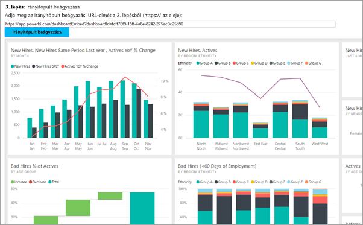
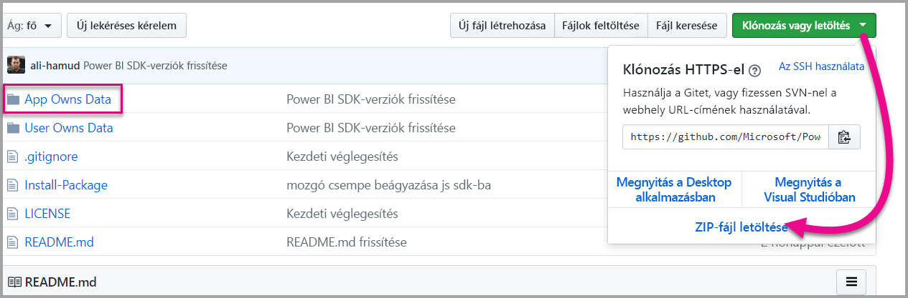

# <a name="tutorial-embed-a-power-bi-content-into-your-application-for-national-clouds"></a>Oktatóanyag: Power BI-tartalom beágyazása az alkalmazásba országos felhők számára

Elsajátíthatja analitikai tartalom beágyazását üzletifolyamat-alkalmazásaiba az országos felhő számára. A Power BI .NET SDK és a Power BI JavaScript API segítségével jelentést, irányítópultot vagy csempét ágyazhat be webalkalmazásába.

A Power BI az [ felhőket](https://docs.microsoft.com/azure/active-directory/develop/authentication-national-cloud) is támogatja.

A különböző országos felhők az alábbiak:

* Egyesült Államok Kormányzati közösségi felhő (GCC)

* Egyesült Államok Katonai alvállalkozók (DoDCON)

* Egyesült Államok Katonaság (DoD)

* A németországi felhőhöz készült Power BI

* A kínai felhőhöz készült Power BI



A bemutató megkezdéséhez **Power BI**-fiókra van szükség. Ha nem rendelkezik beállított fiókkal, akkor a kormányzati típustól vagy az országtól függően kiválaszthatja az Ön számára megfelelő országos felhőt. Regisztrálhat egy [egyesült államokbeli kormányzati Power BI-fiókot](../service-govus-signup.md), egy [németországi felhőhöz készült Power BI-fiókot](https://powerbi.microsoft.com/power-bi-germany/?ru=https%3A%2F%2Fapp.powerbi.de%2F%3FnoSignUpCheck%3D1) vagy egy [kínai felhőhöz készült Power BI-fiókot](https://www.21vbluecloud.com/powerbi/).

> [!NOTE]
> A saját cégének szeretne irányítópultot beágyazni? Tekintse meg az [irányítópult céges alkalmazásba való integrálását](integrate-dashboard.md) ismertető cikket.

Egy irányítópult webalkalmazásba ágyaszásához használja a **Power BI** API-t, és egy Azure Active Directory (AD) engedélyezési **hozzáférési tokent** az irányítópult lekéréséhez. Ezután töltse be az irányítópultot egy beágyazási token használatával. A **Power BI** API szoftveres hozzáférést biztosít meghatározott **Power BI**-erőforrásokhoz. További információt a [Power BI REST API](https://docs.microsoft.com/rest/api/power-bi/), a Power BI .NET SDK és a [Power BI JavaScript API](https://github.com/Microsoft/PowerBI-JavaScript) cikkében talál.

## <a name="download-the-sample"></a>A minta letöltése

Ez a cikk a GitHubon, az [alkalmazás tulajdonában lévő adatok mintában](https://github.com/Microsoft/PowerBI-Developer-Samples) használt kódot mutatja be. A bemutató követéséhez letöltheti a mintát. 



* Kormányzati közösségi felhő (GCC):

    > [!Note]
    > A GCC-fiókok csak a P és EM kapacitásokat támogatják.

1. Írja felül a Cloud.config fájlt a GCCCloud.config tartalmával.

2. Frissítse az applicationId (natív alkalmazáshoz tartozó applicationId), a workspaceId, a felhasználó (a fő felhasználó) és a jelszó értékét a Web.config fájlban.

3. Az alábbiaknak megfelelően adja hozzá a GCC-paramétereket a web.config fájlhoz.

```xml
<add key="authorityUrl" value="https://login.microsoftonline.net/common/" />
<add key="resourceUrl" value="https://analysis.usgovcloudapi.net/powerbi/api" />
<add key="apiUrl" value="https://api.powerbigov.us/" />
<add key="embedUrlBase" value="https://app.powerbigov.us" />
```

* Katonai alvállalkozók (DoDCON):

1. Írja felül a Cloud.config fájlt a TBCloud.config tartalmával.

2. Frissítse az applicationId (natív alkalmazáshoz tartozó applicationId), a workspaceId, a felhasználó (a fő felhasználó) és a jelszó értékét a Web.config fájlban.

3. Az alábbiaknak megfelelően adja hozzá a DoDCON-paramétereket a web.config fájlhoz.

```xml
<add key="authorityUrl" value="https://login.microsoftonlineS.net/common/" />
<add key="resourceUrl" value="https://high.analysis.usgovcloudapi.net/powerbi/api" />
<add key="apiUrl" value="https://api.high.powerbigov.us/" />
<add key="embedUrlBase" value="https://app.high.powerbigov.us" />
```

* Katonaság (DoD):

1. Írja felül a Cloud.config fájlt a PFCloud.config tartalmával.

2. Frissítse az applicationId (natív alkalmazáshoz tartozó applicationId), a workspaceId, a felhasználó (a fő felhasználó) és a jelszó értékét a Web.config fájlban.

3. Az alábbiaknak megfelelően adja hozzá a DoDCON-paramétereket a web.config fájlhoz.

```xml
<add key="authorityUrl" value="https://login.microsoftonline.net/common/" />
<add key="resourceUrl" value="https://mil.analysis.usgovcloudapi.net/powerbi/api" />
<add key="apiUrl" value="https://api.mil.powerbigov.us/" />
<add key="embedUrlBase" value="https://app.mil.powerbigov.us" />
```

* A németországi felhőhöz készült Power BI paraméterei

1. Írja felül a Cloud.config fájlt a németországi felhőhöz készült Power BI tartalmával.

2. Frissítse az applicationId (natív alkalmazáshoz tartozó applicationId), a workspaceId, a felhasználó (a fő felhasználó) és a jelszó értékét a Web.config fájlban.

3. Az alábbiaknak megfelelően adja hozzá a németországi felhőhöz készült Power BI paramétereit a web.config fájlhoz.

```xml
<add key="authorityUrl" value="https://login.microsoftonline.de/common/" />
<add key="resourceUrl" value="https://analysis.cloudapi.de/powerbi/api" />
<add key="apiUrl" value="https://api.powerbi.de/" />
<add key="embedUrlBase" value="https://app.powerbi.de" />
```

* A kínai felhőhöz készült Power BI paraméterei

1. Írja felül a Cloud.config fájlt a [kínai felhőhöz készült Power BI](https://github.com/Microsoft/PowerBI-Developer-Samples/blob/master/App%20Owns%20Data/PowerBIEmbedded_AppOwnsData/CloudConfigs/Power%20BI%20operated%20by%2021Vianet%20in%20China/Cloud.config) tartalmával.

2. Frissítse az applicationId (natív alkalmazáshoz tartozó applicationId), a workspaceId, a felhasználó (a fő felhasználó) és a jelszó értékét a Web.config fájlban.

3. Az alábbiaknak megfelelően adja hozzá a kínai felhőhöz készült Power BI paramétereit a web.config fájlhoz.

```xml
<add key="authorityUrl" value="https://login.chinacloudapi.cn/common/" />
<add key="resourceUrl" value="https://analysis.chinacloudapi.cn/powerbi/api" />
<add key="apiUrl" value="https://api.powerbi.cn/" />
<add key="embedUrlBase" value="https://app.powerbi.cn" />
```

## <a name="step-1---register-an-app-in-azure-ad"></a>1\. lépés – alkalmazás regisztrálása az Azure AD-ben

A REST API-hívások indításához az alkalmazásokat regisztrálja az Azure AD-ben. További információt az [Azure AD alkalmazás regisztrálása Power BI-tartalmak beágyazásához](register-app.md) eljárást ismertető cikkben talál. Mivel különböző országos felhőszolgáltatások léteznek, különböző URL-címek használatával regisztrálhatja alkalmazását.

* Kormányzati közösségi felhő (GCC) – ```https://app.powerbigov.us/apps```

* Katonai alvállalkozók (DoDCON) – ```https://app.high.powerbigov.us/apps```

* Katonaság (DoD) – ```https://app.mil.powerbigov.us/apps```

* A németországi felhőhöz készült Power BI – ```https://app.powerbi.de/apps```

* A kínai felhőhöz készült Power BI – ```https://app.powerbi.cn/apps```

Ha letöltötte az [ügyfelek számára végzett beágyazási mintát](https://github.com/Microsoft/PowerBI-Developer-Samples/tree/master/App%20Owns%20Data), használja a kapott **applicationId** azonosítót, hogy a minta hitelesítést végezhessen az Azure AD-ben. A minta konfigurálásához módosítsa az **applicationId** azonosítót a *web.config* fájlban.

## <a name="step-2---get-an-access-token-from-azure-ad"></a>2\. lépés – hozzáférési token lekérése az Azure AD-ből

Az alkalmazásban egy **hozzáférési tokent** kell beszereznie az Azure AD-ből, mielőtt hívásokat indíthatna a Power BI REST API-hoz. További információkért lásd [a felhasználók hitelesítésével és a Power BI-alkalmazáshoz Azure AD hozzáférési token beszerzésével](get-azuread-access-token.md) kapcsolatos cikket. Mivel különböző országos felhőszolgáltatások léteznek, különböző URL-címek használatával szerezheti be az alkalmazása hozzáférési jogkivonatát.

* Kormányzati közösségi felhő (GCC) – ```https://login.microsoftonline.com```

* Katonai alvállalkozók (DoDCON) – ```https://login.microsoftonline.us```

* Katonaság (DoD) – ```https://login.microsoftonline.us```

* A németországi felhőhöz készült Power BI – ```https://login.microsoftonline.de```

* A kínai felhőhöz készült Power BI – ```https://login.chinacloudapi.cn```

A **Controllers\HomeController.cs** fájlban lévő tartalomelem-feladatokban láthat példát ezekre a hozzáférési jogkivonatokra.

## <a name="step-3---get-a-content-item"></a>3\. lépés – tartalomelem lekérése

A Power BI-tartalom beágyazásához el kell végeznie néhány dolgot a megfelelő beágyazás biztosítása érdekében. Bár ezen lépések mindegyike elvégezhető közvetlenül a REST API-val, a mintaalkalmazás és az itt szereplő példák a .NET SDK-t használják.

### <a name="create-the-power-bi-client-with-your-access-token"></a>A Power BI-ügyfél létrehozása a hozzáférési tokennel

A hozzáférési jogkivonattal érdemes létrehozni a Power BI-ügyfélobjektumot, amely lehetővé teszi a Power BI API-k használatát. A Power BI-ügyfél létrehozásához az AccessToken hozzáférési jogkivonatot a *Microsoft.Rest.TokenCredentials* objektummal kell becsomagolni.

```csharp
using Microsoft.IdentityModel.Clients.ActiveDirectory;
using Microsoft.Rest;
using Microsoft.PowerBI.Api.V2;

var tokenCredentials = new TokenCredentials(authenticationResult.AccessToken, "Bearer");

// Create a Power BI Client object. This is used to call the Power BI APIs.
using (var client = new PowerBIClient(new Uri(ApiUrl), tokenCredentials))
{
    // Your code to embed items.
}
```

### <a name="get-the-content-item-you-want-to-embed"></a>A beágyazni kívánt tartalomelem lekérése

A Power BI-ügyfélobjektummal kérje le a beágyazni kívánt elem hivatkozását. Irányítópultokat, csempéket vagy jelentéseket ágyazhat be. Itt láthat arra példát, hogyan kérhető le az első irányítópult, csempe vagy jelentés egy adott munkaterületről.

Egy példa elérhető az [alkalmazás tulajdonában lévő adatok használatát ismertető mintában](https://github.com/Microsoft/PowerBI-Developer-Samples/tree/master/App%20Owns%20Data) lévő **Controllers\HomeController.cs** fájlban.

#### <a name="reports"></a>Jelentések

```csharp
using Microsoft.PowerBI.Api.V2;
using Microsoft.PowerBI.Api.V2.Models;

// You need to provide the workspaceId where the dashboard resides.
ODataResponseListReport reports = client.Reports.GetReportsInGroupAsync(workspaceId);

// Get the first report in the group.
Report report = reports.Value.FirstOrDefault();
```

#### <a name="dashboards"></a>Irányítópultok

```csharp
using Microsoft.PowerBI.Api.V2;
using Microsoft.PowerBI.Api.V2.Models;

// You need to provide the workspaceId where the dashboard resides.
ODataResponseListDashboard dashboards = client.Dashboards.GetDashboardsInGroup(workspaceId);

// Get the first report in the group.
Dashboard dashboard = dashboards.Value.FirstOrDefault();
```

#### <a name="tiles"></a>Csempék

```csharp
using Microsoft.PowerBI.Api.V2;
using Microsoft.PowerBI.Api.V2.Models;

// To retrieve the tile, you first need to retrieve the dashboard.

// You need to provide the workspaceId where the dashboard resides.
ODataResponseListDashboard dashboards = client.Dashboards.GetDashboardsInGroup(workspaceId);

// Get the first report in the group.
Dashboard dashboard = dashboards.Value.FirstOrDefault();

// Get a list of tiles from a specific dashboard
ODataResponseListTile tiles = client.Dashboards.GetTilesInGroup(workspaceId, dashboard.Id);

// Get the first tile in the group.
Tile tile = tiles.Value.FirstOrDefault();
```

### <a name="create-the-embed-token"></a>A beágyazási token létrehozása

A JavaScript API segítségével létrehozhat egy beágyazási tokent. A beágyazási token a beágyazott elemre vonatkozik. Valahányszor Power BI-tartalmat ágyaz be, mindig létre kell hoznia egy új beágyazási tokent. További információt (beleértve a használandó **hozzáférési szintet**) az [Beágyazási Token](https://docs.microsoft.com/rest/api/power-bi/embedtoken) című cikkben talál.

> [!IMPORTANT]
> Mivel a beágyazási tokenek elsődlegesen fejlesztési és tesztelési célokra használhatók, a Power BI fő fiókja csak korlátozott mennyiségű tokent tud előállítani. Éles üzemi beágyazási helyzetekhez [kapacitást szükséges vásárolni](https://docs.microsoft.com/power-bi/developer/embedded-faq#technical). Kapacitásvásárlás esetén nincs korlátja a beágyazási tokenek előállításának.

Egy példa elérhető a [céges beágyazási mintában](https://github.com/Microsoft/PowerBI-Developer-Samples/tree/master/App%20Owns%20Data) lévő **Controllers\HomeController.cs** fájlban.

Létrejött egy osztály az **EmbedConfig** és a **TileEmbedConfig** elemekhez. Egy példa elérhető a **Models\EmbedConfig.cs** és a **Models\TileEmbedConfig.cs** fájlban.

#### <a name="reports"></a>Jelentések

```csharp
using Microsoft.PowerBI.Api.V2;
using Microsoft.PowerBI.Api.V2.Models;

// Generate Embed Token.
var generateTokenRequestParameters = new GenerateTokenRequest(accessLevel: "view");
EmbedToken tokenResponse = client.Reports.GenerateTokenInGroup(workspaceId, report.Id, generateTokenRequestParameters);

// Generate Embed Configuration.
var embedConfig = new EmbedConfig()
{
    EmbedToken = tokenResponse,
    EmbedUrl = report.EmbedUrl,
    Id = report.Id
};
```

#### <a name="dashboards"></a>Irányítópultok

```csharp
using Microsoft.PowerBI.Api.V2;
using Microsoft.PowerBI.Api.V2.Models;

// Generate Embed Token.
var generateTokenRequestParameters = new GenerateTokenRequest(accessLevel: "view");
EmbedToken tokenResponse = client.Dashboards.GenerateTokenInGroup(workspaceId, dashboard.Id, generateTokenRequestParameters);

// Generate Embed Configuration.
var embedConfig = new EmbedConfig()
{
    EmbedToken = tokenResponse,
    EmbedUrl = dashboard.EmbedUrl,
    Id = dashboard.Id
};
```

#### <a name="tiles"></a>Csempék

```csharp
using Microsoft.PowerBI.Api.V2;
using Microsoft.PowerBI.Api.V2.Models;

// Generate Embed Token for a tile.
var generateTokenRequestParameters = new GenerateTokenRequest(accessLevel: "view");
EmbedToken tokenResponse = client.Tiles.GenerateTokenInGroup(workspaceId, dashboard.Id, tile.Id, generateTokenRequestParameters);

// Generate Embed Configuration.
var embedConfig = new TileEmbedConfig()
{
    EmbedToken = tokenResponse,
    EmbedUrl = tile.EmbedUrl,
    Id = tile.Id,
    dashboardId = dashboard.Id
};
```

## <a name="step-4---load-an-item-using-javascript"></a>4\. lépés – elem betöltése a JavaScript használatával

A JavaScript használatával egy irányítópultot tölthet be egy div elembe a weboldalon. A minta EmbedConfig/TileEmbedConfig modellt használ egy irányítópult, csempe vagy jelentés nézeteivel együtt. A JavaScript API használatának teljes mintájáért használhatja a [Microsoft Power BI Embedded mintát](https://microsoft.github.io/PowerBI-JavaScript/demo).

Egy alkalmazásminta a [céges beágyazási mintában](https://github.com/Microsoft/PowerBI-Developer-Samples/tree/master/App%20Owns%20Data) érhető el.

### <a name="viewshomeembeddashboardcshtml"></a>Views\Home\EmbedDashboard.cshtml

```csharp
<script src="~/scripts/powerbi.js"></script>
<div id="dashboardContainer"></div>
<script>
    // Read embed application token from Model
    var accessToken = "@Model.EmbedToken.Token";

    // Read embed URL from Model
    var embedUrl = "@Html.Raw(Model.EmbedUrl)";

    // Read dashboard Id from Model
    var embedDashboardId = "@Model.Id";

    // Get models. models contains enums that can be used.
    var models = window['powerbi-client'].models;

    // Embed configuration used to describe the what and how to embed.
    // This object is used when calling powerbi.embed.
    // This also includes settings and options such as filters.
    // You can find more information at https://github.com/Microsoft/PowerBI-JavaScript/wiki/Embed-Configuration-Details.
    var config = {
        type: 'dashboard',
        tokenType: models.TokenType.Embed,
        accessToken: accessToken,
        embedUrl: embedUrl,
        id: embedDashboardId
    };

    // Get a reference to the embedded dashboard HTML element
    var dashboardContainer = $('#dashboardContainer')[0];

    // Embed the dashboard and display it within the div container.
    var dashboard = powerbi.embed(dashboardContainer, config);
</script>
```

### <a name="viewshomeembedtilecshtml"></a>Views\Home\EmbedTile.cshtml

```csharp
<script src="~/scripts/powerbi.js"></script>
<div id="tileContainer"></div>
<script>
    // Read embed application token from Model
    var accessToken = "@Model.EmbedToken.Token";

    // Read embed URL from Model
    var embedUrl = "@Html.Raw(Model.EmbedUrl)";

    // Read tile Id from Model
    var embedTileId = "@Model.Id";

    // Read dashboard Id from Model
    var embedDashboardId = "@Model.dashboardId";

    // Get models. models contains enums that can be used.
    var models = window['powerbi-client'].models;

    // Embed configuration used to describe the what and how to embed.
    // This object is used when calling powerbi.embed.
    // This also includes settings and options such as filters.
    // You can find more information at https://github.com/Microsoft/PowerBI-JavaScript/wiki/Embed-Configuration-Details.
    var config = {
        type: 'tile',
        tokenType: models.TokenType.Embed,
        accessToken: accessToken,
        embedUrl: embedUrl,
        id: embedTileId,
        dashboardId: embedDashboardId
    };

    // Get a reference to the embedded tile HTML element
    var tileContainer = $('#tileContainer')[0];

    // Embed the tile and display it within the div container.
    var tile = powerbi.embed(tileContainer, config);
</script>
```

### <a name="viewshomeembedreportcshtml"></a>Views\Home\EmbedReport.cshtml

```csharp
<script src="~/scripts/powerbi.js"></script>
<div id="reportContainer"></div>
<script>
    // Read embed application token from Model
    var accessToken = "@Model.EmbedToken.Token";

    // Read embed URL from Model
    var embedUrl = "@Html.Raw(Model.EmbedUrl)";

    // Read report Id from Model
    var embedReportId = "@Model.Id";

    // Get models. models contains enums that can be used.
    var models = window['powerbi-client'].models;

    // Embed configuration used to describe the what and how to embed.
    // This object is used when calling powerbi.embed.
    // This also includes settings and options such as filters.
    // You can find more information at https://github.com/Microsoft/PowerBI-JavaScript/wiki/Embed-Configuration-Details.
    var config = {
        type: 'report',
        tokenType: models.TokenType.Embed,
        accessToken: accessToken,
        embedUrl: embedUrl,
        id: embedReportId,
        permissions: models.Permissions.All,
        settings: {
            filterPaneEnabled: true,
            navContentPaneEnabled: true
        }
    };

    // Get a reference to the embedded report HTML element
    var reportContainer = $('#reportContainer')[0];

    // Embed the report and display it within the div container.
    var report = powerbi.embed(reportContainer, config);
</script>
```

## <a name="next-steps"></a>Következő lépések

* Egy mintaalkalmazás elérhető a GitHubon, hogy áttekinthesse. A fenti példák azon a mintán alapulnak. További információért tekintse meg a [céges beágyazási mintát](https://github.com/Microsoft/PowerBI-Developer-Samples/tree/master/App%20Owns%20Data).

* További információ a JavaScript API-ról a [Power BI JavaScript API](https://github.com/Microsoft/PowerBI-JavaScript) dokumentációjában található.

* További információ a németországi felhőhöz készült Power BI-ról [a németországi felhőhöz készült Power BI gyakori kérdéseiben](https://docs.microsoft.com/power-bi/service-govde-faq) található.

* [Power BI-munkaterületcsoport tartalmainak migrálása a Power BI-ba](migrate-from-powerbi-embedded.md)

Megfontolandó szempontok és korlátozások

További kérdései vannak? [Kérdezze meg a Power BI közösségét](https://community.powerbi.com/)
