# <a name="tutorial-embed-a-power-bi-report-dashboard-or-tile-into-an-application-for-your-organization"></a>Oktatóanyag: Power BI-jelentés, -irányítópult vagy -csempe beágyazása egy alkalmazásba a szervezet számára

Az oktatóanyag bemutatja, hogyan integrálhat jelentéseket az alkalmazásokba. A Power BI .NET SDK és a Power BI JavaScript API segítségével beágyazza a Power BI-t egy alkalmazásba a szervezet számára. A Power BI-ban jelentéseket, irányítópultokat és csempéket ágyazhat be az alkalmazásokba **a felhasználó tulajdonában lévő adatokkal**. **A felhasználó az adatok tulajdonosa** forgatókönyv lehetővé teszi, hogy az alkalmazás kiterjessze a Power BI szolgáltatást.

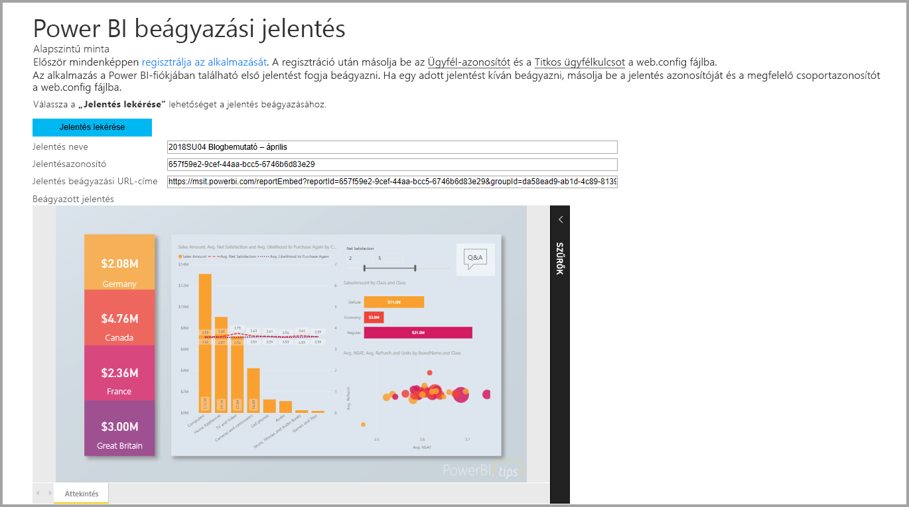

Eben az oktatóanyagban az alábbi feladatokkal fog megismerkedni:
>[!div class="checklist"]
>* Alkalmazás regisztrálása az Azure-ban.
>* Ágyazzon be egy Power BI-jelentést egy alkalmazásba.

## <a name="prerequisites"></a>Előfeltételek

Első lépésként szüksége lesz egy Power BI Pro-fiókra és egy Microsoft Azure-előfizetésre:

* Ha még nem regisztrált a Power BI Pro szolgáltatásra, a kezdés előtt [hozzon létre egy ingyenes próbaverziós fiókot](https://powerbi.microsoft.com/en-us/pricing/).
* Ha még nincs Azure-előfizetése, kezdés előtt hozzon létre egy [ingyenes fiókot](https://azure.microsoft.com/free/?WT.mc_id=A261C142F).
* Állítson be egy saját [Azure Active Directory- (Azure AD-) bérlőt](create-an-azure-active-directory-tenant.md).
* Telepítse a [Visual Studio](https://www.visualstudio.com/) 2013-as vagy újabb verzióját.

## <a name="set-up-your-embedded-analytics-development-environment"></a>A beágyazott elemzési fejlesztési környezet beállítása

Mielőtt jelentéseket, irányítópultokat és csempéket ágyazna az alkalmazásba, győződjön meg arról, hogy a környezete be van állítva a beágyazás engedélyezéséhez. A beállítás részeként tegye a következők egyikét:

- Az első lépések gyors elsajátításához követheti a [beágyazáshoz szükséges telepítési eszköz](https://aka.ms/embedsetup/UserOwnsData) lépéseit, és letölthet egy mintaalkalmazást, amely végigvezeti Önt a környezet létrehozásán és egy jelentés beágyazásán.

- Ha a környezet manuális létrehozása mellett dönt, hajtsa végre a következő szakaszok lépéseit.

### <a name="register-an-application-in-azure-active-directory"></a>Alkalmazás regisztrálása az Azure Active Directoryban

Regisztrálja az alkalmazást az Azure Active Directoryban, hogy hozzáférést biztosítson számára a Power BI REST API-khoz. Ezután létrehozhat egy identitást az alkalmazás számára, és engedélyeket biztosíthat a Power BI REST-erőforrások használatához.

1. Fogadja el a [Microsoft Power BI API használati feltételeit](https://powerbi.microsoft.com/api-terms).

2. Jelentkezzen be az [Azure Portalra](https://portal.azure.com).

    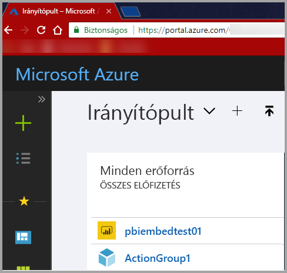

3. A bal oldali navigációs panelen válassza a **Minden szolgáltatás**, majd az **Alkalmazásregisztrációk** elemet. Ezután válassza az **Új alkalmazás regisztrálása** lehetőséget.

    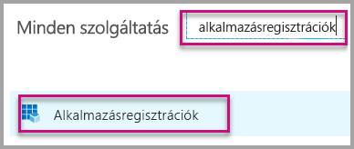</br>

    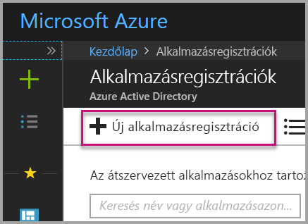

4. Kövesse az utasításokat az új alkalmazás létrehozásához. A **felhasználó tulajdonában lévő adatokkal** az **Alkalmazástípus** mezőben adja meg a **Webalkalmazás/API** beállítást. Egy **Bejelentkezési URL-címet** is meg kell adnia, amelyet az Azure AD a jogkivonatválaszok visszaadására használ. Adja meg az alkalmazáshoz tartozó értéket. Például: `http://localhost:13526/`.

    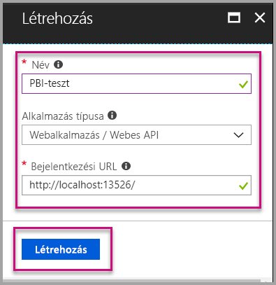

### <a name="apply-permissions-to-your-application-within-azure-active-directory"></a>Engedélyek alkalmazása a saját alkalmazásra az Azure AD-ben

Az alkalmazásregisztrációs oldalon megadottak mellett engedélyeket is kell adnia az alkalmazásnak. Az engedélyek megadásához jelentkezzen be egy globális rendszergazdai fiókkal.

### <a name="use-the-azure-active-directory-portal"></a>Az Azure Active Directory portál használata

1. Az Azure Portal [Alkalmazásregisztrációk](https://portal.azure.com/#blade/Microsoft_AAD_IAM/ApplicationsListBlade) szakaszában keresse meg azt az alkalmazást, amelyet a beágyazáshoz kíván használni.

    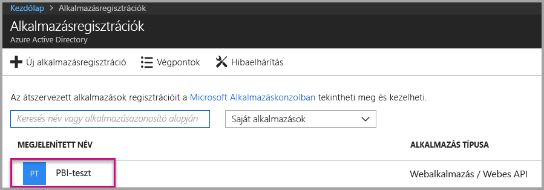

2. Kattintson a **Beállítások** elemre. Ezután az **API-hozzáférés** területen válassza a **Szükséges engedélyek** lehetőséget.

    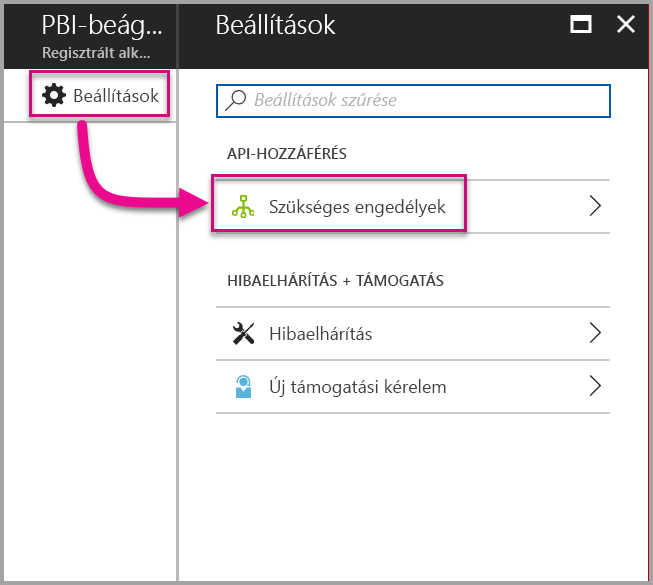

3. Válassza a **Microsoft Azure Active Directory** elemet. Ezután győződjön meg arról, hogy a **Hozzáférés a címtárhoz a bejelentkezett felhasználóként** beállítás be van jelölve. Kattintson a **Mentés** gombra.

    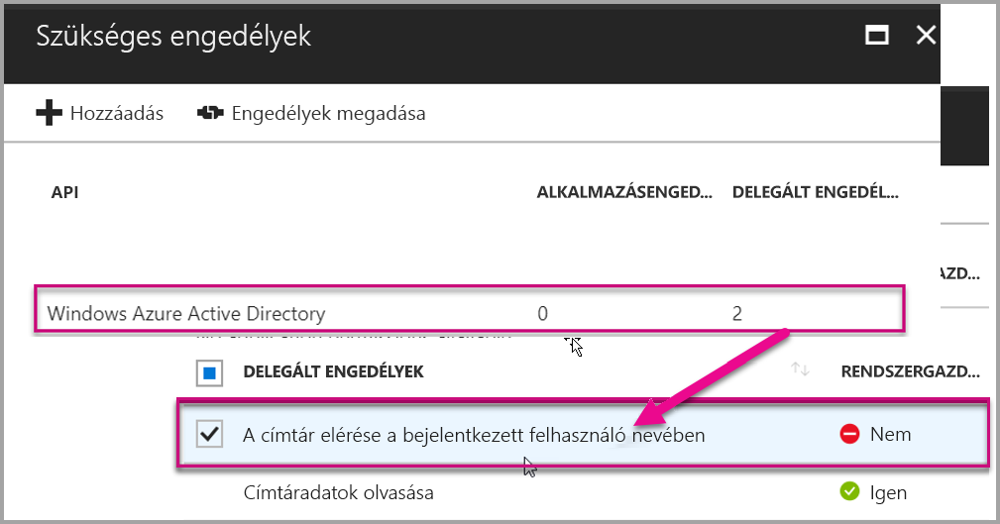

4. Válassza a **Hozzáadás** elemet.

    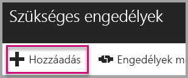

5. Válassza az **API kiválasztása** lehetőséget.

    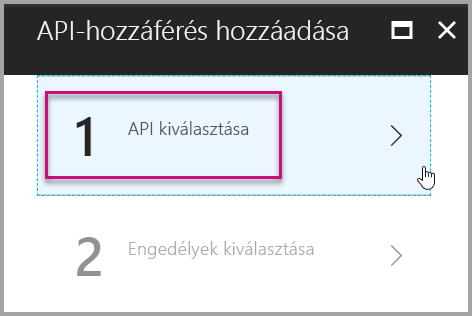

6. Válassza a **Power BI szolgáltatás** lehetőséget. Ezután kattintson a **Kiválasztás** gombra.

    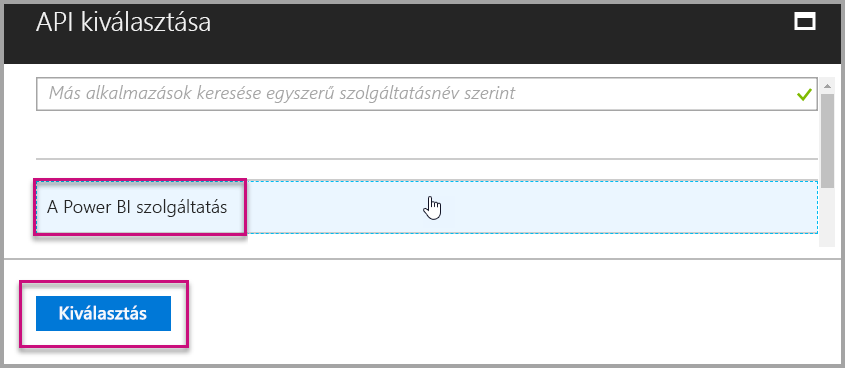

7. Jelölje be az összes engedélyt a **Delegált engedélyek** szakaszban. Egyenként jelölje be őket, hogy menteni tudja a kijelöléseket. Ha végzett, kattintson a **Mentés** gombra.

    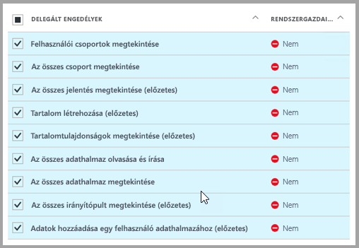

## <a name="set-up-your-power-bi-environment"></a>A Power BI-környezet beállítása

### <a name="create-an-app-workspace"></a>Alkalmazás munkaterületének létrehozása

Ha jelentéseket, irányítópultokat vagy csempéket ágyaz be az ügyfelek számára, akkor ezeket a tartalmakat egy alkalmazás-munkaterületre kell helyezni:

1. Kezdjük a munkaterület létrehozásával. Válassza a **Munkaterületek** > **Alkalmazás munkaterületének létrehozása** lehetőséget. Ezen a munkaterületen kell elhelyeznie a tartalmakat, amelyekhez az alkalmazásnak hozzá kell férnie.

    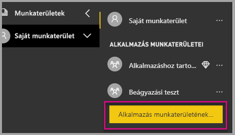

2. Nevezze el a munkaterületet. Ha a megfelelő **munkaterület-azonosító** nem használható, szerkesztéssel hozzon létre egy egyedi azonosítót. Ez lesz az alkalmazás neve is.

    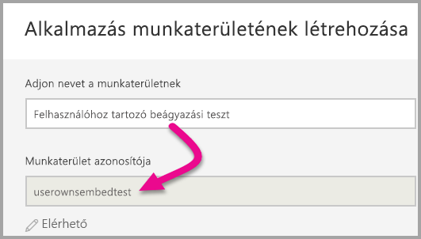

3. Néhány beállítást meg kell adnia. Ha **nyilvánosra** állítja a munkaterületet, a szervezet bármely tagja megtekintheti annak tartalmát. A **Privát** beállítás azt jelenti, hogy a munkaterület tartalmát csak a tagok láthatják.

    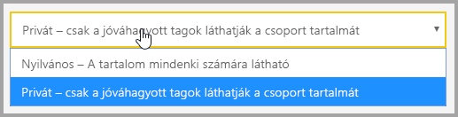

    A Nyilvános vagy a Privát beállítás a csoport létrehozását követően nem módosítható.

4. Azt is beállíthatja, hogy a tagok szerkeszthetik-e a tartalmakat vagy csak megtekintési jogosultságuk van.

    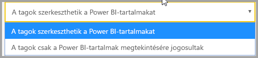

5. Vegye fel az adott személyek e-mail-címét, akiknek hozzáférést kíván adni a munkaterülethez, majd kattintson a **Hozzáadás** gombra. Csoportaliasokat nem adhat hozzá, csak egyéneket.

6. Döntse le, hogy az egyes személyek egyszerű tagok vagy adminisztrátorok legyenek-e. Az adminisztrátorok szerkeszthetik magát a munkaterületet is, és tagokat is felvehetnek. A tagok a munkaterület tartalmát szerkeszthetik, amennyiben nem csak megtekintési jogosultsággal rendelkeznek. Az alkalmazást az adminisztrátorok és a tagok egyaránt közzétehetik.

    Most megtekintheti az új munkaterületet. A Power BI létrehozza és megnyitja a munkaterületet. Ekkor megjelenik az olyan munkaterületek listájában, amelyeknek Ön a tagja. Mivel adminisztrátori jogosultsággal rendelkezik, a három pontra (...) kattintva visszaléphet, és szerkesztheti a munkaterületet, például új tagokat adhat hozzá vagy módosíthatja a tagok jogosultságait.

    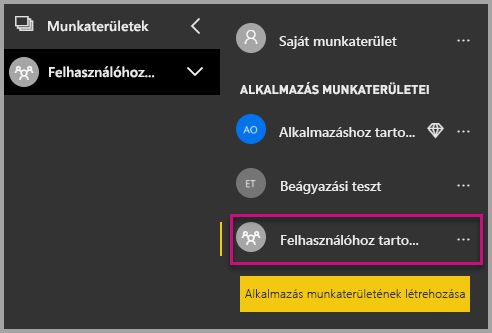

### <a name="create-and-publish-your-reports"></a>Saját jelentések létrehozása és közzététele

A Power BI Desktop segítségével létrehozhatja a jelentéseit és az adathalmazait. A jelentéseket ezután közzéteheti egy alkalmazás-munkaterületen. A jelentéseket közzétevő végfelhasználónak Power BI Pro-licenccel kell rendelkeznie az alkalmazás-munkaterületen való közzétételhez.

1. Töltse le a [Blog Demo](https://github.com/Microsoft/powerbi-desktop-samples) mintát a GitHubról.

    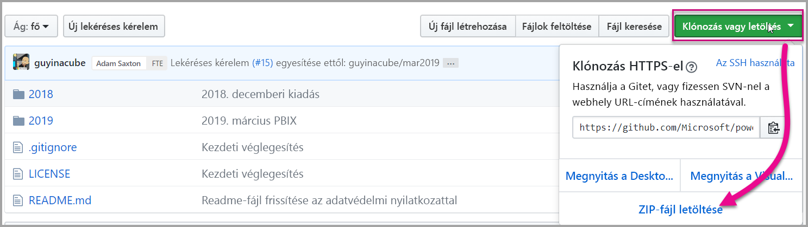

2. Nyissa meg a .pbix mintajelentést a Power BI Desktopban.

   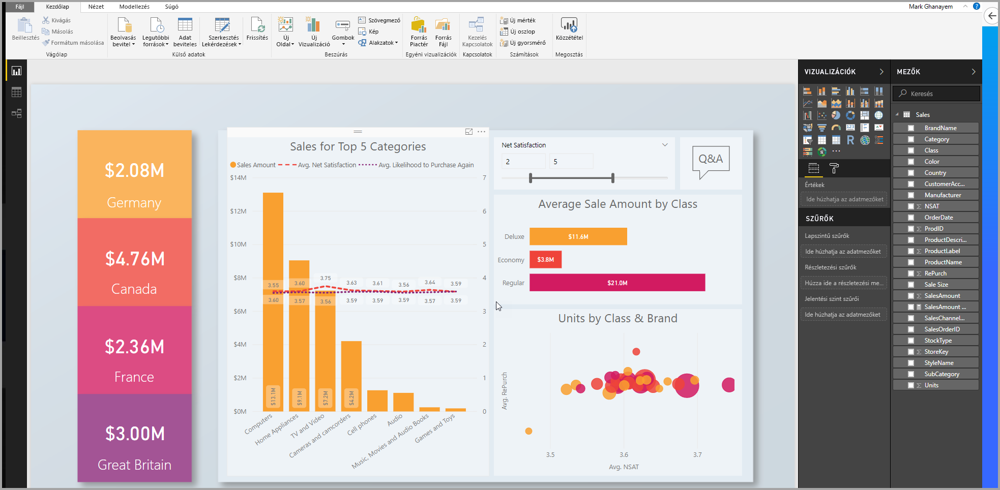

3. Tegye közzé az alkalmazás-munkaterületen.

   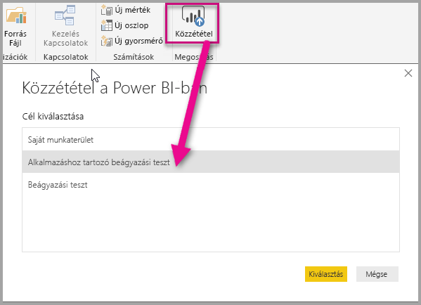

    A jelentést mostantól online megtekintheti a Power BI szolgáltatásban.

   

## <a name="embed-your-content-by-using-the-sample-application"></a>Tartalom beágyazása a mintaalkalmazással

A tartalmak mintaalkalmazással történő beágyazásához kövesse az alábbi lépéseket:

1. Első lépésként töltse le a [felhasználó tulajdonában lévő adatok használatát ismertető mintát](https://github.com/Microsoft/PowerBI-Developer-Samples) a GitHubról. Három különböző mintaalkalmazás érhető el: egy a [jelentésekhez](https://github.com/Microsoft/PowerBI-Developer-Samples/tree/master/User%20Owns%20Data/integrate-report-web-app), egy az [irányítópultokhoz](https://github.com/Microsoft/PowerBI-Developer-Samples/tree/master/User%20Owns%20Data/integrate-dashboard-web-app) és egy a [csempékhez](https://github.com/Microsoft/PowerBI-Developer-Samples/tree/master/User%20Owns%20Data/integrate-tile-web-app). Ez a cikk a **jelentések** alkalmazására hivatkozik.

    

2. Nyissa meg a **Cloud.config** fájlt a mintaalkalmazásban. Az alkalmazás sikeres futtatásához ki kell töltenie a következő mezőket: **ApplicationID** (Alkalmazásazonosító) és **ApplicationSecret** (Alkalmazás titkos kulcsa).

    

    Az **ApplicationID** mezőbe írja be az Azure-beli **alkalmazásazonosítót**. Az alkalmazás az **ApplicationID** segítségével azonosítja magát azon felhasználóknál, akiktől engedélyeket kér.

    Az **ApplicationID** beszerzéséhez kövesse az alábbi lépéseket:

    1. Jelentkezzen be az [Azure Portalra](https://portal.azure.com).

        

    1. A bal oldali navigációs panelen válassza a **Minden szolgáltatás**, majd az **Alkalmazásregisztrációk** elemet.

        

    1. Válassza ki azt az alkalmazást, amelynek használnia kell az **ApplicationID** azonosítót.

        

    1. Egy GUID-ként listázott **alkalmazásazonosítónak** kell megjelennie. Használja ezt az **alkalmazásazonosítót** az alkalmazás **ApplicationID** mezőjében.

        

    1. Az **ApplicationSecret**mező tartalmát az **Azure** **Alkalmazásregisztrációk** szakaszának **Kulcsok** részéből másolhatja be.

    1. Az **ApplicationSecret** beszerzéséhez kövesse az alábbi lépéseket:

        1. Jelentkezzen be az [Azure Portalra](https://portal.azure.com).

            

        1. A bal oldali navigációs panelen válassza a **Minden szolgáltatás**, majd az **Alkalmazásregisztrációk** elemet.

            

        1. Válassza ki azt az alkalmazást, amelyhez használni kívánja az **ApplicationSecret** kulcsot.

            

        1. Kattintson a **Beállítások** elemre.

            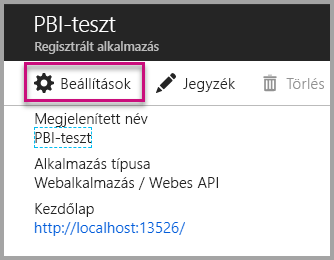

        1. Válassza a **Kulcsok** lehetőséget.

            

    1. A **Leírás** mezőbe írjon be egy nevet, és válasszon ki egy időtartamot. Ezután kattintson a **Mentés** gombra az alkalmazás **Értékének** lekéréséhez. Ha bezárja a **Kulcsok** panelt a kulcsérték mentése után, az értékmező csak rejtettként fog megjelenni. Ebben az esetben nem tudja lekérni a kulcsértéket. Ha elveszíti kulcsértéket, hozzon létre egy újat az Azure Portalon.

        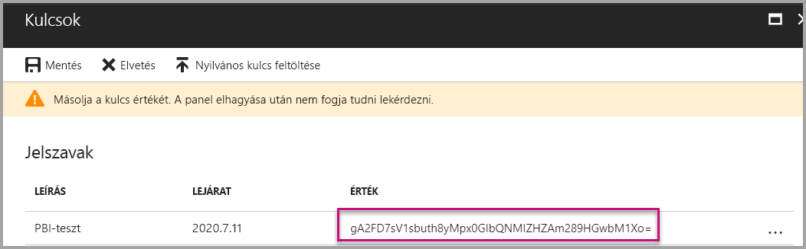

    1. A **csoportazonosító** mezőbe írja be a Power BI szolgáltatásban lévő alkalmazás-munkaterület GUID azonosítóját.

        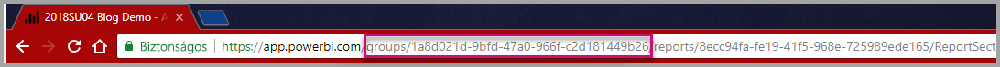

    1. A **jelentésazonosító** mezőbe írja be a Power BI szolgáltatásban lévő jelentés GUID azonosítóját.

        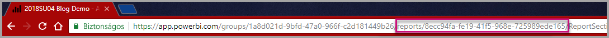

3. Futtassa az alkalmazást:

    1. Először is kattintson a **Futtatás** elemre a **Visual Studióban**.

        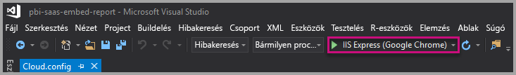

    1. Majd válassza a **Jelentés beolvasása** lehetőséget.

        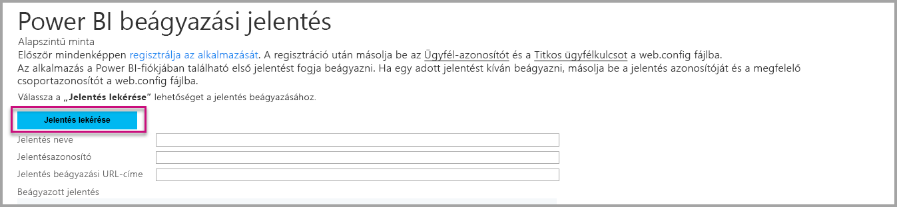

    1. Most megtekintheti a jelentést a mintaalkalmazásban.

        

## <a name="embed-your-content-within-your-application"></a>Tartalom beágyazása az alkalmazásba

Bár a tartalombeágyazás lépései elvégezhetők a [Power BI REST API-kkal](https://docs.microsoft.com/rest/api/power-bi/), a cikkben bemutatott mintakódok a .NET SDK-val készültek.

A jelentés webalkalmazásba való beágyazásához használja a Power BI REST API-t vagy a Power BI C# SDK-t. A jelentés lekéréséhez egy Azure Active Directory (AD) engedélyezési hozzáférési tokent kell használnia. Ezután töltse be a jelentést ugyanezen hozzáférési token használatával. A Power BI REST API szoftveres hozzáférést biztosít egyes Power BI-erőforrásokhoz. További információkért lásd: [Power BI REST API-k](https://docs.microsoft.com/rest/api/power-bi/) és [Power BI JavaScript API](https://github.com/Microsoft/PowerBI-JavaScript).

### <a name="get-an-access-token-from-azure-ad"></a>Hozzáférési token lekérése a Microsoft Azure Active Directory-ból

Az alkalmazásban be kell szereznie egy hozzáférési tokent az Azure AD-ből, mielőtt hívásokat indíthatna a Power BI REST API-hoz. További információkért lásd [a felhasználók hitelesítésével és a Power BI-alkalmazáshoz Azure AD hozzáférési token beszerzésével](get-azuread-access-token.md) kapcsolatos cikket.

### <a name="get-a-report"></a>Jelentés lekérése

Power BI-jelentés lekéréséhez használja a [Jelentések lekérése](https://docs.microsoft.com/rest/api/power-bi/reports/getreports) műveletet, amely a Power BI-jelentések listáját kéri le. A jelentések listájából lekérheti a jelentésazonosítót.

### <a name="get-reports-by-using-an-access-token"></a>Jelentések lekérése hozzáférési token használatával

A [Jelentések lekérése](https://docs.microsoft.com/rest/api/power-bi/reports/getreports) művelet jelentések listáját adja vissza. A jelentések listájából lekérhet egyetlen jelentést.

A REST API-hívásához egy *Engedélyezési* fejlécet is meg kell adnia a *Tulajdonos {hozzáférési token}* formátumában.

#### <a name="get-reports-with-the-rest-api"></a>Jelentések lekérése a REST API-val

A következő kódminta bemutatja, hogyan kérhet le jelentéseket a **REST API-val**:

> [!NOTE]  
> A beágyazni kívánt tartalomelemek lekéréséről a [mintaalkalmazás](#embed-your-content-using-the-sample-application) **Default.aspx.cs** fájljában találhat példát. Van példa jelentésre, irányítópultra és csempére is.

```csharp
using Newtonsoft.Json;

//Get a Report. In this sample, you get the first Report.
protected void GetReport(int index)
{
    //Configure Reports request
    System.Net.WebRequest request = System.Net.WebRequest.Create(
        String.Format("{0}/Reports",
        baseUri)) as System.Net.HttpWebRequest;

    request.Method = "GET";
    request.ContentLength = 0;
    request.Headers.Add("Authorization", String.Format("Bearer {0}", accessToken.Value));

    //Get Reports response from request.GetResponse()
    using (var response = request.GetResponse() as System.Net.HttpWebResponse)
    {
        //Get reader from response stream
        using (var reader = new System.IO.StreamReader(response.GetResponseStream()))
        {
            //Deserialize JSON string
            PBIReports Reports = JsonConvert.DeserializeObject<PBIReports>(reader.ReadToEnd());

            //Sample assumes at least one Report.
            //You could write an app that lists all Reports
            if (Reports.value.Length > 0)
            {
                var report = Reports.value[index];

                txtEmbedUrl.Text = report.embedUrl;
                txtReportId.Text = report.id;
                txtReportName.Text = report.name;
            }
        }
    }
}

//Power BI Reports used to deserialize the Get Reports response.
public class PBIReports
{
    public PBIReport[] value { get; set; }
}
public class PBIReport
{
    public string id { get; set; }
    public string name { get; set; }
    public string webUrl { get; set; }
    public string embedUrl { get; set; }
}
```

#### <a name="get-reports-by-using-the-net-sdk"></a>Jelentések lekérése a .NET SDK használatával

A .NET SDK használatával lekérheti a jelentések listáját ahelyett, hogy közvetlenül a REST API-t hívná. A következő kódminta bemutatja, hogyan listázhatja a jelentéseket:

```csharp
using Microsoft.IdentityModel.Clients.ActiveDirectory;
using Microsoft.PowerBI.Api.V2;
using Microsoft.PowerBI.Api.V2.Models;

var tokenCredentials = new TokenCredentials(<ACCESS TOKEN>, "Bearer");

// Create a Power BI Client object. It is used to call Power BI APIs.
using (var client = new PowerBIClient(new Uri(ApiUrl), tokenCredentials))
{
    // Get the first report all reports in that workspace
    ODataResponseListReport reports = client.Reports.GetReports();

    Report report = reports.Value.FirstOrDefault();

    var embedUrl = report.EmbedUrl;
}
```

### <a name="load-a-report-by-using-javascript"></a>Jelentés betöltése a JavaScript használatával

A JavaScript használatával egy jelentést tölthet be a div elembe a weblapon. A következő kódminta bemutatja, hogyan kérhet le jelentést egy adott munkaterületről:

> [!NOTE]  
> A beágyazni kívánt tartalomelemek betöltéséről a [mintaalkalmazás](#embed-your-content-using-the-sample-application) **Default.aspx** fájljában találhat példát. Van példa jelentésre, irányítópultra és csempére is.

```javascript
<!-- Embed Report-->
<div> 
    <asp:Panel ID="PanelEmbed" runat="server" Visible="true">
        <div>
            <div><b class="step">Step 3</b>: Embed a report</div>

            <div>Enter an embed url for a report from Step 2 (starts with https://):</div>
            <input type="text" id="tb_EmbedURL" style="width: 1024px;" />
            <br />
            <input type="button" id="bEmbedReportAction" value="Embed Report" />
        </div>

        <div id="reportContainer"></div>
    </asp:Panel>
</div>
```

#### <a name="sitemaster"></a>Site.master

```javascript
window.onload = function () {
    // client side click to embed a selected report.
    var el = document.getElementById("bEmbedReportAction");
    if (el.addEventListener) {
        el.addEventListener("click", updateEmbedReporte, false);
    } else {
        el.attachEvent('onclick', updateEmbedReport);
    }

    // handle server side post backs, optimize for reload scenarios
    // show embedded report if all fields were filled in.
    var accessTokenElement = document.getElementById('MainContent_accessTokenTextbox');
    if (accessTokenElement !== null) {
        var accessToken = accessTokenElement.value;
        if (accessToken !== "")
            updateEmbedReport();
    }
};

// update embed report
function updateEmbedReport() {

    // check if the embed url was selected
    var embedUrl = document.getElementById('tb_EmbedURL').value;
    if (embedUrl === "")
        return;

    // get the access token.
    accessToken = document.getElementById('MainContent_accessTokenTextbox').value;

    // Embed configuration used to describe the what and how to embed.
    // This object is used when calling powerbi.embed.
    // You can find more information at https://github.com/Microsoft/PowerBI-JavaScript/wiki/Embed-Configuration-Details.
    var config = {
        type: 'report',
        accessToken: accessToken,
        embedUrl: embedUrl
    };

    // Grab the reference to the div HTML element that will host the report.
    var reportContainer = document.getElementById('reportContainer');

    // Embed the report and display it within the div container.
    var report = powerbi.embed(reportContainer, config);

    // report.on will add an event handler which prints to Log window.
    report.on("error", function (event) {
        var logView = document.getElementById('logView');
        logView.innerHTML = logView.innerHTML + "Error<br/>";
        logView.innerHTML = logView.innerHTML + JSON.stringify(event.detail, null, "  ") + "<br/>";
        logView.innerHTML = logView.innerHTML + "---------<br/>";
    }
  );
}
```

## <a name="using-a-power-bi-premium-dedicated-capacity"></a>Dedikált Power BI Premium-kapacitás használata

Most, hogy elkészült az alkalmazás fejlesztésével, ideje dedikált kapacitással ellátni az alkalmazás-munkaterületet.

### <a name="create-a-dedicated-capacity"></a>Dedikált kapacitás létrehozása

Dedikált kapacitás létrehozásával kihasználhatja annak az előnyeit, hogy egy dedikált erőforrás áll rendelkezésre az alkalmazás-munkaterületen a tartalom számára. Dedikált kapacitást a [Power BI Premium](../service-premium.md) segítségével hozhat létre.

A következő táblázat a [Microsoft Office 365-ben](../service-admin-premium-purchase.md) elérhető Power BI Premium-termékváltozatokat sorolja fel:

| Kapacitási csomópont | Virtuális magok száma összesen<br/>(háttérrendszer + előtérrendszer) | Háttérrendszerbeli virtuális magok | Előtérrendszerbeli virtuális magok | DirectQuery-/élő kapcsolat korlátai | Maximális oldalmegjelenítések óránként csúcsidőszakban |
| --- | --- | --- | --- | --- | --- |
| EM1 |1 virtuális mag |0,5 virtuális mag, 10 GB RAM |0,5 virtuális mag |Másodpercenként 3,75 |150-300 |
| EM2 |2 virtuális mag |1 virtuális mag, 10 GB RAM |1 virtuális mag |Másodpercenként 7.5 |301-600 |
| EM3 |4 virtuális mag |2 virtuális mag, 10 GB RAM |2 virtuális mag |Másodpercenként 15 |601-1200 |
| P1 |8 virtuális mag |4 virtuális mag, 25 GB RAM |4 virtuális mag |Másodpercenként 30 |1,201-2,400 |
| P2 |16 virtuális mag |8 virtuális mag, 50 GB RAM |8 virtuális mag |Másodpercenként 60 |2,401-4,800 |
| P3 |32 virtuális mag |16 virtuális mag, 100 GB RAM |16 virtuális mag |Másodpercenként 120 |4801–9600 |
| P4 |64 virtuális mag |32 virtuális mag, 200 GB RAM |32 virtuális mag |Másodpercenként 240 |9601–19 200 |
| P5 |128 virtuális mag |64 virtuális mag, 400 GB RAM |64 virtuális mag |Másodpercenként 480 |19 201–38 400 |

> [!NOTE]
> - Ha Microsoft Office-alkalmazásokkal szeretne beágyazni, az ingyenes Power BI-licenc lehetővé teszi, hogy az EM termékváltozatokat használja a tartalmak eléréséhez. A Powerbi.com vagy a Power BI Mobile használatakor azonban nem lehet hozzáférni a tartalmakhoz az ingyenes Power BI-licenccel.
> - Ha a Powerbi.com vagy a Power BI Mobile használatával szeretne beágyazni a Microsoft Office-alkalmazásokkal, az ingyenes Power BI-licenccel hozzáférhet a tartalmakhoz.

### <a name="assign-an-app-workspace-to-a-dedicated-capacity"></a>Alkalmazás-munkaterület hozzárendelése dedikált kapacitáshoz

A dedikált kapacitás létrehozása után hozzárendelheti az alkalmazás-munkaterületet ehhez a kapacitáshoz. A folyamat befejezéséhez kövesse az alábbi lépéseket:

1. A Power BI szolgáltatásban bontsa ki a munkaterületeket, és kattintson a három pont elemre a tartalombeágyazáshoz használt munkaterület mellett. Válassza a **Munkaterületek szerkesztése** lehetőséget.

    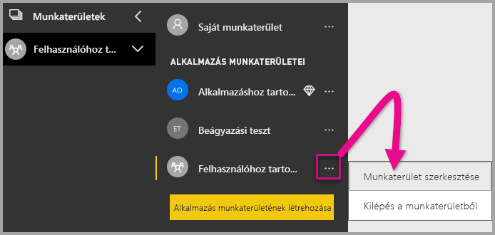

2. Bontsa ki a **Speciális** pontot, és engedélyezze a **Dedikált kapacitás** elemet. Válassza ki a létrehozott dedikált kapacitást. Kattintson a **Mentés** gombra.

    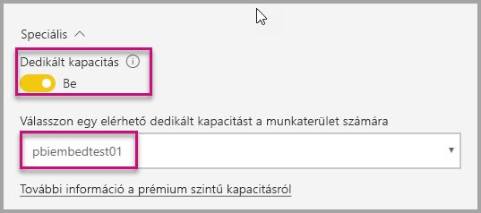

3. A **Mentés** kiválasztása után meg kell jelennie egy gyémántnak az alkalmazás-munkaterület neve mellett.

    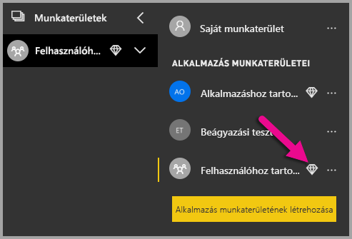

## <a name="admin-settings"></a>Rendszergazdai beállítások

A globális rendszergazdák vagy a Power BI szolgáltatás-rendszergazdái be- és kikapcsolhatják a REST API-k használatának képességét a bérlők esetében. A Power BI-rendszergazdák a teljes szervezethez vagy egyes biztonsági csoportokhoz is megadhatják ezt a beállítást. A beállítás alapértelmezés szerint a teljes szervezethez engedélyezve van. Ezeket a módosításokat a [Power BI felügyeleti portálon](../service-admin-portal.md) végezheti el.

## <a name="next-steps"></a>Következő lépések

Ez az oktatóanyag bemutatta, hogyan ágyazhat be Power BI-tartalmat egy alkalmazásba a Power BI szervezeti fiók használatával. Most már elkezdhet Power BI-tartalmakat beágyazni egy alkalmazásba az alkalmazások segítségével. Megpróbálkozhat Power BI-tartalom beágyazásával az ügyfelei számára is:

> [!div class="nextstepaction"]
> [Beágyazás alkalmazásokból](embed-from-apps.md)

> [!div class="nextstepaction"]
>[Beágyazás az ügyfelek számára](embed-sample-for-customers.md)

Ha további kérdései vannak, [forduljon a Power BI közösségéhez](http://community.powerbi.com/).
