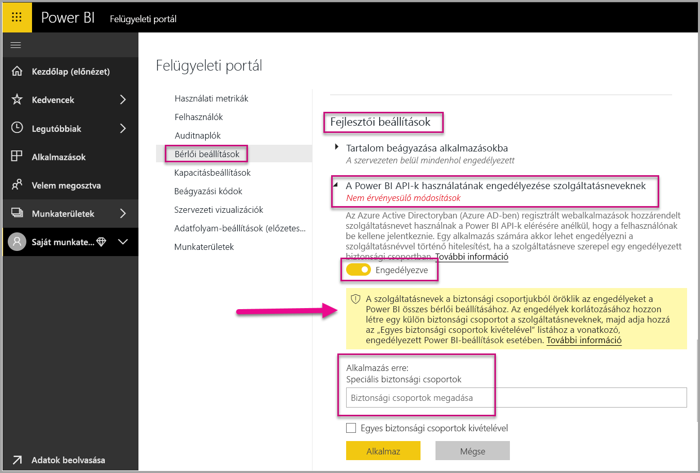
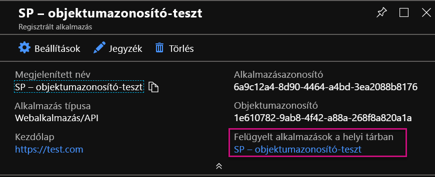
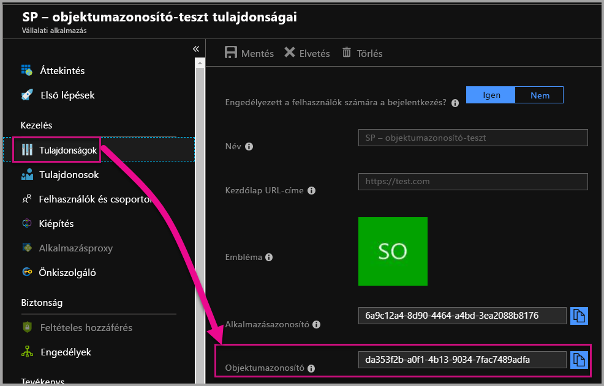

# <a name="service-principal-with-power-bi-preview"></a>Szolgáltatásnév a Power BI-jal (előzetes verzió)

**Szolgáltatásnévvel** beágyazhat tartalmat egy alkalmazásba, és használhat automatizálást a Power BI-jal **csak az alkalmazásra vonatkozó** token használatával. A szolgáltatásnév előnyös a **Power BI Embedded** használatakor vagy **Power BI-feladatok és -folyamatok automatizálásakor**.

A Power BI Embedded használatakor előnyökkel jár a szolgáltatásnév használata. Az elsődleges előnye az, hogy nincs szüksége fő fiókra (olyan Power BI Pro-licencre, amely mindössze egy felhasználónévből és bejelentkezési jelszóból áll) a hitelesítés végrehajtásához az alkalmazásban. A szolgáltatásnév egy alkalmazásazonosítót és titkos kódot használ az alkalmazáshoz annak hitelesítéséhez.

A Power BI-feladatok automatizálásakor parancsfájlokat is írhat a szolgáltatásnevek feldolgozásához és kezeléséhez a méretezés során.

## <a name="application-and-service-principal-relationship"></a>Az alkalmazás és a szolgáltatásnév kapcsolata

Ha olyan erőforrásokhoz szeretne hozzáférni, amelyek egy Azure AD-bérlőt védenek, a hozzáférést kérő entitás egy rendszerbiztonsági tagot képvisel. Ez a művelet mind a felhasználókra, (felhasználói név), mind az alkalmazásokra (szolgáltatásnév) igaz.

A rendszerbiztonsági tag határozza meg az Azure AD-bérlőben a hozzáférési szabályzatot és az engedélyeket a felhasználók és az alkalmazások számára. Ez a hozzáférési szabályzat alapvető fontosságú funkciókat engedélyez, például a felhasználók és az alkalmazások hitelesítését bejelentkezéskor és a hitelesítést az erőforrások elérésekor. További információért tekintse át az [Application and service principal in Azure Active Directory (AAD)](https://docs.microsoft.com/azure/active-directory/develop/app-objects-and-service-principals) (Alkalmazás és szolgáltatásnév az Azure Active Directory (AAD) szolgáltatásban) weblapot.

Amikor egy Azure AD-alkalmazást regisztrál az Azure Portalon, két objektum jön létre az Azure AD-bérlőben:

* Egy [alkalmazásobjektum](https://docs.microsoft.com/azure/active-directory/develop/app-objects-and-service-principals#application-object)
* Egy [szolgáltatásnév-objektum](https://docs.microsoft.com/azure/active-directory/develop/app-objects-and-service-principals#service-principal-object)

Az alkalmazásobjektumra gondolhat úgy, mint az alkalmazás *globális* megfelelőjére az összes bérlőben történő használathoz, a szolgáltatásnévre pedig úgy, mint a *helyi* megfelelőre egy meghatározott bérlőben történő használathoz.

Az alkalmazásobjektum szolgál sablonként, amelyből a közös és az alapértelmezett tulajdonságok *származtatása* történik a megfelelő szolgáltatásnév-objektumok létrehozásához.

Az alkalmazás használatának helyén bérlőnkénti szolgáltatásnévre van szükség, ami lehetővé teszi, hogy identitásként jelenjen meg a bejelentkezéshez és a bérlő által védett erőforrások eléréséhez. Egybérlős alkalmazás csak egy szolgáltatásnévvel rendelkezik (a saját bérlőjében), melynek létrehozása és a használatának engedélyezése az alkalmazás regisztrációja során történik.

## <a name="service-principal-with-power-bi-embedded"></a>Szolgáltatásnév Power BI Embeddeddel

A szolgáltatásnévvel maszkolhatja a fő fiók adatait az alkalmazásban egy alkalmazásazonosítóval és az alkalmazás titkos kódjával. Többé nem kell nem változtatható fő fiókot kódolnia az alkalmazásba a hitelesítéshez.

Mivel a **Power BI API-k** és a **Power BI .NET SDK** már támogatják a szolgáltatásnévvel történő hívásokat, használhatja a [Power BI API-kat](https://docs.microsoft.com/rest/api/power-bi/) szolgáltatásnévvel. Például, módosíthatja a munkaterületeket, létrehozhat munkaterületeket, felvehet felhasználókat a munkaterületekre vagy eltávolíthatja őket onnan, és importálhat tartalmat a munkaterületekre.

Csak akkor használhat szolgáltatásneveket, ha a Power BI-munkadarabokat és -erőforrásokat az [új Power BI-munkaterületen](../service-create-the-new-workspaces.md) tárolja.

## <a name="service-principal-vs-master-account"></a>A szolgáltatásnév és a fő fiók összehasonlítása

Vannak különbségek aközött, hogy szolgáltatásnevet vagy standard fő fiókot (Power BI Pro-licenc) használ a hitelesítéshez. Az alábbi táblázat kiemel néhány jelentős különbséget.

| Függvény | Fő felhasználói fiók </br> (Power BI Pro-licenc) | Szolgáltatásnév </br> (csak az alkalmazásban használható token) |
|------------------------------------------------------|---------------------|-------------------|
| Bejelentkezhet a Power BI szolgáltatásba  | Igen | Nem |
| Az engedélyezése a Power BI felügyeleti portálján történik | Nem | Igen |
| [Működik az alkalmazás-munkaterületekkel (v1)](../service-create-workspaces.md) | Igen | Nem |
| [Működik az új alkalmazás-munkaterületekkel (v2)](../service-create-the-new-workspaces.md) | Igen | Igen |
| Munkaterület-adminisztrátornak kell lennie, ha a Power BI Embeddeddel használja | Igen | Igen |
| Használhat Power BI REST API-kat | Igen | Igen |
| Globális rendszergazdára van szükség létrehozásához | Igen | Nem |
| Telepíthet és kezelhet helyszíni adatátjárót | Igen | Nem |

## <a name="get-started-with-a-service-principal"></a>Első lépések a szolgáltatásnevekkel

A hagyományos fő fiók használatától eltérően a szolgáltatásnév (csak az alkalmazáson belül használható token) használatához néhány más dolgot kell beállítani. A szolgáltatásnevek (csak az alkalmazáson belül használható tokenek) használatához létre kell hoznia a megfelelő környezetet.

1. [Regisztráljon egy kiszolgálóoldali webalkalmazást](register-app.md) az Azure Active Directoryban (AAD) a Power BI-jal történő használathoz. Az alkalmazás regisztrálása után rögzíthet egy alkalmazásazonosítót, egy titkos kódot az alkalmazáshoz és a szolgáltatásnév objektumazonosítóját a Power BI-tartalmak eléréséhez. Szolgáltatásnevet a [PowerShell-lel](https://docs.microsoft.com/powershell/azure/create-azure-service-principal-azureps?view=azps-1.1.0) hozhat létre.

    Az alábbiakban egy mintaszkript látható új Azure Active Directory-alkalmazás létrehozásához.

    ```powershell
    # The app id - $app.appid
    # The service principal object id - $sp.objectId
    # The app key - $key.value

    # Sign in as a user that is allowed to create an app.
    Connect-AzureAD

    # Create a new AAD web application
    $app = New-AzureADApplication -DisplayName "testApp1" -Homepage "https://localhost:44322" -ReplyUrls "https://localhost:44322"

    # Creates a service principal
    $sp = New-AzureADServicePrincipal -AppId $app.AppId

    # Get the service principal key.
    $key = New-AzureADServicePrincipalPasswordCredential -ObjectId $sp.ObjectId
    ```

   > [!Important]
   > Ha engedélyezi a szolgáltatásnevek használatát a Power BI-ban, az alkalmazás AD-engedélyei többé nem lesznek érvényesek. Az alkalmazás engedélyeit ekkor a Power BI felügyeleti portálján lehet kezelni.

2. Hozzon létre egy [biztonsági csoportot az Azure Active Directoryban (AAD)](https://docs.microsoft.com/azure/active-directory/fundamentals/active-directory-groups-create-azure-portal), és adja hozzá a létrehozott alkalmazást ehhez a biztonsági csoporthoz. AAD-beli biztonsági csoportot létrehozhat a [PowerShell-lel](https://docs.microsoft.com/powershell/azure/create-azure-service-principal-azureps?view=azps-1.1.0).

    Az alábbiakban egy mintaszkript látható új biztonsági csoport létrehozásához és alkalmazás felvételéhez ebbe a biztonsági csoportba.

    ```powershell
    # Required to sign in as a tenant admin
    Connect-AzureAD

    # Create an AAD security group
    $group = New-AzureADGroup -DisplayName <Group display name> -SecurityEnabled $true -MailEnabled $false -MailNickName notSet

    # Add the service principal to the group
    Add-AzureADGroupMember -ObjectId $($group.ObjectId) -RefObjectId $($sp.ObjectId)
    ```

3. A Power BI adminisztrátoraként a szolgáltatásnevet a Power BI felügyeleti portáljának **Fejlesztői beállítások** szakaszában engedélyezheti. Az Azure AD-ben létrehozott biztonsági csoportot adja hozzá a **Fejlesztői beállítások** **Adott biztonsági csoportok** szakaszához.

   > [!Important]
   > A szolgáltatásnevek a biztonsági csoportjukból öröklik az engedélyeket a Power BI összes bérlői beállításához. Az engedélyek korlátozásához hozzon létre egy külön biztonsági csoportot a szolgáltatásneveknek, majd adja hozzá az Egyes biztonsági csoportok kivételével listához a vonatkozó, engedélyezett Power BI-beállítások esetében.

    

4. Hozza létre a [Power BI-környezetet](embed-sample-for-customers.md#set-up-your-power-bi-environment).

5. Vegye fel a szolgáltatásnevet **rendszergazdaként** a létrehozott új munkaterülethez. Ezt a feladatot kezelheti az [API-kon](https://docs.microsoft.com/rest/api/power-bi/groups/addgroupuser) keresztül vagy a Power BI szolgáltatásban.

6. Most választhat, hogy egy mintaalkalmazásban vagy a saját alkalmazásában ágyazza-e be a tartalmat.

    * [Tartalom beágyazása a mintaalkalmazással](embed-sample-for-customers.md#embed-content-using-the-sample-application)
    * [Tartalom beágyazása az alkalmazásban](embed-sample-for-customers.md#embed-content-within-your-application)

7. Most már készen áll [átállni az éles üzemre](embed-sample-for-customers.md#move-to-production).

## <a name="migrate-to-service-principal"></a>Átállás szolgáltatásnév használatára

Ha jelenleg fő fiókot használ a Power BI-jal vagy a Power BI Embeddeddel, átállhat szolgáltatásnév használatára.

Kövesse az első három lépést az [Első lépések a szolgáltatásnevekkel](#get-started-with-a-service-principal) szakaszban, és ha elkészült, kövesse az alábbi információkat.

Ha már az [új munkaterületeket](../service-create-the-new-workspaces.md) használja a Power BI-ban, vegye fel a szolgáltatásnevet **rendszergazdaként** a munkaterületekre a Power BI-munkadarabokkal. Ha azonban a [hagyományos munkaterületeket](../service-create-workspaces.md) használja, másolja vagy helyezze át a Power BI-munkadarabokat és erőforrásokat az új munkaterületekre, majd adja hozzá a szolgáltatásnevet **rendszergazdaként** ezekhez a munkaterületekhez.

Nincs olyan felhasználói felületi funkció, amellyel áthelyezhetne Power BI-munkadarabokat és erőforrásokat az egyik munkaterületről a másikra, ezért ennek a feladatnak a végrehajtásához [API-kat](https://powerbi.microsoft.com/pt-br/blog/duplicate-workspaces-using-the-power-bi-rest-apis-a-step-by-step-tutorial/) kell használnia. Ha API-kat használ a szolgáltatásnévvel, szüksége lesz a szolgáltatásnév objektumazonosítójára.

### <a name="how-to-get-the-service-principal-object-id"></a>A szolgáltatásnév-objektum azonosítójának beszerzése

Szolgáltatásnév új alkalmazás-munkaterülethez való hozzárendeléséhez használja a [Power BI REST API-kat](https://docs.microsoft.com/rest/api/power-bi/groups/addgroupuser). A műveletek végrehajtásakor egy szolgáltatásnévre történő hivatkozáshoz vagy módosítások végzéséhez a **szolgáltatásnév objektumazonosítóját** használja, például úgy, hogy a szolgáltatásnevet adminisztrátorként alkalmazza a munkaterületre.

Az alábbi lépésekkel lekérheti a szolgáltatásnév objektumazonosítóját az Azure Portalról.

1. Hozzon létre egy új alkalmazásregisztrációt az Azure Portalon.  

2. Majd a **Felügyelt alkalmazás a helyi címtárban** területen jelölje ki a létrehozott alkalmazás nevét.

   

    > [!Note]
    > A fenti képen látható objektumazonosító nem azonos a szolgáltatásnévvel használttal.

3. Az objektumazonosító megtekintéséhez válassza a **Tulajdonságok** lehetőséget.

    

Alább egy mintaszkript látható a szolgáltatásnév objektumazonosítójának PowerShell-lel történő lekéréséhez.

   ```powershell
   Get-AzureADServicePrincipal -Filter "DisplayName eq '<application name>'"
   ```

## <a name="considerations-and-limitations"></a>Megfontolandó szempontok és korlátozások

* A szolgáltatásnév csak az [új alkalmazás-munkaterületen](../service-create-the-new-workspaces.md) működik.
* A **Saját munkaterület** nem támogatott szolgáltatásnév használatakor.
* Az éles üzemre való átálláshoz [dedikált kapacitás](../service-admin-premium-manage.md) szükséges.
* A Power BI Portalra szolgáltatásnévvel nem lehet bejelentkezni.
* A szolgáltatásnév Power BI felügyeleti portáljának fejlesztői beállításaiban történő engedélyezéséhez rendszergazdai jogosultságok szükségesek a Power BI-ban.
* Szolgáltatásnév használatával nem telepíthet vagy kezelhet helyszíni adatátjárót.
* A [Beágyazás a cég számára](embed-sample-for-your-organization.md) alkalmazásai nem tudják a szolgáltatásnevet használni.
* Az [adatfolyamok](../service-dataflows-overview.md) kezelése nem támogatott.

## <a name="next-steps"></a>Következő lépések

* [Alkalmazás regisztrálása](register-app.md)
* [Power BI Embedded az ügyfelek számára](embed-sample-for-customers.md)
* [Alkalmazás- és szolgáltatásnév-objektumok az Azure Active Directoryban](https://docs.microsoft.com/azure/active-directory/develop/app-objects-and-service-principals)
