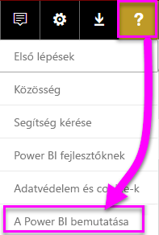
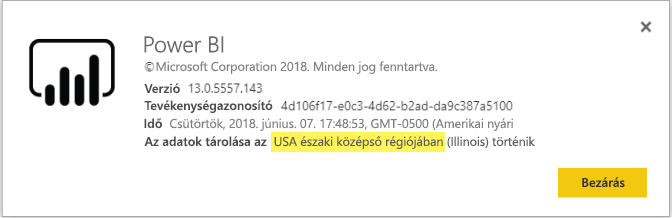

# <a name="frequently-asked-questions-about-power-bi-embedded"></a>Gyakori kérdések – Power BI Embedded

* Ha bármilyen egyéb kérdése van, [kérdezze meg a Power BI közösségét](http://community.powerbi.com/).
* Továbbra sem találja a megoldást? Keresse fel a [Power BI támogatási oldalát](https://powerbi.microsoft.com/support/).

## <a name="general"></a>Általános

### <a name="what-is-power-bi-embedded"></a>Mi az a Power BI Embedded?

[A Microsoft Power BI Embedded (PBIE)](azure-pbie-what-is-power-bi-embedded.md) lehetővé teszi az alkalmazásfejlesztők ágyazhat be lenyűgöző, teljes mértékben interaktív jelentéseket az alkalmazásokba hozhat létre saját adatmegjelenítéseket és vezérlők előzmények nélkül.

### <a name="who-is-the-target-audience-for-power-bi-embedded"></a>Ki a Power BI Embedded célközönsége?

A fejlesztők és szoftvercégek, más néven független szoftvergyártók (ISV), a kódolási alkalmazásokat.

### <a name="how-is-power-bi-embedded-different-from-power-bi-the-service"></a>Mi a különbség a Power BI Embedded és a Power BI szolgáltatás között?

A Power BI egy olyan elemzési szolgáltatottszoftver-megoldás, amely vállalatok számára teszi lehetővé a legfontosabb üzleti adataik egyszerű megtekintését.

A Microsoft kifejlesztett Power BI Embedded független szoftverszállítók számára, aki a Vizualizációk beágyazása ügyfeleik döntéseit elemzési segítségével alkalmazásaikat. Ez megkíméli ISV-k nem kell maguknak saját elemzési megoldásokat készíthet. [Embedded analytics](embedding.md) lehetővé teszi a vállalati adatok eléréséhez, és hajtsa végre a lekérdezéseket az alkalmazáson belüli elemzések generálásához, üzleti felhasználók.


### <a name="what-is-the-difference-between-power-bi-premium-and-power-bi-embedded"></a>Mi a különbség a Power BI Premium és a Power BI Embedded között?

A Power BI Premium kapacitás vállalatok, amelyek a szervezet, partnerek, ügyfelek és szállítók egyetlen áttekintést nyújt a teljes körű BI megoldást kívánják stíluskalauz. A Power BI Premium segítséget nyújt vállalata döntéshozatalaiban. A Power BI Premium egy Szolgáltatottszoftver-termék, amely lehetővé teszi a felhasználóknak a mobile apps, belsőleg fejlesztett alkalmazásokon keresztül vagy a Power BI portálon a tartalmak felhasználása.

Power BI Embedded az ISV-k számára, akik a Vizualizációk beágyazása alkalmazásokba. A Power BI Embedded az Ön ügyfelei számára nyújt segítséget a döntéshozatalaik során, ugyanis a Power BI Embedded alkalmazások fejlesztőinek készült, és ezeknek az alkalmazásoknak a vállalaton belüli és kívüli ügyfelei egyaránt használhatják a Power BI Embedded-kapacitásokban tárolt tartalmakat. Nem oszthat meg Power BI Embedded-kapacitástartalmak egy webes közzététel vagy egykattintásos közzététel a SharePoint szolgáltatásban.

### <a name="what-is-the-microsoft-recommendation-for-when-a-customer-should-buy-power-bi-premium-vs-power-bi-embedded"></a>A Microsoft javaslata alapján mikor érdemes megvásárolni a Power BI Premiumot, és mikor a Power BI Embeddedet?

A Microsoft azt javasolja, hogy a vállalatok vásárolhat Power BI Premium egy nagyvállalati szintű, felhőbeli önkiszolgáló BI-megoldás. Azt javasoljuk, hogy a független szoftverszállítók vásárolhat Power BI Embedded az embedded analytics felhőalapú összetevőit. Azonban egy ügyfél nem vonatkoznak megkötések melyik terméket vásárolható meg.

Előfordulhat, hogy bizonyos esetekben, ahol az ISV (általában nagyobb méretűek), mellett alkalmazás beágyazása, szeretnének használni egy P Termékváltozatot az előrecsomagolt Power BI szolgáltatás számára a szervezetben további kihasználása érdekében. Egyes nagyvállalatok akkor is dönthetnek az Azure-beli A termékváltozatok használata mellet, ha csak az üzletági alkalmazások fejlesztése és az elemzési képességek beágyazása érdekli őket, és nem szeretnék az előrecsomagolt Power BI szolgáltatást használni.

### <a name="how-many-embed-tokens-can-i-create"></a>Hány beágyazási tokent hozhatok létre?

Beágyazási tokenek PRO-licenccel rendelkező elsődlegesen fejlesztési-tesztelési, így a Power BI fő fiókja vagy [szolgáltatásnév](embed-service-principal.md) csak a tokenek csak korlátozott számú hozhat létre. Éles környezetben használt beágyazásokhoz [vásároljon kapacitást](#technical). Hány beágyazási tokent is létrehozhat kapacitásokhoz megvásárolt nincs korlátozva van. Az [Elérhető szolgáltatások](https://docs.microsoft.com/rest/api/power-bi/availablefeatures) oldalon ellenőrizheti a használati értéket, amely százalékosan jelzi az aktuális beágyazott használatot.

## <a name="technical"></a>Műszaki

### <a name="what-is-the-difference-between-the-a-skus-in-azure-and-the-em-skus-in-office-365"></a>Mi a különbség az Azure-beli „A” termékváltozatok és az Office 365-beli „EM” termékváltozatok között?

PowerBI.com egy vállalati szoftver, mint számos képességek között megtalálható például közösségi együttműködés lehetőségét, az e-mail előfizetést és az egyéb funkciókkal rendelkező szoftverszolgáltatás (SaaS-) megoldás. PowerBI.com ISV-k a beágyazott elemzési megoldásának tartalom kezelése és a bérlői szintű beállítások segítségével.

Power BI Embedded, Platform (PaaS) szolgáltatás állíthat be az API-kat a fejlesztők használhatók ágyazhatnak be elemzési megoldásokat létrehozni.

Itt látható a szolgáltatások közötti különbségekről részleges listáját.

| Funkció | Power BI Embedded | Power BI Premium-kapacitás | Power BI Premium-kapacitás |
|----------------------------------------------------------------------------------|-------------------|---------------------------|---------------------------|
|   | (A termékváltozatok) | (EM termékváltozatok) | (P termékváltozatok) |
| Összetevők beágyazása Power BI alkalmazás munkaterületeiről | Azure-kapacitás | Office 365-kapacitás | Office 365-kapacitás |
| Power BI-jelentések használata Embedded-alkalmazásokban | Igen | Igen | Igen |
| Power BI-jelentések használata SharePointban | Nem | Igen | Igen |
| Power BI-jelentések használata Dynamicsben | Nem | Igen | Igen |
| Power BI-jelentések használata Teamsben (a mobil alkalmazás kivételével) | Nem | Igen | Igen |
| Hozzáférés a tartalomhoz INGYENES Power BI-licenccel a Powerbi.com oldalon és a Power BI Mobile-on | Nem | Nem | Igen |
| Hozzáférés a tartalomhoz INGYENES, MS Office-alkalmazásokba beágyazott Power BI-licenccel | Nem | Igen | Igen |

### <a name="power-bi-now-offers-three-skus-for-embedding-a-skus-em-skus-and-p-skus-which-one-should-i-purchase-for-my-scenario"></a>A Power BI három típusú termékváltozatot kínál a beágyazásra: az A termékváltozatokat, az EM termékváltozatokat és a P termékváltozatokat. Melyiket vásároljam meg a saját forgatókönyvemhez?

|  |A termékváltozat (Power BI Embedded)  |EM termékváltozat (Power BI Premium)  |P termékváltozat (Power BI Premium)  |
|---------|---------|---------|---------|
|Vásárlás  |Azure Portal |Office |Office |
|Felhasználási módok | Tartalmak beágyazása saját alkalmazásba | <li> Tartalmak beágyazása saját alkalmazásba <br><br><br> <li> Tartalmak beágyazása MS Office-alkalmazásokba: <br> - [SharePoint](https://powerbi.microsoft.com/blog/integrate-power-bi-reports-in-sharepoint-online/) <br> - [Teams (a mobilalkalmazás kivételével)](https://powerbi.microsoft.com/blog/power-bi-teams-up-with-microsoft-teams/) <br> - [Dynamics 365](https://docs.microsoft.com/dynamics365/customer-engagement/basics/add-edit-power-bi-visualizations-dashboard) | <li> Tartalmak beágyazása saját alkalmazásba <br><br><br> <li> Tartalmak beágyazása MS Office-alkalmazásokba: <br> - [SharePoint](https://powerbi.microsoft.com/blog/integrate-power-bi-reports-in-sharepoint-online/) <br> - [Teams (a mobilalkalmazás kivételével)](https://powerbi.microsoft.com/blog/power-bi-teams-up-with-microsoft-teams/) <br> - [Dynamics 365](https://docs.microsoft.com/dynamics365/customer-engagement/basics/add-edit-power-bi-visualizations-dashboard) <br><br><br> <li> Tartalom megosztása Power BI-felhasználókkal a [Power BI szolgáltatásban](https://powerbi.microsoft.com/)  |
|Számlázás |Óránként |Havonta |Havonta |
|Kötelezettségvállalás  |Nincs kötelezettségvállalás |Éves  |Havi/Éves |
|Megkülönböztetés |Az Azure Portalon vagy API-kon keresztül teljes mértékű rugalmasságot tesz lehetővé, vagyis felfelé és lefelé történő méretezhetőséget, illetve az erőforrások felfüggesztését és folytatását  |Tartalom beágyazása a SharePoint Online és a Microsoft Teams (nem tartalmazza a mobilalkalmazást) használatával |Egy kapacitáson belül egyesíti az alkalmazásokba történő beágyazásokat és a Power BI szolgáltatás használatát |

### <a name="what-are-the-prerequisites-to-create-a-pbie-capacity-in-azure"></a>Milyen feltételekkel hozható létre PBIE-kapacitás az Azure-ban?

* Jelentkezzen be a vállalati címtárba (Microsoft-fiókok nem támogatottak).
* Power BI-bérlő van szüksége, azt jelenti, a címtár legalább egy felhasználója előfizetett a Power bi-ban. 
* A vállalati címtárban szerepelnie kell egy Azure-előfizetésnek.

### <a name="how-can-i-monitor-power-bi-embedded-capacity-consumption"></a>Hogyan figyelhetem meg a Power BI Embedded kapacitásfogyasztását?

* [A Power BI felügyeleti portál](../service-admin-portal.md#power-bi-embedded) használata.

* A [metrikai alkalmazás](https://review.docs.microsoft.com/power-bi/service-admin-premium-monitor-capacity) letöltése a Power BI-ban.

* Az [Azure-beli diagnosztikai naplózás](azure-pbie-diag-logs.md) használata.

### <a name="can-my-capacity-scale-automatically-to-adjust-to-my-app-consumption"></a>Képes automatikusan méretezi alkalmazás-szolgáltatások használati módosítani?

Amíg nem automatikus méretezés, bármikor méretezése az összes API-k érhetők el.

### <a name="why-creatingscalingresuming-a-capacity-results-in-putting-the-capacity-into-a-suspended-state"></a>Miért módosítja a kapacitás létrehozása/méretezése/folytatása a kapacitás állapotát felfüggesztettre?

Kapacitás kiépítése (scale/folytatása/létrehozása) sikertelen lehet. A részletek beolvasása API segítségével ellenőrizze a kapacitás ProvisioningState: [Kapacitások – Részletek beolvasása](https://docs.microsoft.com/rest/api/power-bi-embedded/capacities/getdetails).

### <a name="can-i-only-create-power-bi-embedded-capacities-in-a-specific-region"></a>Csak egy megadott régióban tudok Power BI Embedded-kapacitásokat létrehozni?

A [Multi-Geo (előzetes verzió)](embedded-multi-geo.md) funkcióval a saját Power BI-bérlője helyétől eltérő régióban is vásárolhat [Power BI Embedded-kapacitást](azure-pbie-create-capacity.md).

### <a name="how-can-i-find-my-pbi-tenant-region"></a>Hol találhatom PBI-bérlő régiómban?

A PBI-portál segítségével a PBI bérlői régióban található.

[https://app.powerbi.com/](https://app.powerbi.com/) > ? > A Power BI bemutatása




### <a name="what-does-the-cloud-solution-provider-csp-channel-support"></a>Mit támogat a Cloud Solution Provider (CSP) csatorna?

* A CSP előfizetési típusú bérlőjéhez létrehozhat PBIE-t
* A partnerfiók bejelentkezhet az ügyfélbérlőbe, vásárolhat PBIE-t az ügyfélbérlőhöz, és meghatározhatja az ügyfélbérlő felhasználóját a Power BI-kapacitás rendszergazdájaként

### <a name="why-do-i-get-an-unsupported-account-message"></a>Miért kapok „nem támogatott fiók” üzenetet?

A Power BI megköveteli, hogy céges fiókkal jelentkezzen be. A Power BI, Microsoft-fiókkal regisztráció közben nem támogatott.

### <a name="can-i-use-apis-to-create-and-manage-azure-capacities"></a>Használható API-k létrehozása és kezelése az Azure kapacitások?

Igen, vannak Powershell-parancsmagok és Azure Resource Manager REST API használatával PBIE-erőforrások létrehozásához és kezeléséhez.

* [REST API-k](https://docs.microsoft.com/rest/api/power-bi-embedded/)
* [PowerShell-parancsmagok](https://docs.microsoft.com/powershell/module/azurerm.powerbiembedded/)

### <a name="what-is-the-pbi-embedded-dedicated-capacity-role-in-a-pbi-embedded-solution"></a>Mi az a PBI Embedded elkülönített kapacitási szerepkör a PBI Embedded megoldásban?

A [gyártási megoldás előléptetése](embed-sample-for-customers.md#move-to-production), kell rendelnie a Power BI-tartalmakat (alkalmazás-munkaterületről) az alkalmazás használja a Power BI Embedded (A Termékváltozat) kapacitáshoz.

### <a name="in-what-azure-regions-is-pbi-embedded-available"></a>Milyen Azure-régióban érhető el a beágyazott PBI?

[PAM](https://ecosystemmanager.azurewebsites.net/home) (EcoManager) – lásd termékrendelkezésre állás-kezelő

Elérhető régiók (16 – ugyanazok a régiók, mint a Power BI-ban)

* US (6) – USA keleti régiója, USA 2. keleti régiója, USA északi középső régiója, USA déli középső régiója, USA nyugati régiója, USA 2. nyugati régiója
* Európa (2) – Észak-Európa, Nyugat-Európa
* Ázsia és a Csendes-óceáni térség (2) – Délkelet-Ázsia, Kelet-Ázsia
* Brazília (1) – Dél-Brazília
* Japán (1) – Kelet-Japán
* Ausztrália (1) – Délkelet-Ausztrália
* India (1) Nyugat-India
* Kanada (1) – Közép-Kanada
* Egyesült Királyság (1) Egyesült Királyság déli régiója

### <a name="what-is-power-bi-embeddeds-authentication-model"></a>Mi a Power BI Embedded a hitelesítési modellre?

Power BI Embedded továbbra is a fő felhasználót (a kijelölt Power BI Pro-licenccel rendelkező felhasználó) hitelesítéshez, vagy az Azure AD használata [szolgáltatásnév](embed-service-principal.md) hitelesítéséhez az alkalmazás belül a Power bi-ban.  

 Egy független valósítható meg a saját hitelesítési és engedélyezési alkalmazásaik számára.

Használhatja meglévő címtárát, ha már rendelkezik Azure AD-bérlő. Ezenkívül létrehozhat egy új Azure AD-bérlőt a beágyazott alkalmazásai tartalmainak biztonságához.

AAD-token beszerzéséhez használhatja az [Azure Active Directory valamely hitelesítési kódtárát](https://docs.microsoft.com/azure/active-directory/develop/active-directory-authentication-libraries). Ügyfélkódtárak több platformhoz is elérhetőek.

### <a name="my-application-already-uses-aad-for-user-authentication-how-can-we-use-this-identity-when-authenticating-to-power-bi-in-a-user-owns-data-scenario"></a>Az alkalmazásom már AAD-t használ a felhasználói hitelesítéshez. Hogyan használhatjuk ezt az identitást, a „Felhasználó az adatok tulajdonosa” forgatókönyvek esetében a Power BI-ban való hitelesítésekor?

Célszerű a szabványos OAuth--meghatalmazásos folyamat (<https://docs.microsoft.com/azure/active-directory/develop/web-api>). A Power BI szolgáltatás (és a szükséges hatókörök) engedély szükséges az alkalmazás konfigurálása a kell. Miután egy felhasználói jogkivonat az alkalmazáshoz, akkor egyszerűen hívása ADAL API AcquireTokenAsync a felhasználói hozzáférés jogkivonatot, és adja meg a Power BI-erőforrás URL-címe az erőforrás-azonosító:

```csharp
var context = new AD.AuthenticationContext(authorityUrl);
var userAssertion = new AD.UserAssertion(userAccessToken);
var clientAssertion = new AD.ClientAssertionCertificate(MyAppId, MyAppCertificate)
var authenticationResult = await context.AcquireTokenAsync(resourceId, clientAssertion, userAssertion);
```

### <a name="what-object-id-is-the-service-principal-object-id"></a>Milyen objektum azonosítója a azonosítója?

A *Objektumazonosító* Objektumazonosítóját az alkalmazás már van egy regisztrált alkalmazás fő képernyőjén.

Az objektum azonosítója található a *felügyelt alkalmazás a helyi könyvtár > Tulajdonságok* szakaszban a azonosítója kell használnia. Az Objektumazonosító való hivatkozáshoz egy egyszerű szolgáltatást az operations vagy a szükséges módosításokat a szolgáltatásnév-objektum azonosítóját. Például az egyszerű szolgáltatás-rendszergazdaként alkalmazására egy munkaterületet.

### <a name="how-is-power-bi-embedded-different-from-other-azure-services"></a>Miben különbözik a Power BI Embedded más Azure-szolgáltatásoktól?

Power BI Embedded az Azure megvásárlása előtt egy Power BI-fiókkal kell rendelkeznie. A Power BI Embedded üzembe helyezett régiója határozza meg a Power BI-fiókjába. A Power BI Embedded-kapacitását az Azure-ban kezelheti:

* Méretezheti felfelé vagy lefelé
* Felvehet kapacitás-rendszergazdákat
* Szüneteltethet és folytathat szolgáltatás

A PowerBI.com használatával munkaterületeket rendelhet a Power BI Embedded-kapacitásához, vagy megszüntetheti a hozzárendeléseket.

### <a name="what-are-the-supported-deploy-regions"></a>Mik azok a támogatott üzembe helyezési régiók?

Délkelet-Ausztrália, Dél-Brazília, Közép-Kanada, USA 2. keleti régiója, Nyugat-India, Kelet-Japán, USA északi középső régiója, Észak-Európa, USA déli középső régiója, Délkelet-Ázsia, Egyesült Királyság déli régiója, Nyugat-Európa, az USA nyugati régiója és az USA 2. nyugati régiója.

### <a name="what-content-pack-data-types-can-you-embed"></a>Milyen tartalomcsomag adattípusokat is beágyazni?

Ön *nem* beágyazási **irányítópultok** és **csempék** tartalomcsomag adatkészlet alapján készült. Azonban Ön *is* beágyazási **jelentések** tartalomcsomag adatkészlet alapján készült.

### <a name="what-is-the-difference-between-using-row-level-security-rls-vs-javascript-filters"></a>Mi a különbség a sorszintű biztonság (RLS) vs használatával. JavaScript-szűrők használata között?

Esetén gyakran keveredési körül, és a JavaScript-szűrők, rls-t használja, mert több módszert vezérlése milyen egy adott felhasználó látható, a másik pedig a felhasználó szemszögéből optimalizálása.

Az RLS-nél a független szoftverszállító szabályozza az adatszűrést a modell létrehozásának és a beágyazott token generálásának részeként. A végfelhasználó csak azt látja, amit a független szoftverszállító engedélyez a számára. Ebben az esetben a felhasználó dönthet úgy, hogy kevesebb adatot jelenít meg, mint amennyi a szűrővel látható, de nem tudja megkerülni az RLS-konfigurációt, és a megengedettnél több adatot nem tud megjeleníteni.

Ügyféloldali szűrési (JavaScript) a független Szoftvergyártók dönthetnek úgy, hogy mi a felhasználó, a kezdeti nézet látja, de azok nem tudja vezérelni a változásokat a végfelhasználó a nézetet, maga is vonatkozhatnak. Felhasználói Javascript-Ügyfélkód adatszűrést a háttérkiszolgálón is indíthat, mivel ez nem tekinthető biztonságos.

További részletekért lásd [Az RLS- és a JavaScript-szűrők összehasonlítása](embedded-row-level-security.md#using-rls-vs-javascript-filters) szakaszt.

### <a name="how-do-i-manage-permissions-for-service-principals-with-power-bi"></a>Hogyan kezelhetem az engedélyeket a szolgáltatásnevekhez a Power BI-jal?

Miután engedélyezte a [szolgáltatásnév](embed-service-principal.md) használata a Power bi-ban, AD-engedélyekről az alkalmazás nem érvénybe többé. Az alkalmazás engedélyeit ekkor a Power BI felügyeleti portálján lehet kezelni.

A szolgáltatásnevek a biztonsági csoportjukból öröklik az engedélyeket a Power BI összes bérlői beállításához. Engedélyek korlátozása, kijelölt biztonsági csoport létrehozása az egyszerű szolgáltatások, majd adja hozzá a az **meghatározott biztonsági csoportok kivételével** a releváns, engedélyezve a Power BI-beállítások listája.

Ennek akkor van jelentősége, amikor **rendszergazdaként** felveszi a szolgáltatásnevet az új munkaterületre. Ezt a feladatot kezelheti az [API-kon](https://docs.microsoft.com/rest/api/power-bi/groups/addgroupuser) keresztül vagy a Power BI szolgáltatásban.

### <a name="when-to-use-an-application-id-vs-a-service-principal-object-id"></a>Mikor érdemes alkalmazásazonosítót használni a szolgáltatásnév objektumazonosítója helyett?

Az **[alkalmazásazonosító](embed-sample-for-customers.md#application-id)** a hozzáférési jogkivonat létrehozására szolgál az alkalmazásazonosító hitelesítés céljából történő átadásakor.

A műveletek végrehajtásakor egy szolgáltatásnévre történő hivatkozáshoz vagy módosítások végzéséhez a **[szolgáltatásnév objektumazonosítóját](embed-service-principal.md#how-to-get-the-service-principal-object-id)** használja, például úgy, hogy a szolgáltatásnevet adminisztrátorként alkalmazza a munkaterületre.

### <a name="can-you-manage-an-on-premises-data-gateway-with-service-principal"></a>Kezelheti az helyszíni adatátjárót szolgáltatásnévvel?

Helyszíni adatátjárót (adatátjárót) nem kezelheti ugyanúgy a [szolgáltatásnévvel](embed-service-principal.md), ahogyan azt a fő fiókkal teheti.

Fő fiókkal telepíthet adatátjárót, hozzáadhat felhasználókat az átjáróhoz, csatlakozhat adatforráshoz, és elvégezhet egyéb felügyeleti feladatokat.

Szolgáltatásnévvel konfigurálhat [sorszintű biztonságot (RLS-t)](embedded-row-level-security.md#on-premises-data-gateway-with-service-principal-preview) az SQL Server Analysis Services (SSAS) helyszíni, élő kapcsolattal rendelkező adatforrásával. Így kezelheti a felhasználókat és az adatelérésüket az SSAS-ben a **Power BI Embedded** szolgáltatásnévvel létrehozott integrációjakor.

### <a name="can-you-sign-into-the-power-bi-service-with-service-principal"></a>Bejelentkezhet a Power BI szolgáltatásba szolgáltatásnévvel?

Nem, a Power BI-ba szolgáltatásnévvel nem lehet bejelentkezni.

Emellett nem használhat fel tartalmat felhasználóként külső alkalmazásokban (SaaS-beágyazás), csak akkor, ha létrehoz egy beágyazási tokent.

### <a name="what-are-the-best-practices-to-improve-performance"></a>Mik a teljesítmény növelése érdekében ajánlott eljárások?

[A Power BI Embedded teljesítménye](embedded-performance-best-practices.md)

## <a name="licensing"></a>Licencelés

### <a name="how-do-i-purchase-power-bi-embedded"></a>Hogyan tudom megvásárolni a Power BI Embeddedet?

A Power BI Embedded az Azure-on keresztül érhető el.

### <a name="what-happens-if-i-already-purchased-power-bi-premium-and-now-i-want-some-power-bi-embedded-in-azure-benefits"></a>Mi történik, ha már megvásároltam a Power BI Premiumot és szeretném használni néhány Power BI Embedded az Azure-kedvezmények?

Ügyfeleink továbbra is fizetnie, bármely meglévő Power BI premiumukról aktuális megállapodásuk szerinti időszak végéig, ezt követően, ezen a ponton a Power BI premiumukról szükség szerint.

### <a name="do-i-still-have-to-buy-power-bi-premium-to-get-access-to-power-bi-embedded"></a>Meg kell vásárolnom a Power BI Premiumot, hogy hozzáférhessek a Power BI Embeddedhez?

Nem, a Power BI Embedded magában foglalja a megoldásainak üzembe helyezéséhez és terjesztéséhez szükséges Azure-alapú kapacitást.

### <a name="whats-the-purchase-commitment-for-power-bi-embedded"></a>Milyen kötelezettségeket kell vállalni a Power BI Embedded megvásárlásakor?

Ügyfeleink a használatukat óránként módosíthatják. Nincs a Power BI Embedded szolgáltatás havi vagy éves kötelezettségvállalás.

### <a name="how-does-the-usage-of-power-bi-embedded-show-up-on-my-bill"></a>Hogyan jelenik meg a Power BI Embedded használata a számlámon?

A Power BI Embedded költségeinek számlázása könnyen előrejelezhető módon, óránként történik az üzembe helyezett csomópont(ok) típusa alapján. A számlázás, amennyiben az erőforrás aktív, akkor is, ha nem történik tényleges használat. Kell leállítani a számlázás az erőforrás szüneteltethető.

### <a name="who-needs-a-power-bi-pro-license-for-power-bi-embedded-and-why"></a>Kinek van szüksége a Power BI Embeddedhez Power BI Pro-licencre, és miért?

A Power BI Pro-licencre van szüksége, vagy [szolgáltatásnév](embed-service-principal.md) REST API-k. Jelentések hozzáadása egy Power BI-munkaterület, valamelyik elemzőnek szüksége van egy Power BI Pro-licenc vagy a szolgáltatás egyszerű. Kezelheti a Power BI-bérlő és a kapacitás, a rendszergazda szükség a Power BI Pro-licencre van.

Power BI Embedded lehetővé teszi a portál használata a Power BI beágyazott tartalmak jóváhagyása és kezelése céljából, hitelesíteni a alkalmazást a megfelelő adattárakban található jelentésekhez eléréséhez a powerbi.com-on belül a Power BI Pro-licencre van szükség.

A [beágyazott jelentések létrehozásához/szerkesztéséhez](https://github.com/Microsoft/PowerBI-JavaScript/wiki/Create-Report-in-Embed-View) a saját alkalmazásán belül a végfelhasználónak mégsem kell Pro-licenccel rendelkeznie, mivel nem követelmény, hogy Power BI-felhasználó legyen.

### <a name="can-i-get-started-for-free"></a>Elkezdhetem ingyen a használatát?

Igen, használhatja az [Azure-kreditjeit](https://azure.microsoft.com/free/) a Power BI Embeddedhez.

### <a name="can-i-get-a-trial-experience-for-power-bi-embedded-in-azure"></a>Van lehetőség az Azure-beli Power BI Embedded kipróbálására?

Mivel a Power BI Embedded Azure része, lehetőség a szolgáltatás használatához a [Azure-regisztráció során kapott 200 USD értékű kredit](https://azure.microsoft.com/free/).

### <a name="is-power-bi-embedded-available-for-national-clouds-us-government-germany-china"></a>Elérhető a Power BI Embedded az országos felhőkben (US Government, Németország, Kína)?

Power BI Embedded is rendelkezésre áll a [országos felhők](embed-sample-for-customers-national-clouds.md).

### <a name="is-power-bi-embedded-available-for-non-profits-and-educational"></a>Létezik non-profit vagy oktatási intézményeknek szánt Power BI Embedded?

Nincs nincsenek különleges Azure-díjszabási non-profit és oktatási intézmények számára.

## <a name="power-bi-workspace-collection"></a>Power BI-munkaterületcsoport

### <a name="what-is-power-bi-workspace-collection"></a>Mi a Power BI-munkaterületcsoport?

**A Power BI-Munkaterületcsoport** (**Power BI Embedded** 1-es verzió) megoldás alapján a **Power BI-Munkaterületcsoport** Azure-erőforrás. Ez a megoldás **Power BI Embedded**-alkalmazások létrehozását teszi lehetővé az ügyfelek részére a **Power BI-munkaterületcsoporton** belüli Power BI tartalmak, megoldások és dedikált API-k segítségével, valamint munkaterületcsoport-kulcsokkal az alkalmazás Power BI-ban történő hitelesítéséhez.

### <a name="can-i-migrate-from-power-bi-workspace-collection-to-power-bi-embedded"></a>Áttelepíthetem-e a Power BI-munkaterületcsoport tartalmait a Power BI Embeddedbe?

1. Az áttelepítési eszközzel klónozhatja a **Power BI-munkaterületcsoport** tartalmát a Power BI-ba – https://docs.microsoft.com/power-bi/developer/migrate-from-powerbi-embedded#content-migration.

2. Kezdje a Power BI-tartalmakat használó **Power BI Embedded** kísérleti (POC) alkalmazással.

3. Ha készen áll a munkára, szerezzen be dedikált kapacitást a **Power BI Embedded** használatához, és rendelje hozzá a saját Power BI-tartalmat (munkaállomást).

    > [!Note]
    > Miközben párhuzamosan létrehozza a **Power BI Embedded** megoldást, tovább használhatja a **Power BI-munkaterületcsoportot** is. Miután elkészült, áttelepítheti az ügyfelet az új **Power BI Embedded** megoldásba, majd kivezetheti a **Power BI-munkaterületcsoportot**.

További információkért lásd: [Power BI-munkaterületcsoport tartalmainak áttelepítése a Power BI Embeddedbe](https://docs.microsoft.com/power-bi/developer/migrate-from-powerbi-embedded)

### <a name="is-power-bi-workspace-collection-on-a-deprecation-path"></a>A Power BI-Munkaterületcsoport egy elavult elérési úton van?

Igen, de már használó ügyfelek számára a **Power BI-Munkaterületcsoport** megoldás továbbra is használhatja, amíg elavult. Az ügyfelek egyaránt létrehozhatnak új munkaterületcsoportokat és **Power BI-munkaterületcsoportot** még használó **Power BI Embedded**-alkalmazásokat is.

Azonban ez azt is jelenti, hogy új funkciók nem adja hozzá bármelyik **Power BI-Munkaterületcsoport** megoldásokat. Azt javasoljuk, hogy az ügyfelek számára, hogy azok az új migrálási terv **Power BI Embedded** megoldás.

### <a name="when-is-power-bi-workspace-collection-support-discontinued"></a>Mikor szűnik meg a Power BI-munkaterületcsoport támogatása?

A **Power BI-munkaterületcsoportot** használó ügyfelek 2018 június végéig, vagy a támogatási szerződésük lejártáig folytathatják a használatot.

### <a name="in-what-regions-can-i-create-a-pbi-workspace-collection"></a>Mely régiókban is létrehozható egy PBI-munkaterület-csoport?

Az elérhető régiók Délkelet-Ausztrália, Dél-Brazília, Közép-Kanada, az USA 2. keleti régiója, Kelet-Japán, az USA északi középső régiója, Észak-Európa, az USA déli középső régiója, Délkelet-Ázsia, az Egyesült Királyság déli régiója, Nyugat-Európa, Nyugat-India és az USA nyugati régiója.

### <a name="why-should-i-migrate-from-pbi-workspace-collection-to-power-bi-embedded"></a>Miért kell áttelepítenem a PBI-munkaterületcsoportot a Power BI Embeddedbe?

Néhány új **Power BI Embedded** megoldás funkciókat és képességeket, nem megvalósítható **Power BI-Munkaterületcsoport**.

Néhány ilyen funkció:
* A PBI adatforrások támogatottak. Csak két **Power BI-Munkaterületcsoport** adatforrások támogatottak. 
* Számos új funkció, köztük a Q&A, a Frissítés, a könyvjelzők, az irányítópultok és csempék beágyazása és az egyéni menü csak a **Power BI Embedded** megoldásban van támogatva.
* Kapacitás-számlázási modell.

## <a name="embedding-setup-tool"></a>Beágyazáshoz szükséges telepítési eszköz

### <a name="what-is-the-embedding-setup-tool"></a>Mi a beágyazáshoz szükséges telepítési eszköz?

A [beágyazáshoz szükséges telepítési eszköz](https://aka.ms/embedsetup) használatával egyszerűen elvégezheti az első lépéseket, és letölthet egy mintaalkalmazást, amellyel elkezdheti a beágyazást a Power BI-jal.

### <a name="which-solution-should-i-choose"></a>Melyik megoldást válasszam?

* A [Beágyazás az ügyfelek számára](embedding.md#embedding-for-your-customers) használatával irányítópultokat és jelentéseket ágyazhat be olyan felhasználók számára, akik nem rendelkeznek Power BI-fiókkal. Futtassa a [Beágyazás az ügyfelek számára](https://aka.ms/embedsetup/AppOwnsData) megoldást.
* A [Beágyazás a cég számra](embedding.md#embedding-for-your-organization) használatával kiterjesztheti a Power BI szolgáltatást. Futtassa a [Beágyazás a cég számára](https://aka.ms/embedsetup/UserOwnsData) megoldást.

### <a name="ive-downloaded-the-sample-app-which-solution-do-i-choose"></a>Letöltöttem a mintaalkalmazást. Melyik megoldást válasszam?

A **Beágyazás az ügyfelek számára** használatához mentse és csomagolja ki a *PowerBI-Developer-Samples.zip* fájlt. Nyissa meg a *PowerBI-Developer-Samples-master\App Owns Data* mappát, majd futtassa a *PowerBIEmbedded_AppOwnsData.sln* fájlt.

A **Beágyazás a cég számára** használatához mentse és csomagolja ki a *PowerBI-Developer-Samples.zip* fájlt. Nyissa meg a *PowerBI-Developer-Samples-master\User Owns Data\integrate-report-web-app* mappát, és futtassa a *pbi-saas-embed-report.sln* fájlt.

### <a name="how-can-i-edit-my-registered-application"></a>Hogyan szerkeszthetem a regisztrált alkalmazásomat?

Az Azure AD-ben regisztrált alkalmazások szerkesztéséről itt olvashat bővebben: [Rövid útmutató: Alkalmazás frissítése az Azure Active Directoryban](https://docs.microsoft.com/azure/active-directory/develop/quickstart-v1-update-azure-ad-app).

### <a name="how-can-i-edit-my-power-bi-user-profile-or-data"></a>Hogyan szerkeszthetem a Power BI-felhasználói profilt vagy adatokat?

A Power BI-adatok szerkesztéséről [itt](https://docs.microsoft.com/power-bi/service-basic-concepts) olvashat.

További információ: [A beágyazott alkalmazás hibaelhárítása](embedded-troubleshoot.md).

További kérdései vannak? [Kérdezze meg a Power BI közösségét](http://community.powerbi.com/)
