# <a name="row-level-security-with-power-bi-embedded"></a>Sorszintű biztonság a Power BI Embeddeddel

A **sorszintű biztonság (RLS)** a felhasználók adatokhoz való hozzáférésének korlátozására használható irányítópultoknál, csempéknél, jelentéseknél és adatkészleteknél. Ugyanazokkal a összetevőkkel több felhasználó is dolgozhat egyszerre úgy, hogy más-másféle adatokat látnak. A beágyazás támogatja a RLS-t.

Ha nem Power BI-felhasználóknak végez beágyazást (alkalmazás tulajdonában lévő adatok, ez általában a szoftverszolgáltatóknál fordul elő), akkor ez a cikk Önnek szól. Konfigurálnia kell a beágyazási tokent a felhasználó és a szerepkör figyelembe vételéhez.

Ha Power BI-felhasználóknak végez beágyazást (a felhasználó az adatok tulajdonosa) a cégen belül, az RLS ugyanúgy működik, mintha közvetlenül a Power BI szolgáltatásban lenne. Nem kell semmi mást csinálnia az alkalmazásban. További információkat a [Power BI sorszintű biztonság (RLS) használatával kapcsolatos](../service-admin-rls.md) részben találhat.


Az RLS kihasználása érdekében fontos megérteni a három fő alapelvet: a felhasználókat, a szerepköröket és a szabályokat. Lássuk mindegyiket közelebbről:

**Felhasználók** – Az összetevőket (irányítópultokat, csempéket, jelentéseket vagy adatkészleteket) megtekintő tényleges végfelhasználók. A Power BI Embedded esetében a felhasználókat beágyazási jogkivonatban lévő felhasználónév tulajdonság azonosítja.

**Szerepkörök** – A felhasználók szerepkörökhöz tartoznak. A szerepkörök szabályok tárolói és olyan nevük lehet, mint *Értékesítési igazgató* vagy *Értékesítési képviselő*. A Power BI Desktopban hozhat létre szerepköröket. További információkat a [sorszintű biztonság (RLS) Power BI Desktoppal való használatával kapcsolatos](../desktop-rls.md) részben találhat.

**Szabályok** – A szerepkörök szabályokkal rendelkeznek, és ezek a szabályok az adatokra alkalmazott tényleges szűrők. A szabályok lehetnek olyan egyszerűek, mint a „Country = USA”, vagy sokkal dinamikusabbak is lehetnek.
A cikk hátralévő részében egy példa szerepel az RLS elkészítésére és beágyazott alkalmazásban való használatára. A példánk a [Kiskereskedelmi elemzési minta](http://go.microsoft.com/fwlink/?LinkID=780547) PBIX-fájlját használja.


## <a name="adding-roles-with-power-bi-desktop"></a>Szerepkörök hozzáadása a Power BI Desktoppal

A **Kiskereskedelmi elemzési minta** egy kiskereskedelmi láncban lévő összes áruház értékesítéseit jeleníti meg. Az RLS nélkül nem számít, hogy melyik kerület menedzsere jelentkezik be és tekinti meg a jelentést, mindegyik ugyanazokat az adatokat látja. A felső vezetőség meghatározta, hogy mindegyik kerületi menedzser csak az általuk kezelt áruházak értékesítéseit láthatja. Az RLS használata lehetővé teszi, hogy a felső vezetőség az adatokat a kerületi menedzser alapján korlátozza.

Az RLS a Power BI Desktopban készül. Az adatkészlet és a jelentés megnyitásakor diagramnézetre válthatunk a séma megtekintéséhez:


Ebben a sémában a következőket érdemes megfigyelni:

* Minden mérték (például a **Total Sales** (Összes értékesítés)) a **Sales** (Értékesítések) ténytáblában van tárolva.
* Négy további kapcsolódó dimenziótábla van: **Item** (Tétel), **Time** (Idő), **Store** (Áruház) és **District** (Kerület).
* A kapcsolatvonalakon lévő nyilak jelzik, milyen irányba haladhatnak a szűrők az egyik táblából egy másikba. Ha például egy szűrő a **Time[Date]** (Idő [Dátum]) táblára van helyezve, a jelenlegi sémában csak a **Sales** (Értékesítések) táblába szűrne lefelé értékeket. Ez a szűrő nincs hatással más táblákra, mert a kapcsolatvonalakon lévő összes nyíl az értékesítések táblára mutat, és nem a másik irányba.
* A **District** (Kerület) tábla jelzi, hogy ki az egyes kerületek menedzsere:
  
    

Ezen séma alapján, ha szűrőt alkalmazunk a **District** (Kerület) táblában lévő **District Manager** (Kerületi menedzser) oszlopra, és ha ez a szűrő megfelel a jelentést megtekintő felhasználónak, akkor a szűrő a **Store** (Áruház) és a **Sales** (Értékesítések) táblákra is szűr, hogy az adott menedzser adatait jelenítse meg.

Ezt a következőképpen teheti meg:

1. A **Modellezés** lapon válassza a **Szerepkörök kezelése** lehetőséget.

    
2. Hozzon létre egy **Manager** (Menedzser) nevű új szerepkört.

    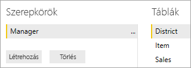
3. A **District** (Kerület) táblában írja be ezt a DAX-kifejezést: **[District Manager] = USERNAME()** .

    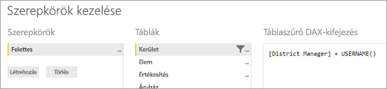
4. A szabályok működésének biztosítása érdekében a **Modellezés** lapon válassza a **Megtekintés szerepkörökként** lehetőséget, majd válassza ki a most létrehozott **Manager** szerepkört és az **Egyéb felhasználó** szerepkört is. Írja be felhasználóként az **AndrewMa** nevet.

    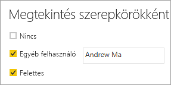

    A jelentések most úgy jelenítenek meg adatokat, mintha **AndrewMa** néven lenne bejelentkezve.

A szűrő alkalmazásával, ahogyan itt tettük, a **District** (Kerület), **Store** (Áruház) és **Sales** (Értékesítések) táblákban lévő összes rekordot szűri. A **Sales** (Értékesítések) és a **Time** (Idő) közötti kapcsolat szűrőiránya miatt azonban a **Sales** (Értékesítések) és az **Item** (Tétel), illetve az **Item** (Tétel) és a **Time** (Idő) táblákra nem szűr le. A kétirányú keresztszűrésről további információért töltse le az [SQL Server Analysis Services 2016-ban és a Power BI Desktopban használatható kétirányú keresztszűrést ismertető](http://download.microsoft.com/download/2/7/8/2782DF95-3E0D-40CD-BFC8-749A2882E109/Bidirectional%20cross-filtering%20in%20Analysis%20Services%202016%20and%20Power%20BI.docx) tanulmányt.

## <a name="applying-user-and-role-to-an-embed-token"></a>Felhasználó és szerepkör alkalmazása beágyazási tokenre

Most, hogy konfigurálva vannak a Power BI Desktop-szerepkörök, el kell végezni néhány dolgot az alkalmazásban a szerepkörök kihasználása érdekében.

Az alkalmazás hitelesíti és engedélyezi a felhasználókat és beágyazási tokenekkel ad hozzáférést ezeknek a felhasználóknak egy adott Power BI Embedded-jelentéshez. A Power BI Embedded nem rendelkezik konkrét információkkal arról, hogy ki a felhasználó. Az RLS működéséhez további kontextust kell megadnia a beágyazási token részeként identitások formájában. Az identitásokat a [Beágyazási token](https://docs.microsoft.com/rest/api/power-bi/embedtoken) API-val adhatja át.

Az API olyan identitások listáját fogadja el, amelyben jelezve vannak a kapcsolódó adatkészletek. Annak érdekében, hogy az RLS működjön, az alábbiakat kell átadnia az identitás részeként.

* **username (kötelező)** – Egy sztring, amellyel azonosítható a felhasználó az RLS-szabályok alkalmazásakor. Csak egyetlen felhasználó sorolható fel. Az Ön felhasználóneve *ASCII* karakterekkel hozható létre.
* **roles (kötelező)** – Sorszintű biztonsági szabályok alkalmazásakor kiválasztható szerepköröket tartalmazó sztring. Több szerepkör átadásakor sztringtömbként kell azokat átadni.
* **dataset (kötelező)** – Az épp beágyazott összetevőre érvényes adatkészlet.

A beágyazási token létrehozásához használja a **PowerBIClient.Reports** **GenerateTokenInGroup** metódusát.

Módosíthatja például a [PowerBIEmbedded_AppOwnsData](https://github.com/Microsoft/PowerBI-Developer-Samples/tree/master/App%20Owns%20Data) mintát. A *Services\EmbedService.cs 76. és 77. sora* a következőről frissíthető:

```csharp
// Generate Embed Token.
var generateTokenRequestParameters = new GenerateTokenRequest(accessLevel: "view");

var tokenResponse = await client.Reports.GenerateTokenInGroupAsync(GroupId, report.Id, generateTokenRequestParameters);
```

to

```csharp
var generateTokenRequestParameters = new GenerateTokenRequest("View", null, identities: new List<EffectiveIdentity> { new EffectiveIdentity(username: "username", roles: new List<string> { "roleA", "roleB" }, datasets: new List<string> { "datasetId" }) });

var tokenResponse = await client.Reports.GenerateTokenInGroupAsync("groupId", "reportId", generateTokenRequestParameters);
```

Ha a REST API-t hívja meg, a frissített API már elfogad egy további, **identities** nevű JSON-tömböt, amely tartalmaz egy felhasználónevet, a szerepkörök sztringlistáját és az adatkészletek karakterlánclistáját. 

Használja példaként az alábbi kódot:

```json
{
    "accessLevel": "View",
    "identities": [
        {
            "username": "EffectiveIdentity",
            "roles": [ "Role1", "Role2" ],
            "datasets": [ "fe0a1aeb-f6a4-4b27-a2d3-b5df3bb28bdc" ]
        }
    ]
}
```

Most, hogy minden együtt van, amikor valaki bejelentkezik az alkalmazásba az összetevő megtekintéséhez, csak a számukra engedélyezett adatokat láthatja, ahogyan azt a sorszintű biztonság meghatározza.

## <a name="working-with-analysis-services-live-connections"></a>Élő Analysis Services-kapcsolatok használata

A sorszintű biztonság használható az élő Analysis Services-kapcsolatokkal a helyszíni kiszolgálókhoz. Néhány speciális alapelvet meg kell értenie, amikor ilyen típusú kapcsolatot használ.

A felhasználónév tulajdonsághoz megadott hatályos identitásnak Windows-felhasználónak kell lennie, amely rendelkezik engedélyekkel az Analysis Services-kiszolgálóhoz.

### <a name="on-premises-data-gateway-configuration"></a>Helyszíni adatátjáró konfigurációja

Az élő Analysis Services-kapcsolatok használatakor [helyszíni adatátjárót](../service-gateway-onprem.md) kell használni. Az identitást tartalmazó beágyazási token létrehozásakor a fő fióknak az átjáró rendszergazdájaként kell szerepelnie. Ha a fő fiók nincs felsorolva, a sorszintű biztonság nem fog érvényesülni az adatok tulajdonságán. Az átjáró nem rendszergazda felhasználója megadhat szerepköröket, de a saját felhasználónevét kell megadnia a hatályos identitáshoz.

### <a name="use-of-roles"></a>Szerepkörök használata

A szerepkörök az identitással adhatók meg a beágyazási tokenekben. Ha nincs megadva szerepkör, a rendszer a megadott felhasználónévvel oldja fel a társított szerepköröket.

### <a name="using-the-customdata-feature"></a>A CustomData funkció használata

A CustomData funkció csak az **Azure Analysis Services** szolgáltatásban található modelleken, és csak az **Élő csatlakozás** módban működik. A felhasználókkal és a szerepkörökkel ellentétben a CustomData funkció nem használható .pbix-fájlokban. Ha a CustomData funkcióval hoz létre tokent, felhasználónévvel kell rendelkeznie.

A CustomData funkció lehetővé teszi sorszűrő hozzáadását, amikor Power BI-adatokat tekint meg az alkalmazásában az **Azure Analysis Services** adatforrásként való használatakor (az Azure Analysis Serviceshez kapcsolódó Power BI-adatok megtekintésekor az alkalmazásban).

A CustomData funkció lehetővé teszi szabad szöveg (sztring) átadását a CustomData kapcsolatisztring-tulajdonság használatával. Az Analysis Services ezt az értéket a *CUSTOMDATA()* függvényen keresztül használja.

Az **Azure Analysis Services** szolgáltatásban a dinamikus RLS (amely dinamikus értékeket használ a szűrő kiértékelésére) használatának egyetlen módja a *CUSTOMDATA()* függvény alkalmazása.

A szerepkör DAX-lekérdezésében is használhatja, valamint szerepkör nélkül egy mérték DAX-lekérdezésében.
A CustomData funkció az alábbi összetevők tokenlétrehozási funkcióinak egyik eleme: irányítópult, jelentés és csempe. Az irányítópultok több CustomData-identitással rendelkezhetnek (csempénként/modellenként eggyel).

#### <a name="customdata-sdk-additions"></a>A CustomData SDK-bővítményei

A CustomData sztringtulajdonságot hozzáadtuk a tokenlétrehozási forgatókönyvbeli hatályos identitásunkhoz.

```json
[JsonProperty(PropertyName = "customData")]
public string CustomData { get; set; }
```

Az identitás egyéni adatokkal, az alábbi hívással hozható létre:

```csharp
public EffectiveIdentity(string username, IList<string> datasets, IList<string> roles = null, string customData = null);
```

#### <a name="customdata-sdk-usage"></a>A CustomData SDK-használata

A REST API meghívásánál minden identitáshoz egyéni adatokat adhat meg, például:

```json
{
    "accessLevel": "View",
    "identities": [
        {
            "username": "EffectiveIdentity",
            "roles": [ "Role1", "Role2" ],
            "customData": "MyCustomData",
            "datasets": [ "fe0a1aeb-f6a4-4b27-a2d3-b5df3bb28bdc" ]
        }
    ]
}
```

Az alábbi lépések követésével megkezdheti a CustomData() függvény beállítását a Power BI Embedded alkalmazáshoz.

1. Hozzon létre egy Azure Analysis Services-adatbázist. Majd jelentkezzen be az Azure Analysis Services-kiszolgálóra az [SQL Server Management Studióval](https://docs.microsoft.com/sql/ssms/download-sql-server-management-studio-ssms?view=sql-server-2017).

    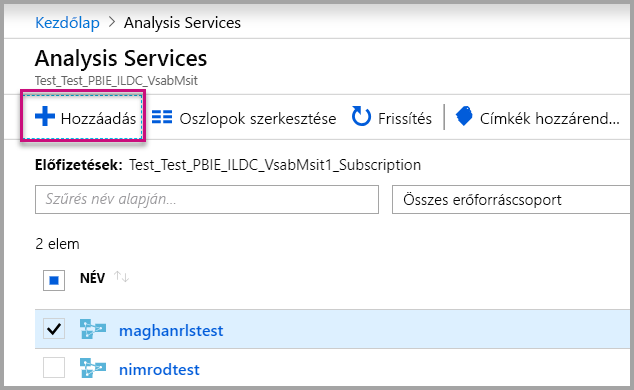

    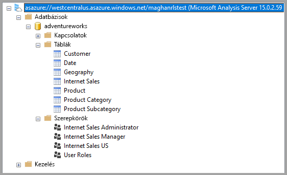

2. Hozzon létre egy szerepkört az Analysis Services-kiszolgálón.

    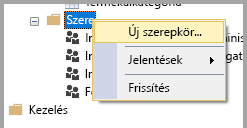

3. Adja meg az **Általános** beállításokat.  Itt megadhatja a **Szerepkörnév** értékét, és beállíthatja a csak **olvasható** adatbázis-jogosultságot.

    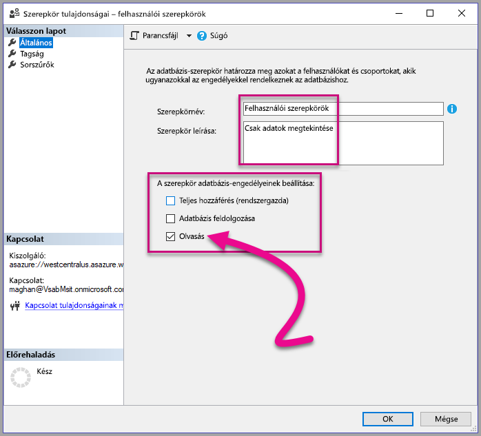

4. Adja meg a **Tagság** beállításait. Itt veheti fel a szerepkör által érintett felhasználókat.

    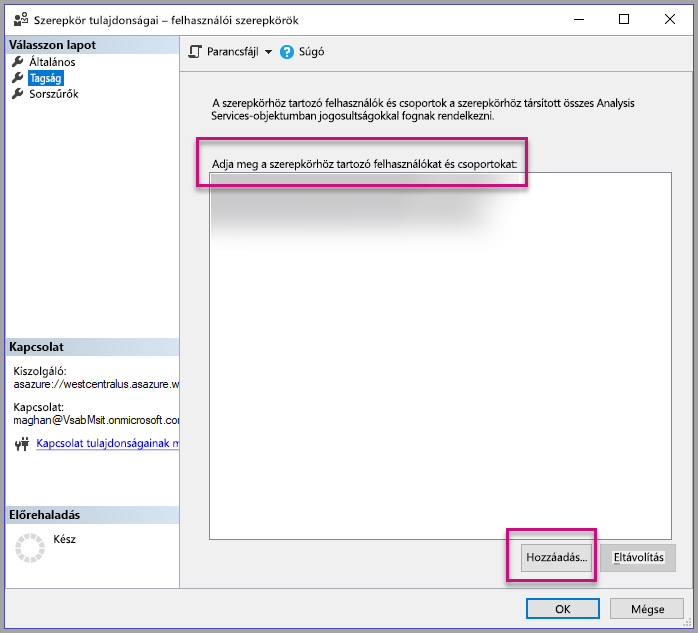

5. Állítsa be a **Sorszűrők** DAX-lekérdezését a *CUSTOMDATA()* függvénnyel.

    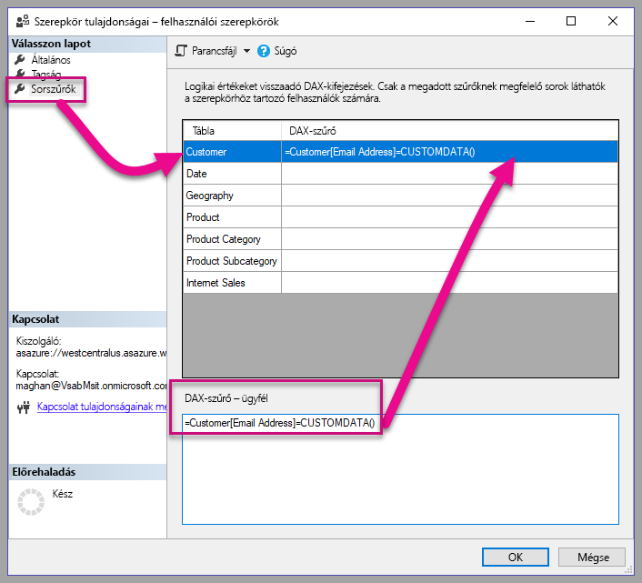

6. Hozzon létre egy PBI-jelentést, és tegye közzé egy dedikált kapacitással rendelkező munkaterületen.

    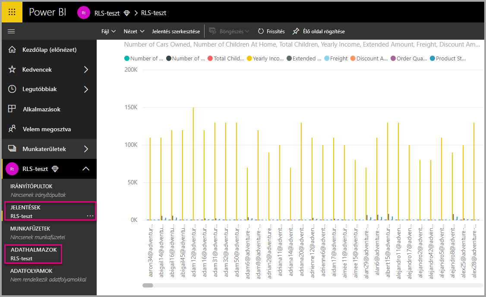

7. Használja a Power BI API-kat a CustomData funkció használatára az alkalmazásában.  Ha a CustomData funkcióval hoz létre tokent, felhasználónévvel kell rendelkeznie. A felhasználónévnek meg kell egyeznie a fő felhasználó egyszerű felhasználónevével. A fő felhasználónak a létrehozott szerepkör tagjának kell lennie. Ha nincs szerepkör megadva, akkor a rendszer minden szerepkört felhasznál az RLS kiértékelésére, amelynek a fő felhasználó a tagja.

    Ha [szolgáltatásnévvel](embed-service-principal.md) dolgozik, fő fiók használata helyett a fenti lépéseket kell elvégeznie. Beágyazási token létrehozásakor a felhasználónévnek használja a [szolgáltatásnév objektumazonosítóját](embed-service-principal.md#how-to-get-the-service-principal-object-id) felhasználónévként.

    > [!Note]
    > Ha készen áll az alkalmazás éles környezetben történő üzembe helyezésére, a fő felhasználói fiók mezője vagy beállítása nem lehet látható a végfelhasználó számára.

    Tekintse meg a [kódot](#customdata-sdk-additions) a CustomData funkció hozzáadásához.

8. Most megtekintheti a jelentést az alkalmazásában a CustomData-érték(ek) alkalmazása előtt a jelentésben lévő összes adat megjelenítéséhez.

    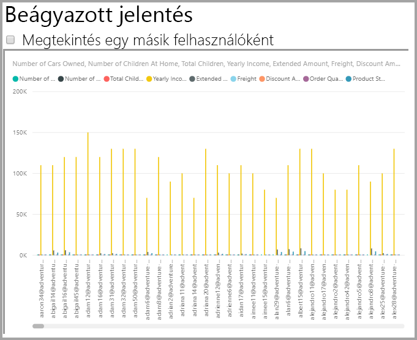

    Ezután alkalmazza a Customdata-értéke(ke)t, hogy láthassa, hogyan jelenít meg a jelentés egy másik adatkészletet.
    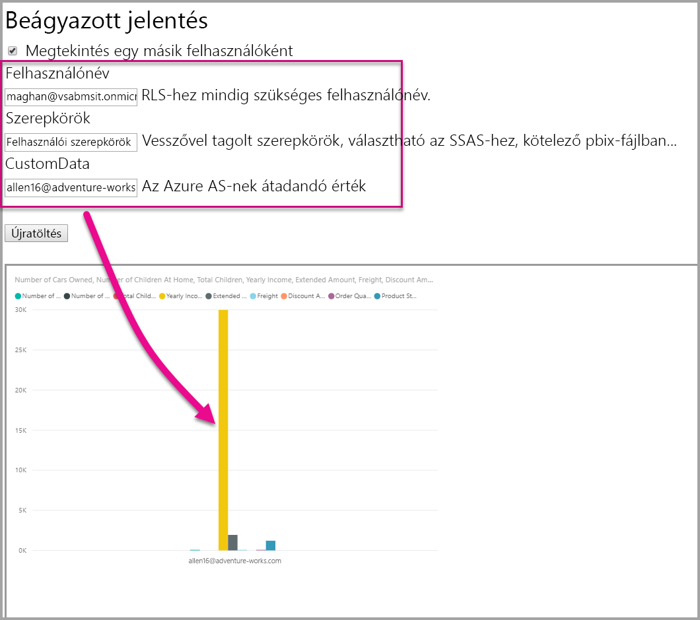

## <a name="using-rls-vs-javascript-filters"></a>Az RLS és a JavaScript-szűrők használatának összehasonlítása

Ha a jelentés adainak szűrése mellett dönt, használhat **sorszintű biztonságot (RLS)** vagy **JavaScript-szűrőket**.

A [sorszintű biztonság](../service-admin-rls.md) olyan szolgáltatás, amely az adatmodell szintjén szűri az adatokat. A háttéralkalmazás adatforrása szabályozza az RLS-beállításait. Az adatmodell alapján a beágyazási tokengenerálás állítja be a felhasználónevet és a szerepköröket a munkamenethez. Nem lehet felülírni, eltávolítani vagy vezérelni az ügyféloldali kóddal, és ezért számít biztonságosnak. Az adatok biztonságos szűréséhez az RLS-t ajánljuk. Az adatokat az RLS-sel az alábbi lehetőségek egyikének használatával szűrheti.

* [Szerepkörök konfigurálása Power BI-jelentésekben](../desktop-rls.md).
* Szerepkörök konfigurálása az adatforrás szintjén (csak Analysis Services élő kapcsolat esetén).
* Programozott módon egy [beágyazási tokennel](https://docs.microsoft.com/rest/api/power-bi/embedtoken/datasets_generatetokeningroup) az `EffectiveIdentity` használatával. Beágyazási token használatakor a tényleges szűrő áthalad a beágyazási tokenen az adott munkamenetnél.

A [JavaScript-szűrők](https://github.com/Microsoft/PowerBI-JavaScript/wiki/Filters#page-level-and-visual-level-filters) lehetővé teszik, hogy a felhasználó csökkentett, hatókörön belüli vagy szűrt nézetet lásson az adatokról. A felhasználó azonban továbbra is rendelkezik hozzáféréssel a modellséma tábláihoz, oszlopaihoz és mértékeihez, és elérheti az itt található bármely adatot. Az adatok korlátozott elérése csak RLS-sel lehetséges, ügyféloldali szűrő API-kkal nem.

## <a name="token-based-identity-with-azure-sql-database-preview"></a>Jogkivonat alapú identitás Azure SQL Database esetén (előzetes verzió)

**Jogkivonat-alapú identitással** úgy adhatja meg egy beágyazási jogkivonat hatályos identitását, hogy **Azure Active Directory (AAD)** hozzáférési jogkivonatot használ az **Azure SQL Database-hez**.

Az adataikat **Azure SQL Database-ben** tároló ügyfelek új képesség kihasználásával kezelhetik felhasználóikat és azok adatokhoz való hozzáférését az Azure SQL-ben, a **Power BI Embeddeddel** való integráció esetén.

A beágyazási jogkivonat generálása során megadható egy felhasználó Azure SQL-ben hatályos identitása. Egy felhasználó hatályos identitása úgy adható meg, hogy átadja az AAD hozzáférési jogkivonatot a kiszolgálónak. A hozzáférési jogkivonat használatának célja az, hogy az adott munkamenetben csak a felhasználót illető adatok legyenek lekérve az Azure SQL-ből.

Használható egy felhasználói nézet kezelésére az Azure SQL-ben, vagy több-bérlős környezetben az Azure SQL-be egy adott ügyfélként való bejelentkezéshez. Használatával sorszintű biztonság alkalmazható a munkamenet során az Azure SQL-ben, így a munkamenet során csak a megfelelő adatok lesznek lekérve, tehát az RLS-t nem szükséges a Power BI-ban kezelni.

A hatályos identitást érintő ilyen kérdések az RLS-szabályokra vonatkoznak, közvetlenül az Azure SQL Serveren. A Power BI Embedded akkor használja a megadott hozzáférési jogkivonatot, amikor adatokat kérdez le az Azure SQL Serverről. A felhasználó egyszerű felhasználónevét (amelyhez a hozzáférési jogkivonat meg lett adva) a USER_NAME() SQL-függvénnyel lehet megállapítani.

A jogkivonat-alapú identitás csak DirectQuery-modelleknél működik, dedikált kapacitáson – olyan Azure SQL Database-hez csatlakozva, amely AAD-hitelesítés engedélyezésére van konfigurálva ([további tudnivalók az Azure SQL Database-hez használt AAD-hitelesítésről](https://docs.microsoft.com/azure/sql-database/sql-database-manage-logins)). Jogkivonat-alapú identitás használatához az adathalmaz adatforrásának konfigurálva kell lennie a végfelhasználók OAuth2 hitelesítő adatainak használatára.

   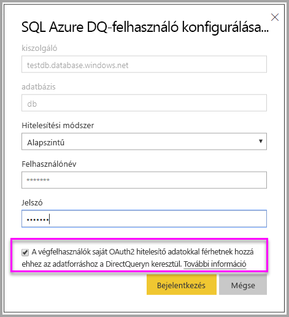

### <a name="token-based-identity-sdk-additions"></a>Jogkivonat-alapú identitás SDK-bővítményei

Az IdentityBlob tulajdonságot hozzáadtuk a jogkivonat-létrehozási forgatókönyvbeli hatályos identitásunkhoz.

```JSON
[JsonProperty(PropertyName = "identityBlob")]
public IdentityBlob IdentityBlob { get; set; }
```

Az IdentityBlob típus egy érték sztring tulajdonságot tároló, egyszerű JSON-struktúra

```JSON
[JsonProperty(PropertyName = "value")]
public string value { get; set; }
```

Az EffectiveIdentity a következő hívással hozható létre identitásblobbal:

```C#
public EffectiveIdentity(string username, IList<string> datasets, IList<string> roles = null, string customData = null, IdentityBlob identityBlob = null);
```

Identitásblob az alábbi hívással hozható létre.

```C#
public IdentityBlob(string value);
```

### <a name="token-based-identity-rest-api-usage"></a>Jogkivonat-alapú identitás REST API használata

Ha meghívja a [REST API-t](/rest/api/power-bi/embedtoken/reports_generatetokeningroup#definitions) minden identitásba felvehet identitásblobot.

```JSON
{
    "accessLevel": "View",
    "identities": [
        {
            "datasets": ["fe0a1aeb-f6a4-4b27-a2d3-b5df3bb28bdc"],
        “identityBlob”: {
            “value”: “eyJ0eXAiOiJKV1QiLCJh….”
         }
        }
    ]
}
```

Az identitásblobban megadott értéknek az Azure SQL Serverhez érvényes hozzáférési jogkivonatnak kell lennie (a következő forrás URL-címmel: <https://database.windows.net/>).

   > [!Note]
   > Ahhoz, hogy hozzáférési jogkivonatot hozhasson létre az Azure SQL-hez, az alkalmazásnak rendelkeznie kell **hozzáféréssel az Azure SQL DB-hez és a Data Warehouse-hoz**, valamint delegált jogosultsággal az **Azure SQL Database** API-hoz az AAD alkalmazásregisztrációs konfigurációban az Azure Portalon.

   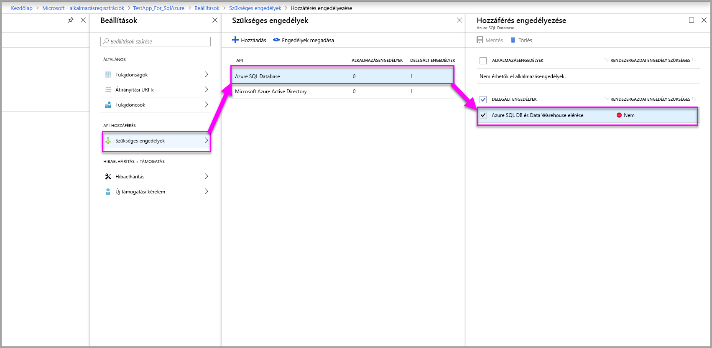

## <a name="on-premises-data-gateway-with-service-principal"></a>Helyszíni adatátjáró szolgáltatásnévvel

Azok az ügyfelek, akik SQL Server Analysis Services (SSAS) helyszíni, élő kapcsolatú adatforrásával konfigurálják a sorszintű biztonságot (RLS), használhatják az új [szolgáltatásnév](embed-service-principal.md) képességet a felhasználók és adatelérésük kezelésére az SSAS-ben a **Power BI Embeddeddel** létrehozott integráció során.

A [Power BI REST API-k](https://docs.microsoft.com/rest/api/power-bi/) lehetővé teszik az SSAS helyszíni, élő kapcsolatok hatályos identitásának meghatározását a beágyazási tokenhez egy [szolgáltatásnév-objektum](https://docs.microsoft.com/azure/active-directory/develop/app-objects-and-service-principals#service-principal-object) használatával.

Eddig az SSAS helyszíni, élő kapcsolatai hatályos identitásának meghatározásához a beágyazási tokent létrehozó fő felhasználónak az átjáró adminisztrátorának kellett lennie. Most a felhasználónak nem szükséges az átjáró adminisztrátorának lennie, hanem az átjáró adminisztrátora dedikált engedélyt adhat a felhasználónak az adatforráshoz, amely lehetővé teszi, hogy felülbírálja a hatályos identitást a beágyazási token létrehozásakor. Ez az új képesség lehetővé teszi a szolgáltatásnévvel történő beágyazást az élő SSAS-kapcsolatoknál.

E szerint a forgatókönyv szerint az átjáró adminisztrátora az [Adatforrás-felhasználó hozzáadása REST API-t](https://docs.microsoft.com/rest/api/power-bi/gateways/adddatasourceuser) használja, hogy megadja a szolgáltatásnévnek a *ReadOverrideEffectiveIdentity* engedélyt a Power BI Embeddedhez.

A felügyeleti portálon ezt az engedélyt nem lehet beállítani. Ennek az engedélynek a megadása kizárólag az API-val történik. A felügyeleti portál jelzi az ilyen engedéllyel rendelkező felhasználókat és egyszerű szolgáltatásneveket.

## <a name="considerations-and-limitations"></a>Megfontolandó szempontok és korlátozások

* A Power BI szolgáltatásban a felhasználók szerepkörökhöz rendelése nincs hatással az RLS-re beágyazási token használatakor.
* Bár a Power BI szolgáltatás nem alkalmazza az RLS-beállítást a rendszergazdákra vagy a szerkesztési engedélyekkel rendelkező tagokra, amikor beágyazási tokennel ad meg egy identitást, azt az adatokra alkalmazza.
* Az élő Analysis Services-kapcsolatok a helyszíni kiszolgálókhoz támogatottak.
* Az Azure Analysis Services élő kapcsolatai támogatják a szerepkör szerinti szűrést. Dinamikus szűrést a CustomData használatával végezhet.
* Ha a mögöttes adatkészlethez nincs szükség RLS-re, a GenerateToken kérés **nem** tartalmazhat hatályos identitást.
* Ha a mögöttes adatkészlet felhőalapú modell (gyorsítótárazott modell vagy DirectQuery), a hatályos identitásnak tartalmaznia kell legalább egy szerepkört, mert ellenkező esetben a szerepkör-hozzárendelés sikertelen lesz.
* Az identitáslista lehetővé teszi, hogy az irányítópultok beágyazásánál több identitásból álló tokent is lehessen használni. A lista minden más összetevő esetében csak egyetlen identitást tartalmaz.

### <a name="token-based-identity-limitations-preview"></a>Jogkivonat-alapú identitás-korlátozások (előzetes verzió)

* Ez a képesség csak a Power BI Premiummal való használatot korlátozza.
* A képesség helyszíni SQL Serverrel nem működik.
* Ez a képesség több földrajzi hely esetén nem működik.

További kérdései vannak? [Kérdezze meg a Power BI közösségét](https://community.powerbi.com/)
