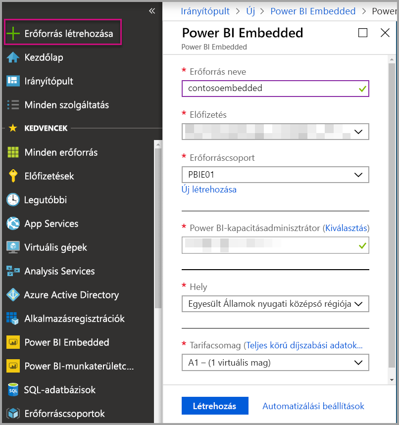
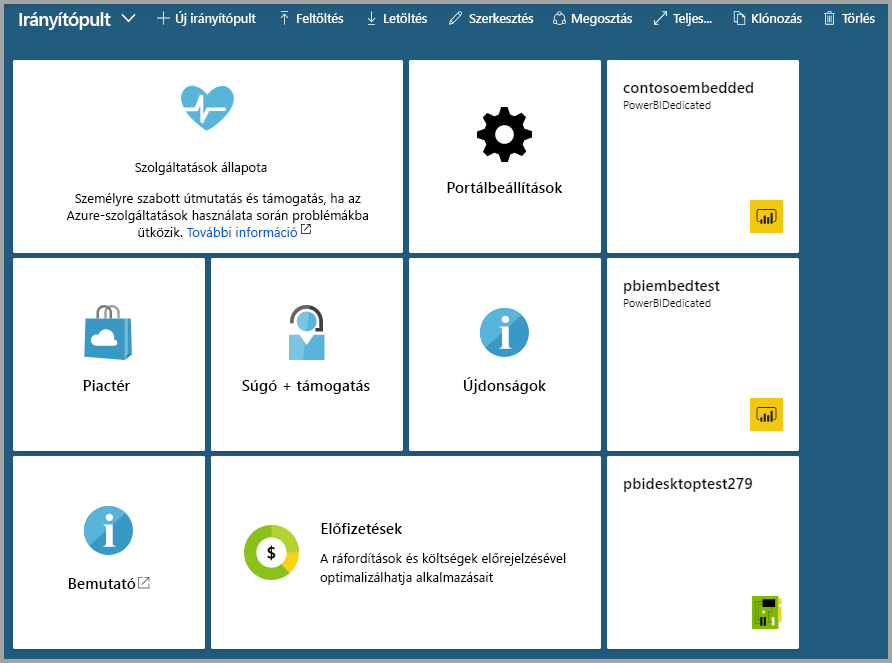

# Power BI Embedded-kapacitás létrehozása az Azure Portalon

Ez a cikk bemutatja, hogyan hozhat létre egy [Power BI Embedded](azure-pbie-what-is-power-bi-embedded.md)-kapacitást a Microsoft Azure-ban. A Power BI Embeddeddel lenyűgöző vizualizációkat, jelentéseket és irányítópultokat adhat gyorsan alkalmazásaihoz, így leegyszerűsítheti a Power BI funkcióit.

Ha még nincs Azure-előfizetése, kezdés előtt hozzon létre egy [ingyenes fiókot](https://azure.microsoft.com/free/).

> [!VIDEO https://www.youtube.com/embed/aXrvFfg_iSk]

## Előkészületek

Ennek a rövid útmutatónak az elvégzéséhez a következőkre lesz szüksége:

* **Azure-előfizetés:** Fiók létrehozásához lépjen az [Azure ingyenes próbaverziójának](https://azure.microsoft.com/free/) oldalára.
* **Azure Active Directory:** Előfizetését társítani kell egy Azure Active Directory- (AAD-) bérlővel. Továbbá ***be kell jelentkeznie az Azure-ba a bérlő egyik fiókjával***. A Microsoft-fiókok nem támogatottak. További információ: [Hitelesítés és felhasználói engedélyek](https://docs.microsoft.com/azure/analysis-services/analysis-services-manage-users).
* **Power BI-bérlő:** Az AAD-bérlő legalább egy fiókjának Power BI-regisztrációval kell rendelkeznie.
* **Erőforráscsoport:** Használjon egy meglévő erőforráscsoportot, vagy [hozzon létre egy újat](https://docs.microsoft.com/azure/azure-resource-manager/resource-group-overview).

## Kapacitás létrehozása

1. Jelentkezzen be az [Azure Portalon](https://portal.azure.com/).

2. A keresőmezőbe írja be a *Power BI Embedded* kifejezést.

3. A Power BI Embeddedben válassza a **Létrehozás** lehetőséget.

4. Adja meg a szükséges adatokat, majd válassza a **Létrehozás** lehetőséget.

    

    |Beállítás |Leírás |
    |---------|---------|
    |**Erőforrás neve**|A kapacitást azonosító név. Az erőforrás neve a Power BI felügyeleti portálon, valamint az Azure Portalon jelenik meg.|
    |**Előfizetés**|Az előfizetés, amelyben létre szeretné hozni a kapacitást.|
    |**Erőforráscsoport**|Az új kapacitást tartalmazó erőforráscsoport. Választhat meglévő erőforráscsoportot, vagy létrehozhat egy újat. További információt [Az Azure Resource Manager áttekintésében](https://docs.microsoft.com/azure/azure-resource-manager/resource-group-overview) találhat.|
    |**Power BI kapacitásadminisztrátor**|A Power BI kapacitás-rendszergazdái megtekinthetik a kapacitást a Power BI felügyeleti portálján, és hozzárendelési engedélyt adhatnak a felhasználóknak. A kapacitásadminisztrátor alapértelmezés szerint az Ön fiókja. A kapacitásadminisztrátornak a Power BI-bérlőn belül kell lennie.|
    |**Hely**|A Power BI bérlői szolgáltatási helye. Az alapértelmezett hely az otthoni régiója, de a [Multi-Geo-beállításokkal](embedded-multi-geo.md) módosíthatja a helyet.
    |**Tarifacsomag**|Válassza ki az igényeinek megfelelő SKU-t (virtuális magok és memóriaméret szerint)  További információt a [Power BI Embedded díjszabásában](https://azure.microsoft.com/pricing/details/power-bi-embedded/) találhat|

A **Minden szolgáltatás** > **Power BI Embedded** területre lépve megtekintheti, hogy készen áll-e az új kapacitás. Másik lehetőségként választhatja a **Rögzítés az irányítópulton** lehetőséget az értesítések szakaszban vagy a panelen az irányítópult megnyitásához, ahol megtekintheti az új kapacitást.

## Következő lépések

Az új Power BI Embedded-kapacitás használatához lépjen a Power BI felügyeleti portáljára, és rendeljen hozzá munkaterületeket. További információ: [Kapacitáskezelés a Power BI Premium és a Power BI Embedded szolgáltatással](https://powerbi.microsoft.com/documentation/powerbi-admin-premium-manage/).

Ha nem szeretné használni ezt a kapacitást, szüneteltetheti a számlázás leállításához. További információ: [Power BI Embedded-kapacitás szüneteltetése és elindítása az Azure Portalon](azure-pbie-pause-start.md).

Power BI-tartalmak beágyazásához tekintse meg a [Power BI-irányítópultok, -jelentések és -csempék beágyazása](https://powerbi.microsoft.com/documentation/powerbi-developer-embedding-content/) című témakört.

További kérdései vannak? [Kérdezze meg a Power BI közösségét](https://community.powerbi.com/)