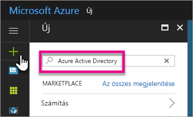
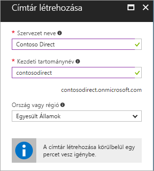
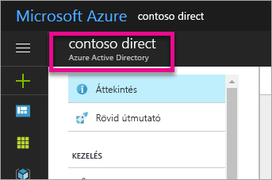
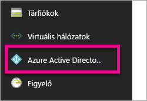
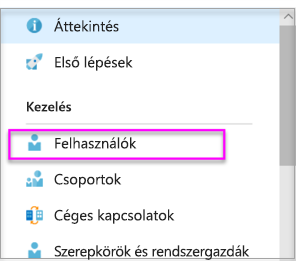
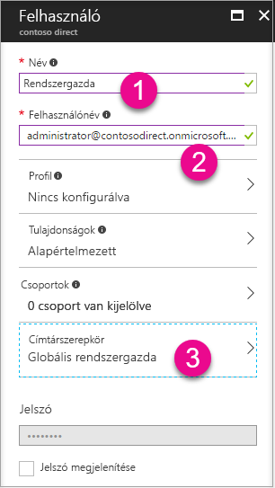
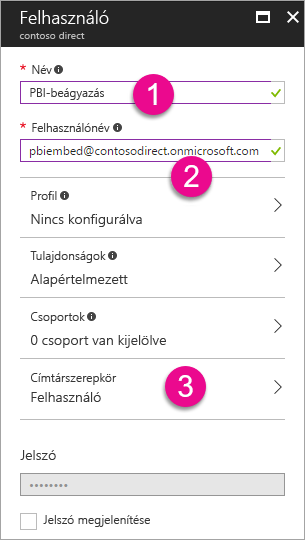

# Azure Active Directory-bérlő létrehozása a Power BI szolgáltatással való használathoz

Ismerje meg, hogyan hozhat létre új Azure Active Directory-bérlőt (Azure AD-bérlőt) a [Power BI REST API-kat](../automation/rest-api-reference.md) meghívó egyéni alkalmazásokhoz.

A bérlők a szervezetek képviselői az Azure Active Directoryban. Ez az Azure AD szolgáltatás egy dedikált példánya, amelyet a szervezetek megkapnak és a tulajdonukban áll, amikor regisztrálnak egy Microsoft-felhőszolgáltatásra, például az Azure, a Microsoft Intune vagy az Office 365 szolgáltatásra. Mindegyik Azure AD-bérlő önálló, és elkülönül a többi Azure AD-bérlőtől.

Ha már rendelkezik Azure AD-bérlővel, megadhat egy alkalmazást, és hozzárendelhet engedélyeket, így az meghívhatja a [Power BI REST API-kat](../automation/rest-api-reference.md).

Lehet, hogy a szervezete már rendelkezik egy Azure AD-bérlővel, amelyet az alkalmazásához használhat. Emellett létre is hozhat egy új bérlőt kifejezetten az alkalmazáshoz. Ez a cikk bemutatja egy új bérlő létrehozásának módját.

## Azure Active Directory-bérlő létrehozása

A Power BI egyéni alkalmazásokba integrálásához meg kell adnia egy alkalmazást az Azure AD-ben, amelyhez Azure AD-címtár szükséges. Ez a címtár az Ön *bérlője*. Ha a cége még nem rendelkezik bérlővel, mert nem használ Power BI-t vagy Office 365-öt, [be kell állítania egy fejlesztői környezetet](https://docs.microsoft.com/azure/active-directory/develop/active-directory-howto-tenant). Akkor is létre kell hoznia egyet, ha nem szeretné az alkalmazást keverni a szervezet bérlőjével, így elkülönítve tarthatja azt. Vagy csak létrehozhat egy bérlőt tesztelési célra is.

Új Azure AD-bérlő létrehozásához tegye a következőket:

1. Nyissa meg az [Azure Portalt](https://portal.azure.com), és jelentkezzen be egy Azure-előfizetéssel rendelkező fiókkal.

2. Válassza ki a **plusz ikont (+)** és keresse meg az **Azure Active Directoryt**.

    

3. Válassza ki az **Azure Active Directoryt** a keresési eredmények közül.

    

4. Válassza a **Létrehozás** lehetőséget.

5. Adja meg a **szervezet nevét** és a **kezdeti tartománynevet**. Ezután kattintson a **Létrehozás** elemre. A címtár létrehozása megtörtént.

    

   > [!NOTE]
   > A kezdeti tartománynév az onmicrosoft.com része. Egyéb tartományneveket később adhat hozzá. Egy bérlő címtára több hozzárendelt tartománnyal is rendelkezhet.

6. A címtár létrehozása után válassza az információs dobozt az új címtár kezeléséhez.

A következő lépésben bérlői felhasználókat adhat hozzá.

## Az Azure Active Directory-bérlő felhasználóinak létrehozása

Most, hogy már rendelkezésre áll a címtár, hozzunk létre legalább két felhasználót. Az egyik a bérlő globális rendszergazdája, a másik pedig a beágyazási főfelhasználó. Gondoljon az utóbbira úgy, mint egy szolgáltatásfiókra.

1. Győződjön meg arról, hogy az Azure Portal Azure Active Directory lapján tartózkodik.

    

    Ha más helyen van, válassza az Azure Active Directory ikont a bal oldali szolgáltatások sávon.

    

2. A **Kezelés** menüpontban válassza a **Felhasználók** lehetőséget.

    

3. Válassza a **Minden felhasználó**, majd az **+ Új felhasználó** lehetőséget.

4. Adjon meg egy **nevet** és **felhasználónevet** a bérlő globális rendszergazdájának. A **Címtárszerepkört** módosítsa **Globális rendszergazdára**. Megjelenítheti az ideiglenes jelszót is. Ha elkészült, válassza a **Létrehozás** lehetőséget.

    

5. Járjon el ugyanígy a hagyományos bérlői felhasználóval is. Ez a fiók használható a fő beágyazó fiókhoz is. Ezúttal a **Címtárszerepkört** hagyja **Felhasználó** értéken. Írja le a jelszót, majd válassza a **Létrehozás** elemet.

    

6. Regisztráljon a Power BI-ra az 5. lépésben létrehozott felhasználói fiókkal. Lépjen a [powerbi.com](https://powerbi.microsoft.com/get-started/) oldalra, és válassza a **Próbálja ki ingyen** lehetőséget a **Power BI – Felhőbeli együttműködés és megosztás** résznél.

    

    Amikor regisztrál, a rendszer felkéri a Power BI Pro 60 napig tartó, ingyenes kipróbálására. Ezt választva Pro-felhasználó lehet, amelynek keretében [beágyazott megoldást fejleszthet](embed-sample-for-customers.md).

   > [!NOTE]
   > Győződjön meg arról, hogy azzal a felhasználói fiók e-mail-címével regisztrál.

## Következő lépések

Most, hogy már rendelkezik Azure AD-bérlővel, használhatja ezt a bérlőt a Power BI-ben található elemek teszteléséhez. Emellett Power BI-irányítópultokat és -jelentéseket ágyazhat az alkalmazásába. További információ: [Power BI-irányítópultok, -jelentések és -csempék beágyazása](embed-sample-for-customers.md).

[Mi az Azure Active Directory?](https://docs.microsoft.com/azure/active-directory/active-directory-whatis) 
 
[Rövid útmutató:: Fejlesztői környezet beállítása](https://docs.microsoft.com/azure/active-directory/develop/active-directory-howto-tenant)  

További kérdései vannak? [Kérdezze meg a Power BI közösségét](https://community.powerbi.com/)
