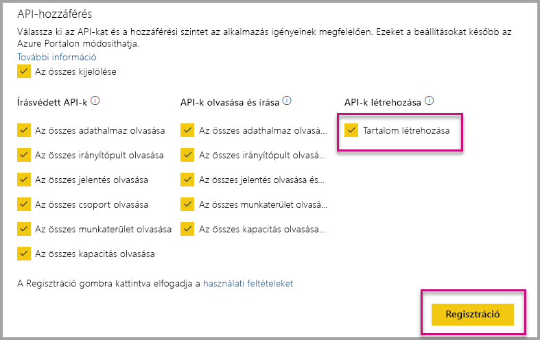

# Power BI-alkalmazások automatikus telepítése szervezeti beágyazáskor

Egy alkalmazás tartalmának beágyazásához a beágyazó felhasználónak [hozzáféréssel kell rendelkeznie az alkalmazáshoz](../../service-create-distribute-apps.md). Ha az alkalmazás telepítve van a felhasználó számára, a beágyazás zökkenőmentesen működik. További információ: [Jelentések és irányítópultok beágyazása alkalmazásokból](embed-from-apps.md). A PowerBI.com oldalon megszabható,hogy minden alkalmazás [telepítése automatikusan történjen](https://powerbi.microsoft.com/blog/automatically-install-apps/). Ez a művelet azonban bérlői szinten végezhető el, és minden alkalmazásra vonatkozik.

## Alkalmazások automatikus telepítése beágyazáskor

Ha a felhasználó hozzáfér egy alkalmazáshoz, azonban az nincs telepítve, a beágyazás meghiúsul. Az ilyen hibák elkerülése érdekében engedélyezze az alkalmazás automatikus telepítését a beágyazás során. Így ha a felhasználó által beágyazni kívánt alkalmazás nincs telepítve, a rendszer automatikusan telepíti azt. A kívánt tartalom így azonnal beágyazásra kerül, ami zökkenőmentes felhasználói élményt biztosít.

## Beágyazás Power BI-felhasználók esetén (a felhasználó az adatok tulajdonosa)

Ha engedélyezni szeretné az alkalmazások automatikus telepítését a felhasználók számára, az alkalmazásnak tartalomlétrehozási engedélyt kell adnia [az alkalmazás regisztrálásakor](register-app.md#register-with-the-power-bi-application-registration-tool), vagy azt követően.

Következő lépésként meg kell adnia az alkalmazás azonosítóját a beágyazási URL-címben. Az alkalmazásazonosító megadásához az alkalmazás létrehozójának telepítenie kell az alkalmazást, majd a támogatás [Power BI Rest API](https://docs.microsoft.com/rest/api/power-bi/)-hívások egyikét kell használnia, a [Jelentések lekérése](https://docs.microsoft.com/rest/api/power-bi/reports/getreports) vagy az [Irányítópultok lekérése](https://docs.microsoft.com/rest/api/power-bi/dashboards/getdashboards) hívást. Az alkalmazás létrehozójának ezután ki kell nyernie a beágyazási URL-címet a REST API-válaszból. Az alkalmazásazonosító megjelenik az URL-címben, ha a tartalom egy alkalmazásból származik.  A beágyazási URL-cím beszerzése után azzal rendszeresen beágyazhat.

## Biztonságos beágyazás

Az alkalmazások automatikus telepítéséhez az alkalmazás létrehozójának először telepítenie kell az alkalmazást, majd megnyitnia azt a PowerBI.com oldalon, és a jelentésre lépve lekérnie a hivatkozást. Az alkalmazáshoz hozzáféréssel rendelkező és a hivatkozást használni képes felhasználók beágyazhatják a jelentést.

## Megfontolandó szempontok és korlátozások

* Ehhez a forgatókönyvhöz csak jelentéseket és irányítópultokat ágyazhat be.

* Ez a funkció jelenleg nem támogatott az alkalmazás tulajdonában lévő adatokhoz és a SharePoint beágyazási forgatókönyveihez.