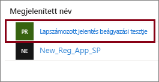

# <a name="tutorial-embed-power-bi-paginated-reports-into-an-application-for-your-customers-preview"></a>Oktatóanyag: Oldalakra osztott Power BI-jelentések beágyazása egy alkalmazásba az ügyfelek számára (előzetes verzió)

Az **Azure-beli Power BI Embedded** vagy az **Office-beli Power BI Embedded** segítségével oldalakra osztott jelentéseket ágyazhat be alkalmazásokba az alkalmazás tulajdonában lévő adatokkal. **Az alkalmazás tulajdonában lévő adatok** esetében egy alkalmazás a Power BI-t használja beágyazott elemzőplatformként. **ISV-ként** vagy **fejlesztőként** olyan Power BI-tartalmakat hozhat létre, amelyek oldalakra osztott jelentéseket jelenítenek meg egy teljes mértékben integrált és interaktív alkalmazásban anélkül, hogy a felhasználóknak Power BI-licenccel kellene rendelkezniük. Ez az oktatóanyag bemutatja, hogyan integrálhat oldalara osztott jelentéseket alkalmazásokba a Power BI .NET SDK és a Power BI JavaScript API segítségével.


Az oktatóanyag a következőket ismerteti:
> [!div class="checklist"]
> * Alkalmazás regisztrálása az Azure-ban.
> * Oldalakra osztott Power BI-jelentés beágyazása egy alkalmazásba.

## <a name="prerequisites"></a>Előfeltételek

Első lépésként, rendelkeznie kell az alábbiakkal:

* Egy [szolgáltatásnév (csak alkalmazásra vonatkozó jogkivonat)](embed-service-principal.md)
* Egy [Microsoft Azure](https://azure.microsoft.com/)-előfizetés
* Az Ön saját [Azure Active Directory-bérlőjének](create-an-azure-active-directory-tenant.md) beállítása
* Legalább egy A4-es vagy P1 [kapacitás](#create-a-dedicated-capacity)[, amelyen engedélyezve vannak az oldalakra osztott jelentés](../../service-admin-premium-workloads.md#paginated-reports) típusú számítási feladatok

Ha még nincs Azure-előfizetése, kezdés előtt hozzon létre egy [ingyenes fiókot](https://azure.microsoft.com/free/?WT.mc_id=A261C142F).

> [!IMPORTANT]
> * **Szolgáltatásnevet** kell használnia. A fő felhasználó nem támogatott.
> * Az egyszeri bejelentkezést (SSO-t) igénylő adatforrások nem támogatottak.
> * A Power BI-adatkészlet nem támogatott [adatforrásként](../../service-get-data.md).

## <a name="set-up-your-power-bi-environment"></a>A Power BI-környezet beállítása

Az oldalakra osztott jelentés beágyazásához a munkaterületet dedikált kapacitáshoz kell hozzárendelni, és a jelentést fel kell tölteni a munkaterületre.

### <a name="create-an-app-workspace"></a>Alkalmazás-munkaterület létrehozása

Ha azonban [szolgáltatásnevet](embed-service-principal.md) használ az alkalmazásába történő bejelentkezéshez, az [új munkaterületeket](../../service-create-the-new-workspaces.md) kell használnia. *Szolgáltatásnév* használata esetén Önnek rendszergazdának vagy tagnak kell lennie az alkalmazásával kapcsolatban érintett alkalmazás-munkaterületekben.

### <a name="create-a-dedicated-capacity"></a>Dedikált kapacitás létrehozása

Mielőtt importálna vagy feltöltene egy oldalakra osztott jelentést a beágyazáshoz, a jelentést tartalmazó munkaterületet legalább egy A4-es vagy P1-es kapacitáshoz kell rendelni. Két típusú kapacitás közül választhat:
* **Power BI Premium** – Oldalakra osztott jelentés beágyazásához*P* termékváltozat kapacitás szükséges. Power BI-tartalom beágyazásakor ezt a megoldást *Power BI-beágyazásnak* nevezzük. További információ erről az előfizetésről: [Mi az a Power BI Premium?](../../service-premium-what-is.md)
* **Azure Power BI Embedded** – Dedikált kapacitást a [Microsoft Azure Portalon](https://portal.azure.com) vásárolhat. Ez az előfizetés az *A* termékváltozatokat használja. Az oldalakra osztott jelentések beágyazásához legalább egy *A4* előfizetésre van szüksége. A Power BI Embedded-kapacitások létrehozásával kapcsolatos részletekért tekintse meg a [Power BI Embedded-kapacitás az Azure Portalon való létrehozásával](azure-pbie-create-capacity.md) kapcsolatos cikket.

Az alábbi táblázat az egyes termékváltozatok erőforrásait és korlátait ismerteti. Annak megállapításához, hogy melyik kapacitás felel meg legjobban az igényeinek, tekintse meg a [melyik termékváltozatot vásároljam meg a forgatókönyvemhez](https://docs.microsoft.com/power-bi/developer/embedded-faq#which-solution-should-i-choose) táblázatát.

| Kapacitás-csomópontok | Összes virtuális mag | Háttérrendszeri virtuális magok | Memória (GB) | Előtérrendszeri virtuális magok | 
| --- | --- | --- | --- | --- |
| P1/A4 | 8 | 4 | 25 | 4 |
| P2/A5 | 16 | 8 | 50 | 8 |
| P3/A6 | 32 | 16 | 100 | 16 |
| | | | | |

### <a name="assign-an-app-workspace-to-a-dedicated-capacity"></a>Alkalmazás-munkaterület hozzárendelése dedikált kapacitáshoz

A dedikált kapacitás létrehozása után hozzárendelheti az alkalmazás-munkaterületet ehhez a kapacitáshoz.

Ha [szolgáltatásnévvel](embed-service-principal.md) szeretne dedikált kapacitást hozzárendelni egy munkaterülethez, használja a [Power BI REST API-t](https://docs.microsoft.com/rest/api/power-bi/capacities/groups_assigntocapacity). Ha a Power BI REST API-t használja, akkor a [szolgáltatásnév objektumazonosítóját](embed-service-principal.md#how-to-get-the-service-principal-object-id) is használnia kell.

### <a name="create-and-upload-your-paginated-reports"></a>Oldalakra osztott jelentések létrehozása és feltöltése

Az oldalakra osztott jelentést létrehozhatja a [Power BI-jelentéskészítővel](../../paginated-reports/paginated-reports-report-builder-power-bi.md#create-reports-in-power-bi-report-builder), majd [feltöltheti a jelentést a szolgáltatásba](../../paginated-reports/paginated-reports-quickstart-aw.md#upload-the-report-to-the-service).

Az oldalakra osztott jelentéseket a [Power BI REST API-k](https://docs.microsoft.com/rest/api/power-bi/imports/postimportingroup) használatával importálhatja az új munkaterületekre.

## <a name="embed-content-using-the-sample-application"></a>Tartalom beágyazása a mintaalkalmazással

Ez a minta szándékosan egyszerű, bemutatási céllal. Önön és fejlesztőin múlik, hogy megvédjék az alkalmazás titkos kódját.

A mintaalkalmazás segítségével történő tartalombeágyazáshoz kövesse az alábbi lépéseket.

1. Töltse le a [Visual Studio](https://www.visualstudio.com/) 2013-as vagy újabb verzióját. Győződjön meg róla, hogy a legújabb [NuGet-csomagot](https://www.nuget.org/profiles/powerbi) tölti le.

2. A kezdéshez töltse le az [App Owns Data mintát](https://github.com/Microsoft/PowerBI-Developer-Samples) a GitHubról.

    

3. Nyissa meg a **Web.config** fájlt a mintaalkalmazásban. Az alkalmazás futtatásához ki kell kitöltenie néhány mezőt. Az **AuthenticationType** beállításnál válassza a **ServicePrincipal** értéket.

    Töltse ki az alábbi mezőket:
    * [applicationId](#application-id)
    * [workspaceId](#workspace-id)
    * [jelentésazonosító](#report-id)
    * [applicationsecret](#application-secret)
    * [bérlő](#tenant)

    > [!Note]
    > Az alapértelmezett **Hitelesítési típus** ebben a mintában a MasterUser. Mindenképpen módosítsa a **ServicePrincipal** értékre. 


    

### <a name="application-id"></a>Alkalmazásazonosító

Az **applicationId** mezőbe írja be az **Azure**-beli **alkalmazásazonosítót**. Az alkalmazás az **applicationId**-vel azonosítja magát azon felhasználóknak, akiktől Ön engedélyeket kér.

Az **applicationId** beszerzéséhez kövesse az alábbi lépéseket:

1. Jelentkezzen be az [Azure Portalon](https://portal.azure.com).

2. A bal oldali navigációs panelen válassza a **Minden szolgáltatás** lehetőséget, majd keresse meg az **Alkalmazásregisztrációk** elemet.

    

3. Válassza ki azt az alkalmazást, amelynek használnia kell az **applicationId** azonosítót.

    

4. Van egy GUID-ként listázott **alkalmazásazonosító**. Használja ezt az **alkalmazásazonosítót** az alkalmazás **applicationId** mezőjében.

    

### <a name="workspace-id"></a>Munkaterület azonosítója

A **workspaceId** mezőbe írja be a Power BI-ban szereplő alkalmazás-munkaterület (csoport) GUID-azonosítóját. Ezt az információt beszerezheti az URL-címből, ha be van jelentkezve a Power BI szolgáltatásba, vagy a PowerShell-lel.

URL-cím <br>


PowerShell <br>

```powershell
Get-PowerBIworkspace -name "Paginated Report Embed"
```

   

### <a name="report-id"></a>Jelentésazonosító

A **jelentésazonosító** mezőbe írja be a Power BI-ban szereplő jelentés GUID-azonosítóját. Ezt az információt beszerezheti az URL-címből, ha be van jelentkezve a Power BI szolgáltatásba, vagy a PowerShell-lel.

URL-cím<br>


PowerShell <br>

```powershell
Get-PowerBIworkspace -name "Paginated Report Embed" | Get-PowerBIReport
```


### <a name="application-secret"></a>Alkalmazás titkos kódja

Az **ApplicationSecret**mező tartalmát az **Azure** **Alkalmazásregisztrációk** szakaszának **Kulcsok** részéből másolhatja be.

Az **ApplicationSecret** beszerzéséhez kövesse az alábbi lépéseket:

1. Jelentkezzen be az [Azure Portalra](https://portal.azure.com).

2. A bal oldali navigációs panelen válassza a **Minden szolgáltatás** lehetőséget, majd keresse meg az **Alkalmazásregisztrációk** elemet.

    

3. Válassza ki azt az alkalmazást, amelyhez használni kívánja az **ApplicationSecret** kulcsot.

    

4. A **Kezelés** területen válassza a **Tanúsítványok és titkos kulcsok** lehetőséget.

5. Válassza az **Új titkos ügyfélkód** elemet.

6. A **Leírás** mezőbe írjon be egy nevet, és válasszon ki egy időtartamot. Ezután kattintson a **Mentés** gombra az alkalmazás **Értékének** lekéréséhez. Ha bezárja a **Kulcsok** panelt a kulcsérték mentése után, az értékmező csak rejtettként fog megjelenni. Ebben az esetben nem tudja lekérni a kulcsértéket. Ha elveszíti kulcsértéket, hozzon létre egy újat az Azure Portalon.

    

### <a name="tenant"></a>Bérlő

Töltse ki a **bérlő** adatait az Azure-bérlőazonosítójával. Ezt az információt beszerezheti az [Azure AD felügyeleti központból](/onedrive/find-your-office-365-tenant-id), ha be van jelentkezve a Power BI szolgáltatásba, vagy a PowerShell-lel.

### <a name="run-the-application"></a>Alkalmazás futtatása

1. Válassza a **Futtatás** lehetőséget a **Visual Studióban**.

    

2. Kattintson a **Jelentés beágyazása** lehetőségre.

    

3. Most megtekintheti a jelentést a mintaalkalmazásban.

    

## <a name="embed-power-bi-paginated-reports-within-your-application"></a>Oldalakra osztott Power BI-jelentések beágyazása az alkalmazásában

Bár az oldalakra osztott Power BI-jelentések beágyazásának lépései elvégezhetők a [Power BI REST API-kkal](https://docs.microsoft.com/rest/api/power-bi/), a cikkben bemutatott mintakódok a **.NET SDK-val** készültek.

Ha ügyfelei számára be szeretné ágyazni az oldalakra osztott Power BI-jelentéseket az alkalmazásba, ehhez **Azure AD**-[szolgáltatásnévvel](embed-service-principal.md) kell rendelkeznie, és be kell szereznie egy [Azure AD-hozzáférési jogkivonatot](get-azuread-access-token.md#access-token-for-non-power-bi-users-app-owns-data) a Power BI-alkalmazás számára, mielőtt hívásokat küldene a [Power BI REST API-knak](https://docs.microsoft.com/rest/api/power-bi/).

A Power BI-ügyfél **hozzáférési jogkivonattal** való létrehozásához hozza létre a Power BI-ügyfélobjektumot, amely lehetővé teszi a [Power BI REST API-k](https://docs.microsoft.com/rest/api/power-bi/) használatát. A Power BI-ügyfél létrehozásához az **AccessToken** hozzáférési jogkivonatot a ***Microsoft.Rest.TokenCredentials*** objektummal kell becsomagolni.

```csharp
using Microsoft.IdentityModel.Clients.ActiveDirectory;
using Microsoft.Rest;
using Microsoft.PowerBI.Api.V2;

var tokenCredentials = new TokenCredentials(authenticationResult.AccessToken, "Bearer");

// Create a Power BI Client object. it's used to call Power BI APIs.
using (var client = new PowerBIClient(new Uri(ApiUrl), tokenCredentials))
{
    // Your code to embed items.
}
```

### <a name="get-the-paginated-report-you-want-to-embed"></a>A beágyazni kívánt oldalakra osztott jelentés lekérése

A Power BI-ügyfélobjektummal lekérheti a beágyazni kívánt elem hivatkozását.

Itt láthat arra mintakódot, hogyan kérhető le az első jelentés egy adott munkaterületről.

*A tartalomelemek (beágyazni kívánt jelentések, irányítópultok vagy csempék) lekéréséről példát a [mintaalkalmazás](https://github.com/Microsoft/PowerBI-Developer-Samples) Services\EmbedService.cs fájljában találhat.*

```csharp
using Microsoft.PowerBI.Api.V2;
using Microsoft.PowerBI.Api.V2.Models;

// You need to provide the workspaceId where the dashboard resides.
ODataResponseListReport reports = await client.Reports.GetReportsInGroupAsync(workspaceId);

// Get the first report in the group.
Report report = reports.Value.FirstOrDefault();
```

### <a name="create-the-embed-token"></a>A beágyazási token létrehozása

Generáljon egy beágyazási tokent, amely a JavaScript API-ból használható. Oldalakra osztott Power BI-jelentések beágyazására szolgáló beágyazott jogkivonat létrehozásához használja a [Reports GenerateTokenForCreateInGroup](https://docs.microsoft.com/rest/api/power-bi/embedtoken/reports_generatetokenforcreateingroup) API-t.

A beágyazási jogkivonat létrehozásáról a [mintaalkalmazásban](https://github.com/Microsoft/PowerBI-Developer-Samples) lévő *Services\EmbedService.cs* fájlban talál példát.

```csharp
using Microsoft.PowerBI.Api.V2;
using Microsoft.PowerBI.Api.V2.Models;

// Generate Embed Token.
var generateTokenRequestParameters = new GenerateTokenRequest(accessLevel: "view");
EmbedToken tokenResponse = client.Reports.GenerateTokenInGroup(workspaceId, report.Id, generateTokenRequestParameters);

// Generate Embed Configuration.
var embedConfig = new EmbedConfig()
{
    EmbedToken = tokenResponse,
    EmbedUrl = report.EmbedUrl,
    Id = report.Id
};
```

### <a name="load-an-item-using-javascript"></a>Elem betöltése a JavaScript használatával

A JavaScript használatával oldalakra osztott jelentést tölthet be egy div elembe a weblapon.

A JavaScript API teljes körű mintáját a [Playground eszköz](https://microsoft.github.io/PowerBI-JavaScript/demo) segítségével használhatja. Ez a demókörnyezeti eszköz lehetőséget ad a Power BI Embedded különböző mintáinak gyors kipróbálására. A JavaScript API-ról a [PowerBI-JavaScript wiki](https://github.com/Microsoft/powerbi-javascript/wiki) oldalon talál további információkat.

## <a name="next-steps"></a>Következő lépések

Ebben az oktatóanyagban bemutattuk, hogyan lehet oldalakra osztott Power BI-jelentéseket beágyazni az ügyfelek alkalmazásaiba. Megpróbálkozhat Power BI-tartalom az ügyfelek vagy a szervezet számára való beágyazásával is.

> [!div class="nextstepaction"]
>[Tartalom beágyazása az ügyfelek számára](embed-sample-for-customers.md)

> [!div class="nextstepaction"]
>[Tartalom beágyazása a szervezet számára](embed-sample-for-your-organization.md)

További kérdései vannak? [Kérdezze meg a Power BI közösségét](https://community.powerbi.com/)
