# <a name="tutorial-embed-power-bi-content-into-an-application-for-your-customers"></a>Oktatóanyag: Power BI tartalom beágyazása egy alkalmazásba az ügyfelek számára

Az **Azure-beli Power BI Embedded** vagy az **Office-beli Power BI Embedded** segítségével jelentéseket, irányítópultokat és csempéket ágyazhat be alkalmazásokba az alkalmazás tulajdonában lévő adatokkal. **Az alkalmazás tulajdonában lévő adatok** esetében egy alkalmazás a Power BI-t használja beágyazott elemzőplatformként. **ISV-ként** vagy **fejlesztőként** létrehozhat olyan Power BI-tartalmakat, amelyek jelentéseket, irányítópultokat vagy csempéket jelenítenek meg egy teljes mértékben integrált és interaktív alkalmazásban anélkül, hogy a felhasználóknak Power BI-licenccel kellene rendelkezniük. Ez az oktatóanyag bemutatja, hogyan integrálhat jelentést alkalmazásokba a Power BI .NET SDK és a Power BI JavaScript API segítségével.

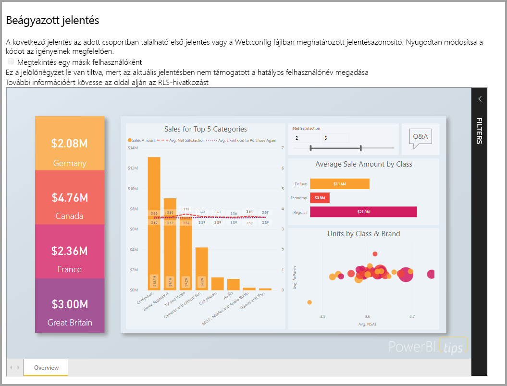

Az oktatóanyag a következőket ismerteti:
> [!div class="checklist"]
> * Alkalmazás regisztrálása az Azure-ban.
> * Ágyazzon be egy Power BI-jelentést egy alkalmazásba.

## <a name="prerequisites"></a>Előfeltételek

Első lépésként, rendelkeznie kell az alábbiakkal:

* Egy [Power BI Pro-fiókkal](../../service-self-service-signup-for-power-bi.md) (egy felhasználónévből és jelszóból álló fő fiókkal a Power BI Pro-fiókba való bejelentkezéshez) vagy egy [szolgáltatásnévvel (csak az alkalmazáson belül használható tokennel)](embed-service-principal.md).
* Be kell állítana egy saját [Azure Active Directory-bérlőt](create-an-azure-active-directory-tenant.md).

Ha még nem regisztrált a **Power BI Pro** szolgáltatásra, a kezdés előtt [hozzon létre egy ingyenes próbaverziós fiókot](https://powerbi.microsoft.com/pricing/).

## <a name="set-up-your-embedded-analytics-development-environment"></a>A beágyazott elemzési fejlesztési környezet beállítása

Mielőtt jelentéseket, irányítópultokat vagy csempéket ágyazna az alkalmazásba, győződjön meg arról, hogy a környezete engedélyezi a beágyazást a Power BI-jal.

Az első lépések gyors elsajátítása érdekében követheti a [beágyazáshoz szükséges telepítési eszköz](https://aka.ms/embedsetup/AppOwnsData) lépéseit, és letölthet egy mintaalkalmazást, amely végigvezeti Önt a környezet létrehozásán és egy jelentés beágyazásán.

Ha mégis a környezet manuális létrehozása mellett dönt, folytathatja az alábbiak szerint.

### <a name="register-an-application-in-azure-active-directory-azure-ad"></a>Alkalmazás regisztrálása az Azure Active Directoryban (Azure AD)

[Regisztrálja az alkalmazást](register-app.md) az Azure Active Directoryban, hogy engedélyezze az alkalmazás számára a [Power BI REST API-k](https://docs.microsoft.com/rest/api/power-bi/) elérését. Az alkalmazás regisztrálásával identitást hozhat létre a számára, és meghatározhatja a Power BI REST-erőforrásokhoz kötődő engedélyeket. Az alkalmazás regisztrációjának első lépései attól függően változnak, hogy egy fő fiókot vagy egy [szolgáltatásnevet](embed-service-principal.md) szeretne-e használni.

A használt módszertől függ, hogy melyik típusú alkalmazást regisztrálja az Azure-ban.

Ha egy fő fiók használatával folytatja, akkor következő lépésként regisztráljon egy **natív** alkalmazást. Natív alkalmazást azért kell használnia, mert egy nem interaktív bejelentkezéssel dolgozik.

Ha azonban továbbra is a szolgáltatásnevet használja, akkor regisztrálnia kell egy **kiszolgálóoldali webalkalmazást**. A kiszolgálóoldali webalkalmazás egy titkos alkalmazáskód létrehozásához kell regisztrálnia.

## <a name="set-up-your-power-bi-environment"></a>A Power BI-környezet beállítása

### <a name="create-a-workspace"></a>Munkaterület létrehozása

Ha jelentéseket, irányítópultokat vagy csempéket ágyaz be az ügyfelek számára, akkor ezeket a tartalmakat egy munkaterületre kell helyezni. Különböző típusú munkaterületeket állíthat be: [hagyományos munkaterületeket](../../service-create-workspaces.md) vagy [új munkaterületeket](../../service-create-the-new-workspaces.md). Ha egy *fő* fiókot használ, akkor nem számít, hogy milyen típusú munkaterületet használ. Ha azonban *[szolgáltatásnevet](embed-service-principal.md)* használ az alkalmazásba való bejelentkezéshez, akkor az új munkaterületeket kell használnia. Mindkét forgatókönyvre érvényes, hogy mind a *fő* fióknak, mind a *szolgáltatásnévnek* az adminisztrátorának kell lennie azoknak a munkaterületeknek, amelyeket az alkalmazásához használ.

### <a name="create-and-publish-your-reports"></a>Saját jelentések létrehozása és közzététele

A Power BI Desktop segítségével létrehozhatja jelentéseit és adatkészleteit, majd közzéteheti ezeket a jelentéseket egy munkaterületen. Ezt a feladatot kétféleképpen végezheti el: Végfelhasználóként közzétehet jelentéseket egy fő fiókkal (hagyományos Power BI Pro-licenc) egy hagyományos munkaterületen. Ha szolgáltatásnevet használ, közzétehet jelentéseket az új munkaterületeken a [Power BI REST API-kkal](https://docs.microsoft.com/rest/api/power-bi/imports/postimportingroup).

Az alábbi lépések bemutatják, hogyan teheti közzé a PBIX-jelentést a Power BI munkaterületén.

1. Töltse le a [Blog Demo](https://github.com/Microsoft/powerbi-desktop-samples) mintát a GitHubról.

    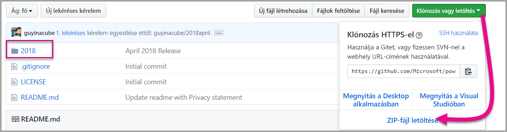

2. Nyissa meg a PBIX-mintajelentést a **Power BI Desktopban**.

   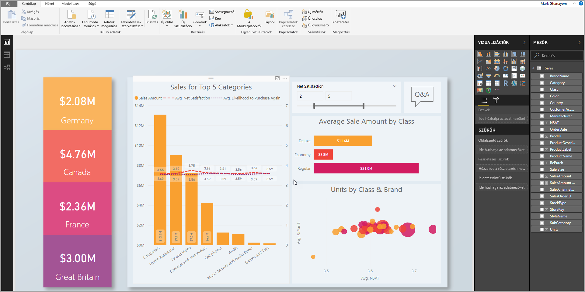

3. Tegye közzé a **munkaterületeken**. Ez a folyamat eltér attól függően, hogy egy fő fiókot (Power Pro-licenc) használ vagy egy szolgáltatásnevet. Ha egy fő fiókot használ, akkor közzéteheti a jelentést a Power BI Desktopban.  Ha szolgáltatásnevet használ, a Power BI REST API-kat kell használnia.

## <a name="embed-content-using-the-sample-application"></a>Tartalom beágyazása a mintaalkalmazással

Ez a minta szándékosan egyszerű, bemutatási céllal. Az Ön és a fejlesztők feladata védeni az alkalmazás titkos kódját vagy a fő fiók hitelesítő adatait.

A mintaalkalmazás segítségével történő tartalombeágyazáshoz kövesse az alábbi lépéseket.

1. Töltse le a [Visual Studio](https://www.visualstudio.com/) 2013-as vagy újabb verzióját. Győződjön meg róla, hogy a legújabb [NuGet-csomagot](https://www.nuget.org/profiles/powerbi) tölti le.

2. A kezdéshez töltse le az [App Owns Data mintát](https://github.com/Microsoft/PowerBI-Developer-Samples) a GitHubról.

    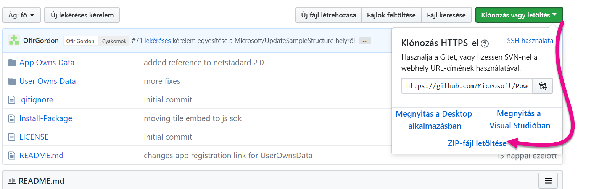

3. Nyissa meg a **Web.config** fájlt a mintaalkalmazásban. Az alkalmazás futtatásához ki kell kitöltenie néhány mezőt. A **Hitelesítési típus** megadásakor választhat a **MasterUser** és a **Szolgáltatásnév** közül. Attól függően, hogy milyen típusú hitelesítési módszert választott, különböző mezőket kell kitölteni.

    > [!Note]
    > Az alapértelmezett **Hitelesítési típus** ebben a mintában a MasterUser.

    <center>

    | **MasterUser** <br> (Power BI Pro-licenc) | **Szolgáltatásnév** <br> (csak az alkalmazásban használható token)|
    |---------------|-------------------|
    | [applicationId](#application-id) | [applicationId](#application-id) |
    | [workspaceId](#workspace-id) | [workspaceId](#workspace-id) |
    | [jelentésazonosító](#report-id) | [jelentésazonosító](#report-id) |
    | [pbiUsername](#power-bi-username-and-password) |  |
    | [pbiPassword](#power-bi-username-and-password) |  |
    |  | [applicationsecret](#application-secret) |
    |  | [bérlő](#tenant) |

   </center>

    

### <a name="application-id"></a>Alkalmazásazonosító

Ez az attribútum szükséges mindkét hitelesítési típushoz (a fő fiókkal és a [szolgáltatásnévvel](embed-service-principal.md) történőhöz).

Az **applicationId** mezőbe írja be az **Azure**-beli **alkalmazásazonosítót**. Az alkalmazás az **applicationId**-vel azonosítja magát azon felhasználóknak, akiktől Ön engedélyeket kér.

Az **applicationId** beszerzéséhez kövesse az alábbi lépéseket:

1. Jelentkezzen be az [Azure Portalon](https://portal.azure.com).

2. A bal oldali navigációs panelen válassza a **Minden szolgáltatás**, majd az **Alkalmazásregisztrációk** elemet.

    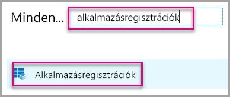

3. Válassza ki azt az alkalmazást, amelynek használnia kell az **applicationId** azonosítót.

    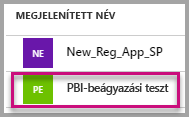

4. Van egy GUID-ként listázott **alkalmazásazonosító**. Használja ezt az **alkalmazásazonosítót** az alkalmazás **applicationId** mezőjében.

    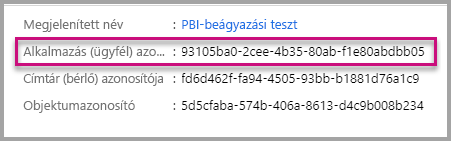

### <a name="workspace-id"></a>Munkaterület azonosítója

Ez az attribútum szükséges mindkét hitelesítési típushoz (a fő fiókkal és a [szolgáltatásnévvel](embed-service-principal.md) történőhöz).

A **workspaceId** mezőbe írja be a Power BI-ban szereplő munkaterület (csoport) GUID-azonosítóját. Ezt az információt beszerezheti az URL-címből, ha be van jelentkezve a Power BI szolgáltatásban vagy a PowerShell-lel.

URL-cím <br>


PowerShell <br>

```powershell
Get-PowerBIworkspace -name "App Owns Embed Test"
```

   

### <a name="report-id"></a>Jelentésazonosító

Ez az attribútum szükséges mindkét hitelesítési típushoz (a fő fiókkal és a [szolgáltatásnévvel](embed-service-principal.md) történőhöz).

A **jelentésazonosító** mezőbe írja be a Power BI-ban szereplő jelentés GUID-azonosítóját. Ezt az információt beszerezheti az URL-címből, ha be van jelentkezve a Power BI szolgáltatásban vagy a PowerShell-lel.

URL-cím<br>


PowerShell <br>

```powershell
Get-PowerBIworkspace -name "App Owns Embed Test" | Get-PowerBIReport
```


### <a name="power-bi-username-and-password"></a>Power BI-felhasználónév és -jelszó

Ezek az attribútumok csak a fő fiók hitelesítési típusához szükségesek.

Ha [szolgáltatásnevet](embed-service-principal.md) használ a hitelesítéséhez, akkor nem szükséges kitöltenie a felhasználónév és a jelszó attribútumokat.

* A **pbiUsername** mezőbe írja be a fő Power BI-fiók nevét.
* A **pbiPassword** mezőbe írja be a fő Power BI-fiók jelszavát.

### <a name="application-secret"></a>Alkalmazás titkos kódja

Ez az attribútum csak a [szolgáltatásnév](embed-service-principal.md) hitelesítési típushoz szükséges.

Az **ApplicationSecret**mező tartalmát az **Azure** **Alkalmazásregisztrációk** szakaszának **Kulcsok** részéből másolhatja be.  Ez az attribútum [szolgáltatásnév](embed-service-principal.md) használatakor működik.

Az **ApplicationSecret** beszerzéséhez kövesse az alábbi lépéseket:

1. Jelentkezzen be az [Azure Portalra](https://portal.azure.com).

2. A bal oldali navigációs ablaktáblán válassza a **Minden szolgáltatás**, majd az **Alkalmazásregisztrációk** elemet.

    

3. Válassza ki azt az alkalmazást, amelyhez használni kívánja az **ApplicationSecret** kulcsot.

    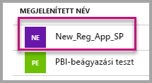

4. A **Kezelés** területen válassza a **Tanúsítványok és titkos kulcsok** lehetőséget.

5. Válassza az **Új titkos ügyfélkód** elemet.

6. A **Leírás** mezőbe írjon be egy nevet, és válasszon ki egy időtartamot. Ezután kattintson a **Mentés** gombra az alkalmazás **Értékének** lekéréséhez. Ha bezárja a **Kulcsok** panelt a kulcsérték mentése után, az értékmező csak rejtettként fog megjelenni. Ebben az esetben nem tudja lekérni a kulcsértéket. Ha elveszíti kulcsértéket, hozzon létre egy újat az Azure Portalon.

    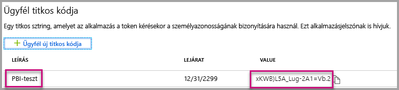

### <a name="tenant"></a>Bérlő

Ez az attribútum csak a [szolgáltatásnév](embed-service-principal.md) hitelesítési típushoz szükséges.

Töltse ki a **bérlő** adatait az Azure-bérlőazonosítójával. Ezt az információt beszerezheti az [Azure AD felügyeleti központról](/onedrive/find-your-office-365-tenant-id), ha be van jelentkezve a Power BI szolgáltatásban, vagy a PowerShell használatával is.

### <a name="run-the-application"></a>Alkalmazás futtatása

1. Válassza a **Futtatás** lehetőséget a **Visual Studióban**.

    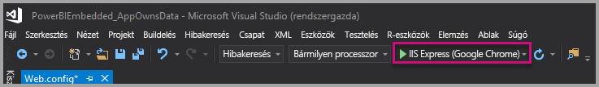

2. Kattintson a **Jelentés beágyazása** lehetőségre. Válassza ki az alkalmazásban a jelentést, az irányítópultot vagy a csempét annak megfelelően, hogy melyiket szeretné kipróbálni.

    

3. Most megtekintheti a jelentést a mintaalkalmazásban.

    

## <a name="embed-content-within-your-application"></a>Tartalom beágyazása az alkalmazásban

Bár a tartalombeágyazás lépései elvégezhetők a [Power BI REST API-kkal](https://docs.microsoft.com/rest/api/power-bi/), a cikkben bemutatott mintakódok a **.NET SDK-val** készültek.

Az ügyfelek számára történő beágyazáshoz az alkalmazásban a fő fióknak egy **hozzáférési jogkivonatra** vagy [szolgáltatásnévre](embed-service-principal.md) van szüksége az **Azure AD-ből**. Mielőtt hívásokat intézhetne a [Power BI REST API-khoz](https://docs.microsoft.com/rest/api/power-bi/), be kell szereznie egy [Azure AD hozzáférési jogkivonatot](get-azuread-access-token.md#access-token-for-non-power-bi-users-app-owns-data) a Power BI-alkalmazáshoz.

A Power BI-ügyfél **hozzáférési jogkivonattal** való létrehozásához célszerű létrehozni a Power BI-ügyfélobjektumot, amely lehetővé teszi a [Power BI REST API-k](https://docs.microsoft.com/rest/api/power-bi/) használatát. A Power BI-ügyfél létrehozásához az **AccessToken** hozzáférési jogkivonatot a ***Microsoft.Rest.TokenCredentials*** objektummal kell becsomagolni.

```csharp
using Microsoft.IdentityModel.Clients.ActiveDirectory;
using Microsoft.Rest;
using Microsoft.PowerBI.Api.V2;

var tokenCredentials = new TokenCredentials(authenticationResult.AccessToken, "Bearer");

// Create a Power BI Client object. it's used to call Power BI APIs.
using (var client = new PowerBIClient(new Uri(ApiUrl), tokenCredentials))
{
    // Your code to embed items.
}
```

### <a name="get-the-content-item-you-want-to-embed"></a>A beágyazni kívánt tartalomelem lekérése

A Power BI-ügyfélobjektummal lekérheti a beágyazni kívánt elem hivatkozását.

Itt láthat arra mintakódot, hogyan kérhető le az első jelentés egy adott munkaterületről.

*A tartalomelemek (beágyazni kívánt jelentések, irányítópultok vagy csempék) lekéréséről példát a [mintaalkalmazás](https://github.com/Microsoft/PowerBI-Developer-Samples) Services\EmbedService.cs fájljában találhat.*

```csharp
using Microsoft.PowerBI.Api.V2;
using Microsoft.PowerBI.Api.V2.Models;

// You need to provide the workspaceId where the dashboard resides.
ODataResponseListReport reports = await client.Reports.GetReportsInGroupAsync(workspaceId);

// Get the first report in the group.
Report report = reports.Value.FirstOrDefault();
```

### <a name="create-the-embed-token"></a>A beágyazási token létrehozása
Generáljon egy beágyazási tokent, amely a JavaScript API-ból használható. Az API-knak két típusa van, az első csoport öt API-t tartalmaz, amelyek mindegyike létrehoz egy beágyazási tokent egy adott elemhez. A második csoport, amely csak egy API-t tartalmaz, több elem beágyazására is használható tokent hoz létre.

**Egy adott elem beágyazási tokenjeinek generálására szolgáló API-k**

Az ezekkel az API-kkal létrehozott beágyazási token a beágyazni kívánt elemre vonatkozik. Ha egy Power BI-elemet (például jelentést, irányítópultot vagy csempét) ágyaz be ezekkel az API-kkal, ehhez létre kell hoznia egy új beágyazási tokent.
* [Irányítópultok GenerateTokenInGroup](https://docs.microsoft.com/rest/api/power-bi/embedtoken/dashboards_generatetokeningroup)
* [Adathalmazok GenerateTokenInGroup](https://docs.microsoft.com/rest/api/power-bi/embedtoken/datasets_generatetokeningroup)
* [Jelentések GenerateTokenForCreateInGroup](https://docs.microsoft.com/rest/api/power-bi/embedtoken/reports_generatetokenforcreateingroup)
* [Jelentések GenerateTokenInGroup](https://docs.microsoft.com/rest/api/power-bi/embedtoken/reports_generatetokeningroup)
* [Csempék GenerateTokenInGroup](https://docs.microsoft.com/rest/api/power-bi/embedtoken/tiles_generatetokeningroup)

A jelentések, irányítópultok vagy csempék beágyazási tokenjének létrehozásához minták a [mintaalkalmazás](https://github.com/Microsoft/PowerBI-Developer-Samples) következő fájljaiban érhetők el.
* Services\EmbedService.cs
* Models\EmbedConfig.cs
* Models\TileEmbedConfig.cs

Az alábbi egy kódpélda a jelentések GenerateTokenInGroup beágyazási token API-jának használatához.
```csharp
using Microsoft.PowerBI.Api.V2;
using Microsoft.PowerBI.Api.V2.Models;

// Generate Embed Token.
var generateTokenRequestParameters = new GenerateTokenRequest(accessLevel: "view");
EmbedToken tokenResponse = client.Reports.GenerateTokenInGroup(workspaceId, report.Id, generateTokenRequestParameters);

// Generate Embed Configuration.
var embedConfig = new EmbedConfig()
{
    EmbedToken = tokenResponse,
    EmbedUrl = report.EmbedUrl,
    Id = report.Id
};
```

**Több elem beágyazási tokenjének generálására szolgáló API**<a id="multiEmbedToken"></a>

A [token generálása](https://docs.microsoft.com/rest/api/power-bi/embedtoken/generatetoken) beágyazási API létrehoz egy tokent, amely több elem beágyazására is használható.

A jelentés beágyazásakor az adathalmaz dinamikus kiválasztására is használható. További információ az API használatáról a [dinamikus kötésről](embed-dynamic-binding.md) szóló szakaszban olvasható.


Az alábbi példa az API használatát mutatja be.
 
```csharp
using Microsoft.PowerBI.Api.V2;
using Microsoft.PowerBI.Api.V2.Models;

var reports = new List<GenerateTokenRequestV2Report>()
{ 
    new GenerateTokenRequestV2Report()
    {
        AllowEdit = false,
        Id = report1.Id
    },
    new GenerateTokenRequestV2Report()
    {
        AllowEdit = true,
        Id = report2.Id
    }
};

var datasets= new List<GenerateTokenRequestV2Dataset>()
{
    new GenerateTokenRequestV2Dataset(dataset1.Id),
    new GenerateTokenRequestV2Dataset(dataset2.Id),
    new GenerateTokenRequestV2Dataset(dataset3.Id),
};

var targetWorkspaces = new List<GenerateTokenRequestV2TargetWorkspace>()
{
    new GenerateTokenRequestV2TargetWorkspace(workspace1.Id),
    new GenerateTokenRequestV2TargetWorkspace(workspace2.Id),
};

var request = new GenerateTokenRequestV2()
{
    Datasets = datasetsRequestDetails ?? null,
    Reports = reportsRequestDetails,
    TargetWorkspaces = targetWSRequestdetials ?? null,
};

var token = client.GetClient().EmbedToken.GenerateToken(request);
```

### <a name="load-an-item-using-javascript"></a>Elem betöltése a JavaScript használatával

A JavaScript használatával egy jelentést tölthet be a div elembe a weblapon.

A JavaScript API teljes körű mintáját a [Playground eszköz](https://microsoft.github.io/PowerBI-JavaScript/demo) segítségével használhatja. Ez a demókörnyezeti eszköz lehetőséget ad a Power BI Embedded különböző mintáinak gyors kipróbálására. A JavaScript API-ról a [PowerBI-JavaScript wiki](https://github.com/Microsoft/powerbi-javascript/wiki) oldalon talál további információkat.

Íme egy minta, amely az **EmbedConfig** és a **TileEmbedConfig** modellt használja egy jelentés nézeteivel együtt.

*A nézetek jelentésekhez, irányítópultokhoz vagy csempékhez való hozzáadásáról példát a [mintaalkalmazás](#embed-content-using-the-sample-application) Views\Home\EmbedReport.cshtml, Views\Home\EmbedDashboard.cshtml és Views\Home\Embedtile.cshtml fájljaiban találhat.*

```javascript
<script src="~/scripts/powerbi.js"></script>
<div id="reportContainer"></div>
<script>
    // Read embed application token from Model
    var accessToken = "@Model.EmbedToken.Token";

    // Read embed URL from Model
    var embedUrl = "@Html.Raw(Model.EmbedUrl)";

    // Read report Id from Model
    var embedReportId = "@Model.Id";

    // Get models. models contains enums that can be used.
    var models = window['powerbi-client'].models;

    // Embed configuration used to describe what and how to embed.
    // This object is used when calling powerbi.embed.
    // This also includes settings and options such as filters.
    // You can find more information at https://github.com/Microsoft/PowerBI-JavaScript/wiki/Embed-Configuration-Details.
    var config = {
        type: 'report',
        tokenType: models.TokenType.Embed,
        accessToken: accessToken,
        embedUrl: embedUrl,
        id: embedReportId,
        permissions: models.Permissions.All,
        settings: {
            filterPaneEnabled: true,
            navContentPaneEnabled: true
        }
    };

    // Get a reference to the embedded report HTML element
    var reportContainer = $('#reportContainer')[0];

    // Embed the report and display it within the div container.
    var report = powerbi.embed(reportContainer, config);
</script>
```

## <a name="move-to-production"></a>Átállás éles üzemre

Most, hogy elkészült az alkalmazás fejlesztésével, ideje dedikált kapacitással ellátni a munkaterületet. 

> [!Important]
> Az éles üzemre való átálláshoz ez kötelező lépés. Az összes munkaterületet (a jelentéseket és az irányítópultokat tartalmazókat, valamint az adatkészleteket tartalmazókat) hozzá kell rendelni egy kapacitáshoz.

### <a name="create-a-dedicated-capacity"></a>Dedikált kapacitás létrehozása

Dedikált kapacitás létrehozásával dedikált erőforrást rendelhet egy ügyfélhez. Két típusú kapacitás közül választhat:
* A **Power BI Premium** bérlői szintű Office 356-előfizetés, amely két SKU- (termékváltozat-) családban érhető el: *EM* és *P*. Power BI-tartalom beágyazásakor ezt a megoldást *Power BI-beágyazásnak* nevezzük. További információ erről az előfizetésről: [Mi az a Power BI Premium?](../../service-premium-what-is.md)
* **Azure Power BI Embedded** – Dedikált kapacitást a [Microsoft Azure Portalon](https://portal.azure.com) vásárolhat. Ez az előfizetés az *A* termékváltozatokat használja. A Power BI Embedded-kapacitások létrehozásával kapcsolatos részletekért tekintse meg a [Power BI Embedded-kapacitás az Azure Portalon való létrehozásával](azure-pbie-create-capacity.md) kapcsolatos cikket.
> [!NOTE]
> A termékváltozatokkal nem férhet hozzá a Power BI-tartalmakhoz INGYENES Power BI-licenccel.

Az alábbi táblázat az egyes termékváltozatok erőforrásait és korlátait ismerteti. Annak megállapításához, hogy melyik kapacitás felel meg legjobban az igényeinek, tekintse meg a [melyik termékváltozatot vásároljam meg a forgatókönyvemhez](https://docs.microsoft.com/power-bi/developer/embedded-faq#which-solution-should-i-choose) táblázatát.

| Kapacitás-csomópontok | Összes virtuális mag | Háttérrendszeri virtuális magok | Memória (GB) | Előtérrendszeri virtuális magok | DirectQuery-/élő kapcsolatok (másodpercenként) | Párhuzamosan végrehajtható modellfrissítések |
| --- | --- | --- | --- | --- | --- | --- |
| EM1/A1 | 1 | 0,5 | 2.5 | 0,5 | 3,75 | 1 |
| EM2/A2 | 2 | 1 | 5 | 1 | 7,5 | 2 |
| EM3/A3 | 4 | 2 | 10 | 2 | 15 | 3 |
| P1/A4 | 8 | 4 | 25 | 4 | 30 | 6 |
| P2/A5 | 16 | 8 | 50 | 8 | 60 | 12 |
| P3/A6 | 32 | 16 | 100 | 16 | 120 | 24 |
| | | | | | | |

### <a name="development-testing"></a>Fejlesztési tesztelés

A Pro licenccel a beágyazási tokenek elsődlegesen fejlesztési tesztelésre használhatók, ezért a Power BI fő fiókja vagy a szolgáltatásnév csak korlátozott mennyiségű tokent tud előállítani. Éles környezetben használt beágyazásokhoz dedikált kapacitás szükséges. Dedikált kapacitásokkal nincs korlátja a beágyazási tokenek előállításának. Az [Elérhető szolgáltatások](https://docs.microsoft.com/rest/api/power-bi/availablefeatures/getavailablefeatures) oldalon ellenőrizheti a használati értéket, amely százalékosan jelzi az aktuális beágyazott használatot. A használati mennyiséget fő fiókonként számoljuk.

További információ: [Tanulmány a beágyazott analitikai kapacitás tervezéséről](https://aka.ms/pbiewhitepaper).

### <a name="assign-a-workspace-to-a-dedicated-capacity"></a>Munkaterület hozzárendelése dedikált kapacitáshoz

A dedikált kapacitás létrehozása után hozzárendelheti a munkaterületet ehhez a kapacitáshoz.

Az összes olyan munkaterületet, amely a beágyazott tartalomhoz (például adathalmazokhoz, jelentésekhez és irányítópultokhoz) kapcsolódó Power BI-erőforrásokat tartalmaz, dedikált kapacitáshoz kell rendelni. Ha például egy beágyazott jelentés és az ahhoz kötött adathalmaz különböző munkaterületeken helyezkedik el, akkor mindkét munkaterületet dedikált kapacitáshoz kell rendelni.

Ha [szolgáltatásnévvel](embed-service-principal.md) szeretne dedikált kapacitást hozzárendelni egy munkaterülethez, használja a [Power BI REST API-t](https://docs.microsoft.com/rest/api/power-bi/capacities/groups_assigntocapacity). Ha a Power BI REST API-t használja, akkor a [szolgáltatásnév objektumazonosítóját](embed-service-principal.md#how-to-get-the-service-principal-object-id) is használnia kell.

Dedikált kapacitás **fő fiókkal** történő munkaterülethez rendeléséhez kövesse az alábbi lépéseket.

1. A **Power BI szolgáltatásban** bontsa ki a munkaterületeket, és kattintson a három pont elemre azon munkaterület mellett, amelyiket tartalombeágyazáshoz használ. Válassza a **Munkaterületek szerkesztése** lehetőséget.

    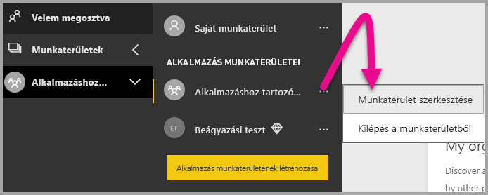

2. Bontsa ki a **Speciális** elemet, engedélyezze a **Dedikált kapacitást**, majd kattintson a létrehozott dedikált kapacitásra. Kattintson a **Mentés** gombra.

    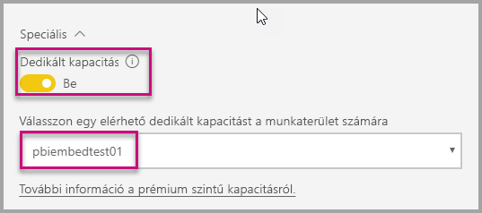

3. A **Mentés** kiválasztása után meg kell jelennie egy **gyémántnak** a munkaterület neve mellett.

    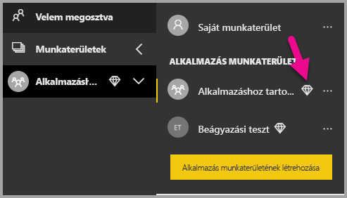

## <a name="next-steps"></a>Következő lépések

Ebben az oktatóanyagban bemutattuk, hogyan lehet Power BI-tartalmat beágyazni az ügyfelek alkalmazásaiba. Megpróbálkozhat Power BI-tartalom beágyazásával a szervezete számára is.

> [!div class="nextstepaction"]
>[Beágyazás a cég számára](embed-sample-for-your-organization.md)

További kérdései vannak? [Kérdezze meg a Power BI közösségét](https://community.powerbi.com/)
