# <a name="tutorial-embed-power-bi-content-into-an-application-for-your-organization"></a>Oktatóanyag: Power BI tartalom beágyazása egy alkalmazásba a cége számára

A **Power BI**-ban (Power BI- vagy lapszámozott) jelentéseket, irányítópultokat és csempéket ágyazhat be az alkalmazásokba a felhasználó tulajdonában lévő adatokkal. **A felhasználó az adatok tulajdonosa** forgatókönyv lehetővé teszi, hogy az alkalmazás kiterjessze a Power BI szolgáltatást a beágyazott analitika használatára. Az oktatóanyag bemutatja, hogyan integrálhat (Power BI- vagy lapszámozott) jelentéseket az alkalmazásokba. A Power BI .NET SDK és a Power BI JavaScript API segítségével beágyazza a Power BI-t egy alkalmazásba a vállalat számára.

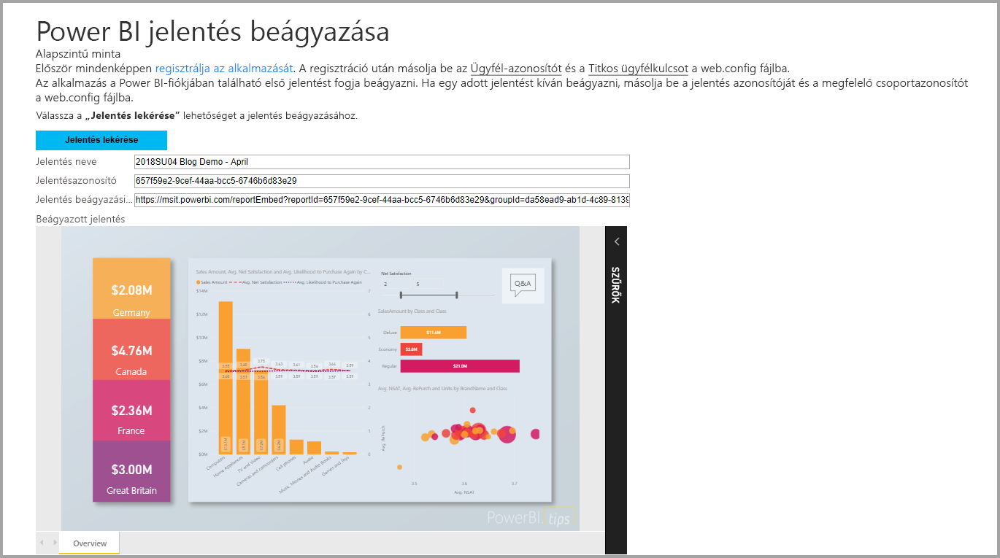

Eben az oktatóanyagban az alábbi feladatokkal fog megismerkedni:
> [!div class="checklist"]
> * Alkalmazás regisztrálása az Azure-ban.
> * Ágyazzon be egy Power BI- vagy lapszámozott jelentést egy alkalmazásba a Power BI-bérlőjével.

## <a name="prerequisites"></a>Előfeltételek

Első lépésként, rendelkeznie kell az alábbiakkal:

* Egy [Power BI Pro-fiók](../../fundamentals/service-self-service-signup-for-power-bi.md).
* Egy [Microsoft Azure](https://azure.microsoft.com/)-előfizetéssel.
* Be kell állítana egy saját [Azure Active Directory-bérlőt](create-an-azure-active-directory-tenant.md).
* Többoldalas jelentések beágyazásához legalább P1-kapacitás szükséges: [Milyen méretű Prémium szintű kapacitás szükséges a többoldalas jelentésekhez?](../../paginated-reports/paginated-reports-faq.md#what-size-premium-capacity-do-i-need-for-paginated-reports)

Ha még nem regisztrált a **Power BI Pro** szolgáltatásra, a kezdés előtt [hozzon létre egy ingyenes próbaverziós fiókot](https://powerbi.microsoft.com/pricing/).

Ha még nincs Azure-előfizetése, kezdés előtt hozzon létre egy [ingyenes fiókot](https://azure.microsoft.com/free/?WT.mc_id=A261C142F).

## <a name="set-up-your-embedded-analytics-development-environment"></a>A beágyazott elemzési fejlesztési környezet beállítása

Mielőtt jelentéseket, irányítópultokat vagy csempéket ágyazna az alkalmazásba, győződjön meg arról, hogy a környezete engedélyezi a beágyazást a Power BI-jal.

Az első lépések gyors elsajátítása érdekében követheti a [beágyazáshoz szükséges telepítési eszköz](https://aka.ms/embedsetup/UserOwnsData) lépéseit, és letölthet egy mintaalkalmazást, amely végigvezeti Önt a környezet létrehozásán és egy jelentés beágyazásán. Többoldalas jelentések beágyazásához legalább P1-kapacitást kell a létrehozott munkaterülethez rendelnie.

Ha a környezet manuális létrehozása mellett dönt, folytathatja az alábbiak szerint.

### <a name="register-an-application-in-azure-active-directory"></a>Alkalmazás regisztrálása az Azure Active Directoryban

[Regisztrálja az alkalmazást](register-app.md) az Azure Active Directoryban, hogy engedélyezze az alkalmazás számára a [Power BI REST API-k](https://docs.microsoft.com/rest/api/power-bi/) elérését. Az alkalmazás regisztrálásával identitást hozhat létre a számára, és meghatározhatja a Power BI REST-erőforrásokhoz kötődő engedélyeket.

Regisztrálnia kell egy **kiszolgálóoldali webalkalmazást**. A kiszolgálóoldali webalkalmazás egy titkos alkalmazáskód létrehozásához kell regisztrálnia.

Miután létrehozta az alkalmazást az Azure-ban, nyissa meg az alkalmazást az Azure-ban, navigáljon a *Hitelesítés* elemre, majd az *Átirányítási URI azonosítók* szakaszban adja hozzá a **/Redirect** elemet az *Átirányítási URI* elemhez.

## <a name="set-up-your-power-bi-environment"></a>A Power BI-környezet beállítása

### <a name="create-a-workspace"></a>Munkaterület létrehozása

Ha jelentéseket, irányítópultokat vagy csempéket ágyaz be az ügyfelek számára, akkor ezeket a tartalmakat egy munkaterületre kell helyezni. Különböző típusú munkaterületeket állíthat be: [hagyományos munkaterületeket](../../collaborate-share/service-create-workspaces.md) vagy [új munkaterületeket](../../collaborate-share/service-create-the-new-workspaces.md).

### <a name="create-and-publish-your-power-bi-reports"></a>Saját Power BI-jelentések létrehozása és közzététele

A Power BI Desktop segítségével létrehozhatja a jelentéseit és az adathalmazait. A jelentéseket ezután közzéteheti egy munkaterületen. A jelentéseket közzétevő végfelhasználónak Power BI Pro-licenccel kell rendelkeznie a munkaterületen való közzétételhez.

1. Töltse le a [Demo](https://github.com/Microsoft/powerbi-desktop-samples) mintát a GitHubról.

    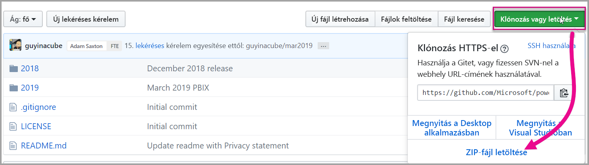

2. Nyissa meg a .pbix mintajelentést a Power BI Desktopban.

   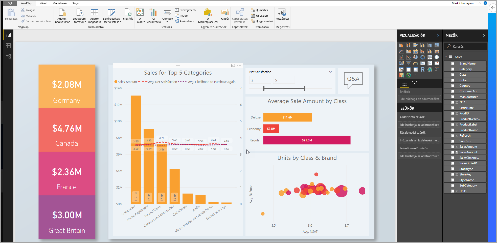

3. Tegye közzé a munkaterületen.

   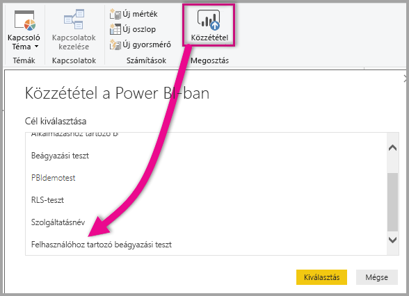

    A jelentést mostantól online megtekintheti a Power BI szolgáltatásban.

   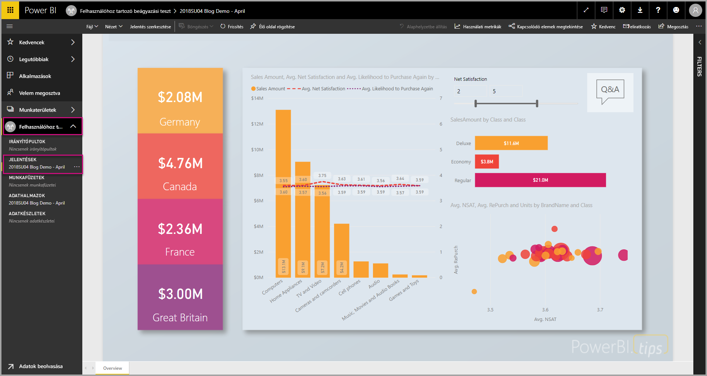
   
### <a name="create-and-publish-your-paginated-reports"></a>Saját lapszámozott jelentések létrehozása és közzététele

A többoldalas jelentéseket a [Power BI Jelentéskészítő](../../paginated-reports/paginated-reports-report-builder-power-bi.md#create-reports-in-power-bi-report-builder) használatával hozhatja létre. Ez után [feltöltheti a jelentést](../../paginated-reports/paginated-reports-quickstart-aw.md#upload-the-report-to-the-service) egy legalább P1-kapacitáshoz rendelt munkaterületre. A jelentést feltöltő végfelhasználónak Power BI Pro-licencre van szüksége, ha közzé szeretne tenni valamit egy munkaterületen.
   
## <a name="embed-your-content-by-using-the-sample-application"></a>Tartalom beágyazása a mintaalkalmazással

Ez a minta szándékosan egyszerű, bemutatási céllal.

A mintaalkalmazás segítségével történő tartalombeágyazáshoz kövesse az alábbi lépéseket.

1. Töltse le a [Visual Studio](https://www.visualstudio.com/) 2013-as vagy újabb verzióját. Győződjön meg róla, hogy a legújabb [NuGet-csomagot](https://www.nuget.org/profiles/powerbi) tölti le.

2. A kezdéshez töltse le a [User Owns Data mintát](https://github.com/Microsoft/PowerBI-Developer-Samples) a GitHubról.

    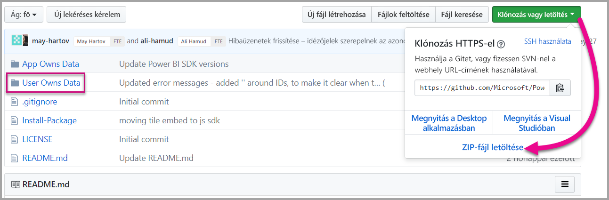

3. Nyissa meg a **Cloud.config** fájlt a mintaalkalmazásban.

    Az alkalmazás futtatásához ki kell kitöltenie néhány mezőt.

    | Mező |
    |--------------------|
    | **[Alkalmazásazonosító](#application-id)** |
    | **[Munkaterület azonosítója](#workspace-id)** |
    | **[Jelentésazonosító](#report-id)** |
    | **[AADAuthorityUrl](#aadauthorityurl)** |

    

### <a name="application-id"></a>Alkalmazásazonosító

Az **applicationId** mezőbe írja be az **Azure**-beli **alkalmazásazonosítót**. Az alkalmazás az **applicationId**-vel azonosítja magát azon felhasználóknak, akiktől Ön engedélyeket kér.

Az **applicationId** beszerzéséhez kövesse az alábbi lépéseket:

1. Jelentkezzen be az [Azure Portalon](https://portal.azure.com).

2. A bal oldali navigációs panelen válassza a **Minden szolgáltatás**, majd az **Alkalmazásregisztrációk** elemet.

3. Válassza ki azt az alkalmazást, amelynek használnia kell az **applicationId** azonosítót.

    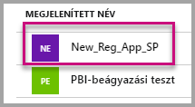

4. Van egy GUID-ként listázott **alkalmazásazonosító**. Használja ezt az **alkalmazásazonosítót** az alkalmazás **applicationId** mezőjében.

    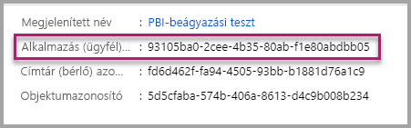

### <a name="workspace-id"></a>Munkaterület azonosítója

A **workspaceId** mezőbe írja be a Power BI-ban szereplő munkaterület (csoport) GUID-azonosítóját. Ezt az információt beszerezheti az URL-címből, ha be van jelentkezve a Power BI szolgáltatásba, vagy a PowerShell-lel.

URL-cím <br>


PowerShell <br>

```powershell
Get-PowerBIworkspace -name "User Owns Embed Test"
```

   

### <a name="report-id"></a>Jelentésazonosító

A **jelentésazonosító** mezőbe írja be a Power BI-ban szereplő jelentés GUID-azonosítóját. Ezt az információt beszerezheti az URL-címből, ha be van jelentkezve a Power BI szolgáltatásba, vagy a PowerShell-lel.

Power BI-jelentés URL-címe <br>


Lapszámozott jelentés URL-címe<br>


PowerShell <br>

```powershell
Get-PowerBIworkspace -name "User Owns Embed Test" | Get-PowerBIReport
```


### <a name="aadauthorityurl"></a>AADAuthorityUrl

Töltse ki az **AADAuthorityUrl** adatait azzal az URL-címmel, amellyel beágyazhat a szervezeti bérlőn belül, vagy beágyazhat egy vendégfelhasználóval.

A szervezeti bérlővel való beágyazáshoz használja a következő URL-címet: *https://login.microsoftonline.com/common/oauth2/authorize* .

A vendéggel való beágyazáshoz használja a következő URL-címet: `https://login.microsoftonline.com/report-owner-tenant-id`. Ebben adja meg a jelentéstulajdonos bérlői azonosítóját a *report-owner-tenant-id* helyén.

### <a name="run-the-application"></a>Alkalmazás futtatása

1. Válassza a **Futtatás** lehetőséget a **Visual Studióban**.

    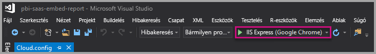

2. Kattintson a **Jelentés beágyazása** lehetőségre. Válassza ki az alkalmazásban a jelentést, az irányítópultot vagy a csempét annak megfelelően, hogy melyiket szeretné kipróbálni.

    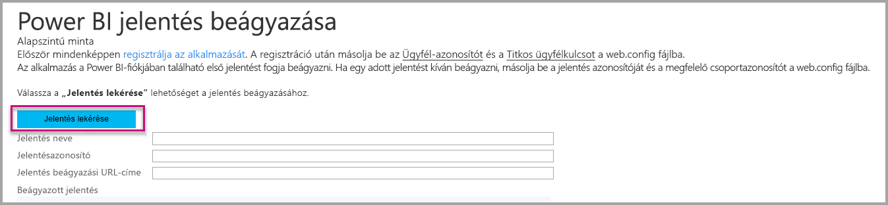

3. Most megtekintheti a jelentést a mintaalkalmazásban.

    

## <a name="embed-your-content-within-your-application"></a>Tartalom beágyazása az alkalmazásba

Bár a tartalombeágyazás lépései elvégezhetők a [Power BI REST API-kkal](https://docs.microsoft.com/rest/api/power-bi/), a cikkben bemutatott mintakódok a .NET SDK-val készültek.

A jelentés webalkalmazásba való beágyazásához használja a Power BI REST API-t vagy a Power BI C# SDK-t. A jelentés lekéréséhez egy Azure Active Directory (AD) engedélyezési hozzáférési tokent kell használnia. Ezután töltse be a jelentést ugyanezen hozzáférési token használatával. A Power BI REST API szoftveres hozzáférést biztosít egyes Power BI-erőforrásokhoz. További információkért lásd: [Power BI REST API-k](https://docs.microsoft.com/rest/api/power-bi/) és [Power BI JavaScript API](https://github.com/Microsoft/PowerBI-JavaScript).

### <a name="get-an-access-token-from-azure-ad"></a>Hozzáférési token lekérése a Microsoft Azure Active Directory-ból

Az alkalmazásban be kell szereznie egy hozzáférési tokent az Azure AD-ből, mielőtt hívásokat indíthatna a Power BI REST API-hoz. További információkért lásd [a felhasználók hitelesítésével és a Power BI-alkalmazáshoz Azure AD hozzáférési token beszerzésével](get-azuread-access-token.md) kapcsolatos cikket.

### <a name="get-a-report"></a>Jelentés lekérése

Power BI- vagy lapszámozott jelentés lekéréséhez használja a [Jelentések lekérése](https://docs.microsoft.com/rest/api/power-bi/reports/getreports) műveletet, amely a Power BI- és lapszámozott jelentések listáját kéri le. A jelentések listájából lekérheti a jelentésazonosítót.

### <a name="get-reports-by-using-an-access-token"></a>Jelentések lekérése hozzáférési token használatával

A [Jelentések lekérése](https://docs.microsoft.com/rest/api/power-bi/reports/getreports) művelet jelentések listáját adja vissza. A jelentések listájából lekérhet egyetlen jelentést.

A REST API-hívásához egy *Engedélyezési* fejlécet is meg kell adnia a *Tulajdonos {hozzáférési token}* formátumában.

#### <a name="get-reports-with-the-rest-api"></a>Jelentések lekérése a REST API-val

A következő kódminta bemutatja, hogyan kérhet le jelentéseket a REST API-val:

> [!Note]
> A beágyazni kívánt tartalomelemek lekéréséről a [mintaalkalmazás](https://github.com/Microsoft/PowerBI-Developer-Samples) Default.aspx.cs fájljában találhat példát. Van példa jelentésre, irányítópultra és csempére is.

```csharp
using Newtonsoft.Json;

//Get a Report. In this sample, you get the first Report.
protected void GetReport(int index)
{
    //Configure Reports request
    System.Net.WebRequest request = System.Net.WebRequest.Create(
        String.Format("{0}/Reports",
        baseUri)) as System.Net.HttpWebRequest;

    request.Method = "GET";
    request.ContentLength = 0;
    request.Headers.Add("Authorization", String.Format("Bearer {0}", accessToken.Value));

    //Get Reports response from request.GetResponse()
    using (var response = request.GetResponse() as System.Net.HttpWebResponse)
    {
        //Get reader from response stream
        using (var reader = new System.IO.StreamReader(response.GetResponseStream()))
        {
            //Deserialize JSON string
            PBIReports Reports = JsonConvert.DeserializeObject<PBIReports>(reader.ReadToEnd());

            //Sample assumes at least one Report.
            //You could write an app that lists all Reports
            if (Reports.value.Length > 0)
            {
                var report = Reports.value[index];

                txtEmbedUrl.Text = report.embedUrl;
                txtReportId.Text = report.id;
                txtReportName.Text = report.name;
            }
        }
    }
}

//Power BI Reports used to deserialize the Get Reports response.
public class PBIReports
{
    public PBIReport[] value { get; set; }
}
public class PBIReport
{
    public string id { get; set; }
    public string reportType { get; set }
    public string name { get; set; }
    public string webUrl { get; set; }
    public string embedUrl { get; set; }
}
```

#### <a name="get-reports-by-using-the-net-sdk"></a>Jelentések lekérése a .NET SDK használatával

A .NET SDK használatával lekérheti a jelentések listáját ahelyett, hogy közvetlenül a REST API-t hívná. A következő kódminta bemutatja, hogyan listázhatja a jelentéseket:

```csharp
using Microsoft.IdentityModel.Clients.ActiveDirectory;
using Microsoft.PowerBI.Api.V2;
using Microsoft.PowerBI.Api.V2.Models;

var tokenCredentials = new TokenCredentials(<ACCESS TOKEN>, "Bearer");

// Create a Power BI Client object. It is used to call Power BI APIs.
using (var client = new PowerBIClient(new Uri(ApiUrl), tokenCredentials))
{
    // Get the first report all reports in that workspace
    ODataResponseListReport reports = client.Reports.GetReports();

    Report report = reports.Value.FirstOrDefault();

    var embedUrl = report.EmbedUrl;
}
```

### <a name="load-a-report-by-using-javascript"></a>Jelentés betöltése a JavaScript használatával

A JavaScript használatával egy jelentést tölthet be a div elembe a weblapon. A következő kódminta bemutatja, hogyan kérhet le jelentést egy adott munkaterületről:

> [!NOTE]  
> A beágyazni kívánt tartalomelemek betöltéséről a [mintaalkalmazás](https://github.com/Microsoft/PowerBI-Developer-Samples)**Default.aspx** fájljában találhat példát.

```javascript
<!-- Embed Report-->
<div> 
    <asp:Panel ID="PanelEmbed" runat="server" Visible="true">
        <div>
            <div><b class="step">Step 3</b>: Embed a report</div>

            <div>Enter an embed url for a report from Step 2 (starts with https://):</div>
            <input type="text" id="tb_EmbedURL" style="width: 1024px;" />
            <br />
            <input type="button" id="bEmbedReportAction" value="Embed Report" />
        </div>

        <div id="reportContainer"></div>
    </asp:Panel>
</div>
```

#### <a name="sitemaster"></a>Site.master

```javascript
window.onload = function () {
    // client side click to embed a selected report.
    var el = document.getElementById("bEmbedReportAction");
    if (el.addEventListener) {
        el.addEventListener("click", updateEmbedReport, false);
    } else {
        el.attachEvent('onclick', updateEmbedReport);
    }

    // handle server side post backs, optimize for reload scenarios
    // show embedded report if all fields were filled in.
    var accessTokenElement = document.getElementById('MainContent_accessTokenTextbox');
    if (accessTokenElement !== null) {
        var accessToken = accessTokenElement.value;
        if (accessToken !== "")
            updateEmbedReport();
    }
};

// update embed report
function updateEmbedReport() {

    // check if the embed url was selected
    var embedUrl = document.getElementById('tb_EmbedURL').value;
    if (embedUrl === "")
        return;

    // get the access token.
    accessToken = document.getElementById('MainContent_accessTokenTextbox').value;

    // Embed configuration used to describe the what and how to embed.
    // This object is used when calling powerbi.embed.
    // You can find more information at https://github.com/Microsoft/PowerBI-JavaScript/wiki/Embed-Configuration-Details.
    var config = {
        type: 'report',
        accessToken: accessToken,
        embedUrl: embedUrl
    };

    // Grab the reference to the div HTML element that will host the report.
    var reportContainer = document.getElementById('reportContainer');

    // Embed the report and display it within the div container.
    var report = powerbi.embed(reportContainer, config);

    // report.on will add an event handler which prints to Log window.
    report.on("error", function (event) {
        var logView = document.getElementById('logView');
        logView.innerHTML = logView.innerHTML + "Error<br/>";
        logView.innerHTML = logView.innerHTML + JSON.stringify(event.detail, null, "  ") + "<br/>";
        logView.innerHTML = logView.innerHTML + "---------<br/>";
    }
  );
}
```

## <a name="using-a-power-bi-premium-dedicated-capacity"></a>Dedikált Power BI Premium-kapacitás használata

Most, hogy elkészült az alkalmazás fejlesztésével, ideje dedikált kapacitással ellátni a munkaterületet.

### <a name="create-a-dedicated-capacity"></a>Dedikált kapacitás létrehozása

Dedikált kapacitás létrehozásával kihasználhatja annak az előnyeit, hogy egy dedikált erőforrás áll rendelkezésre az munkaterületen a tartalom számára. Többoldalas jelentésekhez a munkaterülethez legalább P1-kapacitást kell biztosítania. Dedikált kapacitást a [Power BI Premium](../../admin/service-premium-what-is.md) segítségével hozhat létre.

A következő táblázat a [Microsoft Office 365-ben](../../admin/service-admin-premium-purchase.md) elérhető Power BI Premium-termékváltozatokat sorolja fel:

| Kapacitási csomópont | Virtuális magok száma összesen<br/>(háttérrendszer + előtérrendszer) | Háttérrendszerbeli virtuális magok | Előtérrendszerbeli virtuális magok | DirectQuery-/élő kapcsolat korlátai |
| --- | --- | --- | --- | --- | --- |
| EM1 |1 virtuális mag |0,5 virtuális mag, 10 GB RAM |0,5 virtuális mag |Másodpercenként 3,75 |
| EM2 |2 virtuális mag |1 virtuális mag, 10 GB RAM |1 virtuális mag |Másodpercenként 7.5 |
| EM3 |4 virtuális mag |2 virtuális mag, 10 GB RAM |2 virtuális mag |Másodpercenként 15 |
| P1 |8 virtuális mag |4 virtuális mag, 25 GB RAM |4 virtuális mag |Másodpercenként 30 |
| P2 |16 virtuális mag |8 virtuális mag, 50 GB RAM |8 virtuális mag |Másodpercenként 60 |
| P3 |32 virtuális mag |16 virtuális mag, 100 GB RAM |16 virtuális mag |Másodpercenként 120 |
| P4 |64 virtuális mag |32 virtuális mag, 200 GB RAM |32 virtuális mag |Másodpercenként 240 |
| P5 |128 virtuális mag |64 virtuális mag, 400 GB RAM |64 virtuális mag |Másodpercenként 480 |

> [!NOTE]
> - Ha Microsoft Office-alkalmazásokkal szeretne beágyazni, az ingyenes Power BI-licenc lehetővé teszi, hogy az EM termékváltozatokat használja a tartalmak eléréséhez. A Powerbi.com vagy a Power BI Mobile használatakor azonban nem lehet hozzáférni a tartalmakhoz az ingyenes Power BI-licenccel.
> - Ha a Powerbi.com vagy a Power BI Mobile használatával szeretne beágyazni a Microsoft Office-alkalmazásokkal, az ingyenes Power BI-licenccel hozzáférhet a tartalmakhoz.

### <a name="assign-a-workspace-to-a-dedicated-capacity"></a>Munkaterület hozzárendelése dedikált kapacitáshoz

A dedikált kapacitás létrehozása után hozzárendelheti a munkaterületet ehhez a kapacitáshoz. A folyamat befejezéséhez kövesse az alábbi lépéseket:

1. A Power BI szolgáltatásban bontsa ki a munkaterületeket, és kattintson a három pont elemre a tartalombeágyazáshoz használt munkaterület mellett. Válassza a **Munkaterületek szerkesztése** lehetőséget.

    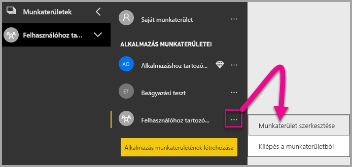

2. Bontsa ki a **Speciális** pontot, és engedélyezze a **Dedikált kapacitás** elemet. Válassza ki a létrehozott dedikált kapacitást. Kattintson a **Mentés** gombra.

    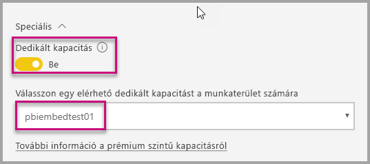

3. A **Mentés** kiválasztása után meg kell jelennie egy rombusznak a munkaterület neve mellett.

    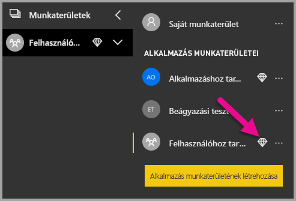

## <a name="admin-settings"></a>Rendszergazdai beállítások

A globális rendszergazdák vagy a Power BI szolgáltatás-rendszergazdái be- és kikapcsolhatják a REST API-k használatának képességét a bérlők esetében. A Power BI-rendszergazdák a teljes szervezethez vagy egyes biztonsági csoportokhoz is megadhatják ezt a beállítást. A beállítás alapértelmezés szerint a teljes szervezethez engedélyezve van. Ezeket a módosításokat a [Power BI felügyeleti portálon](../../admin/service-admin-portal.md) végezheti el.

## <a name="next-steps"></a>Következő lépések

Ez az oktatóanyag bemutatta, hogyan ágyazhat be Power BI-tartalmat egy alkalmazásba a Power BI szervezeti fiók használatával. Most már elkezdhet Power BI-tartalmakat beágyazni egy alkalmazásba az alkalmazások segítségével. Megpróbálkozhat Power BI-tartalom beágyazásával az ügyfelei számára is (ez többoldalas jelentések beágyazásához egyelőre nem támogatott):

> [!div class="nextstepaction"]
> [Beágyazás alkalmazásokból](embed-from-apps.md)

> [!div class="nextstepaction"]
>[Beágyazás az ügyfelek számára](embed-sample-for-customers.md)

Ha további kérdései vannak, [forduljon a Power BI közösségéhez](https://community.powerbi.com/).
