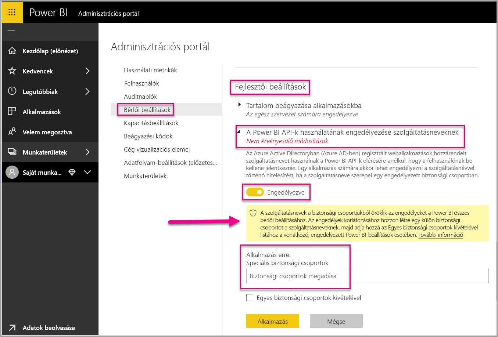
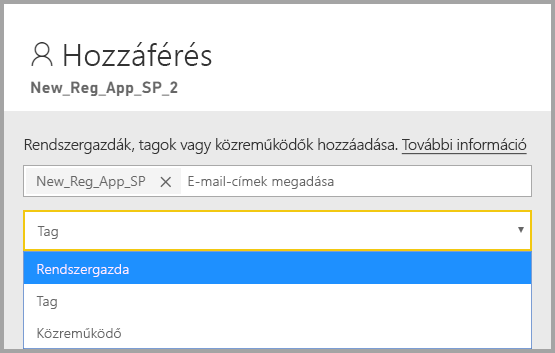

# <a name="embedding-power-bi-content-with-service-principal-and-application-secret"></a>Power BI-tartalom beágyazása szolgáltatásnév és titkos alkalmazáskód használatával

[!INCLUDE[service principal overview](../../includes/service-principal-overview.md)]

Ez a cikk az *alkalmazásazonosító* és az *alkalmazás titkos kódja* használatával történő szolgáltatásnév-hitelesítést ismerteti.

## <a name="method"></a>Módszer

Szolgáltatásnevet és alkalmazásazonosítót az alábbi lépésekben használhat fel beágyazott elemzésekhez:

1. Hozzon létre egy [Azure AD-alkalmazást](https://docs.microsoft.com/azure/active-directory/manage-apps/what-is-application-management).

    1. Hozza létre az Azure AD-alkalmazás titkos kódját.
    
    2. Kérje le az alkalmazás *azonosítóját* és *titkos kódját*.

    >[!NOTE]
    >Ezek a lépések az **1. lépésben** vannak leírva. Az Azure AD-alkalmazások létrehozásáról az [Azure AD-alkalmazás létrehozása](https://docs.microsoft.com/azure/active-directory/develop/howto-create-service-principal-portal) című cikk tartalmaz további információkat.

2. Hozzon létre biztonsági csoportot az Azure AD-ben.

3. Engedélyezze a Power BI szolgáltatás rendszergazdai beállításait.

4. Vegye fel szolgáltatásnevet a munkaterületre.

5. Ágyazza be a tartalmat.

> [!IMPORTANT]
> Ha engedélyezi a szolgáltatásnevek használatát a Power BI-ban, az alkalmazás AD-engedélyei többé nem lesznek érvényesek. Az alkalmazás engedélyeit ekkor a Power BI felügyeleti portálján lehet kezelni.

## <a name="step-1---create-an-azure-ad-app"></a>1\. lépés – Azure AD-alkalmazás létrehozása

Hozzon létre Azure AD-alkalmazást az alábbi módszerek egyikével:
* Hozza létre az alkalmazást a [Microsoft Azure Portalon](https://portal.azure.com/#allservices)
* Hozza létre az alkalmazást a [PowerShell](https://docs.microsoft.com/powershell/azure/create-azure-service-principal-azureps?view=azps-3.6.1) használatával.

### <a name="creating-an-azure-ad-app-in-the-microsoft-azure-portal"></a>Azure AD-alkalmazás létrehozása a Microsoft Azure Portalon

1. Jelentkezzen be a [Microsoft Azure-ba](https://portal.azure.com/#allservices).

2. Keressen rá az **alkalmazásregisztrációk** szóra és kattintson az **Alkalmazásregisztrációk** hivatkozásra.

    

3. Kattintson az **Új regisztráció** elemre.

    

4. Adja meg a kötelező adatokat:
    * **Név** – Adja meg az alkalmazás nevét
    * **Támogatott fióktípusok** – Válassza ki a kívánt Azure AD-fiókot
    * (Nem kötelező) **URI-átirányítás** – Szükség esetén adjon meg egy URI-azonosítót

5. Kattintson a **Regisztrálás** parancsra.

6. A regisztrációt követően az *alkalmazásazonosító* megtalálható az **Áttekintés** lapon. Másolja ki és mentse az *alkalmazásazonosítót*, hogy később felhasználhassa.

    

7. Kattintson a **Tanúsítványok és titkos kódok** lapfülre.

     

8. Kattintson az **Új titkos ügyfélkód** elemre.

    

9. A *Titkos ügyfélkód hozzáadása* ablakban gépeljen be leírást, adja meg, hogy mikor járjon le a titkos ügyfélkód, majd kattintson a **Hozzáadás** gombra.

10. Másolja ki és mentse a *Titkos ügyfélkód* értékét.

    

    >[!NOTE]
    >Miután bezárja ezt az ablakot, a titkos ügyfélkód rejtett lesz, és többé nem lehet megtekinteni vagy kimásolni.

### <a name="creating-an-azure-ad-app-using-powershell"></a>Azure AD-alkalmazás létrehozása a PowerShell használatával

Ez a szakasz egy mintaszkriptet tartalmaz, amellyel új Azure AD-alkalmazást hozhat létre a [PowerShell](https://docs.microsoft.com/powershell/azure/create-azure-service-principal-azureps?view=azps-1.1.0) használatával.

```powershell
# The app ID - $app.appid
# The service principal object ID - $sp.objectId
# The app key - $key.value

# Sign in as a user that's allowed to create an app
Connect-AzureAD

# Create a new Azure AD web application
$app = New-AzureADApplication -DisplayName "testApp1" -Homepage "https://localhost:44322" -ReplyUrls "https://localhost:44322"

# Creates a service principal
$sp = New-AzureADServicePrincipal -AppId $app.AppId

# Get the service principal key
$key = New-AzureADServicePrincipalPasswordCredential -ObjectId $sp.ObjectId
```

## <a name="step-2---create-an-azure-ad-security-group"></a>2\. lépés – Biztonsági csoport létrehozása az Azure AD-ben

A szolgáltatásnév nem fér hozzá a Power BI-tartalmakhoz és az API-khoz. A szolgáltatásnévnek úgy adhat hozzáférést, hogy létrehoz egy biztonsági csoportot az Azure AD-ben, majd felveszi a létrehozott szolgáltatásnevet ebbe a biztonsági csoportba.

Az Azure AD-ben kétféleképpen hozhat létre biztonsági csoportot:
* Manuálisan (az Azure-ban)
* A PowerShell használata

### <a name="create-a-security-group-manually"></a>Biztonsági csoport manuális létrehozása

Azure-beli biztonsági csoport manuális létrehozásához kövesse az [Alapszintű csoport létrehozása és tagok felvétele az Azure Active Directory használatával](https://docs.microsoft.com/azure/active-directory/fundamentals/active-directory-groups-create-azure-portal) című cikk útmutatását. 

### <a name="create-a-security-group-using-powershell"></a>Biztonsági csoport létrehozása a PowerShell használatával

Az alábbi egyszerű szkript új biztonsági csoportot hoz létre, és felvesz egy alkalmazást ebbe a biztonsági csoportba.

>[!NOTE]
>Ha az egész vállalathoz engedélyezni szeretné a szolgáltatásnév-hozzáférést, hagyja ki ezt a lépést.

```powershell
# Required to sign in as a tenant admin
Connect-AzureAD

# Create an Azure AD security group
$group = New-AzureADGroup -DisplayName <Group display name> -SecurityEnabled $true -MailEnabled $false -MailNickName notSet

# Add the service principal to the group
Add-AzureADGroupMember -ObjectId $($group.ObjectId) -RefObjectId $($sp.ObjectId)
```

## <a name="step-3---enable-the-power-bi-service-admin-settings"></a>3\. lépés – A Power BI szolgáltatás rendszergazdai beállításainak engedélyezése

Ahhoz, hogy egy Azure AD-alkalmazás hozzáférjen a Power BI-tartalmakhoz és az API-khoz, egy Power BI-rendszergazdának engedélyeznie kell a szolgáltatásnév hozzáférését az Power BI felügyeleti portálján.

Vegye fel az Azure AD-ben létrehozott biztonsági csoportot a **Fejlesztői beállítások** adott biztonságicsoport-szakaszába.

>[!IMPORTANT]
>A szolgáltatásnevek minden olyan bérlői beállításhoz hozzáférnek, amelyhez engedélyezve vannak. A rendszergazdai beállításoktól függően ez a meghatározott biztonsági csoportokat vagy a teljes vállalatot is jelentheti.
>
>A szolgáltatásnevek adott bérlői beállításokhoz való hozzáférését úgy korlátozhatja, hogy csak meghatározott biztonsági csoportokhoz engedélyezi a hozzáférést. Azt is megteheti, hogy dedikált biztonsági csoportot hoz létre a szolgáltatásnevek számára majd kizárja az a kívánt bérlői beállításokból.



## <a name="step-4---add-the-service-principal-as-an-admin-to-your-workspace"></a>4\. lépés – A szolgáltatásnév felvétele rendszergazdaként a munkaterületre

Annak engedélyezéséhez, hogy az Azure AD-alkalmazás hozzáférjen az olyan összetevőkhöz, mint a Power BI szolgáltatásbeli jelentések, irányítópultok és adathalmazok, vegye fel a szolgáltatásnév-entitást tagként vagy rendszergazdaként a munkaterületre.

>[!NOTE]
>Ez a szakasz a felhasználói felülethez nyújt útmutatást. Szolgáltatásnevet a [Csoportok – csoportfelhasználó felvétele API](https://docs.microsoft.com/rest/api/power-bi/groups/addgroupuser) segtségével is felvehet egy munkaterületre.

1. Görgessen lefelé addig a munkaterületig, amelyhez hozzáférést kíván adni, majd válassza a **További lehetőségek** menü **Munkaterület-hozzáférés** pontját.

    

2. Vegye fel a szolgáltatásnevet **rendszergazdaként** vagy **tagként** a munkaterületre.

    

## <a name="step-5---embed-your-content"></a>5\. lépés – A tartalom beágyazása

A tartalmat egy mintaalkalmazásban vagy a saját alkalmazásában is beágyazhatja.

* [Tartalom beágyazása a mintaalkalmazással](embed-sample-for-customers.md#embed-content-using-the-sample-application)
* [Tartalom beágyazása az alkalmazásban](embed-sample-for-customers.md#embed-content-within-your-application)

A tartalom beágyazása után minden készen áll [az éles üzemre való átállásra](embed-sample-for-customers.md#move-to-production).

## <a name="considerations-and-limitations"></a>Megfontolandó szempontok és korlátozások

* A szolgáltatásnév csak az [új munkaterületeken](../../service-create-the-new-workspaces.md) működik.
* A **Saját munkaterület** nem támogatott szolgáltatásnév használatakor.
* Az éles üzemre való átálláshoz dedikált kapacitás szükséges.
* A Power BI Portalra szolgáltatásnévvel nem lehet bejelentkezni.
* A szolgáltatásnév Power BI felügyeleti portáljának fejlesztői beállításaiban történő engedélyezéséhez rendszergazdai jogosultságok szükségesek a Power BI-ban.
* Szolgáltatásnév használatával nem telepíthet vagy kezelhet helyszíni adatátjárót.
* A [Beágyazás a vállalat számra](embed-sample-for-your-organization.md) beállítású alkalmazások nem használhatnak szolgáltatásnevet.
* Az [adatfolyamok](../../service-dataflows-overview.md) kezelése nem támogatott.
* A szolgáltatásnév jelenleg nem támogat rendszergazdai API-kat.
* Ha egyszerű szolgáltatást használ [Azure Analysis Services](https://docs.microsoft.com/azure/analysis-services/analysis-services-overview)-adatforrással, akkor magának az egyszerű szolgáltatásnak kell az Azure Analysis Services-példányra vonatkozó engedélyekkel rendelkeznie. Erre a célra nem használható az egyszerű szolgáltatást tartalmazó biztonsági csoport.

## <a name="next-steps"></a>Következő lépések

* [Power BI Embedded az ügyfelek számára](embed-sample-for-customers.md)

* [Helyszíni adatátjárót szolgáltatásnévvel használó sorszintű biztonság](embedded-row-level-security.md#on-premises-data-gateway-with-service-principal)