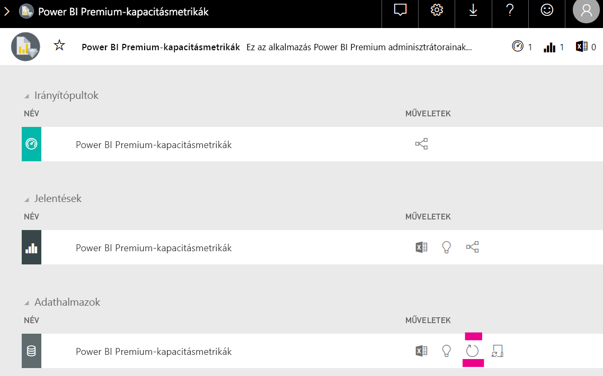

# Kapacitástervezés a Power BI Embedded Analyticsben

A Power BI Embedded Analytics üzembe helyezéséhez szükséges kapacitás típusának kiszámítása bonyolult feladat lehet. Ennek az az oka, hogy a számítás több paraméteren alapul, amelyek közül néhányat nehéz megjósolni.

Néhány szempont, amelyet érdemes megfontolni a kapacitás megtervezésekor:

* Az Ön által használt adatmodellek
* A szükséges lekérdezések száma és összetettsége
* Az alkalmazás használatának óránkénti eloszlása
* Az adatfrissítés gyakorisága
* További nehezen megjósolható használati minták.

A cikk célja, hogy megkönnyítse a Power BI Embedded Analytics kapacitásának megtervezését a [Power BI dedikált kapacitású terheléselemző eszköz](https://github.com/microsoft/PowerBI-Tools-For-Capacities/tree/master/LoadTestingPowerShellTool/) bevezetésével, amelyet a Power BI Embedded Analytics-kapacitások (*A*, *EM* vagy *P* SKU-k) terhelési tesztjének automatizálására hoztak létre.

## Tervezési eszköz

 A [Power BI dedikált kapacitású terheléselemző eszköz](https://github.com/microsoft/PowerBI-Tools-For-Capacities/tree/master/LoadTestingPowerShellTool/) segítségével megtudhatja, hogy mekkora felhasználói terhelést képes kezelni a kapacitása. Az eszköz a PowerShell segítségével automatizált terhelési teszteket hoz létre a kapacitásokhoz, és lehetővé teszi a tesztelni kívánt jelentések kiválasztását, valamint a szimulálni kívánt egyidejű felhasználók számának megadását.

Az eszköz terhelést hoz létre a kapacitásokon úgy, hogy folyamatosan új szűrőértékekkel jeleníti meg az egyes jelentéseket (hogy megakadályozza a jelentések gyorsítótárazása miatti valószerűtlenül jó eredményeket), amíg le nem jár az eszköz szolgáltatásban való hitelesítéséhez szükséges token.

### A tervezési eszköz használata

Az eszköz futtatásakor ügyeljen a kapacitások meglévő terhelésére, valamint arra, hogy ne futtasson terhelési teszteket akkor, amikor a legtöbben használják az alkalmazást.

Íme néhány példa a tervezési eszköz használatára.

* A kapacitás-rendszergazdák jobban átláthatják, hogy hány felhasználót képes kezelni a kapacitásuk az adott időkeretben.
* A jelentések szerzői megismerhetik a Power BI Desktop [Teljesítményelemzője](https://docs.microsoft.com/power-bi/desktop-performance-analyzer) által mért felhasználói terhelés hatását.
* A böngészőben valós időben követheti figyelemmel a rendereléseket.
* A SQL Server Profiler használatával [csatlakozhat a mért kapacitások XMLA-végpontjaihoz](https://powerbi.microsoft.com/blog/power-bi-open-platform-connectivity-with-xmla-endpoints-public-preview/), és figyelemmel kísérheti a lekérdezések végrehajtását.
* A terhelési teszt hatásait a Premium Capacity Metrics alkalmazás Adathalmazok oldalán lehet megtekinteni. A kapacitás-rendszergazdák terhelést hozhatnak létre ezzel az eszközzel, és megtekinthetik, hogyan jelenik meg a terhelés.

### A teszteredmények áttekintése

Ha a teszt futtatása után meg szeretné tekinteni a terhelési teszt hatásait a Metrics alkalmazásban, kövesse az alábbi utasításokat. Számítson 15 perc késésre a terhelés létrehozásának kezdetétől a terhelés metrikákban való megjelenéséig.

1. Bontsa ki az **Adathalmazok** fület a [Metrics alkalmazás](../../admin/service-admin-premium-monitor-capacity.md) kezdőlapján.
2. Indítson egy igény szerinti frissítést az **azonnali frissítés** gombra kattintva. A rendszergazdáknak kell elvégezniük.

    

## A Power BI-kapacitáseszközök GitHub-adattára

A [Power BI-kapacitáseszközök GitHub-adattárát](https://github.com/microsoft/PowerBI-Tools-For-Capacities) a kapacitástervező eszköz, valamint a jövőbeli eszközök és segédprogramok tárolására hozták létre.

Az adattár nyílt forráskódú, és arra bátorítjuk a felhasználókat, hogy adjanak hozzá további, a Power BI Premium és az Embedded kapacitásokkal kapcsolatos eszközöket, valamint fejlesszék a meglévőket.

## További lépések

> [!div class="nextstepaction"]
>[Kapacitás és SKU-k a Power BI Embedded Analyticsben](embedded-capacity.md)

> [!div class="nextstepaction"]
>[A Power BI Embedded teljesítményével kapcsolatos ajánlott eljárások](embedded-performance-best-practices.md)