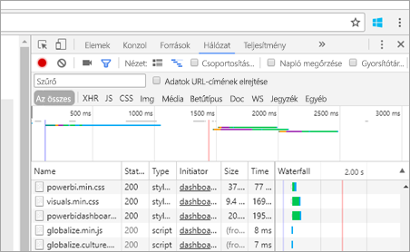
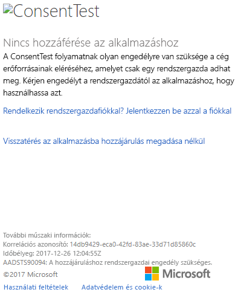
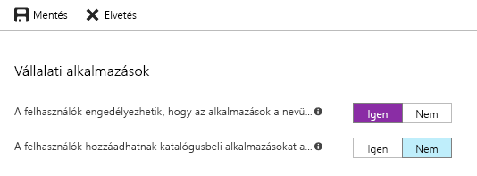

# <a name="troubleshoot-your-embedded-application"></a>Beágyazott alkalmazás hibaelhárítása

Ez a cikk azokat a gyakori problémákat ismerteti, amelyek Power BI-tartalmak beágyazása során fordulhatnak elő.

## <a name="tools-to-troubleshoot"></a>Hibaelhárítási eszközök

### <a name="fiddler-trace"></a>Fiddler-nyomkövetés

A [Fiddler](https://www.telerik.com/fiddler) a Telerik ingyenes eszköze, amely a HTTP-adatforgalom figyelésére használható.  A Power BI API-k használatával megtekintheti a forgalmat az ügyfélszámítógépen. Az eszköz hibaüzenetek és egyéb, kapcsolódó információk megjelenítésére is képes.


### <a name="f12-in-browser-for-front-end-debugging"></a>F12 billentyű a böngészőben a kezelőfelületen történő hibakereséshez

Az F12 billentyű megnyitja a böngészőben a fejlesztői ablakot. Ezzel az eszközzel megtekintheti a hálózati forgalmat és egyéb információkat.



### <a name="extract-error-details-from-power-bi-response"></a>Hiba részleteinek kigyűjtése a Power BI-válaszból

Ez a kódrészlet azt mutatja be, hogyan lehet kigyűjteni a hiba részleteit egy HTTP-kivételből:

```csharp
public static string GetExceptionText(this HttpOperationException exc)
{
    var errorText = string.Format("Request: {0}\r\nStatus: {1} ({2})\r\nResponse: {3}",
    exc.Request.Content, exc.Response.StatusCode, (int)exc.Response.StatusCode, exc.Response.Content);
    if (exc.Response.Headers.ContainsKey("RequestId"))
    {
        var requestId = exc.Response.Headers["RequestId"].FirstOrDefault();
        errorText += string.Format("\r\nRequestId: {0}", requestId);
    }

    return errorText;
}
```

Javasoljuk, hogy naplózza a kérelemazonosítót (valamint hibakereséshez a hiba részleteit is).
Ha a Microsoft támogatási szolgálatával lép kapcsolatba, adja meg a kérelem azonosítóját is.

## <a name="app-registration"></a>Alkalmazásregisztráció

### <a name="app-registration-failure"></a>Sikertelen alkalmazásregisztráció

A hibaüzenetek az Azure Portal vagy a Power BI alkalmazásregisztrációs oldalán a megfelelő jogosultságok hiányát említik. Alkalmazások regisztrálásához rendszergazdának kell lennie az Azure AD-bérlőjében, vagy engedélyezni kell az alkalmazások regisztrációját a nem rendszergazdai felhasználók számára.

### <a name="power-bi-service-doesnt-appear-in-the-azure-portal-when-registering-a-new-app"></a>Új alkalmazás regisztrációja során nem jelenik meg a Power BI szolgáltatás az Azure Portalon

Legalább egy felhasználónak regisztrálni kell a Power BI-ra. Ha nem látja a **Power BI szolgáltatást** az API-listában, akkor egyetlen felhasználó sem regisztrált a Power BI-ra.

## <a name="rest-api"></a>REST API

### <a name="api-call-returning-401"></a>401-es értékkel visszatérő API-hívás

A hiba további felderítéséhez szükség lehet a Fidlerre a forgalom rögzítéséhez. Előfordulhat, hogy a regisztrált alkalmazás nem rendelkezik a szükséges jogosultságok körével az Azure AD-n belül. Ellenőrizze az Azure Portalon, hogy megtalálhatók-e az alkalmazásregisztrációban az Azure AD-hez szükséges jogkörök.

### <a name="api-call-returning-403"></a>403-as értékkel visszatérő API-hívás

A hiba további felderítéséhez szükség lehet a Fidlerre a forgalom rögzítéséhez. A 403-as hibát több tényező is okozhatja.

* A felhasználó túllépte a megosztási kapacitásban létrehozható beágyazási tokenek számát. Azure-kapacitást kell vásárolni a beágyazási tokenek létrehozásához, és a munkaterületet ehhez a kapacitáshoz kell rendelni. További információért lásd: [Power BI Embedded-kapacitás létrehozása az Azure Portalon](https://docs.microsoft.com/azure/power-bi-embedded/create-capacity).
* Lejárt az Azure AD-hitelesítési token.
* A hitelesített felhasználó nem tagja a csoportnak (munkaterület).
* A hitelesített felhasználó nem rendszergazdája a csoportnak (munkaterület).
* A hitelesített felhasználó nem rendelkezik megfelelő engedélyekkel. Az engedélyek a [refreshUserPermissions API](https://docs.microsoft.com/rest/api/power-bi/users/refreshuserpermissions) segítségével frissíthetők
* Az engedélyezési fejléc nem megfelelően szerepel. Ellenőrizze, hogy nincsenek-e benne elgépelések.

Lehet, hogy az alkalmazás háttérszolgáltatásának a GenerateToken-hívás előtt frissítenie kell a hitelesítési tokent.

    ```
    GET https://wabi-us-north-central-redirect.analysis.windows.net/metadata/cluster HTTP/1.1
    Host: wabi-us-north-central-redirect.analysis.windows.net
    ...
    Authorization: Bearer eyJ0eXAiOi...
    ...

    HTTP/1.1 403 Forbidden
    ...

    {"error":{"code":"TokenExpired","message":"Access token has expired, resubmit with a new access token"}}
    ```

## <a name="authentication"></a>Hitelesítés

### <a name="authentication-failed-with-aadsts90002-tenant-authorize-not-found"></a>A hitelesítés nem sikerült: AADSTS90002: A „hitelesítés” bérlő nem található

 Ha bejelentkezéskor a következőhöz hasonló hibaüzeneteket kap: ***hiba: invalid_request, error_description: AADSTS90002: A „hitelesítés” bérlő nem található***, annak az az oka, hogy az ADAL 4.x nem támogatja a „https://login.microsoftonline.com/{Tenant}/oauth2/authorize/” címet hitelesítési URL-címként.
 
A hiba elhárításához törölje az „oauth2/authorize/” végződést a hitelesítési URL-címből. Erről a [Power BI fejlesztői minták](https://github.com/Microsoft/PowerBI-Developer-Samples) című cikkben talál útmutatást.

 Olvassa el az ADAL 4.x kiadási megjegyzések [Jobb hitelesítés-ellenőrzés](https://github.com/AzureAD/azure-activedirectory-library-for-dotnet/wiki/Changes-adalnet-4.0#better-authority-validation) című szakaszát.

### <a name="authentication-failed-with-aadsts70002-or-aadsts50053"></a>A hitelesítés nem sikerült: AADSTS70002 vagy AADSTS50053

**_(AADSTS70002: Hiba a hitelesítő adatok ellenőrzése közben. AADSTS50053: Túl sokszor próbált bejelentkezni helytelen felhasználóazonosítóval vagy jelszóval)_**

Ha Ön a Power BI Embedded szolgáltatást használja Azure AD közvetlen hitelesítéssel, és ehhez hasonló üzeneteket kap bejelentkezéskor: ***error:unauthorized_client, error_description:AADSTS70002: Hiba a hitelesítő adatok ellenőrzése közben. AADSTS50053: Ön túl sokszor próbált bejelentkezni egy helytelen felhasználói azonosítóval vagy jelszóval***, ezért alapértelezés szerint 2018. június 14-től a közvetlen hitelesítés nincs használatban.

Ennek visszakapcsolására is van lehetőség [Azure AD-szabályzattal](https://docs.microsoft.com/azure/active-directory/manage-apps/configure-authentication-for-federated-users-portal#enable-direct-authentication-for-legacy-applications), amelynek hatóköre lehet a cég vagy egy [szolgáltatásnév](https://docs.microsoft.com/azure/active-directory/develop/active-directory-application-objects#service-principal-object).

Javasoljuk, hogy ezt a szabályzatot csak az egyes alkalmazásokra engedélyezze.

Ennek a szabályzatnak a létrehozásához **globális rendszergazdai** engedélyekre van szüksége ahhoz a könyvtárhoz, ahol létrehozza és hozzárendeli a szabályzatot. Itt látható egy mintaszkript a szabályzat létrehozásához és az SP-hez való hozzárendeléshez ennél az alkalmazásnál:

1. Telepítse az [Azure AD előzetes verziójának PowerShell-modulját](https://docs.microsoft.com/powershell/azure/active-directory/install-adv2?view=azureadps-2.0).

2. Futtassa a következő PowerShell-parancsokat soronként (ügyeljen rá, hogy a $sp változó ne kapjon egynél több alkalmazást eredményül).

```powershell
Connect-AzureAD
```

```powershell
$sp = Get-AzureADServicePrincipal -SearchString "Name_Of_Application"
```

```powershell
$policy = New-AzureADPolicy -Definition @("{`"HomeRealmDiscoveryPolicy`":{`"AllowCloudPasswordValidation`":true}}") -DisplayName EnableDirectAuth -Type HomeRealmDiscoveryPolicy -IsOrganizationDefault $false
```

```powershell
Add-AzureADServicePrincipalPolicy -Id $sp.ObjectId -RefObjectId $policy.Id 
```

A szabályzat hozzárendelése után várjon körülbelül 15–20 másodpercig a propagálásra a tesztelés előtt.

### <a name="generate-token-fails-when-providing-effective-identity"></a>A token generálása sikertelen a hatályos identitás megadásakor

Megadott hatályos identitás esetén a GenerateToken-hívás sikertelenségét több tényező is okozhatja.

* Az adatkészlet nem támogatja a hatályos identitás használatát
* Nem adta meg a felhasználónevet
* Nem adta meg a szerepkört
* Nem adta meg a DatasetId-t
* A felhasználó nem rendelkezik megfelelő engedélyekkel

Ahhoz, hogy eldönthesse, melyik okozza a hibát, próbálja meg a következőket.

* Hajtsa végre az [adatkészlet lekérése](https://docs.microsoft.com/rest/api/power-bi/datasets) műveletet. Az IsEffectiveIdentityRequired tulajdonság true (igaz) értékű?
* A felhasználónév megadása minden EffectiveIdentity esetén kötelező.
* Ha az IsEffectiveIdentityRolesRequired true (igaz) értékű, akkor kötelező megadni a szerepkört.
* A DatasetId megadása minden EffectiveIdentity esetén kötelező.
* Az Analysis Serviceshez használt fő felhasználónak az átjáró rendszergazdájának kell lennie.

### <a name="aadsts90094-the-grant-requires-admin-permission"></a>AADSTS90094: A hozzájáruláshoz rendszergazdai engedély szükséges

**_Tünetek:_**<br>
Amikor egy rendszergazdai jogokkal nem rendelkező felhasználó először próbál bejelentkezni egy alkalmazásba és a hozzájárulását adja, a következő hibaüzenetek valamelyikét kapja:

* A ConsentTest folyamatnak olyan engedélyre van szüksége a cég erőforrásainak eléréséhez, amelyet csak egy rendszergazda adhat meg. Kérjen engedélyt a rendszergazdától az alkalmazáshoz, hogy használhassa azt.
* AADSTS90094: A hozzájáruláshoz rendszergazdai engedély szükséges.

    

Egy rendszergazdai jogú felhasználó be tud jelentkezni, és sikeresen meg tudja adni az engedélyt.

**_Alapvető ok:_**<br>
Felhasználói jóváhagyás le van tiltva a bérlő számára.

**_Többféle javítás lehetséges:_**

*Felhasználói beleegyezés engedélyezése a teljes bérlőnek (minden felhasználó, minden alkalmazás)*

1. Az Azure Portalon lépjen az „Azure Active Directory” => „Felhasználók és csoportok” => „Felhasználói beállítások” pontba
2. Engedélyezze „A felhasználók engedélyezhetik, hogy az alkalmazások a felhasználók nevében hozzáférjenek a vállalati adatokhoz” beállítást, és mentse a módosításokat

    

*Adjon engedélyeket* az alkalmazásnak rendszergazdaként – az egész bérlőhöz vagy egy meghatározott felhasználóhoz.

### <a name="cs1061-error"></a>CS1061-es hiba

Töltse le a [Microsoft.IdentityModel.Clients.ActiveDirectory](https://www.nuget.org/packages/Microsoft.IdentityModel.Clients.ActiveDirectory/2.22.302111727) elemet, ha „Az 'AuthenticationContext' nem tartalmaz 'AcquireToken' definíciót, és nem található az 'AuthenticationContext' típusú első argumentumot elfogadó hozzáférhető 'AcquireToken' (hiányzik egy using utasítás vagy szerelvényhivatkozás?)” típusú hibát észlel.

## <a name="data-sources"></a>Adatforrások

### <a name="isv-wants-to-have-different-credentials-for-the-same-data-source"></a>A független szoftvergyártó eltérő hitelesítő adatokat szeretne használni ugyanahhoz az adatforráshoz

Egy adatforrás egy fő felhasználóhoz csak egyetlen hitelesítő adattal rendelkezhet. Ha eltérő hitelesítő adatokra van szüksége, akkor hozzon létre további fő felhasználókat. Ezt követően rendelje hozzá a eltérő hitelesítési adatokat a fő felhasználó környezeteihez, majd ennek a felhasználónak az Azure AD-hitelesítési tokenje segítségével végezze el a beágyazást.

## <a name="troubleshoot-your-embedded-application-with-the-ierror-object"></a>A beágyazott alkalmazás hibaelhárítása az IError objektummal

Használja az [**IError objektumot**, amelyet a *hiba*esemény adott vissza a **JavaScript SDK**](https://github.com/Microsoft/PowerBI-JavaScript/wiki/Troubleshooting-and-debugging-of-embedded-parts) készletből az alkalmazás hibaelhárításához és a hibák okának jobb megértéséhez.

Miután beszerezte a IError objektumot, tekintse meg a megfelelő gyakori hibák táblát, amely egyezik a használt beágyazási típussal. Hasonlítsa össze az **IError-tulajdonságokat** a táblában lévőkkel, és keresse meg a hiba lehetséges okát/okait.

### <a name="typical-errors-when-embedding-for-power-bi-users"></a>Tipikus hibák, amikor a Power BI-felhasználók számára végez beágyazást

| Üzenet | Részletes üzenet | Hibakód | Lehetséges ok(ok) |
|-------------------------------------------------------|-----------------------------------------------------------------------------------------------------------------------------|-----------|--------------------------------------------------------|
| TokenExpired | A hozzáférési jogkivonat lejárt, küldje be újra egy új hozzáférési jogkivonattal | 403 | Lejárt jogkivonat  |
| PowerBIEntityNotFound | A jelentés lekérése sikertelen | 404 | <li> Hibás jelentésazonosító <li> A jelentés nem létezik  |
| Érvénytelen paraméterek | A powerbiToken paraméter nincs megadva | N.A. | <li> Nem megadva hozzáférési jogkivonat <li> Nincs megadva jelentésazonosító |
| LoadReportFailed | Nem sikerült inicializálni a – Nem sikerült feloldani a fürtöt | 403 | * Helytelen a hozzáférési jogkivonat * A beágyazási típus nem egyezik meg a jogkivonat típusával |
| PowerBINotAuthorizedException | A jelentés lekérése sikertelen | 401 | <li> Hibás csoportazonosító <li> Nem engedélyezett csoport |
| TokenExpired | A hozzáférési jogkivonat lejárt, küldje be újra egy új hozzáférési jogkivonattal. Nem lehetett leképezni a következő című jelentésvizualizációt: <visual title> | N.A. | A lekérdezési adatok jogkivonata lejárt |
| OpenConnectionError | A vizualizáció nem jeleníthető meg. Nem lehetett leképezni a következő című jelentésvizualizációt: <visual title> | N.A. | A kapacitás fel van függesztve, vagy törölték, amíg a kapacitással kapcsolatos jelentés meg volt nyitva egy munkamenetben |
| ExplorationContainer_FailedToLoadModel_DefaultDetails | Nem sikerült betölteni a jelentéshez társított modellsémát. Győződjön meg róla, hogy csatlakozott a kiszolgálóhoz, és próbálkozzon újra. | N.A. | <li> A kapacitás fel van függesztve <li> A kapacitás törölve |

### <a name="typical-errors-when-embedding-for-non-power-bi-users-using-an-embed-token"></a>Tipikus hibák, ha nem Power BI-felhasználók számára végez beágyazást (beágyazási jogkivonat használatával)

| Üzenet | Részletes üzenet | Hibakód | Ok(ok) |
|-------------------------------------------------------|-------------------------------------------------------------------------------------------------------------------------------|------------|-------------------------------------------------|
| TokenExpired | A hozzáférési jogkivonat lejárt, küldje be újra egy új hozzáférési jogkivonattal | 403 | Lejárt jogkivonat  |
| LoadReportFailed | A jelentés lekérése sikertelen | 404 | <li> Hibás jelentésazonosító <li> A jelentés nem létezik  |
| LoadReportFailed | A jelentés lekérése sikertelen | 403 | A jelentés azonosítója nem egyezik meg a jogkivonattal |
| LoadReportFailed | A jelentés lekérése sikertelen | 500 | A jelentés megadott azonosítója nem egy GUID azonosító |
| Érvénytelen paraméterek | A powerbiToken paraméter nincs megadva | N.A. | <li> Nem megadva hozzáférési jogkivonat <li> Nincs megadva jelentésazonosító |
| LoadReportFailed | Nem sikerült inicializálni a – Nem sikerült feloldani a fürtöt | 403 | Hibás jogkivonattípus, hibás jogkivonat |
| PowerBINotAuthorizedException | A jelentés lekérése sikertelen | 401 | Hibás/jogosulatlan csoportazonosító |
| TokenExpired | A hozzáférési jogkivonat lejárt, küldje be újra egy új hozzáférési jogkivonattal. Nem lehetett leképezni a következő című jelentésvizualizációt: <visual title> | N.A. | A lekérdezési adatok jogkivonata lejárt |
| OpenConnectionError | A vizualizáció nem jeleníthető meg. Nem lehetett leképezni a következő című jelentésvizualizációt: <visual title> | N.A. | A kapacitás fel van függesztve, vagy törölték, amíg a kapacitással kapcsolatos jelentés meg volt nyitva egy munkamenetben |
| ExplorationContainer_FailedToLoadModel_DefaultDetails | Nem sikerült betölteni a jelentéshez társított modellsémát. Győződjön meg róla, hogy csatlakozott a kiszolgálóhoz, és próbálkozzon újra. | N.A. | <li> A kapacitás fel van függesztve <li> A kapacitás törölve |

## <a name="content-rendering"></a>Tartalom megjelenítése

### <a name="performance"></a>Teljesítmény

[A Power BI Embedded teljesítménye](embedded-performance-best-practices.md)

### <a name="rendering-or-consumption-of-embedded-content-fails-or-times-out"></a>A beágyazott tartalmak megjelenítése vagy használata sikertelen, vagy időtúllépés miatt megszakad

Ellenőrizze, hogy a beágyazási token nem járt-e le. Ellenőrizze és frissítse a beágyazási token lejáratát. További információért tekintse meg a [Token frissítése JavaScript SDK használatával](https://github.com/Microsoft/PowerBI-JavaScript/wiki/Refresh-token-using-JavaScript-SDK-example) című cikket.

### <a name="report-or-dashboard-doesnt-load"></a>A jelentés vagy irányítópult nem tölt be

Ha a felhasználó nem látja a jelentést vagy az irányítópultot, akkor ellenőrizze, hogy a jelentés vagy az irányítópult megfelelően betölt-e a powerbi.com-on. A jelentés vagy az irányítópult nem működik az alkalmazásban, ha nem tölt be a powerbi.com-on.

### <a name="report-or-dashboard-is-performing-slowly"></a>A jelentés vagy irányítópult lassan működik

Nyissa meg a fájlt a Power BI Desktopban vagy a powerbi.com-on, és ellenőrizze, hogy elfogadható-e a működése, hogy kizárhassa az alkalmazása vagy a beágyazási API-k hibáit.

## <a name="embed-setup-tool"></a>Beágyazási telepítő eszköz

Megismerkedhet a [beágyazáshoz szükséges telepítési eszközzel](https://aka.ms/embedsetup), hogy gyorsan letölthessen egy mintaalkalmazást. Az alkalmazását ezután összehasonlíthatja a mintaalkalmazással.

### <a name="prerequisites"></a>Előfeltételek

Mielőtt használatba venné a beágyazáshoz szükséges telepítési eszközt, ellenőrizze, hogy rendelkezik-e az összes szükséges előfeltétellel. Szükség van egy **Power BI Pro**-fiókra és egy **Microsoft Azure**-előfizetésre.

* Ha még nem regisztrált a **Power BI Pro** szolgáltatásra, a kezdés előtt [hozzon létre egy ingyenes próbaverziós fiókot](https://powerbi.microsoft.com/pricing/).
* Ha még nincs Azure-előfizetése, kezdés előtt hozzon létre egy [ingyenes fiókot](https://azure.microsoft.com/free/?WT.mc_id=A261C142F).
* Állítson be egy saját [Azure Active Directory-bérlőt](create-an-azure-active-directory-tenant.md).
* Telepítse a [Visual Studio](https://www.visualstudio.com/) 2013-as vagy későbbi verzióját.

### <a name="common-issues"></a>Gyakori problémák

A beágyazáshoz szükséges telepítési eszköz tesztelésre való használatakor az alábbi gyakori problémák merülhetnek fel:

#### <a name="using-the-embed-for-your-customers-sample-application"></a>A Beágyazás az ügyfelek számára mintaalkalmazás használata

A **Beágyazás az ügyfelek számára** használatához mentse és csomagolja ki a *PowerBI-Developer-Samples.zip* fájlt. Nyissa meg a *PowerBI-Developer-Samples-master\App Owns Data* mappát, majd futtassa a *PowerBIEmbedded_AppOwnsData.sln* fájlt.

Az **Engedélyek megadása** kiválasztásánál (Engedélyek megadása lépés) az alábbi hiba jelentkezik:

    AADSTS70001: Application with identifier <client ID> wasn't found in the directory <directory ID>

A hiba elhárítható, ha bezárja az előugró ablakot, és néhány másodperc múlva újra próbálkozik. Ezt a műveletet esetenként többször is meg kell ismételni. Egy időintervallum miatt az alkalmazásregisztrációs folyamat nem tud befejeződni, amikor az elérhető külső API-k számára.

A mintaalkalmazás futtatásánál az alábbi hibaüzenet jelenik meg:

    Password is empty. Please fill password of Power BI username in web.config.

A hiba azért jelentkezik, mert a felhasználói jelszó az egyetlen érték, amely nem kerül be a mintaalkalmazásba. Nyissa meg a megoldásban a Web.config fájlt, és adja meg a jelszavát a pbiPassword mezőben.

Ha a következő hiba jelenik meg – AADSTS50079: A felhasználónak többtényezős hitelesítést kell használnia.

    Need to use an AAD account that doesn't have MFA enabled.

#### <a name="using-the-embed-for-your-organization-sample-application"></a>A Beágyazás a cég számára mintaalkalmazás használata

A **Beágyazás a cég számára** használatához mentse és csomagolja ki a *PowerBI-Developer-Samples.zip* fájlt. Nyissa meg a *PowerBI-Developer-Samples-master\User Owns Data\integrate-report-web-app* mappát, és futtassa a *pbi-saas-embed-report.sln* fájlt.

A **Beágyazás a cég számára** mintaalkalmazás futtatásánál az alábbi hiba jelentkezik:

    AADSTS50011: The reply URL specified in the request doesn't match the reply URLs configured for the application: <client ID>

Ennek a hibának az az oka, hogy a webkiszolgáló alkalmazáshoz megadott átirányítási URL-cím más, mint a minta URL-cím. A mintaalkalmazás regisztrálásához használja a `https://localhost:13526/` címet átirányítási URL-ként.

Ha szerkeszteni szeretné a regisztrált alkalmazást, ismerje meg, hogyan lehet [frissíteni az Azure AD-ben regisztrált alkalmazást](https://docs.microsoft.com/azure/active-directory/develop/quickstart-v1-update-azure-ad-app), hogy az alkalmazás hozzáférhessen a webes API-khoz.

Ha a Power BI felhasználói profiljait vagy adatait szeretné szerkeszteni, olvassa el, hogyan szerkeszthetők a [Power BI-adatok](https://docs.microsoft.com/power-bi/service-basic-concepts).

Ha a következő hiba jelenik meg – AADSTS50079: A felhasználónak többtényezős hitelesítést kell használnia.

    Need to use an AAD account that doesn't have MFA enabled.

További információ: [Power BI Embedded – gyakori kérdések](embedded-faq.md).

További kérdései vannak? [Kérdezze meg a Power BI közösségét](https://community.powerbi.com/)

Ha további segítségre van szüksége, [forduljon az ügyfélszolgálathoz](https://powerbi.microsoft.com/support/pro/?Type=documentation&q=power+bi+embedded) vagy [hozzon létre egy támogatási jegyet az Azure Portalon keresztül](https://ms.portal.azure.com/#blade/Microsoft_Azure_Support/HelpAndSupportBlade/newsupportrequest), és adja meg a látott hibaüzenet(ek)et.

## <a name="next-steps"></a>Következő lépések

További információ: [GYIK](embedded-faq.md).

További kérdései vannak? [Kérdezze meg a Power BI közösségét](https://community.powerbi.com/)
