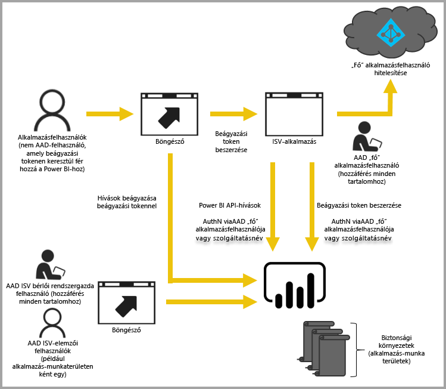

# Beágyazott analitika a Power BI-jal

A Power BI szolgáltatás (SaaS) és a Power BI Embedded szolgáltatás az Azure-ban (PaaS) API-kkal is rendelkezik az irányítópultok és jelentések beágyazásához. A tartalmak beágyazásakor rendelkezésére állnak a Power BI legújabb szolgáltatásai, például az irányítópultok, az átjárók és a munkaterületek.

A [beágyazást előkészítő eszközzel](https://aka.ms/embedsetup) gyorsan megteheti az első lépéseket és letölthet egy mintaalkalmazást.

Válassza ki az Ön számára megfelelő megoldást:

* Amennyiben [a cég számára végzi a beágyazást](embedding.md#embedding-for-your-organization), kibővítheti a Power BI szolgáltatást. Ehhez valósítsa meg a [Beágyazás a vállalat számára](https://aka.ms/embedsetup/UserOwnsData) megoldást.
* Amennyiben az [ügyfelei számára végez beágyazást](embedding.md#embedding-for-your-customers), irányítópultokat és jelentéseket ágyazhat be Power BI-fiókkal nem rendelkező felhasználók számára. Ehhez valósítsa meg a [Beágyazás ügyfelek számára](https://aka.ms/embedsetup/AppOwnsData) megoldást.

## API-k használata

A Power BI-tartalmak beágyazása során két fő forgatókönyv képzelhető el:
- A vállalati felhasználók számára végez beágyazást (akik rendelkeznek Power BI-licenccel). 
 
- Power BI-licenc megkövetelése nélkül végez beágyazást a felhasználók és ügyfelek számára. 

A [Power BI REST API](https://docs.microsoft.com/rest/api/power-bi/) mindkét forgatókönyvet támogatja.

Power BI-licenccel nem rendelkezők számára ugyanazt az API-t használva ágyazhat be irányítópultokat és jelentéseket egyéni alkalmazásokba függetlenül attól, hogy azt a cége vagy az ügyfele számára készíti. Az ügyfelek így megtekinthetik az alkalmazás által kezelt adatokat. A cégen belüli Power BI-felhasználók ezen kívül *saját adataikat* is megtekinthetik közvetlenül a Power BI-ban vagy a beágyazott alkalmazásban. A beágyazáshoz teljes körűen igénybe veheti a JavaScript és a REST API-k lehetőségeit.

A [JavaScript beágyazását szemléltető példa](https://microsoft.github.io/PowerBI-JavaScript/demo/) megtekintése segíthet a beágyazás működésének megértésében.

## Beágyazás a cég számára

Amennyiben **a cég számára végzi a beágyazást**, kibővítheti a Power BI szolgáltatást. Az ilyen típusú beágyazás megköveteli, hogy az alkalmazás felhasználók bejelentkezzenek a Power BI szolgáltatásba a tartalom megtekintéséhez. A bejelentkező vállalati felhasználóknak csak azokhoz az irányítópultokhoz és jelentésekhez lesz hozzáférésük, amelyeknek ők a tulajdonosai, vagy amelyeket a Power BI szolgáltatásban megosztottak velük.

Példák a vállalaton belüli beágyazásra: belső alkalmazások, például [SharePoint Online](https://powerbi.microsoft.com/blog/integrate-power-bi-reports-in-sharepoint-online/), [Microsoft Teams-integráció](https://powerbi.microsoft.com/blog/power-bi-teams-up-with-microsoft-teams/) (ehhez rendszergazdai jogosultsággal kell rendelkeznie), és [Microsoft Dynamics](https://docs.microsoft.com/dynamics365/customer-engagement/basics/add-edit-power-bi-visualizations-dashboard).

A vállalati beágyazással kapcsolatban lásd: [Oktatóanyag: Power BI tartalom beágyazása egy alkalmazásba a vállalat számára](embed-sample-for-your-organization.md).

Amikor Power BI-felhasználók számára végez beágyazást, az önkiszolgáló lehetőségek (pl. a szerkesztés, mentés stb.) a [JavaScript API-n](https://github.com/Microsoft/PowerBI-JavaScript) keresztül érhetők el.

A [Beágyazáshoz szükséges telepítési eszközzel](https://aka.ms/embedsetup/UserOwnsData) megkezdheti a munkát, és letölthet egy mintaalkalmazást, amely bemutatja, hogyan kell integrálni egy jelentést a szervezet számára.

## Beágyazás ügyfelek számára

Amennyiben az **ügyfelei számára végez beágyazást**, irányítópultokat és jelentéseket ágyazhat be olyan felhasználók számára, akik nem rendelkeznek Power BI-fiókkal. Az ilyen típusú beágyazást a *Power BI Embedded* végzi.

A [Power BI Embedded](azure-pbie-what-is-power-bi-embedded.md) egy **Microsoft Azure**-szolgáltatás, amellyel a független szoftverszállítók (ISV-k) és a fejlesztők lenyűgöző vizualizációkat, jelentéseket és irányítópultokat adhatnak gyorsan alkalmazásaikhoz. A beágyazás kapacitásalapú, óránkénti díjszabású modellel történik.

A Power BI Embedded mind az ISV-k, mind a fejlesztők, mind a ügyfelek számára előnyös. Egy ISV például ingyenesen létrehozhat vizualizációkat a Power BI Desktoppal. A vizuális elemzési fejlesztések minimalizálásával a független szoftverszállítók gyorsabban piacra vihetik az alkalmazásaikat, és kitűnhetnek versenytársaik közül az innovatív adatkörnyezeteikkel. Az ISV-k úgy is dönthetnek, hogy felárat számítanak fel a beágyazott analitikával hozzáadott többletértékért.

A Power BI Embedded használatával az ügyfeleinek nem szükséges ismerniük a Power BI működését. Két különböző módszer használatával hozhat létre beágyazott alkalmazást:
- Power BI Pro-fiók 
- Szolgáltatásnév 

Ez a Power BI Pro-fiók szolgál az alkalmazás fő fiókjaként (tehát tulajdonképpen egy proxyfiók). Ez a fiók teszi lehetővé az alkalmazás Power BI-irányítópultjaihoz és -jelentéseihez hozzáférést biztosító beágyazási tokenek generálását.

A [Szolgáltatásnév](embed-service-principal.md)**csak az alkalmazásra vonatkozó** tokennel képes Power BI-tartalmat beágyazni az alkalmazásokba. Ugyanakkor lehetővé teszi az alkalmazás Power BI-irányítópultjaihoz és -jelentéseihez hozzáférést biztosító beágyazási tokenek generálását.

A Power BI Embeddedet használó fejlesztők az alkalmazás alapvető funkcióinak szentelhetik az idejüket, és nem kell vizualizációk és elemzések fejlesztésével foglalkozniuk. Gyorsan eleget tehetnek az ügyfelek jelentésekkel és irányítópultokkal kapcsolatos igényeinek, és könnyen, teljes mértékben dokumentált API-kkal és SDK-kal ágyazhatnak be tartalmakat. A könnyen navigálható, alkalmazáson belüli adatfeltárás engedélyezésével az ISV-k ügyfelei gyors és magabiztos és döntéseket hozhatnak bármilyen eszközről.

> [!IMPORTANT]
> Bár a beágyazáshoz a Power BI szolgáltatás szükséges, felhasználóinak nem kell Power BI-fiókkal rendelkezniük az alkalmazás beágyazott tartalmának megtekintéséhez. 

Amikor készen áll az éles környezetbe való áthelyezésre, a munkaterületet hozzá kell rendelni egy dedikált kapacitáshoz. A Power BI Embedded a Microsoft Azure-on belül elérhetővé tesz az alkalmazásban felhasználható [dedikált kapacitást](azure-pbie-create-capacity.md).

A beágyazást a [Power BI-tartalmak beágyazása](embed-sample-for-customers.md) című cikk ismerteti részletesen.

## Következő lépések

Most már elkezdhet Power BI-tartalmat beágyazni az alkalmazásba vagy az ügyfelek számára.

> [!div class="nextstepaction"]
> [Beágyazás a cég számára](embed-sample-for-your-organization.md)

> [!div class="nextstepaction"]
> [Mi az a Power BI Embedded?](azure-pbie-what-is-power-bi-embedded.md)

> [!div class="nextstepaction"]
>[Beágyazás az ügyfelek számára](embed-sample-for-customers.md)

További kérdései vannak? [Kérdezze meg a Power BI közösségét](https://community.powerbi.com/)
